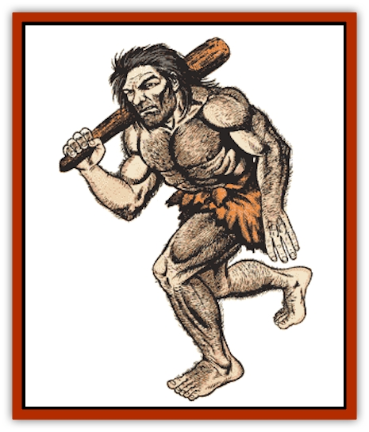
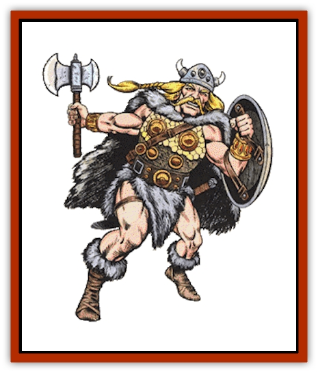
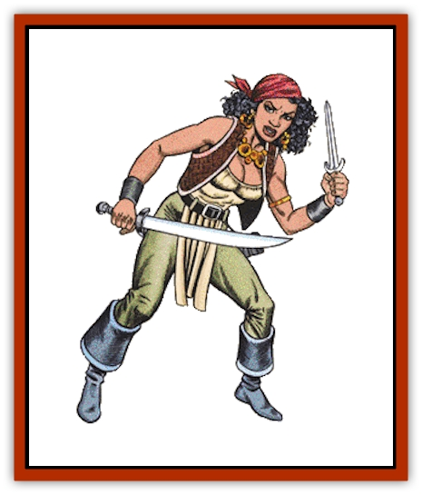
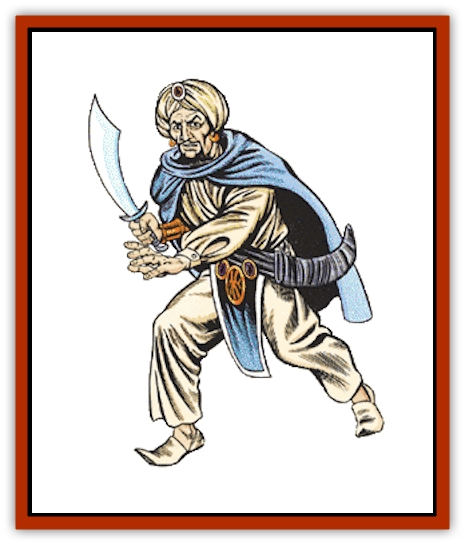

# Human

|  | Gentry | Knight | Mercenary | Merchant Sailor/Fisherman | Merchant/Trader | Middle Class |
| --- | --- | --- | --- | --- | --- | --- |
| Frequency: | Common | Very rare | Rare | Common | Common | Common |
| --- | --- | --- | --- | --- | --- | --- |
| Treasure: | J,K,L,M,N,Q | L,M | L,M | 10-60 sp | 10-1,000 gp | J,M,N |
| --- | --- | --- | --- | --- | --- | --- |
| Alignment: | Any | Any lawful | Any | Any | Any | Any |
| --- | --- | --- | --- | --- | --- | --- |
| No. Appearing: | 1-20 | 1-4 | 10-100 (10d10) | 4-80 (4d20) | 30-300 (3d10>010) | 2-40 (2d20) |
| --- | --- | --- | --- | --- | --- | --- |
| Armor Class: | 10 | 4 or 2 | 7 to 4 | 10 to 8 | 10 to 5 | 10 |
| --- | --- | --- | --- | --- | --- | --- |
| Hit Dice: | 1-6 hp | 2+ | 2-8 hp | 1-6 hp | 1-6 hp | 1-6 hp |
| --- | --- | --- | --- | --- | --- | --- |
| THAC0: | 20 | 19 or less | 20 | 20 | 20 | 20 |
| --- | --- | --- | --- | --- | --- | --- |
| Morale: | Average (9) | Elite (14+) | Steady (11-12) | Average (9) | Average (9) | Average (9) |
| --- | --- | --- | --- | --- | --- | --- |
| XP Value: | 15 | Varies | 15 | 15 | 15 | 15 |
| --- | --- | --- | --- | --- | --- | --- |

|  | Peasant/Serf | Pilgrim | Pirate/Buccaneer | Police/Constabulary | Priest | Sailor |
| --- | --- | --- | --- | --- | --- | --- |
| Frequency: | Common | Uncommon | Common | Uncommon | Very rare | Common |
| --- | --- | --- | --- | --- | --- | --- |
| Treasure: | Nil | I | J,M,N,Q | 10-60 sp | J,K,M | L,M |
| --- | --- | --- | --- | --- | --- | --- |
| Alignment: | Any | Any | Any evil | Any lawful | Any | Any |
| --- | --- | --- | --- | --- | --- | --- |
| No. Appearing: | 1-100 | 10-100 (10d10) | 30-300 (30d10) | 2-20 (2d10) | 1-8 | 4-80 (4d20) |
| --- | --- | --- | --- | --- | --- | --- |
| Armor Class: | 10 | 10 to 8 | 10 to 6 | 7 to 4 | Varies | 10 to 8 |
| --- | --- | --- | --- | --- | --- | --- |
| Hit Dice: | 1-6 hp | 1-6 hp | 1-6 hp | 1-6 hp | 1-6 hp | 1-6 hp |
| --- | --- | --- | --- | --- | --- | --- |
| THAC0: | 20 | 20 | 20 | 20 | 20 | 20 |
| --- | --- | --- | --- | --- | --- | --- |
| Morale: | Average (9) | Average (9) | Average (9) | Steady (10) | Varies | Average (9) |
| --- | --- | --- | --- | --- | --- | --- |
| XP Value: | 15 | 15 | 15 | 15 | Varies | 15 |
| --- | --- | --- | --- | --- | --- | --- |

|  | Slaver | Soldier | Thief/Thug | Tradesman/Craftsman | Tribesman | Wizard |
| --- | --- | --- | --- | --- | --- | --- |
| Frequency: | Common | Uncommon | Common | Common | Rare | Very rare |
| --- | --- | --- | --- | --- | --- | --- |
| Treasure: | Nil | I | J,M,N,Q | 1-100 gp | Nil | L,N,Q |
| --- | --- | --- | --- | --- | --- | --- |
| Alignment: | Any | Any | Any evil | Any | Any | Any |
| --- | --- | --- | --- | --- | --- | --- |
| No. Appearing: | 1-100 | 10-100 (10d10) | 1-8 | 2-12 (2d6) | 10-100 (10d10) | 1-8 |
| --- | --- | --- | --- | --- | --- | --- |
| Armor Class: | 10 | 8 to 4 | 10 to 8 | 10 | 8 | 10 |
| --- | --- | --- | --- | --- | --- | --- |
| Hit Dice: | 1-6 hp | 1-6 hp | 1 to 3 | 1-6 hp | 1-6 hp | Varies |
| --- | --- | --- | --- | --- | --- | --- |
| THAC0: | 20 | 20 | 20 | 20 | 20 | Varies |
| --- | --- | --- | --- | --- | --- | --- |
| Morale: | Average (9) | Steady (10-12) | Varies | Average (8-9) | Average (9) | Varies |
| --- | --- | --- | --- | --- | --- | --- |
| XP Value: | 15 | 15 | Varies | 15 | 15 | Varies |
| --- | --- | --- | --- | --- | --- | --- |

**

Aborigine/Caveman**

These primitive humans are found in otherwise uninhabited regions. For every 10 aborigines there will be a 3rd-level fighter. Aboriginal tribes are always led by a chief (a 5th-level fighter) and 1-4 subchiefs (4th-level fighters). For every 10 aborigines encountered there is a 10% chance that they have a shaman (3rd-level priest) with them.

Most encounters (60%) will be with predominantly male war or hunting/gathering parties. There is a 40% chance that an encounter will be in or near their lair. Aborigines make their lairs in natural shelters such as caves or forest groves. The number encountered above is for males; there will usually be an equal number of females and children in the lair.

Aborigines are typically armed with stone axes, spears, and clubs.

**Combat:** **Adventurer**

These are NPC counterparts of the PC's band, groups of fighters, thieves, priests, and wizards who band together in search of fame, fortune, and power. Typical adventuring bands consist of between two to eight members. Solitary adventurers may be separated from their group, lost, advanced scouts, or sole survivors of decimated groups.

After determining the base size of the group encountered, determine which class each belongs to:

| d10 | Class |
| --- | --- |
| 1-4 | Fighter |
| 5-6 | Cleric |
| 7-8 | Thief |
| 9-10 | Wizard |

Determine the level of the party of adventurers; low, medium, high, or very high, and roll for each member on the table below.

| Level | Level Range | Die |
| --- | --- | --- |
| Low | 1-3 | (1d3) |
| Medium | 4-7 | (1d4+3) |
| High | 7-12 | (1d6+6) |
| Very high | 9-20 | (1d12+8) |

A high level adventurer will have attracted followers who will accompany the party - 1-100% of them. This can swell an encountered band's size to that of a small army.

Clerics and wizards will have 1-100% of their full spells at the time the encounter occurs (round down).

Higher level fighters and clerics will usually have plate mail and shields, and ride unbarded medium warhorses. Each level an adventurer has attained gives a cumulative 5% chance for magical items as shown below. Roll for each item marked "Y". Reroll if a cursed or otherwise undesirable item occurs, but only one reroll is allowed for each category. If no usable item is indicated, the adventurer has no item in that category.

| Item | Fighter | Wizard | Cleric | Thief |
| --- | --- | --- | --- | --- |
| Armor | Y | N | Y | N |
| Shield | Y | N | Y | Y |
| Sword | Y | N | N | Y |
| Misc. Weapon | Y | N | Y* | Y |
| Potion | Y | N | Y | Y |
| Scroll | N | Y | Y | N |
| Ring | N | Y | N | Y |
| Wand/Staff/Rod | N | Y | N* | N |
| Misc. Magic | N | Y | Y | Y |

* If there is no usable miscellaneous weapon, roll again for possibility of a wand/staff/rod. If one is indicated but is unusable by a priest, there is no such item present.

In addition, such adventurers have ordinary treasure. Fighters have type L and M; clerics J, K, and M; wizards L, N, and Q; and thieves J, N, and Q.

**Habitat/Society:** **Bandit/Brigand**

Bandits are rural thieves who openly prey on travelers and isolated dwellings. They travel in groups of 20-200, usually led by high level fighters, rogues, wizards, and priests. For every 20 bandits encountered, there will be an additional 3rd-level fighter. If 100+ are encountered, the leader will be at least 8th level.

Bandits are typically armed with swords, spears, and small shields. Up to 20% may be armed with bows. Bandits may wear no armor (50%), leather (35%), padded (10%), or ring mail (5%). Brigands are better equipped and will have higher morale.

**Ecology:** **

Barbarian/Nomad**

Barbarians belong to primitive cultures that possess rudimentary skills such as animal husbandry and simple manufacturing (weaving, carving). They may live in villages of simple buildings or in portable structures like tents, tepees, yurts, or wagons. In aquatic regions, they may live on watercraft like canoes or rafts.

Barbarians are typically armed with swords, knives, bows, spears, and clubs. Armor is limited to shields, helmets, and chestplates. They tend to be hostile toward unfamiliar wizards. Barbarians are adept at surprising opponents; such opponents have a -5 penalty on their surprise rolls.

**Berserker/Dervish**

Berserkers are violent war parties prone to manic behavior in battle. When encountered, berserkers drive themselves into a battle frenzy that raises their fighting skills and morale. Berserkers attack twice per round, or once at +2. Many use leather armor and shields, giving them Armor Class 7. Berserkers need never make morale checks.

Dervishes are highly religious nomads. Due to their fanatical nature, dervishes add 1 to their attack rolls and damage dice. They never check morale in combat.

If encountered during a peaceful period, berserkers may be indistinguishable from normal warrior bands; dervishes may be mistaken for armed pilgrims.

**Farmer/Herder**

These are simple people involved in the production of agricultural goods. About 65% of all encounters will be with farmers tilling their land. Encounters with herders may occur anywhere there is grazing land or a market for their herds. Encounters with herders also involve the herd animals, whatever they are.

**Gentry**

These are the upper classes. They are not the ruling nobility, but their wealth and connections make them nearly as powerful. Each member of the gentry encountered may be accompanied by 0-3 guards (d4-1) and 1-6 servants. The guards are mercenary fighters of 1st to 6th level and armed with sword and spear. The servants might fight as 0-level fighters, but are more likely to panic. The gentry themselves might be armed with daggers and short swords.

**Knight**

Knights are armored, mounted fighters directly serving their lord. They may be on a quest, a specific mission, or simply patrolling their lord's realm. Knights may be accompanied by their squires, hirelings, and other followers (50%). Knights are armed with sword, lance, mace or flail, and dagger. Armor includes a shield and either plate or chain mail. A knight rides a medium or heavy warhorse, usually a barded mount.

About 5% of encounters will be with a vanquished knight. Being stripped of arms and armor, the knight may be mistaken for any nonwarrior class. The knight may even support this deception, at least until weaponry becomes available.

See "Adventurer" to determine level and special possessions.

**Mercenary Soldier**

These are groups of low level fighters who hire themselves to the highest bidder. When encountered, there is an even chance they may be already hired and on their way to a war, meeting with a prospective employer, open for employment, or on their way home and not willing to take on a new task just yet.

See "Adventurer" to determine level and special possessions.

**Merchant Sailor/Fisherman**

Men of the sea are usually found on or near open waters. If encountered inland, sailors may be ferrymen on streams or rivers. Fishermen will either be putting out to a fishing site, fishing, or returning with their catches. Sailors may be armed with knives, short swords, cutlasses, or belaying pins (1 point of damage).

**Merchant/Trader**

Merchants and traders deal in goods and services. Those encountered in the wild are traveling in caravans in search of new business. Only 10% of the number encountered are actually merchants: 10% are drovers and the rest are mercenary guards. The guards are led by a fighter (6th-11th level) and a lieutenant one level lower. Each leader is accompanied by 12 guards of 2nd level. For each 50 people in the caravan there is a 10% chance of a wizard (6th-8th level) and a 5% chance of a priest (5th-7th level), as well as a 15% chance of a thief (8th-10th level) accompanied by 1-4 thieves (3rd-7th level). All such leaders, guards, and special characters are in addition to the number of merchants, drovers, and normal guards.

The treasure is mostly in trade goods (90%). The caravan has 10 pack animals or one wagon per 5,000 gp value.

**Middle Class**

These are travelers journeying on personal business. They are found primarily in civilized regions, although pioneers may be encountered in relatively peaceful frontier regions. Middle class travelers may be armed with knives, daggers, and short swords.

**Peasant/Serf**

Peasants are farmers, herders, and simple tradesmen of low social class. Unlike serfs, peasants are freemen. Serfs are totally subject to the local lord; they are the lowest of the social classes. They farm and perform the brute labor functions on large agricultural holdings. Serfs, really, are little more than slaves.

Both peasants and serfs may be armed with daggers, clubs, quarterstaves, and farming tools. They never have any treasure except under the rarest of occasions when they are able to hoard scavenged goods.

**Pilgrim**

Pilgrims are groups of the devout on their way to or from a holy place. They can be found anywhere.

A group of pilgrims will always be accompanied by priests and other character classes. These people may be acting as leaders, guards, or pilgrims. Groups of pilgrims always include one to six 2nd-level priests, one to four 4th-level priests, one or two 6th-level, and one 8th-level priest (accompanied by one 3rd- and one 5th-level assistant). For every 10 pilgrims, there is a 10% chance of one to eight fighters (1st-8th level) and 1-6 thieves (2nd-7th level). There is a 5% chance per 10 pilgrims of a wizard of 6th-9th level. If the pilgrims are lawful good, the fighters will be paladins; if the pilgrims are chaotic good, the fighters will be rangers. If the party is neutral, the priests will be druids. If the pilgrims are lawful evil, they all fight as berserkers, although armed only with daggers.

Pilgrim alignment is determined below:

| d100 | Alignment |
| --- | --- |
| 01-35 | Lawful good |
| 36-55 | Chaotic good |
| 56-65 | Neutral |
| 66-85 | Lawful evil |
| 86-00 | Chaotic evil |

About 75% of pilgrim bands encountered are on foot. There is a 5% chance that a high level priest will be carrying a religious artifact, carefully hidden and protected by traps and magic. (See also Priest and Priest Spells, *Player's Handbook*)

**

Pirate/Buccaneer**

These are seafaring thieves and fighters. Pirates are always led by a captain of 8th or 10th level - 8th if fewer than 200. The captain will have a 6th- or 7th-level lieutenant and four mates of 4th level. For every 50 pirates encountered, there will be a 3rd-level fighter, as well as a 15% chance for a cleric of 12th-15th level and a 10% chance for a wizard of 6th-9th level. For every 100 pirates, there will be a 5th-level fighter. All of these are in addition to the pirates already indicated by the dice.

Pirates wear leather armor; leaders wear chain mail. All are armed with knives, swords, and polearms. Some will be armed with crossbows, either light (20%) or heavy (10%). In addition their ships may be equipped with ballistae or catapults.

Buccaneers are similar, but are neutral with evil tendencies.

**Police/Constabulary**

These are the duly appointed representatives of the local government, concerned with upholding the laws, maintaining the peace, and carrying out their superior's will. If constables are encountered in the wilderness, they might be pursuing a fugitive (50%) or investigating a case on the outskirts of their jurisdiction (50%).

Constables are the equivalent of fighters of 1st-4th level. Wilderness encounters include a 25% chance that the constables are accompanied by a mob. The mob is composed of citizenry temporarily deputized to assist the police; they fight as 0-level fighters.

**Priest**

These are typical NPC priests traveling on personal business or on a mission. The number encountered refers to the number of actual priests. If they are of high enough level, they might also have followers accompanying them (50%).

See "Adventurer" to determine level and special possessions.

**Sailor**

Nonmerchant sailors are the seagoing armed forces of the local government, acting as police or soldiers. They may be patrolling their home waters, pursuing a waterborne criminal, or on their way to or from a mission in other waters. Each ship is commanded by a captain (6th-level fighter) and a first officer (5th-level fighter). Sailors are armed with swords, knives, bows, and polearms. They may also be armed with heavier weapons such as catapults and ballistae.

**Slaver**

Slavers are usually found in control of a band of captive slaves; if no slaves are present, the slavers may be mistaken for mercenaries or brigands. The slavers' leader might be a thief, fighter, or fighter/thief (6th-11th level), assisted by a lieutenant one level lower. Each leader is accompanied by 1-12 guards of 1st or 2nd level. For each 50 slaves and slavers, there is a 10% chance of a wizard (6th-8th level) and a 5% chance of a priest (5th-7th level); these work for the slavers.

There are 10 slaves present for each 1-10 slavers. Slaves are treated the same as serfs. They may be recently acquired captives being taken from their homelands or long-time slaves being moved to a new market. Such slaves will be on foot and linked together in strings of 10-100 by ropes or chains. They will be willing to help any adventurers who try to rescue them, although they will be limited in the help they can provide. Slaves may be any class or type, but only 1% of captives belong to one of the character classes.

**

Soldier**

These are organized militia engaged in the defense of their home region. Soldiers are led by a captain (6th level or higher) and a lieutenant (1-4 levels lower). Each leader is accompanied by 1-12 soldiers of 1st or 2nd level. Most soldiers are engaged in routine patrols of the homeland. If local wars are occurring, there is a 50% chance that the soldiers are either heading off to the war or returning from it. There is a 5% chance of a cleric (5th-7th level) for each 50 soldiers present.

See "Adventurer" to determine level and special possessions.

**Thief/Thug**

These are low level rogues who, if not already engaged in a crime, may attempt to rob wealthy or weak-looking adventurers. Thieves may be armed with concealed weapons such as knives, darts, blackjacks, and short swords.

See "Adventurer" to determine level and special possessions.

**Tradesfolk/Craftspeople**

People engaged in the trades and crafts will be about their business when encountered. They may be operating a shop, acquiring materials for their business, or traveling to or from a client's location. They are willing to do business with adventurers, provided they are properly paid. They will not attack except to defend themselves. Note that 1% of all tradesfolk may be retired adventurers. Tradesmen may be armed with knives, quarterstaves, and tools.

About 90% of their treasure is merchandise or equipment.

**Tribal Culture**

Tribal societies are the heart of primitive cultures; people hunt, fish, and farm near their simple villages. They are found in any climate.

For each 10 tribespeople, there will be an additional 3rd-level fighter. Tribes are led by a chief (a 5th-level fighter) and 1-4 subchiefs (4th-level fighters). For every 10 encountered, there is a 4th-level priest with them, and for each 30 tribespeople encountered, a 6th-level priest. The tribe has a shaman (8th-level priest). Tribal priests tend to be druidical in nature.

Tribal villages are made of local materials (grass, bamboo, mud, ice). In addition to the males encountered, there will also be an equal number of women and a 75% chance of 20-50 slaves.

Tribesmen's weapons are typically clubs, knives, spears, and bows. Armor is limited to shields.

**Wizard**

These are typical NPC wizards. They may be engaged in personal business, gathering materials, or traveling. The number encountered refers to the number of actual wizards. They may be accompanied by 0-3 (1d4-1) servants and guards for each wizard. Guards are fighters 1-4 levels lower than the wizard they protect.

---
## Discovery & Documentation

**Source Publication:** Monstrous Manual (1995)
**Campaign Setting:** Advanced Dungeons & Dragons 2nd Edition
**Author(s):** Tim Beach

### Other Creatures Found in This Source Book
   * [[Aarakocra|Aarakocra]]
   * [[Aboleth|Aboleth]]
   * [[Ankheg|Ankheg]]
   * [[Arcane|Arcane]]
   * [[Argos|Argos]]
   * [[Aurumvorax|Aurumvorax]]
   * [[Baatezu_Lesser_Abishai|Baatezu, Lesser, Abishai]]
   * [[Baatezu_General_Information|Baatezu, General Information]]
   * [[Baatezu_Greater_Pit_Fiend|Baatezu, Greater, Pit Fiend]]
   * [[Banshee|Banshee]]
   * [[Basilisk|Basilisk]]
   * [[Bat|Bat]]
   * [[Bear|Bear]]
   * [[Beetle_Giant|Beetle, Giant]]
   * [[Behir|Behir]]
   * [[Beholder_and_Beholder-kin_I|Beholder and Beholder-kin I]]
   * [[Beholder_and_Beholder-kin_II|Beholder and Beholder-kin II]]
   * [[Bird|Bird]]
   * [[Brain_Mole|Brain Mole]]
   * [[Broken_One|Broken One]]
   * [[Brownie|Brownie]]
   * [[Bugbear|Bugbear]]
   * [[Bulette|Bulette]]
   * [[Bullywug|Bullywug]]
   * [[Carrion_Crawler|Carrion Crawler]]
   * [[Cat_Great|Cat, Great]]
   * [[Catoblepas|Catoblepas]]
   * [[Cat_Small|Cat, Small]]
   * [[Cave_Fisher|Cave Fisher]]
   * [[Centaur|Centaur]]
   * [[Centipede|Centipede]]
   * [[Chimera|Chimera]]
   * [[Cloaker|Cloaker]]
   * [[Cockatrice|Cockatrice]]
   * [[Couatl|Couatl]]
   * [[Crabman|Crabman]]
   * [[Crawling_Claw|Crawling Claw]]
   * [[Crocodile|Crocodile]]
   * [[Crustacean_Giant|Crustacean, Giant]]
   * [[Crypt_Thing|Crypt Thing]]
   * [[Death_Knight|Death Knight]]
   * [[Deepspawn|Deepspawn]]
   * [[Dinosaur_I|Dinosaur I]]
   * [[Displacer_Beast|Displacer Beast]]
   * [[Dog|Dog]]
   * [[Dog_Moon|Dog, Moon]]
   * [[Dolphin|Dolphin]]
   * [[Doppelganger|Doppelganger]]
   * [[Dracolich|Dracolich]]
   * [[Dragon_Brown|Dragon, Brown]]
   * [[Dragon_Chromatic_Black|Dragon, Chromatic, Black]]
   * [[Dragon_Chromatic_Blue|Dragon, Chromatic, Blue]]
   * [[Dragon_Chromatic_Green|Dragon, Chromatic, Green]]
   * [[Dragon_Cloud|Dragon, Cloud]]
   * [[Dragon_Chromatic_Red|Dragon, Chromatic, Red]]
   * [[Dragon_Chromatic_White|Dragon, Chromatic, White]]
   * [[Dragon_Deep|Dragon, Deep]]
   * [[Dragon_Gem_Amethyst|Dragon, Gem, Amethyst]]
   * [[Dragon_Gem_Crystal|Dragon, Gem, Crystal]]
   * [[Dragon_Gem_Emerald|Dragon, Gem, Emerald]]
   * [[Dragon_Gem_Sapphire|Dragon, Gem, Sapphire]]
   * [[Dragon_Gem_Topaz|Dragon, Gem, Topaz]]
   * [[Dragon_Metallic_Brass|Dragon, Metallic, Brass]]
   * [[Dragon_Metallic_Bronze|Dragon, Metallic, Bronze]]
   * [[Dragon_Metallic_Copper|Dragon, Metallic, Copper]]
   * [[Dragon_Mercury|Dragon, Mercury]]
   * [[Dragon_Metallic_Gold|Dragon, Metallic, Gold]]
   * [[Dragon_Mist|Dragon, Mist]]
   * [[Dragon_Metallic_Silver|Dragon, Metallic, Silver]]
   * [[Dragon_General_Information|Dragon, General Information]]
   * [[Dragon_Shadow|Dragon, Shadow]]
   * [[Dragon_Steel|Dragon, Steel]]
   * [[Dragon_Yellow|Dragon, Yellow]]
   * [[Dragonne|Dragonne]]
   * [[Dragon_Turtle|Dragon Turtle]]
   * [[Dragonet_Faerie_Dragon|Dragonet, Faerie Dragon]]
   * [[Dragonet_Fire_Drake|Dragonet, Fire Drake]]
   * [[Dragonet_Pseudodragon|Dragonet, Pseudodragon]]
   * [[Dryad|Dryad]]
   * [[Dwarf_Derro|Dwarf, Derro]]
   * [[Dwarf|Dwarf]]
   * [[Elemental_Athas_General_Information|Elemental (Athas), General Information]]
   * [[Elemental_Air_Kin|Elemental, Air Kin]]
   * [[Elemental_Earth_Kin|Elemental, Earth Kin]]
   * [[Elemental_Fire_Kin|Elemental, Fire Kin]]
   * [[Elemental_Water_Kin|Elemental, Water Kin]]
   * [[Elemental_of_Chaos_Air_Earth|Elemental of Chaos, Air/Earth]]
   * [[Elemental_of_Chaos_Fire_Water|Elemental of Chaos, Fire/Water]]
   * [[Elemental_Composite|Elemental, Composite]]
   * [[Elemental_Air_Earth|Elemental, Air/Earth]]
   * [[Elemental_Fire_Water|Elemental, Fire/Water]]
   * [[Elemental_General_Information|Elemental, General Information]]
   * [[Elephant|Elephant]]
   * [[Elf|Elf]]
   * [[Elf_Aquatic|Elf, Aquatic]]
   * [[Elf_Drow|Elf, Drow]]
   * [[Ettercap|Ettercap]]
   * [[Eyewing|Eyewing]]
   * [[Feyr|Feyr]]
   * [[Fish|Fish]]
   * [[Frog|Frog]]
   * [[Fungus|Fungus]]
   * [[Galeb_Duhr|Galeb Duhr]]
   * [[Gargantua|Gargantua]]
   * [[Gargoyle_I|Gargoyle I]]
   * [[Genie|Genie]]
   * [[Ghost|Ghost]]
   * [[Ghoul|Ghoul]]
   * [[Giant_Cloud|Giant, Cloud]]
   * [[Giant_Cyclops|Giant, Cyclops]]
   * [[Giant_Desert|Giant, Desert]]
   * [[Giant_Ettin|Giant, Ettin]]
   * [[Giant_Firbolg|Giant, Firbolg]]
   * [[Giant_Fire|Giant, Fire]]
   * [[Giant_Fog|Giant, Fog]]
   * [[Giant_Fomorian|Giant, Fomorian]]
   * [[Giant_Frost|Giant, Frost]]
   * [[Giant_Hill|Giant, Hill]]
   * [[Giant_Jungle|Giant, Jungle]]
   * [[Giant_Mountain|Giant, Mountain]]
   * [[Giant_Reef|Giant, Reef]]
   * [[Giant_Stone|Giant, Stone]]
   * [[Giant_Storm|Giant, Storm]]
   * [[Giant_Verbeeg|Giant, Verbeeg]]
   * [[Giant_Wood|Giant, Wood]]
   * [[Gibberling|Gibberling]]
   * [[Giff|Giff]]
   * [[Gith|Gith]]
   * [[Gith_Pirate_of|Gith, Pirate of]]
   * [[Githyanki|Githyanki]]
   * [[Githzerai|Githzerai]]
   * [[Gloomwing|Gloomwing]]
   * [[Gnoll|Gnoll]]
   * [[Gnome|Gnome]]
   * [[Gnome_Spriggan|Gnome, Spriggan]]
   * [[Goblin|Goblin]]
   * [[Golem_General_Information|Golem, General Information]]
   * [[Golem_I_Greater_Golem|Golem I (Greater Golem)]]
   * [[Golem_II_Lesser_Golem|Golem II (Lesser Golem)]]
   * [[Golem_III|Golem III]]
   * [[Golem_IV|Golem IV]]
   * [[Golem_V|Golem V]]
   * [[Golem_VI_Stone_Variants|Golem VI (Stone Variants)]]
   * [[Gorgon|Gorgon]]
   * [[Grell_Colonial|Grell, Colonial]]
   * [[Gremlin_Jermlaine|Gremlin, Jermlaine]]
   * [[Gremlin|Gremlin]]
   * [[Griffon|Griffon]]
   * [[Grimlock|Grimlock]]
   * [[Grippli|Grippli]]
   * [[Hag|Hag]]
   * [[Halfling|Halfling]]
   * [[Harpy|Harpy]]
   * [[Hatori|Hatori]]
   * [[Haunt|Haunt]]
   * [[Hell_Hound|Hell Hound]]
   * [[Heucuva|Heucuva]]
   * [[Hippocampus|Hippocampus]]
   * [[Hippogriff|Hippogriff]]
   * [[Hobgoblin|Hobgoblin]]
   * [[Homunculus|Homunculus]]
   * [[Hook_Horror|Hook Horror]]
   * [[Horse|Horse]]
   * [[Hydra|Hydra]]
   * [[Imp|Imp]]
   * [[Insect_Giant|Insect, Giant]]
   * [[Insect_Swarm|Insect Swarm]]
   * [[Intellect_Devourer|Intellect Devourer]]
   * [[Invisible_Stalker|Invisible Stalker]]
   * [[Ixitxachitl|Ixitxachitl]]
   * [[Jackalwere|Jackalwere]]
   * [[Kenku|Kenku]]
   * [[Ki-rin|Ki-rin]]
   * [[Kirre|Kirre]]
   * [[Kobold|Kobold]]
   * [[Kuo-Toa|Kuo-Toa]]
   * [[Lamia|Lamia]]
   * [[Lammasu|Lammasu]]
   * [[Leech|Leech]]
   * [[Leprechaun|Leprechaun]]
   * [[Leucrotta|Leucrotta]]
   * [[Lich|Lich]]
   * [[Living_Wall|Living Wall]]
   * [[Lizard|Lizard]]
   * [[Lizard_Man|Lizard Man]]
   * [[Locathah|Locathah]]
   * [[Lurker|Lurker]]
   * [[Lycanthrope_General_Information|Lycanthrope, General Information]]
   * [[Lycanthrope_Seawolf|Lycanthrope, Seawolf]]
   * [[Lycanthrope_Werebear|Lycanthrope, Werebear]]
   * [[Lycanthrope_Wereboar|Lycanthrope, Wereboar]]
   * [[Lycanthrope_Werebat|Lycanthrope, Werebat]]
   * [[Lycanthrope_Werefox|Lycanthrope, Werefox]]
   * [[Lycanthrope_Wererat|Lycanthrope, Wererat]]
   * [[Lycanthrope_Wereraven|Lycanthrope, Wereraven]]
   * [[Lycanthrope_Weretiger|Lycanthrope, Weretiger]]
   * [[Lycanthrope_Werewolf|Lycanthrope, Werewolf]]
   * [[Mammal|Mammal]]
   * [[Mammal_Giant|Mammal, Giant]]
   * [[Mammal_Herd_I|Mammal, Herd I]]
   * [[Mammal_Small|Mammal, Small]]
   * [[Manscorpion|Manscorpion]]
   * [[Manticore|Manticore]]
   * [[Medusa_Maedar|Medusa, Maedar]]
   * [[Medusa|Medusa]]
   * [[Mephit_General_Information|Mephit, General Information]]
   * [[Merman|Merman]]
   * [[Mimic|Mimic]]
   * [[Mind_Flayer|Mind Flayer]]
   * [[Minotaur|Minotaur]]
   * [[Mist_Crimson_Death|Mist, Crimson Death]]
   * [[Mist_Vampiric|Mist, Vampiric]]
   * [[Mold_I|Mold I]]
   * [[Moldman|Moldman]]
   * [[Mongrelman|Mongrelman]]
   * [[Morkoth|Morkoth]]
   * [[Muckdweller|Muckdweller]]
   * [[Mudman|Mudman]]
   * [[Mummy_Greater|Mummy, Greater]]
   * [[Mummy|Mummy]]
   * [[Myconid|Myconid]]
   * [[Naga|Naga]]
   * [[Naga_Dark|Naga, Dark]]
   * [[Neogi|Neogi]]
   * [[Nightmare|Nightmare]]
   * [[Nymph|Nymph]]
   * [[Octopus_Giant|Octopus, Giant]]
   * [[Ogre|Ogre]]
   * [[Ogre_Half-|Ogre, Half-]]
   * [[Ooze_Slime_Jelly_I|Ooze/Slime/Jelly I]]
   * [[Ooze_Slime_Jelly_II|Ooze/Slime/Jelly II]]
   * [[Ooze_Slime_Jelly_Slithering_Tracker|Ooze/Slime/Jelly, Slithering Tracker]]
   * [[Orc|Orc]]
   * [[Otyugh|Otyugh]]
   * [[Owlbear_I|Owlbear I]]
   * [[Pegasus|Pegasus]]
   * [[Peryton|Peryton]]
   * [[Phantom|Phantom]]
   * [[Phoenix|Phoenix]]
   * [[Piercer|Piercer]]
   * [[Plant_Dangerous_I|Plant, Dangerous I]]
   * [[Plant_Intelligent|Plant, Intelligent]]
   * [[Poltergeist|Poltergeist]]
   * [[Pudding_Deadly|Pudding, Deadly]]
   * [[Quaggoth|Quaggoth]]
   * [[Rakshasa|Rakshasa]]
   * [[Rat|Rat]]
   * [[Rat_Osquip|Rat, Osquip]]
   * [[Remorhaz|Remorhaz]]
   * [[Revenant|Revenant]]
   * [[Roc|Roc]]
   * [[Roper|Roper]]
   * [[Rust_Monster|Rust Monster]]
   * [[Sahuagin|Sahuagin]]
   * [[Satyr|Satyr]]
   * [[Scorpion|Scorpion]]
   * [[Sea_Lion|Sea Lion]]
   * [[Selkie|Selkie]]
   * [[Shadow|Shadow]]
   * [[Shedu|Shedu]]
   * [[Sirine|Sirine]]
   * [[Skeleton|Skeleton]]
   * [[Skeleton_Giant|Skeleton, Giant]]
   * [[Skeleton_Warrior|Skeleton, Warrior]]
   * [[Slaad|Slaad]]
   * [[Slug_Giant|Slug, Giant]]
   * [[Snake|Snake]]
   * [[Snake_Winged|Snake, Winged]]
   * [[Spectre|Spectre]]
   * [[Sphinx|Sphinx]]
   * [[Spider|Spider]]
   * [[Sprite|Sprite]]
   * [[Squid_Giant|Squid, Giant]]
   * [[Stirge|Stirge]]
   * [[Su-Monster|Su-Monster]]
   * [[Swanmay|Swanmay]]
   * [[Tabaxi|Tabaxi]]
   * [[Tako|Tako]]
   * [[Tanar'ri_True_Balor|Tanar'ri, True, Balor]]
   * [[Tanar'ri_True_Marilith|Tanar'ri, True, Marilith]]
   * [[Tarrasque|Tarrasque]]
   * [[Tasloi|Tasloi]]
   * [[Thought_Eater|Thought Eater]]
   * [[Thri-kreen|Thri-kreen]]
   * [[Titan|Titan]]
   * [[Toad_Giant|Toad, Giant]]
   * [[Treant|Treant]]
   * [[Triton|Triton]]
   * [[Troglodyte|Troglodyte]]
   * [[Troll|Troll]]
   * [[Umber_Hulk|Umber Hulk]]
   * [[Unicorn|Unicorn]]
   * [[Urchin|Urchin]]
   * [[Vampire|Vampire]]
   * [[Wemic|Wemic]]
   * [[Whale|Whale]]
   * [[Wight|Wight]]
   * [[Will_O'Wisp|Will O'Wisp]]
   * [[Wolf|Wolf]]
   * [[Wolfwere|Wolfwere]]
   * [[Worm|Worm]]
   * [[Wraith|Wraith]]
   * [[Wyvern|Wyvern]]
   * [[Xorn|Xorn]]
   * [[Yeti|Yeti]]
   * [[Yuan-ti_Histachii|Yuan-ti, Histachii]]
   * [[Yuan-ti|Yuan-ti]]
   * [[Yugoloth_Guardian|Yugoloth, Guardian]]
   * [[Zaratan|Zaratan]]
   * [[Zombie|Zombie]]
