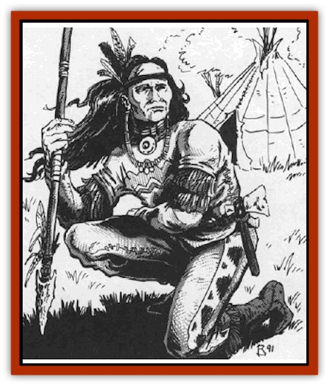

# Human - Abber Nomad

| Statistic | **Human, Abber Nomad** |
| --- | --- |
| **Activity Cycle:** | Day |
| **Alignment:** | Neutral |
| **Armor Class:** | 8 (10) |
| **Climate/Terrain:** | The Nightmare Lands  |
| **Damage/Attack:** | 1-2 or by weapon |
| **Diet:** | Omnivore |
| **Frequency:** | Common |
| **Hit Dice:** | 2 |
| **Intelligence:** | Average (8-10) |
| **Magic Resistance:** | Nil |
| **Morale:** | Average (8-10) |
| **Movement:** | 12 |
| **No. Appearing:** | 10-40 (10d4) |
| **No. of Attacks:** | 1 |
| **Organization:** | Tribe |
| **Size:** | M (6½' tall) |
| **Special Attacks:** | Nil |
| **Special Defenses:** | Resist illusions |
| **THAC0:** | 19 |
| **Treasure:** | Nil |
| **XP Value:** | 65 |

The Abber nomads are a stoic and proud people who dwell in the dreaded Nightmare Lands. Considered by outsiders to be barbarians, the Abber nomads have an unusually sophisticated outlook on life that, not surprisingly, is almost as alien as the bizarre realm that they inhabit.

The typical Abber nomad male stands roughly six and a half feet tall with females being only an inch or so shorter. They are generally well-muscled survivors, as befits their nomadic society and the harsh land with which they must contend.

The language of the Abber nomads is absolutely unique; no scholar has ever been able to liken it to any tongue spoken by any other race in any known land. Further, there seems to be little in their culture to link these people with any other human race, making them seem all the more outcast and alien to the visitor.

**Combat:** When hunting or making ready for battle, Abber nomads paint their faces and bodies with traditional symbols that they feel will give them power over the animals they are stalking or the enemies they are confronting. Most wear tanned skins and carry wooden shields that provide them with AC 8 protection. In all regards, save the following, they fight as normal [[Human|men]].

In melee combat, they employ long, slender spears set with stone tips that function as javelins. These weapons could be thrown, but the nomads seldom use them in that manner and make no effort to balance them for flight.

In missile combat, the Abber nomads use short bows. They often coat their arrowheads in a mild toxin (Class C, 2-5 minutes, 25/2d4) to aid in hunting larger animals. As a rule, 1 in 3 nomads will have poisoned arrows in any encounter.

The Abber nomads live in a wild land of chaos and uncertainty. Because of this, they have developed a natural immunity to all manner of illusions and hallucinations. Any spell designed to fool any of an Abber nomad's senses has a 25% chance of failing to affect them. Even if the spell manages to get past their inherent resistance to it, they are entitled to a +4 bonus on any saving throws required to negate enchantments of this type.

**Habitat/Society:** The Abber nomads, as their name implies, make no permanent strudures. They travel about from place to place in search of the basic elements of survival. They work no metals, but are skilled at woodworking and have some interest in stone carving (usually for the design and construction of minor tools and hunting implements).

While the Abber nomads might seem to be a fairly typical aboriginal culture, nothing could be further from the truth. Their strange surroundings have convinced them that the universe is a wild and unpredictable place - leaving them with no understanding of science or the traditional concepts of cause and effect. In the Nightmare lands, a device or spell that works one day, might cease to function the next.

Because of the strange happenings of the Nightmare Lands, the nomads have developed a philosophy that, greatly paraphrased, says that anything they cannot perceive themselves does not exist. Thus, someone who walks out of their sight ceases to exist until they are again visible. While this can make outsiders uncomfortable and efforts to deal with the nomads very difficult (the nomads will make no long range plans or commitments), it enables them to cope with life in a wild place that seems oblivious to the natural laws that rule the rest of the universe. In addition, the nomads have no faith in the permanency of anything, including ideas or memories. In short, they accept what is and make no efforts to change it or participate in it. They are, perhaps, the universe's most withdrawn and disinterested occupants.

Each tribe of nomads will be composed of 10-40 adults (roughly half male and half female). In addition, there will be another 25% of this number who are young children that do not fight or hunt. Among adults, men and women hunt and share all labors equally. One in ten of the adults will be a leader with 5 HD (THAC0 15). There may be more than one leader in any given tribe. None of the Abber nomads will employ any manner of spells, for they practice no magic.

**Ecology:** As the Nightmare Lands have no natural ecosystem, any judgement about the nomad's place in it is difficult to make. Still, it is clear that, even if the wild lands about them were not constantly in flux, they would have little impact upon them. They are a simple people who survive as hunters and gatherers.

---
## Discovery & Documentation

**Source Publication:** MC10 Ravenloft Appendix I (1989)
**Campaign Setting:** Planescape
**Author(s):** William W. Connors

### Other Creatures Found in This Source Book
   * [[Bastellus|Bastellus]]
   * [[Bat_Ravenloft|Bat (Ravenloft)]]
   * [[Bowlyn|Bowlyn]]
   * [[Broken_One|Broken One]]
   * [[Bussengeist|Bussengeist]]
   * [[Darkling|Darkling]]
   * [[Doom_Guard|Doom Guard]]
   * [[Doppelganger_Plant|Doppelganger Plant]]
   * [[Elemental_Ravenloft|Elemental (Ravenloft)]]
   * [[Ermordenung|Ermordenung]]
   * [[Ghoul_Lord|Ghoul Lord]]
   * [[Goblyn|Goblyn]]
   * [[Golem_III|Golem III]]
   * [[Golem_IV|Golem IV]]
   * [[Golem_Ravenloft|Golem (Ravenloft)]]
   * [[Grim_Reaper|Grim Reaper]]
   * [[Human_Ravenloft|Human (Ravenloft)]]
   * [[Imp_Assassin|Imp, Assassin]]
   * [[Impersonator|Impersonator]]
   * [[Lycanthrope_Werebat|Lycanthrope, Werebat]]
   * [[Lycanthrope_Wereraven|Lycanthrope, Wereraven]]
   * [[Mist_Horror|Mist Horror]]
   * [[Mummy_Greater|Mummy, Greater]]
   * [[Quevari|Quevari]]
   * [[Quickwood|Quickwood]]
   * [[Ravenkin|Ravenkin]]
   * [[Reaver|Reaver]]
   * [[Scarecrow_Ravenloft|Scarecrow (Ravenloft)]]
   * [[Shadow_Fiend|Shadow Fiend]]
   * [[Skeleton_Giant|Skeleton, Giant]]
   * [[Strahd's_Skeletal_Steed|Strahd's Skeletal Steed]]
   * [[Treant_Evil|Treant, Evil]]
   * [[Treant_Undead|Treant, Undead]]
   * [[Valpurgeist|Valpurgeist]]
   * [[Vampire_Dwarf|Vampire, Dwarf]]
   * [[Vampire_Elf|Vampire, Elf]]
   * [[Vampire_Gnome|Vampire, Gnome]]
   * [[Vampire_Halfling|Vampire, Halfling]]
   * [[Vampire_General_Information|Vampire, General Information]]
   * [[Vampire_Kender|Vampire, Kender]]
   * [[Vampyre|Vampyre]]
   * [[Widow_Red|Widow, Red]]
   * [[Wolfwere_Greater|Wolfwere, Greater]]
   * [[Zombie_Lord|Zombie Lord]]
