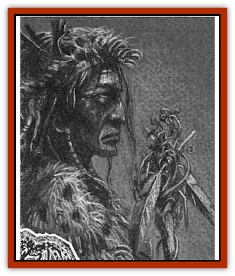

# Human - Abber Shaman

| Statistic | **Human, Abber Shaman** |
| --- | --- |
| **Activity Cycle:** | Day |
| **Alignment:** | Neutral |
| **Armor Class:** | 8 (10) |
| **Climate/Terrain:** | The Nightmare Lands |
| **Damage/Attack:** | By weapon |
| **Diet:** | Omnivore |
| **Frequency:** | Rare |
| **Hit Dice:** | 3 |
| **Intelligence:** | Exceptional (16) |
| **Magic Resistance:** | Nil |
| **Morale:** | Steady (12) |
| **Movement:** | 12 |
| **No. Appearing:** | 1 |
| **No. of Attacks:** | 1 |
| **Organization:** | Solitary |
| **Size:** | M (6½' tall) |
| **Special Attacks:** | Spells |
| **Special Defenses:** | Spells |
| **THAC0:** | 20 |
| **Treasure:** | U |
| **XP Value:** | 270 |

Abber shamans are the holy men and women of the [[Human_Abber_Nomad|Abber nomad]] tribes. The shamans, like the rest of the Abbers, dwell in the dread Nightmare Lands, specifically in the Forest of Everchange. However, the mad paths that the shamans walk make them outcasts among outcasts, cut off from the rest of Abber society.

Abber shamans look like any other Abber nomads. They are tall and well-muscled, forged in a harsh land and tempered by the madness around them. Shamans dress in hides taken from fantastic dream creatures and horrifying nightmare beasts, giving them a surreal appearance. They wield weapons made from wood and stone such as spears, and decorate the few possessions they carry with colorful feathers.

The shamans speak the same unique and alien language as the rest of the Abbers. Many shamans also learn more comprehensible languages from the dreamscapes they study, thus allowing them to communicate with wanderers and dreamers.

**Combat:** Abber shamans are priests. They have the same abilities and spells as other types of priests. Abber shamans, however, cannot turn undead. Instead, they have the ability to banish [[Dream_Spawn_General_Information|dream spawn]]. Use the Hit Dice portion of the Turning Undead table from the *Player's Handbook* to determine a shaman's chances of banishing a dream spawn. A "D" result not only drives a dream spawn off, but it causes it to revert to its natural form (if it was wearing a memory-form pulled from a dreamer's mind).

In addition to weapons and priest spells, Abber shamans have a few special abilities. These are gained through level advancement as described below.

*Detect Dream Spawn:* At 3rd level, a shaman gains the ability to identify a creature as either a dreamer, a wanderer, or a dream spawn. The base chance is 25% plus 2% per level. In the case of dream spawn, the shaman also has a chance of knowing its strengths and weaknesses (10% plus 2% per level).

*Create Dreamcatcher:* At 7th level, a shaman develops the skill to build a dreamcatcher, the magical talismans that locate paths through the nether portals of the dreamscapes. See the Nightmare Lands rules book (TSR 1124) for more information on these devices.

*Dreamwalking:* At 9th level, a shaman gains the ability to enter a deep trance and send his dream-self into the dreams of those sleeping in the waking world. A successful Wisdom check with a -4 modifier is required to accomplish this. Dreamwalking can be attempted once per day. The trance lasts for 1 turn per level of the dreamwalker. While in this type of trance. a shaman's body is vulnerable to any terrors of the Nightmare Lands that come across it.

**Habitat/Society:** While Abber nomads reject the reality of everything around them, Abber shamans seek to embrace the madness and discover the truth of the world. For this obvious rejection of Abber culture, shamans are never allowed to live within Abbcr communities. Their curiosity and bizarre habits attract too much attention from the denizens of nightmare for the rest of the tribe to feel safe.

**Ecology:** Like all Abbers, shamans survive in the bizarre environment as hunters and gatherers. Unlike their fellows, Abber shamans seek to understand the madness and learn about the world around them.

---
## Discovery & Documentation

**Source Publication:** The Nightmare Lands (1995)
**Campaign Setting:** Ravenloft
**Author(s):** Shane Lacy Hensley

### Other Creatures Found in This Source Book
   * [[Arcane_Head|Arcane Head]]
   * [[Dreamweaver|Dreamweaver]]
   * [[Dream_Spawn_General_Information|Dream Spawn, General Information]]
   * [[Dream_Spawn_Greater_Ennui|Dream Spawn, Greater, Ennui]]
   * [[Dream_Spawn_Lesser_Morph|Dream Spawn, Lesser, Morph]]
   * [[Ghost_Dancer_The|Ghost Dancer, The]]
   * [[Hypnos|Hypnos]]
   * [[Lost_Souls|Lost Souls]]
   * [[Morpheus|Morpheus]]
   * [[Mullonga|Mullonga]]
   * [[Nightmare_Court_The|Nightmare Court, The]]
   * [[Nightmare_Man_The|Nightmare Man, The]]
   * [[Night_Terror_Mandalain|Night Terror, Mandalain]]
   * [[Rainbow_Serpent_The|Rainbow Serpent, The]]
