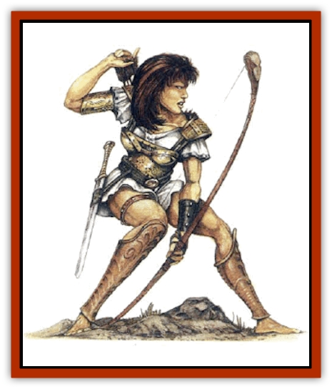

# Human - Amazon

| Statistic | **Human, Amazon** |
| --- | --- |
| **Activity Cycle:** | Day |
| **Alignment:** | Neutral |
| **Armor Class:** | By type |
| **Climate/Terrain:** | Any |
| **Damage/Attack:** | 1d8 (weapon) or 1d6 (unarmed) |
| **Diet:** | Omnivore |
| **Frequency:** | Very rare |
| **Hit Dice:** | 4 or more (d10) |
| **Intelligence:** | Low to Genius (5-18) |
| **Magic Resistance:** | Nil |
| **Morale:** | Elite (13-14) |
| **Movement:** | 15 |
| **No. Appearing:** | 5-30 |
| **No. of Attacks:** | 2 |
| **Organization:** | Clan |
| **Size:** | M (6-7' tall) |
| **Special Attacks:** | High Strength and dexterity (possible), specialization |
| **Special Defenses:** | Constitution (possible) |
| **THAC0:** | 19 |
| **Treasure:** | M,Q (R,S,X) |
| **XP Value:** | Variable |

These barbarian warrior women are, in effect, heroines all. They are exceptionally tall [[Human|human]] women. They tend to be fine-looking, but are hard-eyed (and hard-hearted) too. The exact territory from which they come indicates what sort of weapons they will use and their skills: horsemanship, small water craft, and so on.

They speak the common tongue, and some clans may have a language of their own as well.

**Combat:** Amazons will not be surprised except by invisible attackers. Amazon warriors are barbarian fighters who typically wear light chain mail (though this varies) and carry the weapons typical of barbarian cultures; spears are most common, also a variety of swords, axes, and bows. Young amazons are often skilled with the sling.

Amazons have Strength ratings between 15 and 18 (18/00 is possible), and Dexterity and Constitution ratings between 13 and 18. If unarmed, an amazon can use blows, kicks, nails, teeth, and so on to inflict 1d6 points of damage per round.

**Habitat/Society:** An amazon party of 10 or more will have an additional leader of 5th- or 6th-level, and a witch-doctor of 2nd level. A party of 20 or more will have a captain of 7th or 8th level. Whenever 30 or more are encountered, there is a 30% chance they are one of 2 to 5 raiding parties in the area. In this case, their "lair" will be a ship, or a pack train or wagon train as applicable. The other groups will always be within 5 miles of the party initially encountered.

In their "lair", amazons will have a full 30 barbarian warrior women of 4th level, four leaders of 5th- to 6th-level, one leader of 7th to 8th level, and a Queen - a barbarian of 9th to 12th level. A male witch-doctor of at least 4th-level wizard ability will be present. There are twice as many (normal) males as female warriors, about half of them equal to men-at-arms, and armed and armored as their amazon mistresses. The others will have the care of 2 to 12 children. The queen will have four male guards of 2nd- or 3rd-level, and two female guards of 5th- to 6th-level.

Individual amazon warriors may be encountered from time to time, serving in various mercenary forces. These may retain the weapons of their original clan or adopt unusual weapons, armor, or fighting styles to which they have been exposed.

Amazons of less than 4th level are no older than the young adult age (15-19). Those failing to meet the harsh standards expected of amazon warriors by the age of 20 are banished and not be allowed to rejoin the clan except under the most extraordinary circumstances. On the other hand, a worthy female warrior of 4th level or higher might be adopted into an amazon clan following a period of initiating, training, and questing. The procedure varies from clan to clan, but the initiate must master the clan's skills and weapons.

Amazons of the plains and flatlands employ war chariots. These are light, two-horse chariots with a driver and a warrior, having a movement rate of 18 and a supply of javelins and war arrows. Amazons chariot riders are armed with powerful composite short bows, which they can fire from a moving chariot as if standing stationary on firm ground.

Amazons of the steppes are skilled horse archers. Their mobile communities are based on great wagons that can be circled into a fortified camp. These amazons are reputed to have almost supernatural skill in horse handling.

Island-dwelling amazons build light, maneuverable galleys, which they use for trading and occasional piracy. All amazons from this culture can swim and all have exceptional small boat skills. Their base will be a walled city with a large marble temple to their goddess; the witch-doctor is replaced by a priest-magician of equivalent skill. Island amazons are exceptionally skilled with the long bow.

**Ecology:** Larger amazonian soceties tend to be reclusive or nomadic. Often considered barbarians, regardless of their level of culture, they are viewed with distrust and suspicion by others. In return, they are wary and suspicious of outsiders. Far too often, other warrior cultures have assumed that a band of female warriors would be easy looting. All, thus far, have discovered how costly a mistake that can be.

**Demihuman Amazons**

  *[[Elf|Elf]] amazons* are nomadic woods-dwellers using the spear and long bow. [[Unicorn|Unicorn]] cavalry is possible. *[[Dwarf|Dwarf]] amazons* use axes and war hammers, and ride giant boars. *[[Gnome|Gnome]] amazons* use the throwing axe and short sword. Though lacking mounts, they have exceptional survival skills and can track like rangers. *[[Halfling|Halfling]] amazons* use the javelin and sling. They are famous for their snares and their remarkable endurance.

---
## Discovery & Documentation

**Source Publication:** Monstrous Compendium, 1997 Annual, Volume 4 (1995)
**Campaign Setting:** Advanced Dungeons & Dragons 2nd Edition
**Author(s):** Jon Pickens

### Other Creatures Found in This Source Book
   * [[Anemone_Giant_Sea|Anemone, Giant Sea]]
   * [[Asperii|Asperii]]
   * [[Bainligor|Bainligor]]
   * [[Beast_of_Chaos|Beast of Chaos]]
   * [[Blindheim|Blindheim]]
   * [[Bloodsipper_Far_Realm|Bloodsipper (Far Realm)]]
   * [[Bulette_Gohlbrorn|Bulette, Gohlbrorn]]
   * [[Child_of_the_Sea|Child of the Sea]]
   * [[Clockwork_Horror|Clockwork Horror]]
   * [[Clockwork_Swordsman|Clockwork Swordsman]]
   * [[Coral|Coral]]
   * [[Darklore|Darklore]]
   * [[Dharculus|Dharculus]]
   * [[Dolphin_Athas|Dolphin (Athas)]]
   * [[Dragon_Neutral_Moonstone|Dragon, Neutral, Moonstone]]
   * [[Dragon_Prismatic|Dragon, Prismatic]]
   * [[Dream_Stalker|Dream Stalker]]
   * [[Dragon-kin_Albino_Wyrm|Dragon-kin, Albino Wyrm]]
   * [[Echyan|Echyan]]
   * [[Firestar|Firestar]]
   * [[Firetail|Firetail]]
   * [[Fish_Ascallion|Fish, Ascallion]]
   * [[Fish_Deep_Ocean|Fish, Deep Ocean]]
   * [[Fish_Tropical|Fish, Tropical]]
   * [[Fish_Vurgens|Fish, Vurgens]]
   * [[Fogwarden|Fogwarden]]
   * [[Fraal|Fraal]]
   * [[Giant_Crag|Giant, Crag]]
   * [[Gibberling_Brood|Gibberling, Brood]]
   * [[Glutton_Sea|Glutton, Sea]]
   * [[Golden_Ammonite|Golden Ammonite]]
   * [[Golem_Brass_Minotaur|Golem, Brass Minotaur]]
   * [[Golem_Gemstone|Golem, Gemstone]]
   * [[Golem_Maggot|Golem, Maggot]]
   * [[Groundling|Groundling]]
   * [[Hermit_Sea|Hermit, Sea]]
   * [[Hound_of_Law|Hound of Law]]
   * [[Human_Pygmy|Human, Pygmy]]
   * [[Inquisitor|Inquisitor]]
   * [[Kercpa|Kercpa]]
   * [[Kreel|Kreel]]
   * [[Lycanthrope_Lythari|Lycanthrope, Lythari]]
   * [[Mercurial|Mercurial]]
   * [[Mold_Chromatic|Mold, Chromatic]]
   * [[Mummy_Bog|Mummy, Bog]]
   * [[Neh-thalggu|Neh-thalggu]]
   * [[Nymph_Grain|Nymph, Grain]]
   * [[Nymph_Unseelie|Nymph, Unseelie]]
   * [[Octopus_Octo-Jelly|Octopus, Octo-Jelly]]
   * [[Puddingfish|Puddingfish]]
   * [[Sea_Demon|Sea Demon]]
   * [[Shade|Shade]]
   * [[Shadowrath|Shadowrath]]
   * [[Shark_Athas|Shark (Athas)]]
   * [[Siren_Ravenloft|Siren (Ravenloft)]]
   * [[Skeleton_Variant|Skeleton, Variant]]
   * [[Skyfish|Skyfish]]
   * [[Spectral_Scion|Spectral Scion]]
   * [[Spyder_Fiend|Spyder Fiend]]
   * [[Squid_Squark|Squid, Squark]]
   * [[Tanar'ri_Lesser_Uridezu|Tanar'ri, Lesser, Uridezu]]
   * [[Troll_Mutate|Troll Mutate]]
   * [[Vaati|Vaati]]
   * [[Vampire_Cerebral|Vampire, Cerebral]]
   * [[Varkha|Varkha]]
   * [[Wizshade|Wizshade]]
   * [[Worm_Lukhorn|Worm, Lukhorn]]
   * [[Wyste|Wyste]]
   * [[Yugoloth_Lesser_Gacholoth|Yugoloth, Lesser, Gacholoth]]
   * [[Zombie_Mud|Zombie, Mud]]
