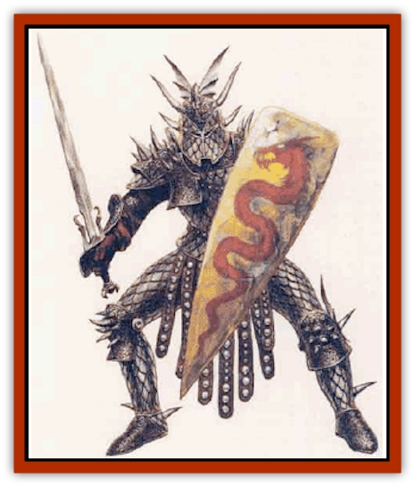

# Human - Dragonslayer

| Statistic | **Human, Dragonslayer** |
| --- | --- |
| **Activity Cycle:** | Any |
| **Alignment:** | Any |
| **Armor Class:** | 4 or better |
| **Climate/Terrain:** | Any |
| **Damage/Attack:** | By weapon |
| **Diet:** | Omnivore |
| **Frequency:** | Rare |
| **Hit Dice:** | 2+ |
| **Intelligence:** | High (13) |
| **Magic Resistance:** | Nil |
| **Morale:** | Elite (13) |
| **Movement:** | 12 |
| **No. Appearing:** | 2-12 |
| **No. of Attacks:** | 1 |
| **Organization:** | Group |
| **Size:** | M (6-7' tall |
| **Special Attacks:** | See below |
| **Special Defenses:** | See below |
| **THAC0:** | 19 or better |
| **Treasure:** | L,M,U |
| **XP Value:** | Slayer Warrior (2 HD): 270 / Slayer Knight (7 HD): 5,000 / Slayer Mage (5 HD): 4,000 |

The dragon slayer is a [[Human|human]] warrior specially trained to battle dragons. Some dragon slayers consider themselves to be on a holy mission of one sort or another, while others are simply part of an order of knights dedicated to protecting humanity from one or more types of dragons.

A dragon slayer is easy to recognize. Warriors and priests wear specially crafted armor designed to protect them from the weapons of dragons - claws, teeth, and breath. The armor often makes the slayers look like the great wyrms they battle, with helms shaped into dragon heads, plate mail inlaid with a pattern of scales, and spiky protrusions jutting from the shoulders, elbows, and knees. Slayer mages wear cloaks of dragon scales with hoods fashioned from dragon skulls.

Dragon slayers speak the common language of the land they live in, as well as the language of one group of dragons (metallic, chromatic, or gem).

**Combat:** The traditional weapons of the dragon slayers include any weapons that inflict great damage on large creatures. Favorites include the long sword, heavy and medium horse lance, awl pike, bardiche, bastard sword, two-handed sword, and trident. Some slayers employ long sword +2, dragon slayers (25%). Mages wield daggers of dragon teeth and staves of dragon bone.

The slayers of 4th level or higher wear enchanted asmor. In battle with dragons, the armor glows and adds a protection bonus of +1 to +5. Only warriors above 9th level who have been true to their cause can hope to gain the highest enchantment. Dragonslayer mages wear speaally crafted cloaks that provide a +1 protective bonus. At 5th level, a mage's cloak becomes enchanted against dragons and provides an additional +1 protection bonus. By 12th level the bonus can be as high as +5.

Dragon slayers are immune to the effects of dragon fear. Warriors receive a +2 bonus to attack rolls made against all dragons, and a +4 bonus against one type of dragon. When fighting dragons, slayers get damage roll bonuses equal to their levels. Because of their training, slayers save vs. breath weapon for half or no damage. Some slayers (60%) use mounts of heroic proportions (either war [[Horse|horses]] or flying creatures). These creatures receive the same fear immunity, attack bonuses, and breath weapon defenses as their masters.

Dragon slayer warriors learn special attacks as part of their training. They receive one of these attacks upon reaching 1st, 4th, 8th, and 12th level.

*Dazzle:* This ability confuses a dragon and hinders its ability to cast spells or use its innate powers. The slayer twirls his or her weapon in such a way as to captivate or disorient the dragon foe. The twirling weapon disrupts the dragon's concentration, making it impossible for the dragon to gather the merest thoughts necessary to activate a spell or innate ability.

*Wing Attack:* Aimed at a dragon's wing muscles, this attack is made with a -3 penalty. In addition to nomtal damage, this attack keeps a dragon from flying for 1 round per point of damage inflicted in the attack.

*Breath Stun:* Aimed at a dragon's gullet, this attack disables a dragon's breath weapon. It is made with a -4 penalty. In addition to normal damage, the breath weapon is disabled for 1 round per point of damage inflicted.

*Great Blow:* This attack uses everything a slayer has and may be aimed at any part of the body. A slayer expends hit points and weives a -4 penalty. If successful, the dragon takes normal damage plus loses as many hit points as the slayer expended.

**Habitat/Society:** The most common orders of dragon slayers are holy knights who worship a dragon god but hate all mortal dragons, or warriors dedicated to battling evil dragons. They study dragons intensely to learn how best to defeat them. All travel the land, seeking their eternal foes.

**Ecology:** Except for thew fascination with all things draconic, slayers are otherwise normal humans.

---
## Discovery & Documentation

**Source Publication:** Monstrous Compendium, 1995 Annual, Volume 2 (1995)
**Campaign Setting:** Advanced Dungeons & Dragons 2nd Edition
**Author(s):** Jon Pickens

### Other Creatures Found in This Source Book
   * [[Aboleth_Savant|Aboleth, Savant]]
   * [[Addazahr|Addazahr]]
   * [[Amiq_Rasol|Amiq Rasol]]
   * [[Arch-Shadow|Arch-Shadow]]
   * [[Automaton_Scaladar|Automaton, Scaladar]]
   * [[Automaton_Trobriand's|Automaton, Trobriand's]]
   * [[Bat_Sporebat|Bat, Sporebat]]
   * [[Beetle_Dragon|Beetle, Dragon]]
   * [[Bi-nou|Bi-nou]]
   * [[Boggle|Boggle]]
   * [[Brownie_Dobie|Brownie, Dobie]]
   * [[Brownie_Quickling|Brownie, Quickling]]
   * [[Cat_Crypt|Cat, Crypt]]
   * [[Cat_Great_Cath_Shee|Cat, Great, Cath Shee]]
   * [[Centaur-kin_Dorvesh|Centaur-kin, Dorvesh]]
   * [[Centaur-kin_Gnoat|Centaur-kin, Gnoat]]
   * [[Centaur-kin_Ha'pony|Centaur-kin, Ha'pony]]
   * [[Centaur-kin_Zebranaur|Centaur-kin, Zebranaur]]
   * [[Chronolily|Chronolily]]
   * [[Curst|Curst]]
   * [[Darktentacles|Darktentacles]]
   * [[Dinosaur_Aquatic|Dinosaur, Aquatic]]
   * [[Dinosaur_II|Dinosaur II]]
   * [[Dinosaur_III|Dinosaur III]]
   * [[Doppelganger_Greater|Doppelganger, Greater]]
   * [[Dragon_Brine|Dragon, Brine]]
   * [[Dragon_Half-|Dragon, Half-]]
   * [[Dragon-kin_Sea_Wyrm|Dragon-kin, Sea Wyrm]]
   * [[Dwarf_Wild|Dwarf, Wild]]
   * [[Ekimmu|Ekimmu]]
   * [[Elemental_Nature|Elemental, Nature]]
   * [[Elf_Winged|Elf, Winged]]
   * [[Fish_Great_Glacier|Fish (Great Glacier)]]
   * [[Fish_Subterranean|Fish, Subterranean]]
   * [[Fish_Toril|Fish (Toril)]]
   * [[Flareater|Flareater]]
   * [[Flumph|Flumph]]
   * [[Froghemoth|Froghemoth]]
   * [[Ghost_Casurua|Ghost, Casurua]]
   * [[Ghost_Ker|Ghost, Ker]]
   * [[Ghul|Ghul]]
   * [[Ghul-Kin|Ghul-Kin]]
   * [[Giant_Half-giant|Giant, Half-giant]]
   * [[Golem_Burning_Man|Golem, Burning Man]]
   * [[Golem_Phantom_Flyer|Golem, Phantom Flyer]]
   * [[Gulguthhydra|Gulguthhydra]]
   * [[Hakeashar|Hakeashar]]
   * [[Horse_Moon-|Horse, Moon-]]
   * [[Human_Vistana|Human, Vistana]]
   * [[Jellyfish_Giant|Jellyfish, Giant]]
   * [[Kalin|Kalin]]
   * [[Kholiathra|Kholiathra]]
   * [[Laerti|Laerti]]
   * [[Leucrotta_Greater|Leucrotta, Greater]]
   * [[Lich_Suel|Lich, Suel]]
   * [[Lurker_Shadow|Lurker, Shadow]]
   * [[Lycanthrope_Werepanther|Lycanthrope, Werepanther]]
   * [[Lycanthrope_Wereshark|Lycanthrope, Wereshark]]
   * [[Mammal_Herd_II|Mammal, Herd II]]
   * [[Marl|Marl]]
   * [[Meenlock|Meenlock]]
   * [[Mimic_Greater|Mimic, Greater]]
   * [[Mold_II|Mold II]]
   * [[Mummy_Creature|Mummy, Creature]]
   * [[Nyth|Nyth]]
   * [[Ooze_Slime_Jelly_Ghaunadan|Ooze/Slime/Jelly, Ghaunadan]]
   * [[Palimpsest|Palimpsest]]
   * [[Peltast|Peltast]]
   * [[Plant_Dangerous_II|Plant, Dangerous II]]
   * [[Pleistocene_Animal|Pleistocene Animal]]
   * [[Pudding_Subterranean|Pudding, Subterranean]]
   * [[Raggamoffyn|Raggamoffyn]]
   * [[Snake_Serpent|Snake, Serpent]]
   * [[Snake_Serpent_Vine|Snake, Serpent Vine]]
   * [[Sphinx_Draco-|Sphinx, Draco-]]
   * [[Sprite_Seelie_Faerie|Sprite, Seelie Faerie]]
   * [[Sprite_Unseelie_Faerie|Sprite, Unseelie Faerie]]
   * [[Squealer|Squealer]]
   * [[Turtle_Giant|Turtle, Giant]]
   * [[Umpleby|Umpleby]]
   * [[Vizier's_Turban|Vizier's Turban]]
   * [[Wall_Walker|Wall Walker]]
   * [[Webbird|Webbird]]
   * [[Yak-Man|Yak-Man]]
   * [[Zorbo|Zorbo]]
