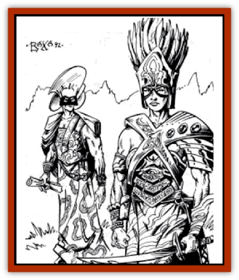

# Human - Draxan

| Statistic | **Human, Draxan** |
| --- | --- |
| **Activity Cycle:** | Any |
| **Alignment:** | Varies (Lawful evil) |
| **Armor Class:** | Varies (5) |
| **Climate/Terrain:** | Valley of Dust and Fire |
| **Damage/Attack:** | By weapon (1d6) |
| **Diet:** | Omnivore |
| **Frequency:** | Uncommon |
| **Hit Dice:** | 3d10 |
| **Intelligence:** | Varies (Average) |
| **Magic Resistance:** | Nil |
| **Morale:** | Champion (15) |
| **Movement:** | 12 |
| **No. Appearing:** | 1-12 (Patrol 2-16) |
| **No. of Attacks:** | Varies (1) |
| **Organization:** | Clan or Patrol |
| **Size:** | M (5-6') |
| **Special Attacks:** | Psionics or spells |
| **Special Defenses:** | Nil |
| **THAC0:** | Varies (18) |
| **Treasure:** | Individual K,M,N |
| **XP Value:** | Varies (270) |

**Psionics Summary**

| Level | Dis/Sci/Dev | Attack/Defense | Score | PSPs |
| --- | --- | --- | --- | --- |
| 3 | 1/0/1 | nil/nil | 12 | 30 |

**Wild Talent:** Roll 1d12. 1: danger sense; 2: ballistic attack; 3: adrenalin control; 4: displacement; 5: graft weapon; 6: ESP; 7: invisibility; 8: dimension door; 9 through 12: no significant talent.

Draxans are the citizens of Ur Draxa, the City of Doom within the Valley of Dust and Fire. From birth they are trained as warriors, psionicists, templars, or defilers. They are the lords of the Valley and aggressively attack most intruders. Draxans are [[Human|human]], but centuries of martial training have made them into a cruel, fierce people.

When Draxans are encountered, half are average Draxans who conform to the statistics in parentheses above. They fight and save as 3rd-level fighters, and may have a random wild talent. The rest are unique individuals. Half of these are warriors of level 3-10 (1d8+2), 20% are psionicists of level 2-12, 20% are templars of level 3-12, and 10% are defilers of level 3-12. Draxans are frequently accompanied by 0-2 slaves per Draxan.

**Combat:** Draxans fight according to their class. Defilers and psionicists hang back and use spells and psionic abilities, whereas warriors engage the enemy. Templars choose one of these two strategies. Slaves cower out of the way. Standard Draxans are effectively 3rd-level fighters in all respects. They are equipped with fine chitinous hide armor and a long shield, and they carry short bows of horn and spears and short swords of fine steel. Draxans are paranoid and often go about their city armed to the teeth; in their homes, or wherever a fight would be unexpected, they are unarmored and equipped with daggers.

All Draxans are trained in the keshai, the Draxan martial art of strikes and throws, as children. Every Draxan can make unarmed attacks on the martial arts table given in *The Complete Fighter's Handbook*. If you do not use martial arts in your campaign, allow Draxans to punch and wrestle at +1 to hit and +1 on damage and knock-out rolls.

Some Draxans may have exceptional ability scores that affect their combat abilities. Roll one d6: 1-3, the Draxan has no exceptional ability scores; 4-5, one; 6, two. The abilities affected are noted in the descriptions below. Each exceptional ability has a score of 14 + 1d6 and corresponding benefits.

*Fighters:* Draxan warriors use three principal armors: studded leather, hide, or banded. Banded mail is usually reserved for high-level Draxan fighters. Most unique Draxan fighters have specialized in a favored weapon, gaining the additional attacks, hit bonus, and damage bonus of a specialist. Unique Draxan fighters have a 10% chance per level to own magical arms or armor of +1 to +3 value and half that chance to own a miscellaneous magic item usable by fighters.

Exceptional ability scores for Draxan fighters are found in Strength, Dexterity, and Constitution. Draxans favor short swords, large shields, spears, javelins, and bows.

*Psionicists:* Draxan psionicists progress as normal NPC psionicists. Generating NPC psionicists can take a long time; develop a couple of standard psionicist templates to save time. Psionicists usually wear hide or studded leather armor and prefer short swords. They have a 5% chance per level to own magical arms or armor of +1 to +3 value and twice that chance to own a miscellaneous magical item.

Exceptional ability scores for Draxan psionicists are in Wisdom, Intelligence, or Constitution.

*Templars:* Draxan templars usually wear black, chitinous hide armor and carry short swords and spears on duty. Otherwise, they wear studded leather armor. Templars have a spell selection appropriate to their level. Templars have the same chance to own magical weapons and miscellaneous magical items as a fighter.

Templars may have exceptional ability scores in Wisdom, Intelligence, or Strength.

*Defilers:* Draxan defilers are limited to robes, but often are trained in weapons foreign to most wizards. If desired, use the Militant Wizard kit from The Complete Wizard's Handbook as a guide. Otherwise, treat Draxan defilers as normal mages who can wield the short sword as one of their weapon options. Defilers have spells memorized appropriate to their level and have a 5% chance per level to own an offensive magical item such as a wand of fire, wand of frost, or wand of magic missiles.

Defilers may have exceptional ability scores in Intelligence, Constitution, or Dexterity.

Draxans are persistent, aggressive foes who do not hesitate to carry the fight to the enemy. Warriors fire a volley or two of arrows, then draw their swords and attack the weakened enemy. Templars, psionicists, and defilers make early and effective use of their most powerful abilities and spells.

*The Dragon Warriors:* The most exalted Draxan fighters, the Dragon Warriors patrol beyond the Great Ash Storm. Dragon Warriors wear banded mail and carry shields, lances, composite short bows, and a melee weapon. They are warriors of 10th to 15th level (d6+9) and usually ride [[Roc|rocs]].

**Habitat/Society:** Only a few Draxans ever leave their mighty city. The Draxans are a feudal clan society and are all considered nobles and landowners. The work of the city is performed by a massive slave population the Draxans oversee. Draxans are by nature competitive and settle their differences through ritual duels and intense feuds.

---
## Discovery & Documentation

**Source Publication:** DSR4 Valley of Dust and Fire (1992)
**Campaign Setting:** Dark Sun
**Author(s):** L. Richard Baker III

### Other Creatures Found in This Source Book
   * [[Drake_Lesser_Athas_Silt|Drake, Lesser (Athas), Silt]]
   * [[Golem_Athas_Magma|Golem (Athas), Magma]]
   * [[Human_Ka'Ardan|Human, Ka'Ardan]]
   * [[Jhakar|Jhakar]]
   * [[Kaisharga|Kaisharga]]
   * [[Silt_Horror_Black|Silt Horror, Black]]
