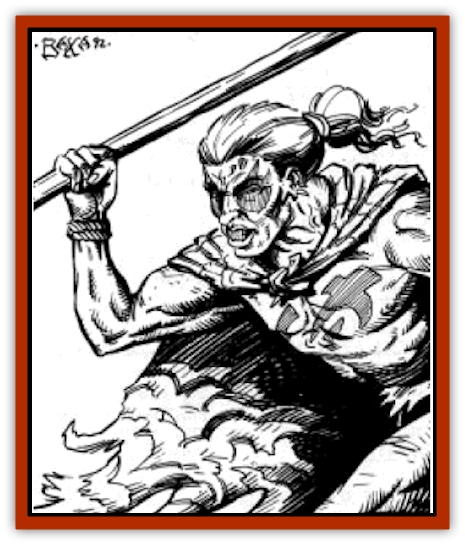

# Human - Ka'Ardan

| Statistic | **Human, Ka'Ardan** |
| --- | --- |
| **Activity Cycle:** | Any |
| **Alignment:** | Any (Chaotic neutral) |
| **Armor Class:** | 10 (6) |
| **Climate/Terrain:** | Valley of Dust and Fire |
| **Damage/Attack:** | By weapon (1d6-1) |
| **Diet:** | Omnivore |
| **Frequency:** | Uncommon |
| **Hit Dice:** | Varies (2d10) |
| **Intelligence:** | Varies (Average) |
| **Magic Resistance:** | Nil |
| **Morale:** | Steady (11) |
| **Movement:** | 12 |
| **No. Appearing:** | 2d6 |
| **No. of Attacks:** | Varies (1) |
| **Organization:** | Tribal |
| **Size:** | M (5-7') |
| **Special Attacks:** | Psionics, magic use |
| **Special Defenses:** | Nil |
| **THAC0:** | Varies (19) |
| **Treasure:** | Nil |
| **XP Value:** | 175 |

**Psionics Summary**

| Level | Dis/Sci/Dev | Attack/Defense | Score | PSPs |
| --- | --- | --- | --- | --- |
| 2 | 1/0/1 | nil/nil | 9 | 20 |

Wild Talent: Roll 1d12.1: danger sense; 2: ballistic attack; 3: adrenalin control; 4: displacement; 5: graft weapon; 6: ESP; 7: invisibility; 8: dimension door; 9 through 12: no significant talent.

The ka'ardani ([[Human_Draxan|Draxan]] for "outlanders" or "exiles") are residents of the outer valley, a people descended from escaped slaves, lost travelers, and exiled criminals. They survive where few creatures can - in the hellish volcanic waste of the Valley of Dust and Fire. Every day of their existence is a struggle to find food, water, and shelter.

When the ka'ardani are encountered, half are average 2nd-level fighters conforming to the statistics given in parentheses above. Half of the rest are rangers, 20% psionicists, 20% clerics, and 10% preservers.

Most ka'ardani are [[Human_Athas|human]], but significant numbers of [[Dwarf_Athas|dwarves]], [[Elf_Athas|elves]], and half-elves (one in six) are found among them. As a rule of thumb, allow dwarves a +2 bonus on damage and hit points, and allow elves a -2 bonus to their Armor Class. If they are unique individuals, use the racial ability score modifiers instead.

Unique ka'ardani are of level 3-12 and have a chance to possess exceptional ability scores. Roll 1d6: 1-3, no exceptional scores; 4-5, one; 6, two. They have only a 2% chance per level to own a magical item that is appropriate to their profession.

**Combat:** Ka'ardani make do with whatever materials they can. Weapons are made of bone or stone, and armor is usually skins (AC 9) or hide (AC 6). They carry large wicker or hide shields. Ka'ardani use spears, clubs, and bows in combat and brew type A, B, and O poisons. They are consummate hunters and are familiar with the lands they live in. They gain a bonus of -1 on their opponents' surprise rolls.

**Habitat/Society:** The ka'ardani gather in small tribes of two to three dozen, for the ravaged land of the Valley cannot support larger groups. The tribes are ruled by the strongest and wisest warrior, but even the most well-liked leaders must be prepared to face a challenge to their leadership at any time. The ka'ardani are survivors, and when a chief no longer leads well, they replace him. Similarly, sick or old individuals are often sent away when they become a burden to the tribe.

---
## Discovery & Documentation

**Source Publication:** DSR4 Valley of Dust and Fire (1992)
**Campaign Setting:** Dark Sun
**Author(s):** L. Richard Baker III

### Other Creatures Found in This Source Book
   * [[Drake_Lesser_Athas_Silt|Drake, Lesser (Athas), Silt]]
   * [[Golem_Athas_Magma|Golem (Athas), Magma]]
   * [[Human_Draxan|Human, Draxan]]
   * [[Jhakar|Jhakar]]
   * [[Kaisharga|Kaisharga]]
   * [[Silt_Horror_Black|Silt Horror, Black]]
