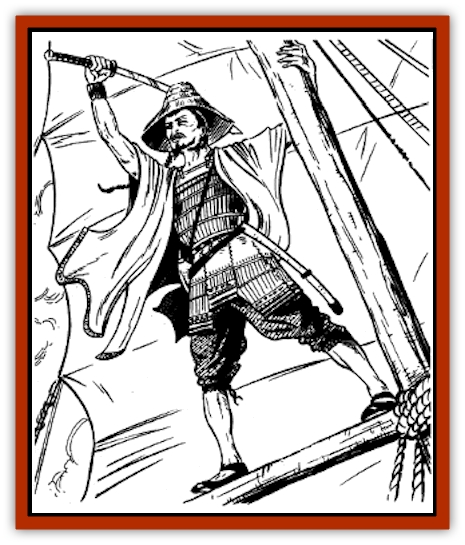

# Human - Kara-Tur

| Statistic | **Frost Barbarian** | **Wako (Sea Pirate)** |
| --- | --- | --- |
| **Activity Cycle:** | Any | Any |
| **Alignment:** | Lawful evil | Lawful evil |
| **Armor Class:** | See below | See below |
| **Climate/Terrain:** | Arctic mountains | Tropical, subtropical, and temperate oceans and coasts |
| **Damage/Attack:** | By weapon | By weapon +1 |
| **Diet:** | Omnivore | Omnivore |
| **Frequency:** | Rare | Uncommon |
| **Hit Dice:** | 1 (2-7 hit points) | 1 (2-7 hit points) |
| **Intelligence:** | Average (8-10) | Average to very (8-12) |
| **Magic Resistance:** | Nil | Nil |
| **Morale:** | Average (10) | Steady (11) |
| **Movement:** | 12 | 12 |
| **No. Appearing:** | 20-80 | 30-180 |
| **No. of Attacks:** | 1 | 1 (at +2) |
| **Organization:** | Tribe | Band |
| **Size:** | M (4-5' tall) | M (5-6' tall) |
| **Special Attacks:** | Nil | Nil |
| **Special Defenses:** | See below | Nil |
| **THAC0:** | 20 | 20 |
| **Treasure:** | C | A |
| **XP Value:** | Varies | Varies |

Of all the men of Kara-Tur, few are more feared than the wako and frost barbarians. Wako are merciless pirates, preying on all who travel the seas. Frost barbarians are savage tribesmen of the arctic mountains, renowned for their brutality.

## Wako

The wako are a loosely organized band of men of low class who have fled their homelands or have been hired by powerful lords. They ply the warm seas, boarding ships and raiding coastal towns. They are desperate and dangerous, and even the fierce western pirates regard them with fear.

Wako speak the trade language. They also speak the languages of many lands bordering the oceans upon which they sail.

**Combat:** Wako are virtually fearless in combat. Knowing that their capture means torture and death, the wako fight to the last man, no matter how hopeless the situation. Negotiation with wako is seldom an option. These pirates take no prisoners, but they may take slaves, who will be sold or kept for personal use in the wako's secret coastal settlements.

Because of their fearlessness, all wako gain a +2 bonus to their attack rolls and a +1 bonus to damage rolls. A typical force is equipped as follows: hara-ate-gawa and sword (50%); do-maru and sword (15%); sword and bow (10%); kote and spear (10%); haramaki, sword, spear, and bow (10%); kote, do-maru, sword, and bow (5%). All leaders and high-level wako wear o-yoroi and usually carry swords and bows.

**Habitat/Society:** The wako lair is a permanent settlement in a secluded and easily defended coastal area. Wako sometimes establish their settlements on the lands of their sponsoring lords. In any case, a wako settlement is surrounded by high stone walls and is constantly patrolled.

For every 30 wako encountered, there is a 5th level bushi. For every 60 wako, there is a 7th level barbarian. (These are in addition to wako indicated by the dice.) A wako band is always led by a 10th level samurai, who is aided by a barbarian lieutenant of 8th level and 1-3 bushi mates of 6th level. For every 30 wako present, there is a 5% chance that a 6th- to 9th-level wu jen is present. (To determine this wu jen's level, roll 1d4 and add 5.)

**Ecology:** Unless their sponsoring lords decide otherwise, ships from all countries are equally susceptible to wako attacks. Rival wako bands sometimes battle for control of a particular region, but for the most part, wako bands give each other wide berth.

**Frost Barbarian**

  The frost barbarians are warlike tribesmen who live in primitive villages in remote, mountainous arctic regions. They are short and stocky, with matted hair and beards, and chalky skin. Though they speak their own language, tribal leaders usually are conversant in the trade language.

Frost barbarians ambush and attack anyone who ventures within 20 miles of their villages. Small barbarian groups occasionally travel far from their homes while hunting. Most often, these barbarian hunters also attack everyone they encounter, presuming them to be competitors for the same game.

Frost barbarians are armed as follows: club (30%); spear (20%); stone axe (20%); stone axe and spear (20%); long sword (10%). All wear heavy furs, which give them an effective AC of 9. Frost barbarian leaders wear leather armor (AC 8) and carry long swords and stone axes. The arctic animal furs worn by frost barbarians, along with their naturally pale skins, makes them nearly impossible to see against the snow and ice. This camouflage gives their opponents a -5 penalty to surprise.

For every 20 tribesmen encountered, there is one 3rd level barbarian. For every 40 tribesmen, there is a 4th level barbarian. As the numbers increase to 80 or more, a tribe includes one 7th or 8th level barbarian. All other tribesmen are 1st level barbarians. The highest ranking barbarian serves as leader.

---
## Discovery & Documentation

**Source Publication:** MC6 Kara-Tur Appendix (1990)
**Campaign Setting:** Kara-Tur (Forgotten Realms)
**Author(s):** Rick Swan

### Other Creatures Found in This Source Book
   * [[Bajang|Bajang]]
   * [[Bakemono|Bakemono]]
   * [[Bisan|Bisan]]
   * [[Buso|Buso]]
   * [[Carp_Giant|Carp, Giant]]
   * [[Centipede_Spirit|Centipede, Spirit]]
   * [[Chu-u|Chu-u]]
   * [[Con-tinh|Con-tinh]]
   * [[Doc_cu'o'c|Doc cu'o'c]]
   * [[Duruch'i-lin|Duruch'i-lin]]
   * [[Flame_Spirit|Flame Spirit]]
   * [[Foo_Creature|Foo Creature]]
   * [[Gaki|Gaki]]
   * [[Gargantua|Gargantua]]
   * [[Goblin_Rat|Goblin Rat]]
   * [[Hai_Nu|Hai Nu]]
   * [[Hannya|Hannya]]
   * [[Hengeyokai|Hengeyokai]]
   * [[Hsing-sing|Hsing-sing]]
   * [[Hu_Hsien|Hu Hsien]]
   * [[Ikiryo|Ikiryo]]
   * [[Jishin_Mushi|Jishin Mushi]]
   * [[Kala|Kala]]
   * [[Kaluk|Kaluk]]
   * [[Kappa|Kappa]]
   * [[Korobokuru|Korobokuru]]
   * [[Krakentua|Krakentua]]
   * [[Kuei|Kuei]]
   * [[Memedi|Memedi]]
   * [[Men-shen|Men-shen]]
   * [[Nat|Nat]]
   * [[Ningyo|Ningyo]]
   * [[Oni|Oni]]
   * [[P'oh|P'oh]]
   * [[P'oh_Gohei|P'oh, Gohei]]
   * [[Shan_Sao|Shan Sao]]
   * [[Shirokinukatsukami|Shirokinukatsukami]]
   * [[Spirit_Folk|Spirit Folk]]
   * [[Spirit_Nature|Spirit, Nature]]
   * [[Spirit_Stone|Spirit, Stone]]
   * [[Tako|Tako]]
   * [[Tengu|Tengu]]
   * [[Wang-Liang|Wang-Liang]]
   * [[Yuan-ti_Histachii|Yuan-ti, Histachii]]
   * [[Yuki-on-na|Yuki-on-na]]
