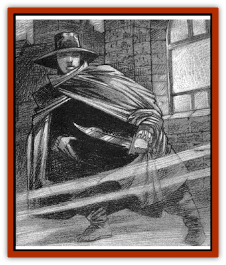

# Human - Madman - The Midnight Slasher

| Statistic | **Human, Madman (The Midnight Slasher)** |
| --- | --- |
| **Activity Cycle:** | Night |
| **Alignment:** | Chaotic evil |
| **Armor Class:** | 8 |
| **Climate/Terrain:** | Invidia (Karina) |
| **Damage/Attack:** | 2-5 (1d4+1) |
| **Diet:** | Omnivore |
| **Frequency:** | Unique |
| **Hit Dice:** | 5 (17 hit points) |
| **Intelligence:** | Average (10) |
| **Magic Resistance:** | Nil |
| **Morale:** | Unsteady (7) |
| **Movement:** | 12 |
| **No. Appearing:** | 1 |
| **No. of Attacks:** | 1 |
| **Organization:** | Solitary |
| **Size:** | M (6'2&rdquo; or 5'8&rdquo;; see below) |
| **Special Attacks:** | Triple damage on backstabs |
| **Special Defenses:** | Hide in Shadows 90% |
| **THAC0:** | 18 |
| **Treasure:** | Nil |
| **XP Value:** | 650 |

The city of Karina lies nestled in a wooded valley carved by the sparkling wafers of the Musarde River. Its cobblestone streets are kept clean and in good repair, flowers decorate window boxes throughout the town, and the weather is generally mild and pleasant.

One night each month, however, a thick fog boils from the river and flows through the streets. When this happens, people fear to leave their homes. They hide behind locked doors until the sun rises and burns off the hated mists. From behind barred windows, they peer nervously into the night and listen for the chiming of the great clock in the center of town. Almost without exception, the last bell of midnight is followed by a scream of terror somewhere in the city. As the echoes of this cry fade into the fog, people make holy signs and offer thanks that the [[Human_Ravenloft|Midnight Slasher]] has chosen someone else as his victim that night.

Though few have caught more than a fleeting glimpse of the Slasher, there are enough scattered reports of sightings to piece together a fair description of the fiend. The Slasher is tall, rather over six feet in height, and slender. He wears a wide-brimmed hat and a billowing cloak of some black fabric that seems to drink up the light, making him hard to see. The lower half of his face is obscured by a black cloth, above which maddened eyes stare out from a narrow band of pale skin. When he strikes, he uses a long, razor-sharp blade.

None have ever spoken with the Slasher, so it is not known what languages he might speak. The folk of Karina assume he is a native of Invidia, and thus understands the local language, although a few insist this fiend is a foreigner, probably one of those sinister [[Human_Vistana|Vistani]] outcasts known as [[Darkling|Darklings]].

**Combat:** The Midnight Slasher is not a man who likes to stand for a fair fight. However, when he is able to strike with surprise, he is a deadly assassin. The black cloak that he wears was crafted by the [[Elf_Drow|Drow]] of [[Arak_General_Information|Arak]] and is said to have been fashioned from darkness itself. When the Slasher wears this cloak, he is able to Hide in Shadows with 90% effectiveness. In addition, he wears Drowish *boots of elvenkind* which enable him to Move Silently with a 95% chance of success. Both of these items work only in darkness; together, they give the Slasher triple the normal chance for surprise. If he attains surprise, the Slasher's attack is made with a +4 bonus to hit and inflicts triple damage. In addition, the Slasher has the following thiefly skills: Pick Pockets 50%; Open Locks 42%; Find & Remove Traps 42%; Move Silently 40% (95% with *boots*); Hide in Shadows 31% (90% with cloak); Hear Noise 20%; Climb Walls 90%.

The Slasher limits his attacks to individuals foolish or unlucky enough to be caught outside when the hour of midnight arrives. He never attacks groups of people nor anyone who looks as if he or she may pose a serious threat. If he fails to attain surprise, the Slasher will usually flee, using his Drow cloak to vanish into the night.

**Habitat/Society:** The Midnight Slasher's greatest secret is that "he" is in fact a woman - a fact which the good folk of Karina do not even begin to suspect. Part of the reason for this is that the cloak, hat, and boots not only hide her features but also make her appear taller than she really is. Another is that they cannot conceive that the shy and silent sneak thief they scoff at and curse by day and the brutal murderer they so fear by night could be one and the same.

The story of the Midnight Slasher begins not with the young woman herself, but with her parents. She was barely five years old when her father, a strong and handsome woodsman, drew the attention of the lord of Invidia, Gabrielle Aderre. After her first chance encounter with him, she learned that he was married with a wife and daughter to whom he was utterly devoted. Aderre vowed that his happiness would be destroyed and began to visit the woodsman regularly. Eventually, the temptress lured him into her arms with her unnatural charms.

As she toyed with the entranced woodsman over the next several weeks, she saw to it that his wife learned of her husband's infidelity. The tension that was growing between the young couple culminated when the wife and daughter returned home early from errands about town and discovered the lovers together. As Aderre stood by and watched with mocking laughter, the young couple plunged into a violent fight. With the prompting of the beautiful but evil witch, the argument grew into something that neither could control. In the end, husband and wife killed each other, utterly consumed by their overwhelming rage.

Aderre left the bloody scene well satisfied with the tragedy she had wrought. She paused in her departure only long enough to kneel beside the almost catatonic child and kiss her gently on the forehead. From that moment on, the young girl's sanity was destroyed.

For the next several years, the young orphan lived as a beggar on the streets of Karina. She stole food and clothing when she could, starved and shivered when she could not. She found shelter in the darkest sections of the city, a neighborhood inhabited by criminals, beggars, and harlots. She saw the latter as kin to the vile woman who destroyed her parents and began to develop a burning hatred for them. Gradually, she became more and more detached from the human race.

Years passed and the girl grew to adulthood on the streets. She spoke to no one, hid from others, and was all but invisible in the heart of Karina. One night, when a thick fog had rolled in from the river to fill the night with misty shapes, she happened across a traveling adventurer in the arms of a trollop. The scene reminded her so much of the one that she and her mother had walked in on that she flew into a wild rage. Over and over she tore at the woman with her dagger as the adventurer fled into the night. When she finished her butchery, the young thief stood over her kill and listened to the distant chiming of the city's great clock tower. As the last echoes faded, the Midnight Slasher was born.

**Ecology:** The Midnight Slasher lives in the darkness, just as she always has. She moves about the city; hiding, watching, and stalking her next victim. She survives by stealing food and drink. Her knowledge of the city's darkest corners - its dank alleys, abandoned buildings, and forgotten culverts - is unmatched, making her as deadly as any [[Spider|spider]] in its web.

---
## Discovery & Documentation

**Source Publication:** Ravenloft Appendix II: Children of the Night (1991)
**Campaign Setting:** Ravenloft
**Author(s):** William W. Connors

### Other Creatures Found in This Source Book
   * [[Brain_Living|Brain, Living]]
   * [[Ermordenung_Nostalia_Romaine|Ermordenung, Nostalia Romaine]]
   * [[Ghoul_Ghast_Jugo_Hesketh|Ghoul, Ghast, Jugo Hesketh]]
   * [[Golem_Half-|Golem, Half-]]
   * [[Golem_Mechanical_Ahmi_Vanjuko|Golem, Mechanical, Ahmi Vanjuko]]
   * [[Human_Cursed_Jacqueline_Montarri|Human, Cursed (Jacqueline Montarri)]]
   * [[Human_Voodan|Human, Voodan]]
   * [[Lich_Bardic|Lich, Bardic]]
   * [[Lycanthrope_Weretiger_Jahed|Lycanthrope, Weretiger (Jahed)]]
   * [[Meazel_Salizarr|Meazel (Salizarr)]]
   * [[Medusa_Ravenloft|Medusa (Ravenloft)]]
   * [[Mummy_Greater_Senmet|Mummy, Greater, Senmet]]
   * [[Night_Hag_Styrix|Night Hag, Styrix]]
   * [[Spectre_Jezra_Wagner|Spectre, Jezra Wagner]]
   * [[Thrax_Pelik|Thrax (Pelik)]]
   * [[Treant_Evil_Blackroot|Treant, Evil (Blackroot)]]
   * [[Vampire_Eastern_Mayónaka|Vampire, Eastern (Mayónaka)]]
   * [[Vampire_Illithid_Athaekeetha|Vampire, Illithid (Athaekeetha)]]
   * [[Vampyre_Vladimir_Ludzig|Vampyre (Vladimir Ludzig)]]
