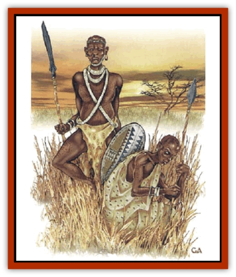

# Human - Pygmy

| Statistic | **Human, Pygmy** |
| --- | --- |
| **Activity Cycle:** | Day |
| **Alignment:** | Neutral |
| **Armor Class:** | 10 or better |
| **Climate/Terrain:** | Jungle or tropical island |
| **Damage/Attack:** | By weapon |
| **Diet:** | Omnivore |
| **Frequency:** | Uncommon |
| **Hit Dice:** | 1 |
| **Intelligence:** | Average (8-10) |
| **Magic Resistance:** | Nil |
| **Morale:** | Average (8-10) |
| **Movement:** | 9 |
| **No. Appearing:** | 11-20 (village: 20-50) |
| **No. of Attacks:** | 1 |
| **Organization:** | Village |
| **Size:** | S (3-4' tall) |
| **Special Attacks:** | Surprise, poison, missiles +2 |
| **Special Defenses:** | Camouflage |
| **THAC0:** | 20 |
| **Treasure:** | Nil |
| **XP Value:** | 35 |

Pygmies are small [[Human|humans]] who live in the deepest jungles or on isolated tropical islands. They were once widespread, but competition with taller neighbors has forced them into small pockets of wilderness unclaimed by others. Pygmies look like small versions of other natives, with brown or black skin, dark eyes, and tightly coiled black hair. They wear little more than loincloths made of animal skin; the tails of these skins are often left intact to dangle behind them. This has led to the rumor that they have tails.

Pygmies have their own language and also speak the trade talk of the area.

**Combat:** Pygmies combine the woodcraft of [[Elf|elves]] with the stealth of [[Halfling|halflings]]. They conceal themselves in thick jungle foliage so well that they are considered *invisible* in their home terrain (though magic will detect them). If they have prepared an ambush for their enemies, opponents have a -4 penalty to their surprise rolls.

Pygmies arm themselves with these weapons: short bow (flight arrows), club, knife, spear, or machete (this is only available though trade, treat as a short sword). When using short bows of their own making, pygmies have a +2 bonus to hit. If the pygmies have no access to metal, their weapons will be made of wood, stone, or bone. Some tribes use blowguns instead of bows, using them with equivalent skill.

If attacked by superior numbers, pygmies use guerrilla tactics. Like elves, they can move, fire a bow once, and move again, all in the same round. They move quickly and quietly through the foliage, leaving no trace of their passage (as the 1st-level priest spell *pass without trace*). If they have time to prepare, pygmies string nets across trails to impede movement; when intruders stop to cut these down, the pygmies attack from ambush. They will prepare snares and pits; some set with wooden spikes. If forced to fight in their village, the pygmies will use shields.

**Habitat/Society:** Pygmies live by hunting and foraging, having no domesticated animals or plants. They have no metallurgy; they get what metal tools and weapons they can by trading with other native tribes.

They live in villages of up to 50 inhabitants, which they freely abandon when food in an area is exhausted. As they have no agriculture, this occurs fairly often. A nomadic pygmy tribe might have natural different village sites that they travel between on a regular basis. Pygmy huts are quickly constructed structures of wood and bark.

The pygmy population in a tribe is evenly divided, roughly one-third adult men, one-third women, and one-third children. For every 8 adult males, one will be a fighter of 2nd-4th level. Each tribe has a chief who is a fighter of 5th-8th level and 1-2 priests of 1st-8th level. Further, there is a 50% chance that one pygmy in the village is a ranger of 1st-8th level. Pygmies are mostly neutral or neutral good; few turn to evil.

They do not allow strangers to disrupt the ecology of their lands. Those who come with peaceful intentions are 75% likely to be met with friendliness; otherwise: the pygmies simply demand that the intruders leave. Strangers who refuse are attacked. This will not be a frontal assault, but sustained guerilla warfare and raiding until the intruders leave. The best way for outsiders to be accepted is to approach openly and offer gifts to the chief. This action practically guarantees a friendly reception, provided the guests behave themselves.

**Ecology:** Pygmies are omnivorous, eating any food they find; wild game, insect larvae, eggs fowl, and wild fruit. They respect the forest, neither hunting more game than they need, nor cutting down living trees. Moreover, they do not willingly live in isolation, and carry on a lively trade with their taller neighbors. Pygmies offer meat and hides in exchange for salt, metal tools and weapons, and cloth.

**Pygmy Hunting Poison**

  Pygmies have a special poison made from beetle larvae, which they use to bring down larger game animals. The poison is used only on arrowheads or blowgun needles. A creature hit must make a saving throw vs. poison at a -2 penalty. Success means the poison has no effect. Failurs means that the next round the victim is *slowed* (as the 3rd-level wizard spell) and the following round is paralyzed for 1-4 turns (in this time the animal is hunted down and killed). The poison breaks down in one hour, leaving the dead game safe to eat.

---
## Discovery & Documentation

**Source Publication:** Monstrous Compendium, 1997 Annual, Volume 4 (1995)
**Campaign Setting:** Advanced Dungeons & Dragons 2nd Edition
**Author(s):** Jon Pickens

### Other Creatures Found in This Source Book
   * [[Anemone_Giant_Sea|Anemone, Giant Sea]]
   * [[Asperii|Asperii]]
   * [[Bainligor|Bainligor]]
   * [[Beast_of_Chaos|Beast of Chaos]]
   * [[Blindheim|Blindheim]]
   * [[Bloodsipper_Far_Realm|Bloodsipper (Far Realm)]]
   * [[Bulette_Gohlbrorn|Bulette, Gohlbrorn]]
   * [[Child_of_the_Sea|Child of the Sea]]
   * [[Clockwork_Horror|Clockwork Horror]]
   * [[Clockwork_Swordsman|Clockwork Swordsman]]
   * [[Coral|Coral]]
   * [[Darklore|Darklore]]
   * [[Dharculus|Dharculus]]
   * [[Dolphin_Athas|Dolphin (Athas)]]
   * [[Dragon_Neutral_Moonstone|Dragon, Neutral, Moonstone]]
   * [[Dragon_Prismatic|Dragon, Prismatic]]
   * [[Dream_Stalker|Dream Stalker]]
   * [[Dragon-kin_Albino_Wyrm|Dragon-kin, Albino Wyrm]]
   * [[Echyan|Echyan]]
   * [[Firestar|Firestar]]
   * [[Firetail|Firetail]]
   * [[Fish_Ascallion|Fish, Ascallion]]
   * [[Fish_Deep_Ocean|Fish, Deep Ocean]]
   * [[Fish_Tropical|Fish, Tropical]]
   * [[Fish_Vurgens|Fish, Vurgens]]
   * [[Fogwarden|Fogwarden]]
   * [[Fraal|Fraal]]
   * [[Giant_Crag|Giant, Crag]]
   * [[Gibberling_Brood|Gibberling, Brood]]
   * [[Glutton_Sea|Glutton, Sea]]
   * [[Golden_Ammonite|Golden Ammonite]]
   * [[Golem_Brass_Minotaur|Golem, Brass Minotaur]]
   * [[Golem_Gemstone|Golem, Gemstone]]
   * [[Golem_Maggot|Golem, Maggot]]
   * [[Groundling|Groundling]]
   * [[Hermit_Sea|Hermit, Sea]]
   * [[Hound_of_Law|Hound of Law]]
   * [[Human_Amazon|Human, Amazon]]
   * [[Inquisitor|Inquisitor]]
   * [[Kercpa|Kercpa]]
   * [[Kreel|Kreel]]
   * [[Lycanthrope_Lythari|Lycanthrope, Lythari]]
   * [[Mercurial|Mercurial]]
   * [[Mold_Chromatic|Mold, Chromatic]]
   * [[Mummy_Bog|Mummy, Bog]]
   * [[Neh-thalggu|Neh-thalggu]]
   * [[Nymph_Grain|Nymph, Grain]]
   * [[Nymph_Unseelie|Nymph, Unseelie]]
   * [[Octopus_Octo-Jelly|Octopus, Octo-Jelly]]
   * [[Puddingfish|Puddingfish]]
   * [[Sea_Demon|Sea Demon]]
   * [[Shade|Shade]]
   * [[Shadowrath|Shadowrath]]
   * [[Shark_Athas|Shark (Athas)]]
   * [[Siren_Ravenloft|Siren (Ravenloft)]]
   * [[Skeleton_Variant|Skeleton, Variant]]
   * [[Skyfish|Skyfish]]
   * [[Spectral_Scion|Spectral Scion]]
   * [[Spyder_Fiend|Spyder Fiend]]
   * [[Squid_Squark|Squid, Squark]]
   * [[Tanar'ri_Lesser_Uridezu|Tanar'ri, Lesser, Uridezu]]
   * [[Troll_Mutate|Troll Mutate]]
   * [[Vaati|Vaati]]
   * [[Vampire_Cerebral|Vampire, Cerebral]]
   * [[Varkha|Varkha]]
   * [[Wizshade|Wizshade]]
   * [[Worm_Lukhorn|Worm, Lukhorn]]
   * [[Wyste|Wyste]]
   * [[Yugoloth_Lesser_Gacholoth|Yugoloth, Lesser, Gacholoth]]
   * [[Zombie_Mud|Zombie, Mud]]
