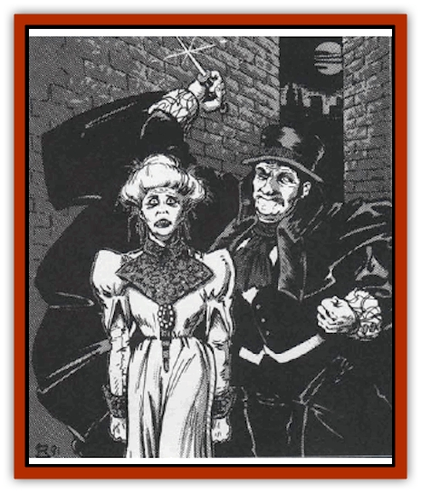

# Human - Ravenloft

| Statistic | **Lost One** | **Madman** |
| --- | --- | --- |
| **Activity Cycle:** | Any | Any (usually night) |
| **Alignment:** | Neutral | Chaotic evil |
| **Armor Class:** | 10 | Varies |
| **Climate/Terrain:** | Any Ravenloft | Any urban |
| **Damage/Attack:** | 1d12 or by weapon | 1d3 or by weapon |
| **Diet:** | Omnivore | Omnivore |
| **Frequency:** | Very rare | Very rare |
| **Hit Dice:** | 1-1 | 2 |
| **Intelligence:** | Low (5-7) | Average (8-10) |
| **Magic Resistance:** | Nil | Nil |
| **Morale:** | Unsteady (5-7) | Average (8-10) |
| **Movement:** | 6 | 9 |
| **No. Appearing:** | 1 | 1 |
| **No. of Attacks:** | 1 | 1 |
| **Organization:** | Solitary | Solitary |
| **Size:** | M (6' tall) | M (6' tall) |
| **Special Attacks:** | Rage | Surprise |
| **Special Defenses:** | Nil | Nil |
| **THAC0:** | 20 | 19 |
| **Treasure:** | Nil | Varies |
| **XP Value:** | 7 | 35 |

## Lost One

In a land as filled with nightmares and unspeakable horrors as Ravenloft, there are persons who have seen more evil than they can possibly bear. These shattered and broken souls are known throughout the demiplane as "the lost ones".

Almost mindless, the lost ones have no interest in the outside world. They wander about, often staying in some place where they feel safe, and spend most of their time in an almost catatonic state. The enormity of the things they have seen is written in their tortured features and the blankness of their eyes which seem to have lost the very spark of life.

Lost ones seldom speak or communicate in any way. When they do, it is often nothing more that a muttered warning or periodic cry of alarm and terror.

**Combat:** Lost ones will take no actions to defend themselves from attack and will not normally engage others in combat. The only time they have been known to do so is when they are reminded of the terrors they have seen. For example, a woman who has seen her children destroyed by a [[Vampire_General_Information|vampire]] might go into a berserk fit and attack someone who looks much like the monster that took her family (and sanity) from her. In such cases, they attack with whatever weapons are nearby (usually just their hands). The ferocity and suddenness of their rage, however, imposes a -1 penalty on their opponent's surprise rolls.

**Habitat/Society:** Lost ones can be found anywhere in Ravenloft. As a rule, their wanderings will carry them to towns and villages where they become pitied and shunned creatures who survive only by the kindness of others. The only known way to return a lost one to sanity is for them to confront the horror that destroyed them. If they see the thing that drove them to mental destruction slain, there is a 25% chance that they will be able to begin recovering - a process that may take many months. Because of the special link these people have with the Dark Powers, they are immune to magical attempts to cure them.

**Ecology:** Lost ones have given up all links with reality. As such, they produce nothing useful and play no important role in the world.

## Madman

For some, the horrors of Ravenloft are too much to bear. While thoss too weak to cope with the things they have seen are destroyed (see Lost Ones), others are driven into absolute madness. Twisted to evil, they prowl the night looking for fresh victims - often their own friends and neighbors - to slaughter.

**Combat:** Typically, madmen will depend on smaller weapons - knives, hand axes, garrotes, etc. - that they can conceal until they strike. Madmen normally present a pleasing front that lures their would-be victims into a false sense of security before they strike. When a madman strikes in this fashion, he imposes a -2 penalty on his victim's surprise rolls. In addition, those surprised by the madman's attacks take triple damage as if they had been backstabbed by a 5th level thief. If confronted with actual resistance to their attack, the madman will generally flee.

**Habitat/Society:** In many cases, madmen appear normal. They may even lead a normal life and go about in public without notice. Thus, their dress and behavior are dictated by their surroundings. When something sparks the insanity that burns within them, however, they turn into brutal killers who seek to drive the horrors from their memories in a torrent of blood.

Some madmen have special "calling cards" that they use to mark their kills. In this way, they begin a dangerous game of cat-and-mouse with the local constabulary. A madman's calling card might be anything from a particular style of murder (cutting the throat, a single wound to the heart, etc.) to an unusual item left behind at the scene of each killing. The subconscious mind of these twisted murderers often causes them to leave clues to their identity or that of their next victim in their "calling cards".

**Ecology:** In many cases, the madman continues to lead a normal life, interacting with society just as they did before witnessing the horrors that drove them over the edge.

---
## Discovery & Documentation

**Source Publication:** MC10 Ravenloft Appendix I (1989)
**Campaign Setting:** Planescape
**Author(s):** William W. Connors

### Other Creatures Found in This Source Book
   * [[Bastellus|Bastellus]]
   * [[Bat_Ravenloft|Bat (Ravenloft)]]
   * [[Bowlyn|Bowlyn]]
   * [[Broken_One|Broken One]]
   * [[Bussengeist|Bussengeist]]
   * [[Darkling|Darkling]]
   * [[Doom_Guard|Doom Guard]]
   * [[Doppelganger_Plant|Doppelganger Plant]]
   * [[Elemental_Ravenloft|Elemental (Ravenloft)]]
   * [[Ermordenung|Ermordenung]]
   * [[Ghoul_Lord|Ghoul Lord]]
   * [[Goblyn|Goblyn]]
   * [[Golem_III|Golem III]]
   * [[Golem_IV|Golem IV]]
   * [[Golem_Ravenloft|Golem (Ravenloft)]]
   * [[Grim_Reaper|Grim Reaper]]
   * [[Human_Abber_Nomad|Human, Abber Nomad]]
   * [[Imp_Assassin|Imp, Assassin]]
   * [[Impersonator|Impersonator]]
   * [[Lycanthrope_Werebat|Lycanthrope, Werebat]]
   * [[Lycanthrope_Wereraven|Lycanthrope, Wereraven]]
   * [[Mist_Horror|Mist Horror]]
   * [[Mummy_Greater|Mummy, Greater]]
   * [[Quevari|Quevari]]
   * [[Quickwood|Quickwood]]
   * [[Ravenkin|Ravenkin]]
   * [[Reaver|Reaver]]
   * [[Scarecrow_Ravenloft|Scarecrow (Ravenloft)]]
   * [[Shadow_Fiend|Shadow Fiend]]
   * [[Skeleton_Giant|Skeleton, Giant]]
   * [[Strahd's_Skeletal_Steed|Strahd's Skeletal Steed]]
   * [[Treant_Evil|Treant, Evil]]
   * [[Treant_Undead|Treant, Undead]]
   * [[Valpurgeist|Valpurgeist]]
   * [[Vampire_Dwarf|Vampire, Dwarf]]
   * [[Vampire_Elf|Vampire, Elf]]
   * [[Vampire_Gnome|Vampire, Gnome]]
   * [[Vampire_Halfling|Vampire, Halfling]]
   * [[Vampire_General_Information|Vampire, General Information]]
   * [[Vampire_Kender|Vampire, Kender]]
   * [[Vampyre|Vampyre]]
   * [[Widow_Red|Widow, Red]]
   * [[Wolfwere_Greater|Wolfwere, Greater]]
   * [[Zombie_Lord|Zombie Lord]]
