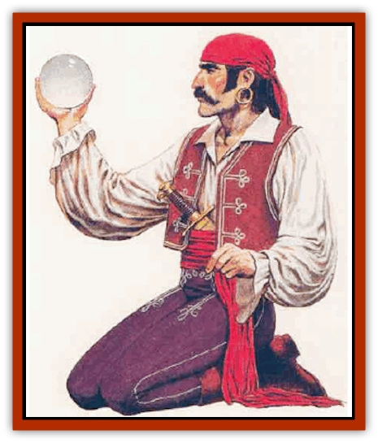

# Human - Vistana

| Statistic | **Human, Vistana** |
| --- | --- |
| **Activity Cycle:** | Any |
| **Alignment:** | Neutral |
| **Armor Class:** | 6 (10) |
| **Climate/Terrain:** | Any land |
| **Damage/Attack:** | 1d6 or by weapon |
| **Diet:** | Omnivore |
| **Frequency:** | Very rare |
| **Hit Dice:** | 1 |
| **Intelligence:** | Average to Exceptional (9-16) |
| **Magic Resistance:** | Nil |
| **Morale:** | Steady (11-12) |
| **Movement:** | 12 |
| **No. Appearing:** | 5-50 |
| **No. of Attacks:** | 1 |
| **Organization:** | Clan |
| **Size:** | M (6' tall) |
| **Special Attacks:** | <i>Evil eye</i> |
| **Special Defenses:** | Prognostication |
| **THAC0:** | 20 |
| **Treasure:** | J,K,M (A) |
| **XP Value:** | 15 |

The Viitani (singular, *Vistana*) are a mysterious nomadic people resembling gypsies in manner, dress, and custom. Although their origins are lost in the distant shadows of their oral history, their legends agree that the Vistani fled the place of their origin to escape a terrible shadowy enemy, which still seems able to threaten them.

The Vistani are swarthy and dress in vibrant clothing: their hair is generally black, though some are born with amber tresses. Their eyes are black and luminous, and a few tribes have features that suggest the Orient.

In addition to the common tongue, the Vistani have a secret language of their own, which has special trail signs and much in common with thieves' cant.

**Combat:** Many Vistani are skilled as warriors and thieves. Spellcasters are rarer and usually women. Vistani typically arm themselves with swords, daggers, cudgels, light axes, and similar eapons. Missile weapons are uncommon; longer distance weapons tend to be light crossbows or slings, while daggers are popular for short ranged work.

Many Vistani have a gaze attack called the eoil eye. This focuses powerful negative emotions - hate, anger, jealousy, - against a creature meeting their gaze. The attack is usable thrice per day, and can manifest in one of five ways. The most common are a *hold* (person or monster) or a *curse* (though *fear*, *charm*, and *suggestion* effects are not unknown). To avoid the effect, the target creature must make a successful saving throw vs. paralyzation. Failure against any except the curse afflicts the creature for 2-5 rounds; failing against the hold by 4 or or more inflicts disabling convulsions upon the victim for three rounds. The curse effext is similar to the reverse of the 4th-level wizard spell *remove curse*. It can affect either a creature or an item, but the curse itself must be spoken.

**Habitat/Society:** The Vistani are vagabonds, wandering from land to land, seldom pausing for more than a week in any one place. A Vistani caravan has 5 to 50 members, and is usually an extended family. The leader is a woman, called a *raunie*, and she is assisted by a man, called a *captain*. Caravans of 30 or more will be led by a raunie of at least 5th level and a captain of 4th level, while those of the greatest size will have a raunie and captain of at least 8th and 7th level, respectively.

Non-Vistani are called *giorgios*. While these individuals may be befriended or guided (or swindled), they will not be considered part of the Vistani fellowship.

The Vistani pursue a number of occupations. All caravans have at least some fortune tellers and entertainers, and characters of nearly any rogue or warrior class (except paladins) may be found among them. While the Vistani do not have clerics or priests of an organized religion, this role is fulfilled by individuals who function as shamans, mystics, healers, or oracles. Most of these are Vistani women.

Most Vistani live in traveling wagons. The typical wagon, called a vardo, is small wooden caravan wagon with a high arching roof and a door at the back. The driver sits at the front in an outdoor seat. Vardos are painted in vivid colors and might even have tiny windows of tinted glass, if the owner is prosperous. The vardo travels with a menagerie. Horses and faithful mongrel dogs trot along side. Crates of chickens may be strapped to the sides or beneath the wagon, and a tethered ox or goat may bring up the rear. Sometimes a trained [[Bear|bear]] accompanies the caravan, ready to amaze and entertain villagers it the next stop.

The campfire is the center of Vistani family life. Each night, the men build roaring fires and play their violins as young women dance and recount the Oral history of the family. Older members recall important legends at their nightly gatherings.

Beyond the independent caravans, the Vistani clans are loosely united into a number of "tribes". The tribes are further united into three great Vistani "nations", called tnsques. While each "nation" has its own manner of dress, appearance, and traditions, they all recognize each other as fellow Vistani. Each nation has certain crafts and services in which its members traditionally excel. The three distinct nations of the Vistani are the Kaldresh, the Boem, and the Manusa.

*Kaldresh:* The Kaldresh are "camp followers": tinkers, smiths, animal trainers, and healers. They pride themselves in their ability to supply armies, trade caravans, adventurers, and others with the proper took needed to defeat enemies, as well as needed healing after a battle. The Kaldresh have been known to supply both sides in a conflict, not really caring about the disputes of non-Vistani, but more interested in making a living. Tribes include the Kamii, Equaar, and Vatraska.

*Boem:* The Boem are consummate entertainers. Their camps are rife with bards, dancers, musicians, and con men. They seem to have the ability to turn even the most hostile audience into an adoring crowd, and frequently a charming Boem can convince an entire village to gamble away months of savings on a rigged game with a smile and a few well-placed words. They have a darker side; they also hire out as smugglers, kidnappers, and assassins, using their innate charm to circumvent obstacles that stymie others. Like the Kaldresh, the Boem might accept such assignments from all sides in a conflict, performing what they view as necessary, preordained tasks. Tribes include the Naiat and the Corvara.

*Manusa:* The Manusa are the rarest of the major tribes and are seldom encountered in numbers larger than a single family. They are the most mysterious and reclusive of the Vistani and the ones closest to the oldest legends of the race. They are tinkerers in the arcane: amulets, charms, potions, and lore. Rumor says they have the power to bend time and space to their will, and that they know much of ancient evils and how best to ward off or escape them. It is believed they guard the other Vistani from the retum of their age-old enemy. Tribes include the Canjar and the Zarovan.

**Ecology:** The Vistani diet consists of roasted meat, goat�s and mare's milk, berries and other fruit, and strong coffees.

They are a passionate people who value their arts and their families above all else. While they may befriend or defraud giorgios, they value their freedom, and also value honesty and loyalty among their own. They may join others against ancient and enduring evils if convinced the evil is a personal threat to the Vistani, or they may just move away. Only rarely will a Vistani become a true servant of evil, and these are invariably outcasts.

The Vistani earn their living in various ways, mostly through services, minor arcana, fortune telling, and entertaining, though they have a reputation for thievery. They occasionally hire out as guides. They have a knack for guiding parties safely to wherever they wish to go. (In these cases the Vistani perform exactly according to contract, not going beyond the letter of the agreement, but not falling short of it, either). They are not adverse to negotiating a new contract if the other party wishes. They are clever, and always find ways to honor their agreements, even if these have been made with conflicting sides.

**Other Vistani**

  Unity with the caravan and tribe and their nomadic lifwtyle is so central to the Vistani character that if one breaks from the tribe, a distinct transformation occurs in his or her personality. These solitaq Vistani include several distinct types:

**Darkling**

  [[Darkling|Darklings]] are Vistani who have been cast out of the fellowship for unforgivable crimes against other Vistani (such as murder). While they appear much as other Vistani, their features are generally sunken and starved, and their eyes burn with hatred. They believe the world has done them a great wrong and now owes them a great debt. Thus, they take what they feel they need, without regard for the consequences. Darklings often lead or are found in bands of ruffians or bandits. They have no fortune telling abilities, but still possess their *evil eye* ability. The death of a darkling will be sensed by any nearby Vistani caravan; they will arrive on the scene to give the darkling a proper Vistani burial. Without such a service, they darkling will rise as an undead creature to continue extracting the payment the world owes him.

**Dukkar**

  The dukkar is the product of a cursed union, and is fated to be an agent of the Viitani's shadowy enemy. He is a male Vistana born with the power to see into the future, and he will commit great atrocities in his lifetime. The dukkar is a blind spot in the Vistani ability to foresee the future, and any Vistani precognition is unreliable or fails outright when he is involved. Often, a dukkar will be immune to the Vistani *evil eye*. The Zarovan tribe has the duty to locate and destroy any dukkar before he reaches adulthood. If they fail, the dukkar will cause great upheaval and tragedy. Legend say that the dukkar's dark powers will increase in strength and number as he survives; these are unpredictable and unique to the individual.

**Mortu**

  Viitani who give up the nomadic life to live among settled peoples are called mortu. They soon lose their powers of foresight and emerge as nervous, suspicious individuals who demand solitude on a regular basis. Some live by faking the talents of true Vistani, others join thieves' guilds or become adventurers. They are driven by a yearning for their former life and community, but are somehow never able to recapture it. In combat, they often fight wildly and ruthlessly, driven by a desperate despair.

**Fahtah**

  The reclusive fahtah, often called a witch or a [[Hag|hag]] by non-Vistani, is a woman of the Vistani who has left her tribe to spend her days communing with spirits. Now she cackles gleefully at the shadows that flit past her campfire, as she speaks in long-dead languages to spirits that only she can see. Fahtah are loved by the spirits with which they commune, and any attack upon one will subject the attacker to a swarm of noncorporeal undead, as well as curses great in both number and power. A fahtah often retires from Vistani life because of some great tragedy, curse, or madness that has afflicted her or her immediate family.

---
## Discovery & Documentation

**Source Publication:** Monstrous Compendium, 1995 Annual, Volume 2 (1995)
**Campaign Setting:** Advanced Dungeons & Dragons 2nd Edition
**Author(s):** Jon Pickens

### Other Creatures Found in This Source Book
   * [[Aboleth_Savant|Aboleth, Savant]]
   * [[Addazahr|Addazahr]]
   * [[Amiq_Rasol|Amiq Rasol]]
   * [[Arch-Shadow|Arch-Shadow]]
   * [[Automaton_Scaladar|Automaton, Scaladar]]
   * [[Automaton_Trobriand's|Automaton, Trobriand's]]
   * [[Bat_Sporebat|Bat, Sporebat]]
   * [[Beetle_Dragon|Beetle, Dragon]]
   * [[Bi-nou|Bi-nou]]
   * [[Boggle|Boggle]]
   * [[Brownie_Dobie|Brownie, Dobie]]
   * [[Brownie_Quickling|Brownie, Quickling]]
   * [[Cat_Crypt|Cat, Crypt]]
   * [[Cat_Great_Cath_Shee|Cat, Great, Cath Shee]]
   * [[Centaur-kin_Dorvesh|Centaur-kin, Dorvesh]]
   * [[Centaur-kin_Gnoat|Centaur-kin, Gnoat]]
   * [[Centaur-kin_Ha'pony|Centaur-kin, Ha'pony]]
   * [[Centaur-kin_Zebranaur|Centaur-kin, Zebranaur]]
   * [[Chronolily|Chronolily]]
   * [[Curst|Curst]]
   * [[Darktentacles|Darktentacles]]
   * [[Dinosaur_Aquatic|Dinosaur, Aquatic]]
   * [[Dinosaur_II|Dinosaur II]]
   * [[Dinosaur_III|Dinosaur III]]
   * [[Doppelganger_Greater|Doppelganger, Greater]]
   * [[Dragon_Brine|Dragon, Brine]]
   * [[Dragon_Half-|Dragon, Half-]]
   * [[Dragon-kin_Sea_Wyrm|Dragon-kin, Sea Wyrm]]
   * [[Dwarf_Wild|Dwarf, Wild]]
   * [[Ekimmu|Ekimmu]]
   * [[Elemental_Nature|Elemental, Nature]]
   * [[Elf_Winged|Elf, Winged]]
   * [[Fish_Great_Glacier|Fish (Great Glacier)]]
   * [[Fish_Subterranean|Fish, Subterranean]]
   * [[Fish_Toril|Fish (Toril)]]
   * [[Flareater|Flareater]]
   * [[Flumph|Flumph]]
   * [[Froghemoth|Froghemoth]]
   * [[Ghost_Casurua|Ghost, Casurua]]
   * [[Ghost_Ker|Ghost, Ker]]
   * [[Ghul|Ghul]]
   * [[Ghul-Kin|Ghul-Kin]]
   * [[Giant_Half-giant|Giant, Half-giant]]
   * [[Golem_Burning_Man|Golem, Burning Man]]
   * [[Golem_Phantom_Flyer|Golem, Phantom Flyer]]
   * [[Gulguthhydra|Gulguthhydra]]
   * [[Hakeashar|Hakeashar]]
   * [[Horse_Moon-|Horse, Moon-]]
   * [[Human_Dragonslayer|Human, Dragonslayer]]
   * [[Jellyfish_Giant|Jellyfish, Giant]]
   * [[Kalin|Kalin]]
   * [[Kholiathra|Kholiathra]]
   * [[Laerti|Laerti]]
   * [[Leucrotta_Greater|Leucrotta, Greater]]
   * [[Lich_Suel|Lich, Suel]]
   * [[Lurker_Shadow|Lurker, Shadow]]
   * [[Lycanthrope_Werepanther|Lycanthrope, Werepanther]]
   * [[Lycanthrope_Wereshark|Lycanthrope, Wereshark]]
   * [[Mammal_Herd_II|Mammal, Herd II]]
   * [[Marl|Marl]]
   * [[Meenlock|Meenlock]]
   * [[Mimic_Greater|Mimic, Greater]]
   * [[Mold_II|Mold II]]
   * [[Mummy_Creature|Mummy, Creature]]
   * [[Nyth|Nyth]]
   * [[Ooze_Slime_Jelly_Ghaunadan|Ooze/Slime/Jelly, Ghaunadan]]
   * [[Palimpsest|Palimpsest]]
   * [[Peltast|Peltast]]
   * [[Plant_Dangerous_II|Plant, Dangerous II]]
   * [[Pleistocene_Animal|Pleistocene Animal]]
   * [[Pudding_Subterranean|Pudding, Subterranean]]
   * [[Raggamoffyn|Raggamoffyn]]
   * [[Snake_Serpent|Snake, Serpent]]
   * [[Snake_Serpent_Vine|Snake, Serpent Vine]]
   * [[Sphinx_Draco-|Sphinx, Draco-]]
   * [[Sprite_Seelie_Faerie|Sprite, Seelie Faerie]]
   * [[Sprite_Unseelie_Faerie|Sprite, Unseelie Faerie]]
   * [[Squealer|Squealer]]
   * [[Turtle_Giant|Turtle, Giant]]
   * [[Umpleby|Umpleby]]
   * [[Vizier's_Turban|Vizier's Turban]]
   * [[Wall_Walker|Wall Walker]]
   * [[Webbird|Webbird]]
   * [[Yak-Man|Yak-Man]]
   * [[Zorbo|Zorbo]]
