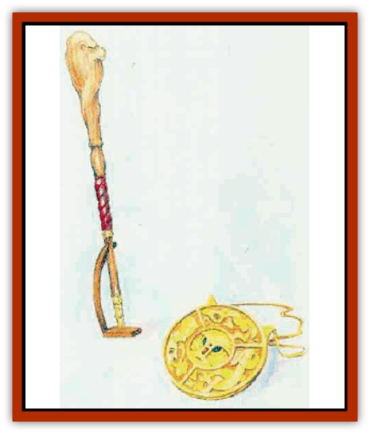

# Huptzeen

| Statistic | **Huptzeen** |
| --- | --- |
| **Activity Cycle:** | Any |
| **Alignment:** | Neutral |
| **Armor Class:** | 3 |
| **Climate/Terrain:** | Any |
| **Damage/Attack:** | Nil |
| **Diet:** | Nil |
| **Frequency:** | Very rare |
| **Hit Dice:** | 3-7 |
| **Intelligence:** | Very (11) |
| **Magic Resistance:** | Nil |
| **Morale:** | Fearless (20) |
| **Movement:** | Fl 3 (D) |
| **No. Appearing:** | 1d3 |
| **No. of Attacks:** | 0 |
| **Organization:** | Solitary |
| **Size:** | T-M (2&rdquo;-5') |
| **Special Attacks:** | Spells |
| **Special Defenses:** | See below |
| **THAC0:** | 3-4 HD: 17 / 5-6 HD: 15 / 7 HD: 13 |
| **Treasure:** | Special |
| **XP Value:** | 3 HD: 650 / 4 HD: 975 / 5 HD: 1,400 / 6 HD: 3,000 / 7 HD: 2,000 |

Huptzeens are lesser magical constructs animated by a combination of arcane rituals and the cooperation of an inhabitant of the Outer Planes.

Unlike most constructs (such as [[Statue_Living|living statues]] or [[Golem_General_Information|golems]]), a huptzeen has no limbs and bears no physical resemblance to any living creature. Instead, they are crafted in the form of ornaments, pieces nf jewelry, or other richly fashioned objects notable for their breathtaking beauty, fine lines, and exceptional craftsmanship.

**Combat:** In battle, huptzeens have only one method of attack: casting spells. Each day one of these constructs can cast as many spells as a wizard of an experience level equal to its number of Hit Dice. (For example, a 4 HD huptzeen can cast the same number and type of spells as a 4th-level wizard.) However, a huptzeen can never have more Hit Dice than its creator has experience levels.

The set of spells available to any huptzeen is fixed at its creation and can never be altered. The huptzeen's creator may select the spells the creature will wield only from among those he or she knows. Although the construct normally cannot speak or gesture, it still manages to cast spells that require verbal or somatic components.

Huptzeens are smarter than most constructs; they can hear sounds, respond intelligently to changing circumstances, and plan attacks sensibly. Their use of spells demonstrates their superior Intelligence. Since a huptzeen often looks like a piece of jewelry or a curio, the target of its attack may at first have trouble spotting the assailant. Realizing this, the constructs often begin their attack using subtle spells with no obvious origin (like *phantasmal force*).

Huptzeens are immune to mind-affecting spells such as *sleep*, *charm*, *hold*, etc. Nonmagical weapons inflict only half damage upon them. When a huptzeen falls to zero or fewer hit points, it explodes, causing 1d6 points of damage to anyone within 10 feet (plus 2 points of damage per unused spell). A victim who makes a successhl saving throw vs. dragon breath suffers only half damage from the shattering spray.

**Habitat/Society:** Huptzeens are created to protect temples, treasures, and other places or items of importance. A wizard usually has chosen a particular guardian's form specifically to make it seem innocuous in its setting (a large piece of jewelry in a treasury, an ornate incense burner in a shrine, or a decorative lectern in a wizard's workshop).

Occasionally, people have been known to use a huptzeen as a bodyguard by wearing the construct (in the form of a large belt buckle, ornate amulet, etc.) or carrying it around (as a rune-covered staff, for example). A huptzeen can move independently only via its slow, magical flight. This pace normally poses no problem, since the creature usually can fulfill its role as a guardian without moving much.

Huptzeens, more intelligent than the majority of constructs, require only general instructions from their creators. They understand the common tongue and can even communicate if they possess a spell such as *whispering wind*.

**Ecology:** As huptzeens are constructs, created to perform specific functions, they play no part in the natural ecology of Mystara. They neither eat nor sleep, and they "live" only until destroyed, usually in combat.

A huptzeen's construction requires materials costing at least 5,000 gold pieces per Hit Die. However, when a huptzeen is destroyed, the remaining fragments recoup only 1d4x50 gold pieces per Hit Die of the constmct.

An intact huptzeen can be sold for as much as 2,000 gold pieces per Hit Die, but the construct will serve a new master only if its creator tells it to do so.

---
## Discovery & Documentation

**Source Publication:** Mystara Appendix (1994)
**Campaign Setting:** Mystara
**Author(s):** John Nephew, Teeuwynn Woodruff, John Terra, Skip Williams

### Other Creatures Found in This Source Book
   * [[Actaeon|Actaeon]]
   * [[Agarat|Agarat]]
   * [[Ash_Crawler|Ash Crawler]]
   * [[Baldandar|Baldandar]]
   * [[Bargda|Bargda]]
   * [[Bhut|Bhut]]
   * [[Bird_Mystara|Bird (Mystara)]]
   * [[Blackball|Blackball]]
   * [[Choker|Choker]]
   * [[Coltpixie|Coltpixie]]
   * [[Crone_of_Chaos|Crone of Chaos]]
   * [[Darkhood|Darkhood]]
   * [[Darkwing|Darkwing]]
   * [[Decapus|Decapus]]
   * [[Deep_Glaurant|Deep Glaurant]]
   * [[Diabolus|Diabolus]]
   * [[Dimensional_Warper|Dimensional Warper]]
   * [[Dragon_Mystara_Crystalline|Dragon (Mystara), Crystalline]]
   * [[Dragon_Mystara_Jade|Dragon (Mystara), Jade]]
   * [[Dragon_Mystara_Onyx|Dragon (Mystara), Onyx]]
   * [[Dragon_Mystara_Ruby|Dragon (Mystara), Ruby]]
   * [[Drake_Mystara|Drake (Mystara)]]
   * [[Dragonfly|Dragonfly]]
   * [[Dusanu|Dusanu]]
   * [[Elemental_of_Chaos_Air_Earth|Elemental of Chaos, Air/Earth]]
   * [[Elemental_of_Chaos_Fire_Water|Elemental of Chaos, Fire/Water]]
   * [[Elemental_of_Law_Air_Earth|Elemental of Law, Air/Earth]]
   * [[Elemental_of_Law_Fire_Water|Elemental of Law, Fire/Water]]
   * [[Familiar_Mystara|Familiar (Mystara)]]
   * [[Frost_Salamander|Frost Salamander]]
   * [[Fundamental_Air_Earth|Fundamental, Air/Earth]]
   * [[Fundamental_Fire_Water|Fundamental, Fire/Water]]
   * [[Gargantua_Mystara|Gargantua (Mystara)]]
   * [[Geonid|Geonid]]
   * [[Ghostly_Horde|Ghostly Horde]]
   * [[Giant_Athach|Giant, Athach]]
   * [[Giant_Hephaeston|Giant, Hephaeston]]
   * [[Golem_Drolem|Golem, Drolem]]
   * [[Golem_Mystara_I|Golem (Mystara) I]]
   * [[Golem_Mystara_II|Golem (Mystara) II]]
   * [[Golem_Mystara_III|Golem (Mystara) III]]
   * [[Gray_Philosopher|Gray Philosopher]]
   * [[Guardian_Warrior|Guardian Warrior]]
   * [[Gyerian|Gyerian]]
   * [[Herex|Herex]]
   * [[Hivebrood|Hivebrood]]
   * [[Horde|Horde]]
   * [[Hsiao|Hsiao]]
   * [[Hutaakan|Hutaakan]]
   * [[Imp_Mystara|Imp (Mystara)]]
   * [[Jellyfish_Giant_Mystara|Jellyfish, Giant (Mystara)]]
   * [[Kna|Kna]]
   * [[Kopru|Kopru]]
   * [[Lizard_Mystara|Lizard (Mystara)]]
   * [[Lizard-kin_Mystara|Lizard-kin (Mystara)]]
   * [[Lupin|Lupin]]
   * [[Lycanthrope_Werejaguar_Mystara|Lycanthrope, Werejaguar (Mystara)]]
   * [[Lycanthrope_Wereswine|Lycanthrope, Wereswine]]
   * [[Magen|Magen]]
   * [[Manikin|Manikin]]
   * [[Mek|Mek]]
   * [[Mujina|Mujina]]
   * [[Nagpa|Nagpa]]
   * [[Neh-thalggu|Neh-thalggu]]
   * [[Nightshade_Mystara|Nightshade (Mystara)]]
   * [[Nuckalavee|Nuckalavee]]
   * [[Pegataur|Pegataur]]
   * [[Phanaton|Phanaton]]
   * [[Plant_Dangerous_Mystara|Plant, Dangerous (Mystara)]]
   * [[Plasm|Plasm]]
   * [[Rakasta|Rakasta]]
   * [[Rock_Man|Rock Man]]
   * [[Sabreclaw|Sabreclaw]]
   * [[Sacrol|Sacrol]]
   * [[Scamille|Scamille]]
   * [[Shapeshifter|Shapeshifter]]
   * [[Shargugh|Shargugh]]
   * [[Shark-kin|Shark-kin]]
   * [[Sollux|Sollux]]
   * [[Spectral_Death|Spectral Death]]
   * [[Spectral_Hound|Spectral Hound]]
   * [[Spider-kin|Spider-kin]]
   * [[Spirit_Mystara|Spirit (Mystara)]]
   * [[Statue_Living|Statue, Living]]
   * [[Surtaki|Surtaki]]
   * [[Tabi|Tabi]]
   * [[Thoul|Thoul]]
   * [[Thunderhead|Thunderhead]]
   * [[Tiger_Ebon|Tiger, Ebon]]
   * [[Topi|Topi]]
   * [[Tortle|Tortle]]
   * [[Vampire_Velya|Vampire, Velya]]
   * [[White_Fang|White Fang]]
   * [[Worm_Mystara|Worm (Mystara)]]
   * [[Wyrd|Wyrd]]
   * [[Yowler|Yowler]]
   * [[Zombie_Lightning|Zombie, Lightning]]
