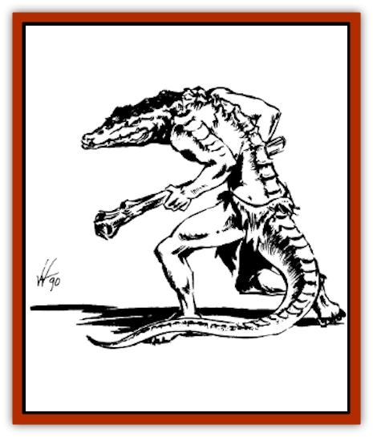

# Hurdu

| Statistic | **Hurdu** |
| --- | --- |
| **Activity Cycle:** | Day |
| **Alignment:** | Lawful evil |
| **Armor Class:** | 6 |
| **Climate/Terrain:** | Temperate or tropical forest, mountains |
| **Damage/Attack:** | 1d6, 1d8, or by weapon |
| **Diet:** | Carnivore |
| **Frequency:** | Rare |
| **Hit Dice:** | 2 |
| **Intelligence:** | Average (8-10) |
| **Magic Resistance:** | Nil |
| **Morale:** | Elite (14) |
| **Movement:** | 12 |
| **No. Appearing:** | 3d6 |
| **No. of Attacks:** | 1 |
| **Organization:** | Tribal |
| **Size:** | L (7-8' tall) |
| **Special Attacks:** | Nil |
| **Special Defenses:** | Nil |
| **THAC0:** | 18 |
| **Treasure:** | Nil |
| **XP Value:** | 100 / Chieftain: 250 |

**Combat:** Hurdu are physically powerful fighters who favor weapons that they can use with two hands, taking full advantage of their reach and height to land smashing blows. In the Steamwall region they are often equipped solely with warclubs or spears; those who wander into other lands have developed a liking for two-handed battle axes and glaives.

However, even without weapons a hurdu is not unarmed. If necessary he can bite with his fangs, inflicting 1d6 points of damage. If he does not attack with a weapon during a combat round, he may instead lash out with his five-foot-long tail. This is a bludgeoning attack inflicting 1d8 points of damage.

Hurdu wear armor when it is available but are comfortable without it, relying on their natural body armor for a minimal degree of protection. They fight well as a unit, with those of lesser rank unquestioningly following the instructions of their leader. Left to their own, hurdu are good tactical fighters. Operating with the advice of a sesk draconian, a hurdu raid party leader is capable of inspired sneak attacks and treacherous strategic moves.

**Habitat/Society:** Hurdu are cousins of the [[Lizard_Man_Krynn|bakali]], the lizard men of Blackwater Glade whose ancestors once roamed all the waterways of Taladas. These lizard men have taken on the aspect of other twisted, vicious things which live in the tortured Steamwall region. Those in the Steamwall Mountains live along the less poisoned waterways in small villages of 20 to 30 individuals.

Hurdu society is much like that of the bakali of Blackwater Glade. The lizard men live in tribes organized along a strict basis of dominance. The strongest holds firm rule; all others obey his command. Unlike their more passive swampland cousins, however, hurdu are given to violent rages and displays of brutish atrocity. They commonly torture prisoners, and show no mercy or sympathy to the weak or ailing.

They are fewer in numbers than bakali; though more hardy in their physical attributes, they do not live as long as a result of poisons in the Steamwall environment. Hurdu hunt, trade with [[Draconian_Sesk|sesk draconians]], and compete with [[Hobgoblin|hobgoblins]] for living space in the Steamwall region. They despise [[Kender|kender]], who sometimes clash with their hunting parties, and avoid the [[Dwarf|dwarves]] of the high mountain peaks, who usually best them in combat.

Food is more difficult to find in the poisoned Steamwall mountains than in the southern swamplands, so hurdu are forced to hunt with frequency and skill. It is these forays which bring them most often into conflict with hobgoblins and other mountain inhabitants. Hurdu expect an accomplish warrior to be an accomplished hunter as well, and scorn those who are not. A male who cannot gain dominance in his tribe often leaves and travels far afield, gaining experience and fighting prowess so he can eventually return and successfully challenge his fellows for position and rank.

**Ecology:** Hurdu are cold-blooded reptilians. They prefer to live in hot climates and are most active during the daytime, when they hunt and conduct most of the business of daily life. They stand seven to eight feet tall when standing upright, but tend to walk hunched over on all fours. Their alligator-like skin is yellow-green to orange-yellow in color, a natural camouflage which permits them to blend into the ill-favored foliage of the Steamwall Mountains.

When generating statistics for significant hurdu characters, these lizard men are +1 ST, +1 CN, -1 IN and -1 CH. They are predominantly fighters, although some are shamans dedicated to Ussk (Morgion). All male hurdu start with Hunting proficiency.

---
## Discovery & Documentation

**Source Publication:** DLA1 Dragon Dawn (1985)
**Campaign Setting:** Dragonlance
**Author(s):** Deborah Christian

### Other Creatures Found in This Source Book
   * [[Draconian_Sesk|Draconian, Sesk]]
