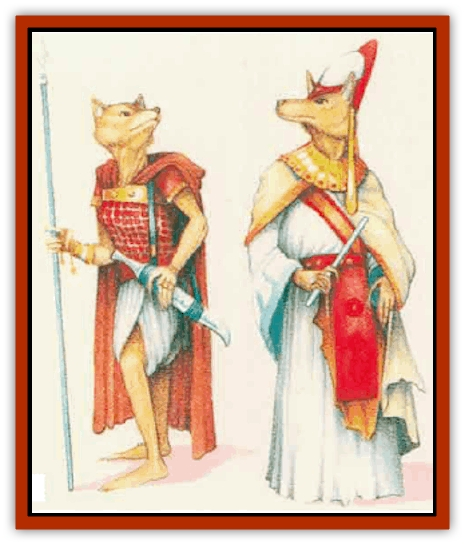

# Hutaakan

| Statistic | **Other** | **Priest** | **Warrior** |
| --- | --- | --- | --- |
| **Activity Cycle:** | Night | Night | Night |
| **Alignment:** | Lawful neutral | Lawful neutral | Lawful neutral |
| **Armor Class:** | 10 | 7 (10) | 6 (10) |
| **Climate/Terrain:** | Temperate mountains or ruins | Temperate mountains or ruins | Temperate mountains or ruins |
| **Damage/Attack:** | 1d4 (club) | 1d6+1 (mace) | 1d6 (sword/spear) |
| **Diet:** | Omnivore | Omnivore | Omnivore |
| **Frequency:** | Very rare | Very rare | Very rare |
| **Hit Dice:** | 1 | 2 | 1+1 |
| **Intelligence:** | Average (8-10) | Very (11-12) | Average (8-10) |
| **Magic Resistance:** | Nil | Nil | Nil |
| **Morale:** | Average (9) | Steady (11) | Steady (12) |
| **Movement:** | 9 | 9 | 9 |
| **No. Appearing:** | 1d10 | 1d4+1 | 1d4+4 |
| **No. of Attacks:** | 1 | 1 | 1 |
| **Organization:** | Town | Town | Town |
| **Size:** | M (6' tall) | M (6' tall) | M (6' tall) |
| **Special Attacks:** | Nil | Spells | Nil |
| **Special Defenses:** | Move silently (20%) | Move silently (20%) | Move silentlv (20%) |
| **THAC0:** | 20 | 19 | 19 |
| **Treasure:** | S (I) | S (I) | S (I) |
| **XP Value:** | 7 | 65 | 15 |

The Hutaakans are a haughty, callous race, dominated by their priests.

The tall, slender, humanoid Hutaakans have [[Jackal|jackal]]-like heads but otherwise resemble ascetic humans with narrow hands and feet. Hutaakans often decorate or carve their heavy, clawlike nails to represent their rank and station in life. Even the most simple and unassuming of these creatures wears long, somber robes, with the occasional addition of a simple piece of jewelry. They speak in fluting, mellifluous tones using a complex language possessed of a haunting, musical quality.

**Combat:** The Hutaakans are not a boldly aggressive race - they consider themselves above physical combat with the lesser mortal races (including humans and other humanoids). They will, however, fight without mercy when forced to do so. Hutaakans prefer strategies involving ambush, and they attack with missile weapons when possible.

Hutaakans other than trained warriors rarely fight. Priests are loath to sully themselves in combat and rarely do battle, save when diredy attacked. Instead, they prefer to cast spells and call out instructions from a safe distance. Most priests have 2 Hit Dice and can cast spells like a 2nd-level priest. However, the most powerful Hutaakan priests can achieve higher experience levels (up to 11th), with corresponding Hit Dice, spells, and experience point values. These higher-level priests lead Hutaakan society.

In combat, warriors tend to use spears, short swords, and sometimes slings; they typically wear studded leather armor and carry a shield. Priests wear leather annor and carry a shield; they prefer as weapons elaborately cawed maces dedicated to one or more of their Immortals. Although other Hutaakans are not skilled at fighting and wear no armor, they can defend themselves adequately with clubs.

All Hutaakans have infravision (60-foot range) and a 20% chance to move silently (as a thief).

**Habitat/Society:** In Mystara, the Hutaakan empire once covered much of what is now the Kingdom of Karameikos. Today, the few surviving Hutaakans speak vaguely of a great catastrophe that decimated their brilliant race; the remaining examples of their species live in small, isolated communities scattered throughout the Known World. Hutaakan priests rigidly control these comunihes and the destinies of the survivors.

In general, the creatures consider themselves a sensitive, civilized, intellectual people forced to suffer as the result of the barbarous world's cruel dominance over their cultured nature.

**Ecology:** Hutaakans often keep valuable coins, potions, gems, and items of rare beauty on their persons and in their homes.

These people pride themselves on both their good taste and their lack of involvement with the rest of the world.

---
## Discovery & Documentation

**Source Publication:** Mystara Appendix (1994)
**Campaign Setting:** Mystara
**Author(s):** John Nephew, Teeuwynn Woodruff, John Terra, Skip Williams

### Other Creatures Found in This Source Book
   * [[Actaeon|Actaeon]]
   * [[Agarat|Agarat]]
   * [[Ash_Crawler|Ash Crawler]]
   * [[Baldandar|Baldandar]]
   * [[Bargda|Bargda]]
   * [[Bhut|Bhut]]
   * [[Bird_Mystara|Bird (Mystara)]]
   * [[Blackball|Blackball]]
   * [[Choker|Choker]]
   * [[Coltpixie|Coltpixie]]
   * [[Crone_of_Chaos|Crone of Chaos]]
   * [[Darkhood|Darkhood]]
   * [[Darkwing|Darkwing]]
   * [[Decapus|Decapus]]
   * [[Deep_Glaurant|Deep Glaurant]]
   * [[Diabolus|Diabolus]]
   * [[Dimensional_Warper|Dimensional Warper]]
   * [[Dragon_Mystara_Crystalline|Dragon (Mystara), Crystalline]]
   * [[Dragon_Mystara_Jade|Dragon (Mystara), Jade]]
   * [[Dragon_Mystara_Onyx|Dragon (Mystara), Onyx]]
   * [[Dragon_Mystara_Ruby|Dragon (Mystara), Ruby]]
   * [[Drake_Mystara|Drake (Mystara)]]
   * [[Dragonfly|Dragonfly]]
   * [[Dusanu|Dusanu]]
   * [[Elemental_of_Chaos_Air_Earth|Elemental of Chaos, Air/Earth]]
   * [[Elemental_of_Chaos_Fire_Water|Elemental of Chaos, Fire/Water]]
   * [[Elemental_of_Law_Air_Earth|Elemental of Law, Air/Earth]]
   * [[Elemental_of_Law_Fire_Water|Elemental of Law, Fire/Water]]
   * [[Familiar_Mystara|Familiar (Mystara)]]
   * [[Frost_Salamander|Frost Salamander]]
   * [[Fundamental_Air_Earth|Fundamental, Air/Earth]]
   * [[Fundamental_Fire_Water|Fundamental, Fire/Water]]
   * [[Gargantua_Mystara|Gargantua (Mystara)]]
   * [[Geonid|Geonid]]
   * [[Ghostly_Horde|Ghostly Horde]]
   * [[Giant_Athach|Giant, Athach]]
   * [[Giant_Hephaeston|Giant, Hephaeston]]
   * [[Golem_Drolem|Golem, Drolem]]
   * [[Golem_Mystara_I|Golem (Mystara) I]]
   * [[Golem_Mystara_II|Golem (Mystara) II]]
   * [[Golem_Mystara_III|Golem (Mystara) III]]
   * [[Gray_Philosopher|Gray Philosopher]]
   * [[Guardian_Warrior|Guardian Warrior]]
   * [[Gyerian|Gyerian]]
   * [[Herex|Herex]]
   * [[Hivebrood|Hivebrood]]
   * [[Horde|Horde]]
   * [[Hsiao|Hsiao]]
   * [[Huptzeen|Huptzeen]]
   * [[Imp_Mystara|Imp (Mystara)]]
   * [[Jellyfish_Giant_Mystara|Jellyfish, Giant (Mystara)]]
   * [[Kna|Kna]]
   * [[Kopru|Kopru]]
   * [[Lizard_Mystara|Lizard (Mystara)]]
   * [[Lizard-kin_Mystara|Lizard-kin (Mystara)]]
   * [[Lupin|Lupin]]
   * [[Lycanthrope_Werejaguar_Mystara|Lycanthrope, Werejaguar (Mystara)]]
   * [[Lycanthrope_Wereswine|Lycanthrope, Wereswine]]
   * [[Magen|Magen]]
   * [[Manikin|Manikin]]
   * [[Mek|Mek]]
   * [[Mujina|Mujina]]
   * [[Nagpa|Nagpa]]
   * [[Neh-thalggu|Neh-thalggu]]
   * [[Nightshade_Mystara|Nightshade (Mystara)]]
   * [[Nuckalavee|Nuckalavee]]
   * [[Pegataur|Pegataur]]
   * [[Phanaton|Phanaton]]
   * [[Plant_Dangerous_Mystara|Plant, Dangerous (Mystara)]]
   * [[Plasm|Plasm]]
   * [[Rakasta|Rakasta]]
   * [[Rock_Man|Rock Man]]
   * [[Sabreclaw|Sabreclaw]]
   * [[Sacrol|Sacrol]]
   * [[Scamille|Scamille]]
   * [[Shapeshifter|Shapeshifter]]
   * [[Shargugh|Shargugh]]
   * [[Shark-kin|Shark-kin]]
   * [[Sollux|Sollux]]
   * [[Spectral_Death|Spectral Death]]
   * [[Spectral_Hound|Spectral Hound]]
   * [[Spider-kin|Spider-kin]]
   * [[Spirit_Mystara|Spirit (Mystara)]]
   * [[Statue_Living|Statue, Living]]
   * [[Surtaki|Surtaki]]
   * [[Tabi|Tabi]]
   * [[Thoul|Thoul]]
   * [[Thunderhead|Thunderhead]]
   * [[Tiger_Ebon|Tiger, Ebon]]
   * [[Topi|Topi]]
   * [[Tortle|Tortle]]
   * [[Vampire_Velya|Vampire, Velya]]
   * [[White_Fang|White Fang]]
   * [[Worm_Mystara|Worm (Mystara)]]
   * [[Wyrd|Wyrd]]
   * [[Yowler|Yowler]]
   * [[Zombie_Lightning|Zombie, Lightning]]
