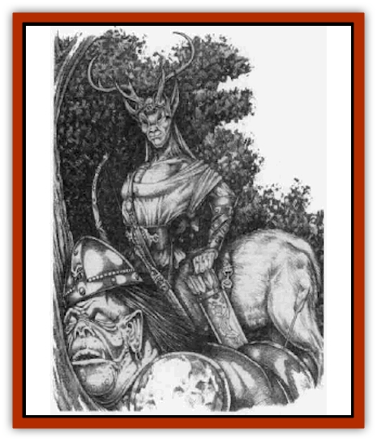
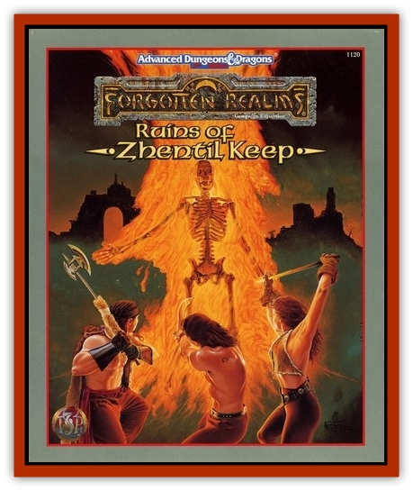

# Hybsil

| Statistic | **Hybsil** |
| --- | --- |
| **Activity Cycle:** | Day |
| **Alignment:** | Lawful good |
| **Armor Class:** | 7 |
| **Climate/Terrain:** | Any temperate forest, plains, or hills |
| **Damage/Attack:** | By weapon |
| **Diet:** | Omnivore |
| **Frequency:** | Rare |
| **Hit Dice:** | 1 |
| **Intelligence:** | Average to very (8-12) |
| **Magic Resistance:** | Nil |
| **Morale:** | Average (8-10) |
| **Movement:** | 15 |
| **No. Appearing:** | 1d6(1d8&times;8) |
| **No. of Attacks:** | 1 |
| **Organization:** | Tribe |
| **Size:** | S (3' tall) |
| **Special Attacks:** | Sleep arrows |
| **Special Defenses:** | +4 to all saving throws, immune to poison, limited thief abilities in forest terrain, <i>continual light</i>, <i>ventriloquism</i>, <i>pass without trace</i> |
| **THAC0:** | 19 |
| **Treasure:** | I,K |
| **XP Value:** | 420 / Leader 4th: 1,400 / Leader 5th: 2,000 / Leader 6th: 3,000 / Leader 7th: 4,000 / Guard: 975 / Ranger: 3,000 |

Hybsils look like a cross between a small antelope and a [[Sprite|pixie]], [[Brownie|brownie]], or [[Sprite|sprite]]. These antelope [[Centaur|centaurs]] can be found in large forests or small woods across the Heartlands, and often venture into nearby plains or hills to hunt or forage. The color of their antelope body ranges from dark gray to chestnut brown, and they sometimes sport small spots, white tails, white or tan striping, or dark socks and tails. Male hybsils grow antlers and shed them seasonally. Hybsil ears are pointed and graceful, with a small tuft of hair on their tips.

Hybsils are somewhat xenophobic, preferring the company of their own kind. They have been sighted in the Border Forest, the Reaching Woods, and the Trollbark Forest.

**Combat:** Hybsils fight with daggers, short swords, or short bows. Hybsils coat their weapons with a rare plant juice blend that causes sleep for 1d4 hours. The victim is allowed a saving throw vs. poison at -4 to avoid the effects. Hybsil bows have normal short bow range, and their arrows inflict flight arrow damage (1d6), in addition to the sleep effect.

Hybsils have inherited some of the powers of their fairy cousins. Once per day a hybsil can use the following spell-like abilities: *continual light*, *mirror image*, *pass without trace*, and *ventriloquism*. Hybsils gain a +4 bonus to all saving throws and an immunity to all poisons due to their fey nature and an extremely high Constitution.

Because of their familiarity with forests, hybsils have a 75% chance to hide in shadows and move silently when in any forest. They also have a 50% chance to find and remove traps or snares when in an arboreous environment. In addition, once a day for one turn, a hybsil can break into a gallop and travel at the rate of 21.

**Habitat/Society:** Hybsils live together in closely knit tribes of up to 80, but rarely less than 20, members. Young male hybsils sometimes break away and attempt to start their own tribe if a tribe's numbers total more than 50. Hybsils are seminomadic and may roam over vast forests or plains, either in search of food or to preserve their isolation from other sentient species. Because of this tendency to roam, most hybsil tribes live in or near large forests and grasslands.

Male hybsil are in charge of hunting, gathering, and protecting the tribe from external invaders. Female hybsils rear and educate the young, preserve tribal lore and traditions, maintain an oral history of the tribal range, and care for the injured and the sick. Females can wield weapons as the males do when necessary, but in general do not do so on a day-to-day basis. Female hybsils are seldom encountered outside of their tribe's home camp or village unless searching for a stray young one or on a special quest.

Every tribe of hybsils has a leader of 4th-7th level who is either a druid (60%) or a mage (40%). For every 30 or more hybsils in a tribe, there will be 1d4 hybsils with 3 HD who are charged solely with guarding the tribe. A tribe of 50 or more hybsils will also have a mighty warrior who has 5 HD and the all skills of a 7th-level ranger.

**Ecology:** Hybsils eat fruits, berries, roots, and small mammals that they hunt. They live for up to 50 years, and those with spellcasting abilities have been known to live well past 70 years of age.

Hybsil antlers are said to have magical powers, and have fetched as much as 100 gold pieces from certain wizards, sages, and potioners. Since hybsils shed their antlers every year, it is not necessary to injure hybsils to obtain their horns. However, since hybsils do not like people trespassing on their territory, it is often difficult to gain permission to gather shed antlers, or to befriend a male hybsil and convince him to give one away.

---
## Discovery & Documentation

**Source Publication:** Ruins of Zhentil Keep (1995)
**Campaign Setting:** Forgotten Realms
**Author(s):** John Terra and Kevin Melka

### Other Creatures Found in This Source Book
   * [[Banedead|Banedead]]
   * [[Banelich|Banelich]]
   * [[Burnbones|Burnbones]]
   * [[Elemental_Nature|Elemental, Nature]]
   * [[Gargoyle_Guardgoyle|Gargoyle, Guardgoyle]]
   * [[Golem_Magic|Golem, Magic]]
   * [[Golem_Vault_Guardian|Golem, Vault Guardian]]
   * [[Magedoom|Magedoom]]
   * [[Mist_Scarlet_Dancer|Mist, Scarlet Dancer]]
   * [[Orc_Ondonti|Orc, Ondonti]]
   * [[Rat_Zhentish_Sewer|Rat, Zhentish Sewer]]
   * [[Render|Render]]
   * [[Sacaanti|Sacaanti]]
   * [[Snake_Messenger|Snake, Messenger]]
   * [[Zhentarim_Spirit|Zhentarim Spirit]]
