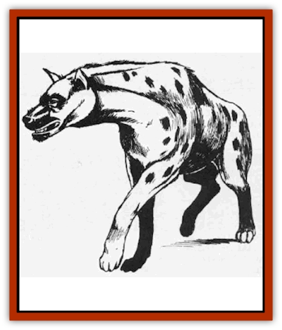

# Hyena

| Statistic | **Hyaenodon** | **Hyena** |
| --- | --- | --- |
| **Activity Cycle:** | Day | Day |
| **Alignment:** | Neutral | Neutral |
| **Armor Class:** | 7 | 7 |
| **Climate/Terrain:** | Warm plains | Warm plains |
| **Damage/Attack:** | 3-12 (3d4) | 2-8 (2d4) |
| **Diet:** | Scavenger | Scavenger |
| **Frequency:** | Very rare | Common |
| **Hit Dice:** | 5 | 3 |
| **Intelligence:** | Animal (1) | Animal (1) |
| **Magic Resistance:** | Nil | Nil |
| **Morale:** | Average (8-10) | Unsteady (5-7) |
| **Movement:** | 12 | 12 |
| **No. Appearing:** | 2-8 (2d4) | 2-12 (2d6) |
| **No. of Attacks:** | 1 | 1 |
| **Organization:** | Pack | Pack |
| **Size:** | L (8' long) | S (4' long) |
| **Special Attacks:** | Nil | Nil |
| **Special Defenses:** | Nil | Nil |
| **THAC0:** | 15 | 17 |
| **Treasure:** | Nil | Nil |
| **XP Value:** | 175 | 65 |

Hyenae are canines who roam warm grasslands and plains. They are primarily scavengers, but will hunt small game on occasion. Their powerful jaws give them a nasty bite.

Hyenae are ugly animals. Roughly the size of a large [[Dog|dog]], the hyena's body is covered with a light brown or golden fur. Its feet, markings, and belly are black. The hyena's shorter rear legs make it look clumsy - an illusion which is quickly dispelled when it attacks.

**Combat:** Hyenae are cowards. They do not attack unless their prey is helpless, outnumbered, or dead already.

Hyenae surround a victim and rush in at it from all sides, attacking with a strong bite that does 2-8 (2d4) points of damage. A natural attack roll of 20 indicates that the hyena has locked its jaws onto the victim. Once this happens, the animal will not let go until it suffers 2 or more points of damage. Such holding bites do not do additional damage but can slow the victim down because of the hyena's extra weight. Each hyena reduces a victim's movement rate by 6. The number of hyenae which can lock onto a victim is determined by its size. One hyena can lock onto a tiny animal, two to a small one, and so forth.

**Habitat/Society:** Hyenae roam the open plains of warm, grassy regions. They are usually found within sight of a herd of animals like zebra and antelope. Generally, there will be 1 hyena for every 10 herd animals being followed. A typical hyena pack can survive on one man-sized animal every three days. If they attack and kill an animal, they will strip it to the bones in short order. Any carrion which they encounter will also be consumed.

Hyenae are instinctively aware of their place in the animal hierarchy. They defer to larger or more powerful predators like [[Cat_Great|lions]]. If such an animal makes a kill they will sit 50' to 100' away and patiently wait for the predator to finish and leave. If given the chance, they have been known to try to snatch portions of the carcass and run. They may openly challenge other, less powerful or numerous, predators.

Hyenae travel in packs composed of an even mixture of adult males, females, and young. Although they do not mate for life, a hyena couple will remain together for several years. The male assists in caring for the 2-4 cubs which are born in each litter. The young do not nurse, but are fed regurgitated food in a manner similar to that employed by many avian species.

During their first year of life cubs will not attack. They are one Hit Die animals who run for the protection of their parents and the pack if threatened. During the second year, the cubs gain an additional Hit Die and begin to hunt alongside the adults. Hyenae become fully mature in three years.

**Ecology:** Hyenae are active scavengers who feed on the carrion left behind by other, larger predators. They are also able to take living prey, although they normally restrict their hunting to small, young, old, or sick animals. They have strong constitutions and digestive tracts that enable them to safely digest even diseased meat.

Hyenae produce few useful byproducts. The skins make poor leather, the fur tends to fall out, and the meat has a decidedly rancid taste. Cubs are difficult to domesticate as they usually revert to the wild upon hitting maturity. However. they may be found as companions of nomadic, aboriginal people.

**Hyaenodon**

  Although the hyaenodon resembles a giant hyena it is actually not related at all. It is a survivor of prehistoric times, a predator that evolved into a canine-like form. Hyaenodon markings are similar to those of hyenae, although the dominant fur color is a lion-like gold. Despite their genetic differences, they are very similar to hyenae in temperament and behavior. Hyaenodon females give birth to litters of 1-4 cubs. These mature within 4 years.

Its savage bite does 3-12 (3d4) points of damage and it can lock onto its victims just as smaller hyenae do. If the hyaenodon does this, the victim's movement rate is cut by 12 for each hyaenodon that attaches itself. Hyaenodon packs will devour one man-sized victim per day. Because of their larger size, they are able to take large prey such as elephants, oxen. and buffalo. If a giant hyena suffers 2 or more points of burning damage. it immediately flees the area in search of a spot to tend its wounds.

---
## Discovery & Documentation

**Source Publication:** MC1 Volume I (w/binder #1) (1991)
**Campaign Setting:** Advanced Dungeons & Dragons 2nd Edition
**Author(s):** Jay Batista, Scott Bennie, Grant Boucher, William W. Connors, Steve Gilbert, Heike Kubasch, James Lowder, David Edward Martin, Bruce Nesmith, Jean Rabe, Rick Swan, John J. Terra, Gary L. Thomas

### Other Creatures Found in This Source Book
   * [[Bat|Bat]]
   * [[Bear|Bear]]
   * [[Behir|Behir]]
   * [[Boar|Boar]]
   * [[Bookworm|Bookworm]]
   * [[Brownie|Brownie]]
   * [[Bugbear|Bugbear]]
   * [[Carrion_Crawler|Carrion Crawler]]
   * [[Cat_Great|Cat, Great]]
   * [[Catoblepas|Catoblepas]]
   * [[Dragon_General_Information|Dragon, General Information]]
   * [[Dragonfish|Dragonfish]]
   * [[Elemental_Air_Kin_Aerial_Servant|Elemental, Air Kin, Aerial Servant]]
   * [[Elemental_Earth_Kin_Sandling|Elemental, Earth Kin, Sandling]]
   * [[Elephant|Elephant]]
   * [[Gnoll|Gnoll]]
   * [[Hobgoblin|Hobgoblin]]
   * [[Homunculus|Homunculus]]
   * [[Hornet_Giant|Hornet, Giant]]
   * [[Horse|Horse]]
   * [[Jackal|Jackal]]
   * [[Jackalwere|Jackalwere]]
   * [[Korred|Korred]]
   * [[Lich|Lich]]
   * [[Lizard|Lizard]]
   * [[Lizard_Man|Lizard Man]]
   * [[Lycanthrope_General_Information|Lycanthrope, General Information]]
   * [[Lycanthrope_Seawolf|Lycanthrope, Seawolf]]
   * [[Lycanthrope_Werebear|Lycanthrope, Werebear]]
   * [[Lycanthrope_Weretiger|Lycanthrope, Weretiger]]
   * [[Lycanthrope_Werewolf|Lycanthrope, Werewolf]]
   * [[Manticore|Manticore]]
   * [[Medusa|Medusa]]
   * [[Mind_Flayer|Mind Flayer]]
   * [[Minotaur|Minotaur]]
   * [[Mudman|Mudman]]
   * [[Mummy|Mummy]]
   * [[Nixie|Nixie]]
   * [[Nymph|Nymph]]
   * [[Ogre|Ogre]]
   * [[Ooze_Slime_Jelly_I|Ooze/Slime/Jelly I]]
   * [[Ooze_Slime_Jelly_II|Ooze/Slime/Jelly II]]
   * [[Orc|Orc]]
   * [[Owl|Owl]]
   * [[Owlbear_I|Owlbear I]]
   * [[Pegasus|Pegasus]]
   * [[Piercer|Piercer]]
   * [[Pudding_Deadly|Pudding, Deadly]]
   * [[Rakshasa|Rakshasa]]
   * [[Rat|Rat]]
   * [[Ray|Ray]]
   * [[Remorhaz|Remorhaz]]
   * [[Satyr|Satyr]]
   * [[Scorpion|Scorpion]]
   * [[Selkie|Selkie]]
   * [[Shadow|Shadow]]
   * [[Skeleton|Skeleton]]
   * [[Skunk|Skunk]]
   * [[Snake|Snake]]
   * [[Spectre|Spectre]]
   * [[Spider|Spider]]
   * [[Sprite|Sprite]]
   * [[Toad_Giant|Toad, Giant]]
   * [[Treant|Treant]]
   * [[Troll|Troll]]
   * [[Umber_Hulk|Umber Hulk]]
   * [[Unicorn|Unicorn]]
   * [[Vampire|Vampire]]
   * [[Wight|Wight]]
   * [[Will_O'Wisp|Will O'Wisp]]
   * [[Wolf|Wolf]]
   * [[Wolfwere|Wolfwere]]
   * [[Wraith|Wraith]]
   * [[Wyvern|Wyvern]]
   * [[Yeti|Yeti]]
   * [[Yuan-ti|Yuan-ti]]
   * [[Zombie|Zombie]]
