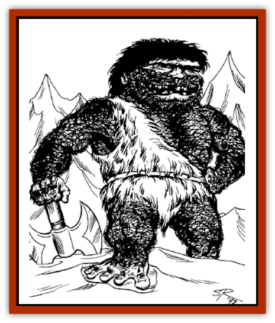

# Ice Gnome

| Statistic | **Ice Gnome** |
| --- | --- |
| **Activity Cycle:** | Day |
| **Alignment:** | Lawful neutral |
| **Armor Class:** | 6 (9) |
| **Climate/Terrain:** | Cold Wastes |
| **Damage/Attack:** | By weapon |
| **Diet:** | Omnivore |
| **Frequency:** | Rare |
| **Hit Dice:** | 2 |
| **Intelligence:** | Low-average |
| **Magic Resistance:** | Nil |
| **Morale:** | Average (8-10) |
| **Movement:** | 6 |
| **No. Appearing:** | 1-6 (20-200) |
| **No. of Attacks:** | 1 |
| **Organization:** | Tribal |
| **Size:** | S (3' tall) |
| **Special Attacks:** | Nil |
| **Special Defenses:** | +2 on saves vs. cold |
| **THAC0:** | 19 |
| **Treasure:** | K (C) |
| **XP Value:** | 65 |

**Combat:** Ice gnomes are fierce warriors in large groups. They can carry any weapon appropriate to their size, and their tough skin provides a natural AC of 9. Ice gnomes wear (at best) leather armor. Roll on the following table to determine their weapons.

| Weapon | 1d100 roll |
| --- | --- |
| Club | 1-35% |
| Short sword | 36-55% |
| Spear | 56-75% |
| Sling | 76-90% |
| Dagger | 91-00% |

**Habitat/Society:** Tribes of wild ice gnomes roam the Cold Waste in numbers large enough to exterminate entire human tribes. Fafhrd's own Snow Clan was wiped out by ice gnomes. They travel nomadically, living in skin tents or improvised lean-to's. The tribes are ruled by hereditary chieftains, but these chieftains may be displaced through trial-by-combat.

For every 30 ice gnomes encountered, there is a 3 HD fighter. If 100 or more are encountered, there is also a 4 or 5 HD fighter. If there are 150 or more ice gnomes, they are led by a 6 or 7 HD fighter.

A tribe of ice gnomes contains females equal to the number of male warriors, and children equal to one quarter of the males. Ice gnome encampments may be guarded by tame [[Snow_Serpent|snow serrpents]] (1d4) or [[Wolf|wolves]] (1d6).

Ice gnome tribes serve the invisibles of Stardock as servants, warriors, and slaves.

**Ecology:** lce gnomes live for 40 years. Each female bears a single child after a gestation period of six months. Ice gnomes are omnivorous.

---
## Discovery & Documentation

**Source Publication:** Lankhmar: City of Adventure (2nd Ed.) (1993)
**Campaign Setting:** Lankhmar
**Author(s):** Bruce Nesmith, Douglas Niles, and Ken Rolston

### Other Creatures Found in This Source Book
   * [[Astral_Wolf|Astral Wolf]]
   * [[Behemoth|Behemoth]]
   * [[Bird_of_Tyaa|Bird of Tyaa]]
   * [[Cat_War|Cat, War]]
   * [[Cloaker_Sea|Cloaker, Sea]]
   * [[Cold_Woman|Cold Woman]]
   * [[Devourer_Lankhmar|Devourer (Lankhmar)]]
   * [[Ghoul_Kleshite|Ghoul, Kleshite]]
   * [[Ghoul_Lankhmar|Ghoul (Lankhmar)]]
   * [[Gladiator_Lizard|Gladiator Lizard]]
   * [[Horag|Horag]]
   * [[Howler|Howler]]
   * [[Invisible_of_Stardock|Invisible of Stardock]]
   * [[Lizard|Lizard]]
   * [[Ophidian|Ophidian]]
   * [[Ray_Invisible_Flying|Ray, Invisible Flying]]
   * [[Scorpion|Scorpion]]
   * [[Simorgyan|Simorgyan]]
   * [[Snow_Serpent|Snow Serpent]]
   * [[Thunder_Children|Thunder Children]]
   * [[Wraith-Spider|Wraith-Spider]]
   * [[Zombie_Sea|Zombie, Sea]]
