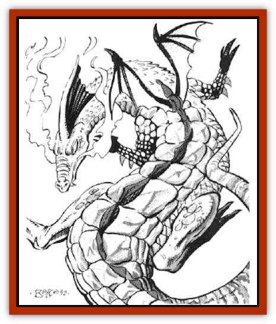

# Ice Lizard

| Statistic | **Ice Lizard** |
| --- | --- |
| **Activity Cycle:** | Day |
| **Alignment:** | Chaotic evil |
| **Armor Class:** | 1 |
| **Climate/Terrain:** | Any arctic |
| **Damage/Attack:** | 1-3/1-3/1-6 |
| **Diet:** | Carnivore |
| **Frequency:** | Very rare |
| **Hit Dice:** | 3+3 |
| **Intelligence:** | Low (7) |
| **Magic Resistance:** | 80% (but see below) |
| **Morale:** | Elite (14) |
| **Movement:** | 9, Fl 15 (C) |
| **No. Appearing:** | 1-4 |
| **No. of Attacks:** | 3 |
| **Organization:** | Solitary or family |
| **Size:** | S (3' long) |
| **Special Attacks:** | Spells, breath weapon |
| **Special Defenses:** | See below |
| **THAC0:** | 17 |
| **Treasure:** | G |
| **XP Value:** | 1,400 |

In its natural form, the ice [[Lizard|lizard]] is a snow-white lizard, some 3' long, and strikingly similar in appearance to a very young [[Dragon_Chromatic_White|white dragon]]. Its scales are tinged in places with a dull silver or palest blue. It lives in the same kind of icy, frigid wastelands favored by white dragons. Only those who are well-studied in [[Dragon_General_Information|dragon]] lore and biology will notice the slight differences in scale color between ice lizards and their larger cousins: a hatchling white dragon has scales of a mirror-bright pure white: it is only the much larger, older white dragons which have varicolored scales.

**Combat:** Ice lizards tend to surprise opponents who know nothing about them, as they can *polytmorph self* into white dragon form twice per day (two-hour duration each time). The ice lizard's dragon form is similar to a young adult white dragon, but without the special attacks (breath weapon and spells) possessed by the dragon. Reversion to ice lizard form heals 10-60% of the damage the creature has suffered.

Ice lizards possess a high degree of magic resistance (an astounding 80%), but their low Intelligence and Wisdom make them very susceptible to *charm* and *hold* magic (-2 to saving throws for each). They can cast *fear* and *sleep* spells twice per day each, but only when in ice lizard form. Ice lizards are also susceptible to fire damage: all saving throws vs. fire are at -2, and damage is +1 point per die.

In melee, the ice lizard, in either form, can use its own frigid breath weapon once per round every three rounds, up to three times per day. The breath weapon is a cone of frigid air, 10' diameter at the base and 30' long, and can inflict 2-16 points of damage. Some adventurers have said that the breath weapon is so cold that the very air freezes whenever an ice lizard breathes on an opponent.

When not using its breath weapon, the ice lizard will attack with two claws (1-3 points of damage each) and bite (1-6 points of damage), An ice lizard is too small to make effective use of the other attack modes inherent to true dragons (wing buffet, tail slap, etc).

**Habitat/Society:** Like their true dragon cousins, ice lizards are susceptible to flattery. They are not inclined to grant favors, and guard their territory fiercely. However, if approached in the proper manner, they can be made to listen - or perhaps even cooperate, if they can be convinced the plan is to their advantage. Such coercion requires gifts of particularly valuable gems or magic items. Ice lizards tend to be more impressed with quantity than with quality. Thus, 10,000 gold pieces will hold more sway over the dragon's decision than would a similarly-valued flawless diamond or emerald. Ice lizards may also occasionally be tricked into accepting false treasure, but deal very harshly with such deceit if they discover it.

Adult ice lizards generally live by themselves in underground ice caves. These caves are too small to hold the ice lizards while in white dragon form. Each male ice lizard stakes out and defends a territory of about 100 square miles. No other male ice lizards are tolerated in this territory, but it may be within the territory of a white dragon, with which it is occasionally seen. Because they can adopt two forms, ice lizards consider themselves to be superior to white dragons, while white dragons tolerate ice lizards as minor pests.

Mating may occur at anytime, but only once per year. As indicate his interest, a male ice lizard will give a portion of his hoard to the female he feels is strongest. The gift will consist of up to 40% of the total number of objects, not total value, of the male's hoard, A pair of ice lizards who are mated or have a clutch of eggs will live together until the eggs have hatched. A clutch consists of 1-3 eggs. which require 3 months to develop and hatch. During this time, the male will defend the female and eggs from other males who would seek to kill the pair and destroy the eggs in order to expand their territory and take more treasure.

Ice lizards do not have the voracious appetites possessed by their larger cousins. They prefer small game (snow hares and the like) but will eat carrion if nothing else is available.

**Ecology:** Wizards have experimented with substituting ice lizard parts for the rarer white dragon parts in magical potions and constructs, but without much useful effect. If an ice lizard is hatched and raised in captivity, it may be trained to serve as a pet or guard.

---
## Discovery & Documentation

**Source Publication:** MC14 Fiend Folio Appendix (1992)
**Campaign Setting:** Fiends Folio
**Author(s):** Don Bingle, John Terra, Wes Nicholson, Tim Beach, Steve Hardinger, Kris Hardinger, Rob Nicholls, Greg Swedberg, Al Boyce, Vince Garcia, Norm Ritchie

### Other Creatures Found in This Source Book
   * [[Aballin|Aballin]]
   * [[Achaierai|Achaierai]]
   * [[Adherer|Adherer]]
   * [[Algoid|Algoid]]
   * [[Al-Mi'raj|Al-Mi'raj]]
   * [[Apparition|Apparition]]
   * [[Caterwaul|Caterwaul]]
   * [[Coffer_Corpse|Coffer Corpse]]
   * [[Crabman|Crabman]]
   * [[Dark_Creeper|Dark Creeper]]
   * [[Dark_Stalker|Dark Stalker]]
   * [[Darter|Darter]]
   * [[Denzelian|Denzelian]]
   * [[Dune_Stalker|Dune Stalker]]
   * [[Dwarf_Urdunnir|Dwarf, Urdunnir]]
   * [[Falcon_Fire|Falcon, Fire]]
   * [[Faux_Faerie|Faux Faerie]]
   * [[Flawder|Flawder]]
   * [[Fyrefly|Fyrefly]]
   * [[Gambado|Gambado]]
   * [[Garbug|Garbug]]
   * [[Giant_Fhoimorien|Giant, Fhoimorien]]
   * [[Gibberling|Gibberling]]
   * [[Gorbel|Gorbel]]
   * [[Grimlock|Grimlock]]
   * [[Hellcat|Hellcat]]
   * [[Iron_Cobra|Iron Cobra]]
   * [[Khargra|Khargra]]
   * [[Mantari|Mantari]]
   * [[Penanggalan|Penanggalan]]
   * [[Pernicon|Pernicon]]
   * [[Phantom_Stalker|Phantom Stalker]]
   * [[Retriever|Retriever]]
   * [[Ruve|Ruve]]
   * [[Scathe|Scathe]]
   * [[Sheet_Ghoul_Sheet_Phantom|Sheet Ghoul/Sheet Phantom]]
   * [[Shocker|Shocker]]
   * [[Spanner|Spanner]]
   * [[Stwinger|Stwinger]]
   * [[Sussurus|Sussurus]]
   * [[Symbiotic_Jelly|Symbiotic Jelly]]
   * [[Terithran|Terithran]]
   * [[Thunder_Children|Thunder Children]]
   * [[Troll_Ice|Troll, Ice]]
   * [[Tween|Tween]]
   * [[Umpleby|Umpleby]]
   * [[Volt|Volt]]
   * [[Xill|Xill]]
   * [[Xvart|Xvart]]
   * [[Zygraat|Zygraat]]
