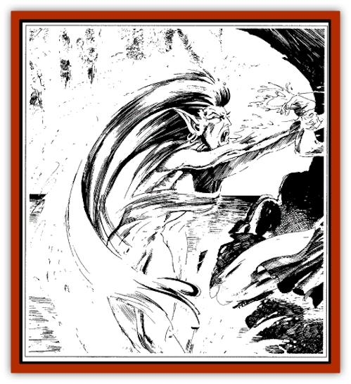

# Ice Vampire

| Statistic | **Ice Vampire** |
| --- | --- |
| **Activity Cycle:** | Any |
| **Alignment:** | Neutral evil |
| **Armor Class:** | 2 |
| **Climate/Terrain:** | Temperate and subtropical/Forest |
| **Damage/Attack:** | 2-8 |
| **Diet:** | Special |
| **Frequency:** | Very rare |
| **Hit Dice:** | 6+6 |
| **Intelligence:** | Low (5-7) |
| **Magic Resistance:** | 40% |
| **Morale:** | Champion (15) |
| **Movement:** | 12, Sw 18 |
| **No. Appearing:** | 1 |
| **No. of Attacks:** | 1 |
| **Organization:** | Solitary |
| **Size:** | Variable |
| **Special Attacks:** | Magic, charm |
| **Special Defenses:** | +1 or better weapon to hit, immune to cold attacks, vampiric regeneration |
| **THAC0:** | 13 |
| **Treasure:** | Incidental |
| **XP Value:** | 2,000 |

Not true [[Vampire_General_Information|vampires]], ice vampires are the spirits of [[Elf_Wild_Kagonesti|Kagonesti]] women who have drowned themselves in grief. They take two forms: a female Kagonesti surrounded by mist, or a pool of water (of varying size). Ice vampires feed off the warmth of living creatures, preferring [[Human|humans]], [[Elf|elves]], and other intelligent warm-blooded creatures.

**Combat:** In their human form, ice vampires can manipulate cold, which gives them the following powers, each usable once per day: *ice storm*, *cone of cold*, and *wall of ice*, as 7th-level spellcasters. Their touch drains 2d4 hit points of warmth, which are added to their hit point total, to a maximum of 50 points above their normal hit point maximum. These extra hit points fade away after 24 hours.

In their pool form, if they position themselves under a waterfall, they can enthrall one creature within a 240-foot radius; this includes creatures that are normally immune to charm (such as elves). The creature targeted must roll a saving throw vs. spell; if the roll fails, the creature is drawn to touch the water, losing 2d4 hit points per round until he dies or is pulled away by others (these hit points vampirically restore the hit points of the ice vampire, as above). It takes a round for the ice vampire to change forms.

**Habitat/Society:** The ice vampire is a creature of evil and does not have any social interaction. It prefers to live near waterfalls and pools. An unnatural chill can often be felt within a half mile of an ice vampire.

**Ecology:** The ice vampire is a spirit, and not part of the normal ecology.

---
## Discovery & Documentation

**Source Publication:** Wild Elves (1991)
**Campaign Setting:** Dragonlance
**Author(s):** Scott Bennie

### Other Creatures Found in This Source Book
   * [[Curotai|Curotai]]
   * [[Dragon_Spider|Dragon, Spider]]
   * [[Handmaiden_of_Takhisis|Handmaiden of Takhisis]]
   * [[Spider_Horse|Spider Horse]]
   * [[Weapon_Living|Weapon, Living]]
