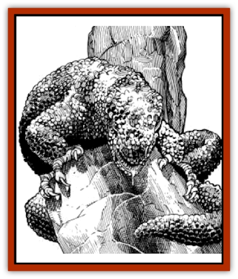

# Id Fiend

| Statistic | **Id Fiend** |
| --- | --- |
| **Activity Cycle:** | Any |
| **Alignment:** | Neutral |
| **Armor Class:** | 6 |
| **Climate/Terrain:** | Any |
| **Damage/Attack:** | 1-6/1-6/1-8 or 1-8/1-8 |
| **Diet:** | Carnivore |
| **Frequency:** | Rare |
| **Hit Dice:** | 5+5 |
| **Intelligence:** | High (13-14) |
| **Magic Resistance:** | Nil |
| **Morale:** | Steady (11-12) |
| **Movement:** | 12 |
| **No. Appearing:** | 1-2 |
| **No. of Attacks:** | 3 or 2 |
| **Organization:** | Solitary |
| **Size:** | Large (10' long) |
| **Special Attacks:** | Fear attack (see below) |
| **Special Defenses:** | Nil |
| **THAC0:** | 15 |
| **Treasure:** | Nil (A) |
| **XP Value:** | 420 |

**Psionics Summary**

| Level | Dis/Sci/Dev | Attack/Defense | Score | PSPs |
| --- | --- | --- | --- | --- |
| 7 | 3/4/12 | EW,MT,PB,PsC/M-,TS,MB,TW | 16 | 140 |

**Clairsentience -** *Science:* aura sight; *Devotions:* combat mind, danger sense, poison sense.

**Psychometabolism -** *Science:* death field; *Devotions:* biofeedback, double pain, flesh armor, heightened senses.

**Telepathy -** *Sciences:* mind link, psionic blast, tower of iron will; *Devotions:* aversion, ego whip, inflict pain, life detection, mental barrier, mind thrust, mind blank, psionic crush, thought shield, contact.

The id fiend is a psionic predator whose greatest weapon is its ability to draw images of its victims' fears from their minds.

The id fiend is very much like a gila monster or large [[Lizard|lizard]] in appearance. It has a large, thick, stocky body supported by four muscular legs. All of the id fiends legs end in four clawed digits, three pointing forward and one backward. The torso of the id fiend usually ranges from 3 to 4 feet in length, ending in a long, tapering tail which is often up to four feet long. The head and neck of the id fiend measure two feet long, with its jaws making up about one foot of that length. The id fiends skin has a tough leather-like texture, varying in color from light brown and tan, found on specimens encountered in the desert, to a dark olive green, found on specimens encountered in the forests and jungles.

**Combat:** As stated above, id fiends are predators. Before an id fiend will engage in actual combat with a victim, it will first stalk its victim using its psionic fear attack. The id fiend uses this attack when it first locates its prey. The creature can affect up to 15 Hit Dice of creatures, within a range of 60'. All creatures affected must roll a saving throw against paralyzation at a base penalty of -5. For every two experience levels beyond 5th level, this penalty is decreased by 1 (-4 at 7th level, -3 at 9th level, etc.). Those succeeding at their saving throw are unaffected. Those who fail are tormented by their greatest fears, creating a significant impediment to their combat abilities. All affected creatures add + 1 to their initiative rolls and suffer a -2 penalty to all attack and damage rolls. Mages affected by the fear power of the id fiend must make a successful Intelligence check in order to successfully cast any spells, while affected priests must pass Wisdom checks when spell casting. All of the above effects last for 5 rounds.

Once engaged in actual melee combat, the id fiend is still difficult to face. The creature is able to attack 3 times, using both its front claws and its teeth. Each claw attack does 1-6 points, and its bite does 1-8 points. The id fiend can also attack with its tail. When employing its tail, the creature cannot use its claw attacks, but can still bite. A tail lash from an id fiend does 1-8 points of damage.

The id fiend is also a powerful psionicist. The creature can use any of its offensive psionic powers instead of its normal physical attacks in any round. In addition, any of the id fiends psionic defense modes can be used in any round, whether the creature is using its other psionic powers or its physical attacks. Of course, the creature must have enough PSPs to power the defense mode being used.

**Habitat/Society:** Id fiends can be encountered in virtually any terrain on Athas. Some live in the forests and jungles near the Forest Ridge, while some make their homes on the flat Tablelands that surround the Sea of Silt.

Though active at all times of the day, id fiends are more commonly encountered at night than during daylight hours. These creatures have learned that their natural fear inducing ability is much more effective at night, and thus prefer to stalk their prey in the dark. Though id fiends do not have infravision, they are able to see adequately in natural darkness.

Id fiends mate yearly, and females bear their young in litters of a single offspring. A new born id fiend is able to digest solid food at birth, and the mother will most often leave the youngling to fend for itself.

**Ecology:** Dried id fiend blood is used in the creation of a potion concocted by psionic researchers; the potion allegedly increases the imbiber.s psionic abilities for brief periods of time.

---
## Discovery & Documentation

**Source Publication:** MC12 Dark Sun Appendix I - Terrors of the Desert (1991)
**Campaign Setting:** Dark Sun
**Author(s):** Tom Prusa, Louis J. Prosperi, Walter M. Baas

### Other Creatures Found in This Source Book
   * [[Animal_Herd_Athas|Animal, Herd (Athas)]]
   * [[Animal_Household_Athas|Animal, Household (Athas)]]
   * [[Antloid_Desert|Antloid, Desert]]
   * [[Banshee_Dwarf|Banshee, Dwarf]]
   * [[Beetle_Agony|Beetle, Agony]]
   * [[Bog_Wader|Bog Wader]]
   * [[Brambleweed|Brambleweed]]
   * [[B'rohg|B'rohg]]
   * [[Burnflower|Burnflower]]
   * [[Cat_Psionic|Cat, Psionic]]
   * [[Cha'thrang|Cha'thrang]]
   * [[Cistern_Fiend|Cistern Fiend]]
   * [[Clam_Giant|Clam, Giant]]
   * [[Cloud_Ray|Cloud Ray]]
   * [[Drake_Athas_Air|Drake (Athas), Air]]
   * [[Drake_Athas_Earth|Drake (Athas), Earth]]
   * [[Drake_Athas_Fire|Drake (Athas), Fire]]
   * [[Drake_Athas_Water|Drake (Athas), Water]]
   * [[Dune_Runner|Dune Runner]]
   * [[Dune_Trapper|Dune Trapper]]
   * [[Elemental_Athas_Greater_Air|Elemental (Athas), Greater, Air]]
   * [[Elemental_Athas_Greater_Earth|Elemental (Athas), Greater, Earth]]
   * [[Elemental_Athas_Greater_Fire|Elemental (Athas), Greater, Fire]]
   * [[Elemental_Athas_Greater_Water|Elemental (Athas), Greater, Water]]
   * [[Elemental_Athas_Lesser_Air_Earth|Elemental (Athas), Lesser, Air/Earth]]
   * [[Elemental_Athas_Lesser_Fire_Water|Elemental (Athas), Lesser, Fire/Water]]
   * [[Elemental_Athas_General_Information|Elemental (Athas), General Information]]
   * [[Erdland|Erdland]]
   * [[Esperweed|Esperweed]]
   * [[Flailer|Flailer]]
   * [[Floater|Floater]]
   * [[Giant_Athas|Giant (Athas)]]
   * [[Golem_Athas_I|Golem (Athas) I]]
   * [[Golem_Athas_II|Golem (Athas) II]]
   * [[Golem_Athas_III|Golem (Athas) III]]
   * [[Golem_Athas_General_Information|Golem (Athas), General Information]]
   * [[Halfling_Renegade|Halfling, Renegade]]
   * [[Hej-kin|Hej-kin]]
   * [[Insect_Swarm_Athas|Insect Swarm (Athas)]]
   * [[Kank_Wild|Kank, Wild]]
   * [[Kirre|Kirre]]
   * [[Megapede|Megapede]]
   * [[Mul_Wild|Mul, Wild]]
   * [[Nightmare_Beast|Nightmare Beast]]
   * [[Plant_Carnivorous_Athas|Plant, Carnivorous (Athas)]]
   * [[Pterran|Pterran]]
   * [[Pterrax|Pterrax]]
   * [[Pulp_Bee|Pulp Bee]]
   * [[Pyreen|Pyreen]]
   * [[Rasclinn|Rasclinn]]
   * [[Razorwing|Razorwing]]
   * [[Roc_Athas|Roc (Athas)]]
   * [[Sand_Bride|Sand Bride]]
   * [[Sand_Cactus|Sand Cactus]]
   * [[Sand_Vortex|Sand Vortex]]
   * [[Scrab|Scrab]]
   * [[Silt_Horror|Silt Horror]]
   * [[Silt_Runner|Silt Runner]]
   * [[Sink_Worm|Sink Worm]]
   * [[Sloth_Athas|Sloth (Athas)]]
   * [[So-ut|So-ut]]
   * [[Spider_Cactus|Spider Cactus]]
   * [[Spider_Crystal|Spider, Crystal]]
   * [[Spirit_of_the_Land|Spirit of the Land]]
   * [[T'Chowb|T'Chowb]]
   * [[Thrax|Thrax]]
   * [[Tohr-kreen_I|Tohr-kreen I]]
   * [[Villichi|Villichi]]
   * [[Zhackal|Zhackal]]
   * [[Zombie_Plant|Zombie Plant]]
