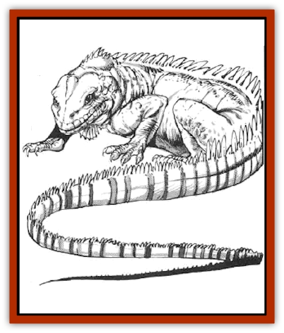

# Iguana - Giant

| Statistic | **Iguana, Giant** |
| --- | --- |
| **Activity Cycle:** | Night |
| **Alignment:** | Neutral |
| **Armor Class:** | 6 |
| **Climate/Terrain:** | Temperate and subtropical/Forests |
| **Damage/Attack:** | 2-8 |
| **Diet:** | Omnivore |
| **Frequency:** | Rare |
| **Hit Dice:** | 6+2 |
| **Intelligence:** | Animal (1) |
| **Magic Resistance:** | Nil |
| **Morale:** | Average (8-10) |
| **Movement:** | 12 |
| **No. Appearing:** | 1 or 2-12 |
| **No. of Attacks:** | 1 bite |
| **Organization:** | Solitary |
| **Size:** | L (8-10' long) |
| **Special Attacks:** | Swallows whole |
| **Special Defenses:** | Nil |
| **THAC0:** | 15 |
| **Treasure:** | Nil |
| **XP Value:** | 420 |

The giant iguana is a large, omnivorous reptile found in wilderness forests.

This large [[Lizard|lizard]] looks just like a normal iguana, except that it is eight to ten feet long in the body with a long, thin tail ten to 15 feet long. It is green and black in color, and more or less spotted and barred. The neck and back bear a high, serrated crest, and there is a large sac under its chin. The long-toed feet have strong talons, which are used for climbing and running but not combat.

**Combat:** The giant iguana attacks only if cornered or hungry. It can stand in any position unmoving for great lengths of time. Even its breathing is not noticeable. Its coloration provides camouflage in darkened undergrowth, where it causes a -3 penalty to opponents' surprise rolls. Any attacks to its tail cause pain, but inflict no damage on the lizard. The tail can even be severed clean off. This is unpleasant for the iguana, but it grows a new one at the rate of a foot a month.

The lizards wide mouth inflicts only 2d4 points of damage because it has only a few teeth. On a natural roll of 20 it can swallow any man-sized creature whole. A 19 or 20 enables it to swallow any smaller sized creature, such as a [[Dwarf|dwarf]] or [[Halfling|halfling]]. The iguana always goes for the smallest creature in a group. Once a meal is swallowed, it tums and runs away. It can swallow only one creature per week, unless they are small animals.

Any creature swallowed has to get out before it suffocates (for a character this is a number of rounds equal to 1/3 Constitution, rounded up). The stomach lining is the same Armor Class as the outer skin, but only smd motions can be made in such tight quarters. Any edged or pointed weapon under a foot in length can be used normally; the attack roll is used to determine if the arm can be moved to attack. Blunt weapons are useless and all other weapons cause only 1 point of damage per successful attack.

**Habitat/Society:** Giant iguanas are solitary hunters, but they gather in groups for sunning or to find a mate. Such group are rarely dangerous, and there is only a 1 in 6 chance of an unprovoked attack. They prefer to hunt in the darkened undergrowth of a forest and then bask in the sun to digest. Even standing in the open under bright sunlight, it is possible to not notice the completely immobile iguana.

Unlike their smaller, herbivorous cousins, giant iguanas eat both meat and plants. They prefer insects to mammals, although they hunt both, and prefer grasses to bushes or tree leaves. They do not need to eat very often, only once every other day.

The giant iguana can climb any slope up to 60 degrees that has reasonable grip at normal speed. It can even climb large trees if necessary. Unlike the smaller variety, the giant iguana cannot leap.

**Ecology:** Iguana meat is tender and tasty to most humanoid creatures. Some plainsmen even keep small herds, although they are much more trouble than placid cows and sheep. Fences and even rock walls are not much of an obstacle to them, and they are much more dangerous than cows.

The giant iguana can rarely be domesticated, or used as a pack animal. However, an [[Ingundi|ingundi]] can ride them with little trouble. The ingundi do not use a saddle; they just push the spines of the iguana�s back flat and sit on them. This would be uncomfortable to anything with a tender hide.

**Horned Iguana**

  The giant horned iguana is just like the regular giant iguana, except for the three two-foot-long horns on its head. It does not attack with these horns, but it can move them to intercept a rush or charge. Interception requires a successful attack roll; the horns cause 3d6 points of damage to the charging enemy. This occurs just before the attack, even if the horned iguana loses the initiative roll. If it attempts to intercept the charge, that is its only attack that round.

**Other Species**

  There are many different species of giant iguana. They may look quite different, but all have basically the same statistics. They have different coloration, smaller tails, independently moving eyes, different numbers of toes on the foot etc. Despite these differences, they still have the same Hit Dice, Armor Class, THAC0, etc.

---
## Discovery & Documentation

**Source Publication:** MC5 Greyhawk Appendix (1989)
**Campaign Setting:** Advanced Dungeons & Dragons 2nd Edition
**Author(s):** Grant Boucher, William W. Connors, Steve Gilbert, Bruce Nesmith, Chris Mortika, Skip Williams

### Other Creatures Found in This Source Book
   * [[Aspis|Aspis]]
   * [[Beastman|Beastman]]
   * [[Bonesnapper|Bonesnapper]]
   * [[Booka|Booka]]
   * [[Brownie_Buckawn|Brownie, Buckawn]]
   * [[Brownie_Quickling|Brownie, Quickling]]
   * [[Crystalmist|Crystalmist]]
   * [[Dragon_Cloud|Dragon, Cloud]]
   * [[Dragon_Oerth_Greyhawk|Dragon (Oerth), Greyhawk]]
   * [[Dragonfly_Giant|Dragonfly, Giant]]
   * [[Dragonnel|Dragonnel]]
   * [[Elf_Grugach|Elf, Grugach]]
   * [[Elf_Valley|Elf, Valley]]
   * [[Golem_Necrophidius|Golem, Necrophidius]]
   * [[Grell_Wild|Grell, Wild]]
   * [[Grung|Grung]]
   * [[Hobgoblin_Norker|Hobgoblin, Norker]]
   * [[Hook_Horror|Hook Horror]]
   * [[Horgar|Horgar]]
   * [[Hound_Yeth|Hound, Yeth]]
   * [[Ingundi|Ingundi]]
   * [[Kech|Kech]]
   * [[Kyuss_Son_of|Kyuss, Son of]]
   * [[Mite|Mite]]
   * [[Needleman|Needleman]]
   * [[Plant_Carnivorous_Oerth|Plant, Carnivorous (Oerth)]]
   * [[Plant_Carnivorous_Vampire_Cactus|Plant, Carnivorous, Vampire Cactus]]
   * [[Plasmoid_General_Information|Plasmoid, General Information]]
   * [[Rat_Oerth|Rat (Oerth)]]
   * [[Raven_Crow|Raven/Crow]]
   * [[Scarecrow|Scarecrow]]
   * [[Shadow_Slow|Shadow, Slow]]
   * [[Skulk|Skulk]]
   * [[Snail|Snail]]
   * [[Sprite|Sprite]]
   * [[Taer|Taer]]
   * [[Tentamort|Tentamort]]
   * [[Turtle_Giant|Turtle, Giant]]
   * [[Tyrg|Tyrg]]
   * [[Wolf_Mist|Wolf, Mist]]
   * [[Wraith_Oerth|Wraith (Oerth)]]
   * [[Zygom|Zygom]]
