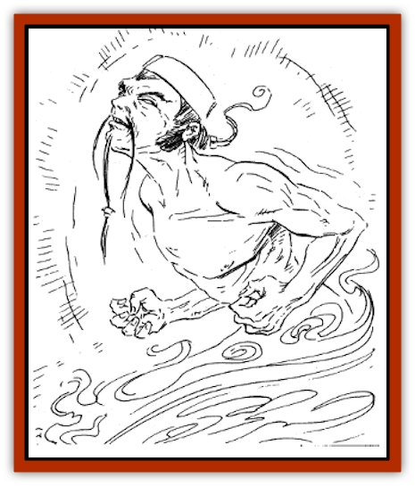

# Ikiryo

| Statistic | **Ikiryo** |
| --- | --- |
| **Activity Cycle:** | Any |
| **Alignment:** | Chaotic evil |
| **Armor Class:** | Nil |
| **Climate/Terrain:** | Any |
| **Damage/Attack:** | Nil |
| **Diet:** | None |
| **Frequency:** | Very rare |
| **Hit Dice:** | Nil |
| **Intelligence:** | Very (11-12) |
| **Magic Resistance:** | See below |
| **Morale:** | Nil |
| **Movement:** | Nil |
| **No. Appearing:** | 1 |
| **No. of Attacks:** | 1 |
| **Organization:** | Solitary |
| **Size:** | Nil |
| **Special Attacks:** | Ability drain |
| **Special Defenses:** | See below |
| **THAC0:** | Nil |
| **Treasure:** | Nil |
| **XP Value:** | 7,000 |

A projection of the evil thoughts of a living person, the ikiryo is a lesser spirit that obsessively pursues its victim until either it or the victim is destroyed.

An ikiryo springs into existence as a manifestation of intense jealousy or hatred, which is directed toward a specific person. Only a human or humanoid can create this spirit; monsters cannot. No one can intentionally create an ikiryo. The person who generates this deadly spirit is seldom, if ever, aware of its existence.

Once created, the ikiryo has a will of its own. It seeks out the object of its creator's dark emotions, and attempts to erode the victim's abilities until he dies. The ikiryo's creator cannot negate, command, or control the spirit in any way. An ikiryo never does what it does on behalf of the person who created it.

The ikiryo has no physical form of any kind; it is only experienced as a presence of psychic energy. As such, it cannot be seen or detected by *detect invisibility* or *detect life*. A *detect evil* spell reveals an aura of evil surrounding the victim it is trying to destroy. A *detect harmony* spell reveals that something about the victim and his surroundings is out of place, but it does not specifically reveal the ikiryo's presence.

Only a *true sight* spell (or its equivalent) causes the ikiryo to appear. In this case, it looks like a shimmering, ghostly image of the person who created it.

**Combat:** An ikiryo always has a specific living character as its target. After its creation, the ikiryo travels unerringly in the direction of that victim, moving at its full movement rate. The ikiryo can locate its victim anywhere in the world, although it cannot seek him out on other planes of existence. Should its victim be on another plane at the time of the ikiryo's creation, the ikiryo dissipates within 24 hours, unless the victim returns to the Prime Material Plane during that time.

When an ikiryo finds its victim, it stays with him until either it or the victim is destroyed. Once an ikiryo has contacted its victim, it can follow him anywhere, including other planes of existence. Each day the ikiryo stays with the victim, the victim loses 1 point from every ability score. The loss occurs at the end of each 24-hour period. The victim also loses the use of any attributes that depend upon those scores. (For instance, if a wu jen's Intelligence drops from 10 to 9, he cannot cast his 5th level spells.)

Unless the victim has detected the presence of the ikiryo by one of the methods described above, he probably won't realize exactly what is happening to him. He will feel disturbed and restless, and even the freshest air will seem stagnant. He will tire easily and feel exhausted. But he may not realize his ability scores are dropping, or how much. If any ability score is reduced to 0, the victim dies, and the ikiryo blinks out of existence.

If a victim survives the drain, he only can recover ability points when the ikiryo is banished or destroyed. At that time, lost ability points return at the rate of 1 point per ability, per day.

An ikiryo is extremely difficult to thwart. A *protection from evil 10' radius* spell temporarily keeps the ikiryo at bay, but the spell does not harm it. *Invisibility to spirits* prevents the ikiryo from locating its victim, but as soon as the magical effects fade, the ikiryo is back on track. *Summon spirit* causes the ikiryo to instantly take the form of the person who created it, complete with all of the creator's strengths, weaknesses, and other attributes. If this summoned form is destroyed, the ikiryo is likewise dispelled. An *exorcism*, if successful, banishes the ikiryo, forbidding it from ever returning.

Perhaps the easiest way to destroy an ikiryo is to seek out the person who generated it. If this person is confronted with the existence of the ikiryo, the creature vanishes forever, regardless of whether the person accepts responsibility for the spirit's creation.

In game play, either an NPC or PC may create an ikiryo, and either may be its victim. The DM determines when the formation of the spirit is appropriate. As DM, you may know of an NPC who harbors secret resentments against a PC; the ikiryo can attack that PC.

**Habitat/Society:** Ikiryo have no lairs. They do not collect treasure or organize themselves into formal groups.

**Ecology:** Primitive villagers shun those who have been attacked by an ikiryo, believing them to be harbingers of bad fortune.

---
## Discovery & Documentation

**Source Publication:** MC6 Kara-Tur Appendix (1990)
**Campaign Setting:** Kara-Tur (Forgotten Realms)
**Author(s):** Rick Swan

### Other Creatures Found in This Source Book
   * [[Bajang|Bajang]]
   * [[Bakemono|Bakemono]]
   * [[Bisan|Bisan]]
   * [[Buso|Buso]]
   * [[Carp_Giant|Carp, Giant]]
   * [[Centipede_Spirit|Centipede, Spirit]]
   * [[Chu-u|Chu-u]]
   * [[Con-tinh|Con-tinh]]
   * [[Doc_cu'o'c|Doc cu'o'c]]
   * [[Duruch'i-lin|Duruch'i-lin]]
   * [[Flame_Spirit|Flame Spirit]]
   * [[Foo_Creature|Foo Creature]]
   * [[Gaki|Gaki]]
   * [[Gargantua|Gargantua]]
   * [[Goblin_Rat|Goblin Rat]]
   * [[Hai_Nu|Hai Nu]]
   * [[Hannya|Hannya]]
   * [[Hengeyokai|Hengeyokai]]
   * [[Hsing-sing|Hsing-sing]]
   * [[Hu_Hsien|Hu Hsien]]
   * [[Human_Kara-Tur|Human (Kara-Tur)]]
   * [[Jishin_Mushi|Jishin Mushi]]
   * [[Kala|Kala]]
   * [[Kaluk|Kaluk]]
   * [[Kappa|Kappa]]
   * [[Korobokuru|Korobokuru]]
   * [[Krakentua|Krakentua]]
   * [[Kuei|Kuei]]
   * [[Memedi|Memedi]]
   * [[Men-shen|Men-shen]]
   * [[Nat|Nat]]
   * [[Ningyo|Ningyo]]
   * [[Oni|Oni]]
   * [[P'oh|P'oh]]
   * [[P'oh_Gohei|P'oh, Gohei]]
   * [[Shan_Sao|Shan Sao]]
   * [[Shirokinukatsukami|Shirokinukatsukami]]
   * [[Spirit_Folk|Spirit Folk]]
   * [[Spirit_Nature|Spirit, Nature]]
   * [[Spirit_Stone|Spirit, Stone]]
   * [[Tako|Tako]]
   * [[Tengu|Tengu]]
   * [[Wang-Liang|Wang-Liang]]
   * [[Yuan-ti_Histachii|Yuan-ti, Histachii]]
   * [[Yuki-on-na|Yuki-on-na]]
