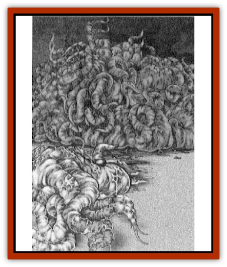

# Illithocyte

| Statistic | **Illithocyte** |
| --- | --- |
| **Activity Cycle:** | Any |
| **Alignment:** | Neutral |
| **Armor Class:** | 6 |
| **Climate/Terrain:** | Subpenumbra: The Nethermost |
| **Damage/Attack:** | 1 (&times;4) |
| **Diet:** | Psychosphere radiation |
| **Frequency:** | Common |
| **Hit Dice:** | 4 |
| **Intelligence:** | Animal (1) |
| **Magic Resistance:** | 25% |
| **Morale:** | Elite (14) |
| **Movement:** | 6 |
| **No. Appearing:** | 3d10 |
| **No. of Attacks:** | 4 (tentacles) |
| **Organization:** | Mass |
| **Size:** | S (4' long) |
| **Special Attacks:** | Nil |
| **Special Defenses:** | � damage from acid |
| **THAC0:** | 17 |
| **Treasure:** | Nil |
| **XP Value:** | 420 |

Illithocytes are squirming subpenumbran lifeforms that subsist on random psychic energy alone, but whose lashing tentacles are capable of delivering painful stings to those that encounter them.

Mucous-coated eyeless slugs, illithocytes are mottled violet and brown, pushing their way through darkness with four long tentacles. Illithocytes are four feet long with tentacles compromising one fourth of that length, but they generally move in groups of 3 to 30 individuals, entwining bodies and tentacles in an undifferentiated mass of squalid flesh, leaving behind a wide track of slowly dryig mucous.

Though only of animal intelligence and lacking any language, illithocytes are able to telepathically sense living creatures within a 30-foot radius, and other illithocytes within a 100-foot radius.

**Combat:** Though not a carnivorous species, illithocytes are quite aggressive. Because they are the chief source of nutrition for ravening [[Neothelid|neothelids]], illithocytes attack before being attacked, attempting to drive off all possible threats. Though not always successful, sometimes these aggressive tendencies cause a predator neothelid to move on in search of smaller illithocyte masses on which to dine. Though it hasn't happened yet, it's possible that enough illithocyte masses could bring down a neothelid.

In melee, illithocytes work together against a single target. Seeking to swarm a foe, illithocytes flail with their tentacles, inflicting only 1 hp of damage with each successful hit. Singly, illithocytes are not too dangerous, but in their customary masses, these size S creatures can concentrate on a single foe to deadly effect (up to eight of the creatures can simultaneously attack a foe of size M).

Illithocytes have developed some resistance to the neothelid flesh-dissolving breath weapon, and as such are equally resistant to more common acids, taking 1/4 damage from all such exposure. Unfortunately, their bodies prove particularly susceptible to fire, suffering double normal damage from flame.

Due to their ancient [[Mind_Flayer|illithid]] kinship, illithocytes possess a residual 25% magic resistance.

**Habitat/Society:** Since the fall of the illithid empire, what were once tadpoles have evolved into an entirely self-contained species. Forced to adapt or die, a minuscule population of bereaved illithid tadpoles managed the former. Illithocytes divorced themselves from the need to swim through liquid, and instead squirm in family masses across the bare substance. In fact, these family masses are made up of members that have budded from other members: illithocytes are not illithid tadpoles, but in fact are an entirely new species able to reproduce in their own limited fashion.

An illithocyte is ready to bud once it has achieved its full length of four feet. Then, after entering a 24-hour period of torpor in which the illithocyte gorges itself on psychospheric radiations, it begins to bud off a new illithocyte. The actual budding process takes 48 hours, at the end of which time the "parent" illithocyte has lost about 25% of its mass, while the "daughter" illithocyte is only 1 foot long. With sufficient nutrition, the new illithocyte can expect to reach full length in about 360 sleep periods (approximately one Penumbran year).

**Ecology:** Forced by the extremity of starvation, illithocytes feed from the penumbran "psychosphere" just like the more primitive mosses do, turning the undirected energy into nutrition for growth and development. In turn, illithocytes serve as the only food source for the few neothelids living within the disc of Penumbra.

Because the intensity of psychosphere radiations wax and wane according to several random factors, illithocyte masses constantly migrate through the bare tunnels of Penumbra's Nethermost passages. No natural access exists between the Penumbra's two surfaces and the realm of the creatures that were once illithid tadpoles; illithocytes are fated to remain forever within the moist darks of the Nethermost.

---
## Discovery & Documentation

**Source Publication:** Dawn of the Overmind (1998)
**Campaign Setting:** Advanced Dungeons & Dragons 2nd Edition
**Author(s):** Bruce R Cordel

### Other Creatures Found in This Source Book
   * [[Voor_Larva|Voor Larva]]
