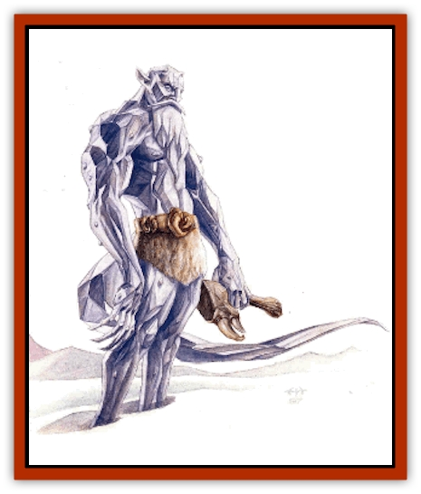

# Immoth

| Statistic | **Immoth** |
| --- | --- |
| **Activity Cycle:** | Any |
| **Alignment:** | Neutral |
| **Armor Class:** | 2 |
| **Climate/Terrain:** | Paraplane of Ice |
| **Damage/Attack:** | 1d8+1/1d8+1/2d4+2 |
| **Diet:** | Carnivore |
| **Frequency:** | Rare |
| **Hit Dice:** | 10+3 |
| **Intelligence:** | High to exceptional (14-16) |
| **Magic Resistance:** | 25% |
| **Morale:** | Fanatic (17-18) |
| **Movement:** | 12 |
| **No. Appearing:** | 1 |
| **No. of Attacks:** | 3 |
| **Organization:** | Solitary |
| **Size:** | L (8' tall) |
| **Special Attacks:** | Poison, words of power |
| **Special Defenses:** | Immune to cold, bladed weapons inflict half damage |
| **THAC0:** | 9 |
| **Treasure:** | Special |
| **XP Value:** | 8,000 |

Words are power. It's been said many times, and each time it's the truth. It's also been said that on the Paraelemental Plane of Ice, the air is so cold that a cutter's words freeze the minute they're spoken. That's never been taken as a literal fact, but it's just as true a statement.

The frost-rimed immoth, giant native of the plane of Ice, knows the dark of where the frozen words go. It gathers them and taps the power inherent within. No one else has been able to fathom these secrets, but those who've encountered an immoth have no doubt that the chant about these creatures is true.

A giant made of icy crystals and encrusted with gemlike nuggets of ice, the immoth is both beautiful and terrible to behold. The creature is essentially humanoid but for the long tail that sweeps along the icy ground and the cruel talons that gleam at the end of its hands. Its sparkling, semitransparent body shimmers in the dim light of the plane of its origin. A beard of frost grows long on the face of the giant, marking its age. Mortals know no other means of distinguishing one immoth from another except by the length of the creatures' beards.

Each of the thousands of ice nuggets adhered along the immoth's body holds a frozen word gathered from a hidden place deep within the plane of Ice, a locale so utterly cold that everything freezes - even a body's speech. All words spoken on the Paraelemental Plane of Ice end up in this forbidden place to freeze for all eternity.

Immoths speak their own language and some speak planar common as well.

**Combat:** Physically imposing, an immoth can inflict grievous wounds with its icy talons (inflicting 1d8+1 points of damage each). Worse, however, the giant can also strike an opponent with its whiplike tail (causing 2d4+2 points of damage). Although the tail appears blunt, it's coated with a virulent contact poison secreted by the immoth. This strange venom, which appears as a partially frozen brown syrup, imparts a multistage affliction upon those who're struck and fail their saving throw.

The first stage of the poison's effects begins almost immediately. The victim collapses and suffers a -2 penalty to all actions. The poor sod then begins to suffer 1d3 points of damage every hour. Not long after - 1d100 rounds after the first stage begins - the second stage sets in, as the victim begins to lose his words. The poor sod finds himself helplessly babbling away, speaking whatever words come to his mind. Strangely, once he uses a particular word, he cannot ever use it again - it is purged from his memory. Even as he loses his words, the diction continues to rattle his bone-box until every bit of language he knows is gone. In 24 hours, if the sod is still alive, the poison finally finishes him off.

Further, the immoth can use the frozen words encrusted all over its body. Tapping into some inherent power, it can cause any of the ice crystals to shatter, releasing the word and a spell-like effect. An immoth casts spells as a 12th-level wizard, both in the power of its magic and in the number of spells it has available from the crystals. The immoth isn't restricted by the usual limitations on magic imposed by the nature of the plane of Ice: it essentially has an innate spell key to avoid any such conditions. Regardless, an immoth never conjures forth magic that generates heat or fire or summons other creatures. Instead, it prepares spell-like abilities that inflict pain or misfortune (such as *fumble*, *hold person*, or *magic missile*), that give it useful abilities (*fly*, *haste*, *passwall*, or *teleport*), or those with an icy nature (*cone of cold*, *ice storm*, or *wall of ice*). It can also manipulate spell effects to better control its frozen environment (*ice shape* rather than *stone shape*, *transmute ice to slush* rather than *transmute stone to mud*, and so on) as the DM allows.

Immoths are immune to cold attacks. Due to their hard crystalline nature, they suffer only half damage from bladed weapons. However, magical weapons are not required to strike them.

**Habitat/Society:** Immoths are solitary creatures that keep to themselves. No one knows how many of these creatures live on the plane of Ice, but the number seems to be small. Although reports claim the existence of a particular immoth that has a number of [[Frost_Salamander|frost salamanders]] *charmed* and under its control, it seems that most of the time the icy giants disdain the presence of other creatures.

When the immoths gather, they do so in a hidden locale somewhere in the Paraelemental Plane of Ice. This mysterious place lies somewhere near the fabled Mountain of Ultimate Winter. Here, chant has it, ideas, concepts, emotions, and words freeze forever in the incredible cold. Immoths scour the mountain for useful words trapped in the frozen ice. This area of the plane is said to be even colder than the rest, freezing non-natives solid in 1d4 rounds if they fail a saving throw versus spell (required each round).

When they need to feed, the creatures leave the mountain and prowl other areas of the plane for months at a time. During these hunting trips, immoths attack any living creature (whether native to the plane of Ice or not) that they encounter, considering all other beings potential sustenance. Attempts to parlay or otherwise communicate peacefully with the giants hit the blinds.

If there's a way for a body other than an immoth to utilize the power in the frozen word-crystals, no one's ever tumbled to it. That doesn't mean, however, that ambitious berks out there aren't giving it a try. A frozen word can be worth up to 100 gold pieces to the right buyer. 'Course, a body's got to figure out a canny way to get the icy crystal off the plane of Ice without it melting - no mean feat.

**Ecology:** Creatures of solid ice, the immoths are probably related to ice [[Paraelemental|paraelementals]] in some way. One story relates that immoths are actually a group of intelligent ice elementals cursed by a powerful mortal witch. Supposedly, this woman came to the plane of Ice to obtain a number of servants; when the elementals refused to obey her commands, she magically compelled them to forever seek the words that she spoke to them on the Mountain of Ultimate Winter. This task changed them physically into the forms they currently wear. Once they find all of her words, the curse will be lifted - and in the meantime, the other words that they find can be useful.

Immoths eat any sort of living creature, feeding more on the life essence than the actual flesh, although they consume the flesh as well.

Most graybeards (at least, those who've bothered to study the reclusive creatures) believe that immoths do not reproduce.

---
## Discovery & Documentation

**Source Publication:** Planescape III (1996)
**Campaign Setting:** Planescape
**Author(s):** Monte Cook

### Other Creatures Found in This Source Book
   * [[Animental|Animental]]
   * [[Archomental_Evil|Archomental, Evil]]
   * [[Archomental_Good|Archomental, Good]]
   * [[Belker|Belker]]
   * [[Bzastra|Bzastra]]
   * [[Chososion|Chososion]]
   * [[Darklight|Darklight]]
   * [[Devete|Devete]]
   * [[Devourer_Planescape|Devourer (Planescape)]]
   * [[Dharum_Suhn|Dharum Suhn]]
   * [[Egarus|Egarus]]
   * [[Elemental_Athas_Lesser_Air_Earth|Elemental (Athas), Lesser, Air/Earth]]
   * [[Elemental_Athas_Lesser_Fire_Water|Elemental (Athas), Lesser, Fire/Water]]
   * [[Elemental_Fire_Kin_Salamander_II|Elemental, Fire Kin, Salamander II]]
   * [[Entrope|Entrope]]
   * [[Facet|Facet]]
   * [[Frost_Salamander|Frost Salamander]]
   * [[Fundamental_Air_Earth|Fundamental, Air/Earth]]
   * [[Fundamental_Fire_Water|Fundamental, Fire/Water]]
   * [[Fundamental_All_Elements|Fundamental, All Elements]]
   * [[Garmorm|Garmorm]]
   * [[Homunculus_Elemental|Homunculus, Elemental]]
   * [[Khargra|Khargra]]
   * [[Klyndes|Klyndes]]
   * [[Magran|Magran]]
   * [[Menglis|Menglis]]
   * [[Nathri|Nathri]]
   * [[Ooze_Sprite|Ooze Sprite]]
   * [[Paraelemental|Paraelemental]]
   * [[Phirblas|Phirblas]]
   * [[Psurlon|Psurlon]]
   * [[Quasielemental_Negative|Quasielemental, Negative]]
   * [[Quasielemental_Positive|Quasielemental, Positive]]
   * [[Rast|Rast]]
   * [[Ravid|Ravid]]
   * [[Ruvoka|Ruvoka]]
   * [[Scile|Scile]]
   * [[Shad|Shad]]
   * [[Shocker|Shocker]]
   * [[Sislan|Sislan]]
   * [[Suisseen|Suisseen]]
   * [[Terithran|Terithran]]
   * [[Thoqqua|Thoqqua]]
   * [[Trilloch|Trilloch]]
   * [[Tsnng|Tsnng]]
   * [[Ungulosin|Ungulosin]]
   * [[Vacuous|Vacuous]]
   * [[Wavefire|Wavefire]]
   * [[Xag-Ya_Xeg-Yi|Xag-Ya/Xeg-Yi]]
   * [[Xill|Xill]]
