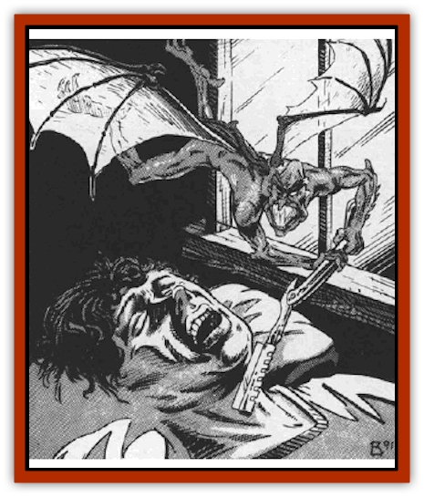

# Imp - Assassin

| Statistic | **Imp, Assassin** |
| --- | --- |
| **Activity Cycle:** | Any (night) |
| **Alignment:** | Lawful evil |
| **Armor Class:** | 0 |
| **Climate/Terrain:** | Any Ravenloft |
| **Damage/Attack:** | 1d4 |
| **Diet:** | Carnivore |
| **Frequency:** | Rare |
| **Hit Dice:** | 3 |
| **Intelligence:** | Very (11-12) |
| **Magic Resistance:** | 50% |
| **Morale:** | Average (8-10) |
| **Movement:** | 6, Fl 18 (B) |
| **No. Appearing:** | 1 |
| **No. of Attacks:** | 1 |
| **Organization:** | Solitary |
| **Size:** | T (1' tall) |
| **Special Attacks:** | See below |
| **Special Defenses:** | See below |
| **THAC0:** | 17 |
| **Treasure:** | O |
| **XP Value:** | 975 |

The assassin imp is a clever and evil creature that, like the more common [[Imp|quasit]] or traditional [[Imp|imp]], serves the cause of darkness.

Assassin imps are tiny creatures, seldom standing over one foot in height. They are generally deep black in color, but some individuals are as light as slate gray. Two bat-like wings fan out from the creature's back and enable it to fly, while a long, slender tail dangles behind it. The tail, which is almost constantly in motion, ends in a scorpion-like stinger (see below). The creature is noted for its keen eyesight and 60' infravision.

Assassin imps are able to communicate with others of their kind by means of a language that some describe as purely evil in sound and expression.

**Combat:** As its name implies, the assassin imp often strikes without warning. The spell-like abilities of the imp are obviously useful in such practices. At will, an assassin imp can become *invisible*, *detect magic*, or *find traps*. Three times per day the imp can employ a *knock* or *cause light wounds* spell, and once per day it may cast a *command* spell.

When an assassin imp attacks a target that has not yet detected it, it imposes a -3 to that creature's surprise roll. Often, the imp avoids detection by remaining invisible until its victim draws near and then diving at them from above.

Assassin imps generally try to kill their victims in some way that is linked to their professions. Thus, a weaponsmith might be impaled on one of his own swords or a thief slain by a poisoned needle cleverly concealed in his own home.

An assassin imp's stinger is not nearly as dangerous as that of a true imp. While it inflicts the same 1d4 points of damage with each successful attack, the poison it injects does not cause death. Rather, it forces those who fail to save against its effects into a deep state of hibernation (as a *feign death* spell) that lasts for 2d4 days. Assassin imps often linger near the body of an affected individual in hopes of seeing them buried alive by their companions. When this happens, the imp always arranges for the character's friends to discover what they have done after it is too late.

Assassin imps are immune to all fire, cold, or electricity-based attacks. They have a basic 50% immunity to all other spells and save as if they were 7 HD monsters. They can be hit only by magical weapons of +2 or better and are immune to all poisons and toxins. They regenerate lost hit points at the rate of 1 per melee round.

**Habitat/Society:** Whenever a wizard of lawful evil alignment employs a *find familiar* spell in Ravenloft, there is a base 10% chance per level that he or she will receive an imp as a servant. If that individual has already failed at least one Ravenloft Powers check, then the imp is an assassin imp.

The imp will serve its master faithfully, but cannot leave Ravenloft. If its lord leaves Ravenloft and it must remain behind, it is instantly slain (with the normal penalties for losing a familiar being invoked.) As with a normal imp, however, the assassin will attempt to lead its master into greater and greater arts of darkness. Its final goal in all this is to cause the wizard it serves to fall to the dark powers and (with luck) become the lord of a domain in Ravenloft.

The master of an assassin imp is telepathically linked to it whenever the two are within one mile of each other. This enables the wizard to receive all of the sensory input from its familiar (including infravision). The master also acquires the imp's natural magic resistance (50%) and can cast spells as if he were 1 level higher than he actually is when within one mile of the creature. When the assassin imp moves beyond this range, the wizard reverts to his normal level. The death of an assassin imp causes its master to instantly lose 4 levels of experience (in addition to all other penalties for losing a familiar.)

The assassin imp will ruthlessly kill those that it feels are a threat to its master - whether or not its master desires it to do so. Thus, the creature will often act on its own in "defending" its lord and may actually draw unwanted attention to its master. Thus, a wizard may well find that everyone who has dangerous information about him (including his loved ones) have become targets for the murderous attentions of his familiar.

**Ecology:** The assassin imp is a tool of the Dark Powers of Ravenloft that seeks to lead the already evil into arts that will eventually trap him in the Demiplane of Dread forever.

---
## Discovery & Documentation

**Source Publication:** MC10 Ravenloft Appendix I (1989)
**Campaign Setting:** Planescape
**Author(s):** William W. Connors

### Other Creatures Found in This Source Book
   * [[Bastellus|Bastellus]]
   * [[Bat_Ravenloft|Bat (Ravenloft)]]
   * [[Bowlyn|Bowlyn]]
   * [[Broken_One|Broken One]]
   * [[Bussengeist|Bussengeist]]
   * [[Darkling|Darkling]]
   * [[Doom_Guard|Doom Guard]]
   * [[Doppelganger_Plant|Doppelganger Plant]]
   * [[Elemental_Ravenloft|Elemental (Ravenloft)]]
   * [[Ermordenung|Ermordenung]]
   * [[Ghoul_Lord|Ghoul Lord]]
   * [[Goblyn|Goblyn]]
   * [[Golem_III|Golem III]]
   * [[Golem_IV|Golem IV]]
   * [[Golem_Ravenloft|Golem (Ravenloft)]]
   * [[Grim_Reaper|Grim Reaper]]
   * [[Human_Abber_Nomad|Human, Abber Nomad]]
   * [[Human_Ravenloft|Human (Ravenloft)]]
   * [[Impersonator|Impersonator]]
   * [[Lycanthrope_Werebat|Lycanthrope, Werebat]]
   * [[Lycanthrope_Wereraven|Lycanthrope, Wereraven]]
   * [[Mist_Horror|Mist Horror]]
   * [[Mummy_Greater|Mummy, Greater]]
   * [[Quevari|Quevari]]
   * [[Quickwood|Quickwood]]
   * [[Ravenkin|Ravenkin]]
   * [[Reaver|Reaver]]
   * [[Scarecrow_Ravenloft|Scarecrow (Ravenloft)]]
   * [[Shadow_Fiend|Shadow Fiend]]
   * [[Skeleton_Giant|Skeleton, Giant]]
   * [[Strahd's_Skeletal_Steed|Strahd's Skeletal Steed]]
   * [[Treant_Evil|Treant, Evil]]
   * [[Treant_Undead|Treant, Undead]]
   * [[Valpurgeist|Valpurgeist]]
   * [[Vampire_Dwarf|Vampire, Dwarf]]
   * [[Vampire_Elf|Vampire, Elf]]
   * [[Vampire_Gnome|Vampire, Gnome]]
   * [[Vampire_Halfling|Vampire, Halfling]]
   * [[Vampire_General_Information|Vampire, General Information]]
   * [[Vampire_Kender|Vampire, Kender]]
   * [[Vampyre|Vampyre]]
   * [[Widow_Red|Widow, Red]]
   * [[Wolfwere_Greater|Wolfwere, Greater]]
   * [[Zombie_Lord|Zombie Lord]]
