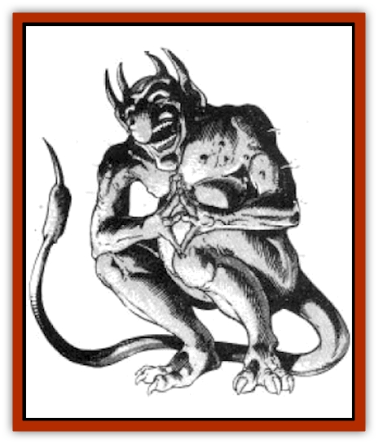

# Imp - Blood Sea

| Statistic | **Imp, Blood Sea** |
| --- | --- |
| **Activity Cycle:** | Night |
| **Alignment:** | Chaotic evil |
| **Armor Class:** | 4 or 1 (in mist form) |
| **Climate/Terrain:** | Tropical and subtropical ocean |
| **Damage/Attack:** | 1-6 or 1 |
| **Diet:** | Special |
| **Frequency:** | Very rare |
| **Hit Dice:** | 5+3 |
| **Intelligence:** | Very (11) |
| **Magic Resistance:** | See below |
| **Morale:** | Steady (11) |
| **Movement:** | 12, F124 (A), SW 6 |
| **No. Appearing:** | 10-40 |
| **No. of Attacks:** | 1 |
| **Organization:** | School |
| **Size:** | T (2' tall) |
| **Special Attacks:** | Nil |
| **Special Defenses:** | Hit only by magical weapons |
| **THAC0:** | 15 |
| **Treasure:** | E |
| **XP Value:** | 975 |

Blood Sea [[Imp|imps]], also known as vapor imps, are hateful, vicious creatures dwelling in tropical oceans They delight in tormenting all those who dare enter their waters.

A Blood Sea imp can freely *polymorph* between two forms (polymorphing from one form to the other takes a full turn). One form is that of a cloud of red mist; two blazing red eyes hover in the center of the cloud. The Imp's physical form is that of a bright red humanoid two feet tall with a protruding belly, clawed feet and hands, and a pointed tail. It has long ears, curved horns, and a huge nose that droops over a grinning mouth filled with tiny teeth. Its skin and eyes are bright red, and red mist continually oozes from the pores of its body. In both its physical and mist forms the Blood Sea imp continually cackles, screams, and groans. A Blood Sea imp can telepathically communicate with other Blood Sea imps, but it will not communicate with its intended victim.

**Combat:** When severe storms rock the sea at night, Blood Sea imps rise from the ocean floor to ambush passing ships. Sailors are first alerted to the presence of Blood Sea imps by the sounds of high-pitched screaming and cackling mingling with the shrieking winds. Those staring into the water notice the waves transforming into a mass of grinning faces, clawed hands, and sharp tails, all enveloped in a growing cloud of red mist. The imps begin to push the ship, causing it to pitch and shiver. During the next hour, the imps transform into their mist forms to overwhelm the ship.

When an imp is in its physical form, it attacks with a chilling touch that causes 1d6 points of damage (no saving throw), however, it cannot fly in this form and its AC is 4. In its mist form, it can fly, its AC is 1, and all attack rolls against it are made with a -2 penalty, however, it can take no physical actions (such as pushing a ship or throwing a sailor overboard) and opponents contacting it receive only 1 point of chilling damage. The imp much prefers its physical form when attacking, as it can cause much more mischief. Blood Sea imp attacks are always accompanied by nonstop screaming, cackling, and groaning.

When a ship is surrounded by red mist, the vaporous imps flow through doorways and ooze into portholes, then *polymorph* back to their physical forms. Small misty imps emerge from the vapor, swarming up the masts, jerking the rigging, and loosening cargo ropes. The imps always first attempt to disable the ship, then murder the crew. If any crew members interfere with the rampaging imps, the imps try to throw them down the hold, lock them in a cabin, or toss them overboard. Imps have a Strength of 4, and they can only move a character if the total Strength points of the attacking imps exceeds the character's Strength. The character is dragged one foot per round for every point that the imps' combined Strength exceeds the character's Strength.

Blood sea imps can only be attacked with magical weapons, other attacks pass harmlessly through them. Blood sea imps can not be turned, and they are unaffected by *sleep*, *charm*, or cold-based spells. They are likewise unaffected by paralysis or poisons.

If struck by a lightning bolt, either natural or magical, there is a 10% chance that the imp spontaneously generates a copy of itself; the copy appearing in its vaporous form.

**Habitat/Society:** As their name implies, Blood Sea imps reside primarily in the Blood Sea, but some also exist in other tropical and subtropical oceans. Schools of 10d4 imps live together in shallow lairs on the ocean floor; these lairs are lined with rotten vegetation and other debris. The imps sleep in their lairs all day long, emerging only at night to search for ships battered by ocean storms. Treasure items are also stored in their lairs: imps aren't interested in the value of treasure, but they keep various baubles as souvenirs from ships they have plundered.

**Ecology:** Blood Sea imps are oblivious to other sea life, though they fight fiercely it attacked. The imps do not eat, drink, or breathe. They are invigorated by exposing themselves to the thunder and lightning generated by an ocean storm.

---
## Discovery & Documentation

**Source Publication:** MC4 Dragonlance Appendix (w/binder #2) (1989)
**Campaign Setting:** Dragonlance
**Author(s):** Rick Swan

### Other Creatures Found in This Source Book
   * [[Anemone_Giant_Sea|Anemone, Giant Sea]]
   * [[Bear_Ice|Bear, Ice]]
   * [[Beast_Undead|Beast, Undead]]
   * [[Bird_Krynn|Bird (Krynn)]]
   * [[Disir|Disir]]
   * [[Draconian_Aurak|Draconian, Aurak]]
   * [[Draconian_Baaz|Draconian, Baaz]]
   * [[Draconian_Bozak|Draconian, Bozak]]
   * [[Draconian_Kapak|Draconian, Kapak]]
   * [[Draconian_General_Information|Draconian, General Information]]
   * [[Draconian_Sivak|Draconian, Sivak]]
   * [[Draconian_Proto-_Traag|Draconian, Proto-, Traag]]
   * [[Dragon_Amphi|Dragon, Amphi]]
   * [[Dragon_Astral|Dragon, Astral]]
   * [[Dragon_Kodragon|Dragon, Kodragon]]
   * [[Dragon_Krynn_Othlorx_General_Information|Dragon (Krynn), Othlorx, General Information]]
   * [[Dragon_Krynn_General_Information|Dragon (Krynn), General Information]]
   * [[Dragon_Sea|Dragon, Sea]]
   * [[Dreamshadow|Dreamshadow]]
   * [[Dreamwraith|Dreamwraith]]
   * [[Dwarf_Daergar|Dwarf, Daergar]]
   * [[Dwarf_Hill_Neidar|Dwarf, Hill, Neidar]]
   * [[Dwarf_Mountain_Hylar|Dwarf, Mountain, Hylar]]
   * [[Dwarf_Theiwar|Dwarf, Theiwar]]
   * [[Dwarf_Zakhar|Dwarf, Zakhar]]
   * [[Elf_Half-|Elf, Half-]]
   * [[Elf_High_Qualinesti|Elf, High, Qualinesti]]
   * [[Elf_High_Silvanesti|Elf, High, Silvanesti]]
   * [[Elf_Sea_Dargonesti|Elf, Sea, Dargonesti]]
   * [[Elf_Sea_Dimernesti|Elf, Sea, Dimernesti]]
   * [[Elf_Wild_Kagonesti|Elf, Wild, Kagonesti]]
   * [[Eyewing|Eyewing]]
   * [[Fetch|Fetch]]
   * [[Fire_Minion|Fire Minion]]
   * [[Fireshadow|Fireshadow]]
   * [[Gnome_Tinker|Gnome, Tinker]]
   * [[Gurik_Cha'ahl|Gurik Cha'ahl]]
   * [[Haunt_Knight|Haunt, Knight]]
   * [[Horax|Horax]]
   * [[Human_Krynn|Human (Krynn)]]
   * [[Kalothagh|Kalothagh]]
   * [[Kani_Doll|Kani Doll]]
   * [[Kender|Kender]]
   * [[Kyrie|Kyrie]]
   * [[Lizard_Man_Krynn|Lizard Man (Krynn)]]
   * [[Minotaur_Krynn|Minotaur, Krynn]]
   * [[Ogre_High|Ogre, High]]
   * [[Ogre_Krynn|Ogre (Krynn)]]
   * [[Phaethon|Phaethon]]
   * [[Saqualaminoi|Saqualaminoi]]
   * [[Shadowperson|Shadowperson]]
   * [[Shimmerweed|Shimmerweed]]
   * [[Skrit|Skrit]]
   * [[Spectral_Minion|Spectral Minion]]
   * [[Spider_Krynn|Spider (Krynn)]]
   * [[Stag|Stag]]
   * [[Tayling|Tayling]]
   * [[Thanoi|Thanoi]]
   * [[Tylor|Tylor]]
   * [[Wichtlin|Wichtlin]]
   * [[Wyndlass|Wyndlass]]
   * [[Yaggol|Yaggol]]
