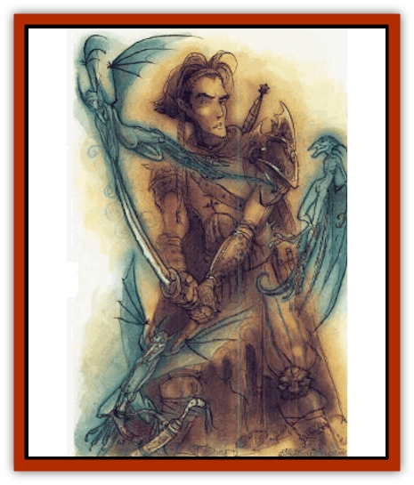

# Imp - Chaos

| Statistic | **Imp, Chaos** |
| --- | --- |
| **Activity Cycle:** | Any |
| **Alignment:** | Chaotic neutral |
| **Armor Class:** | 3 |
| **Climate/Terrain:** | Limbo or any |
| **Damage/Attack:** | Nil |
| **Diet:** | Unknown |
| **Frequency:** | Rare |
| **Hit Dice:** | 3 |
| **Intelligence:** | Average (8-10) |
| **Magic Resistance:** | Nil |
| **Morale:** | Fearless (19) |
| **Movement:** | 12 |
| **No. Appearing:** | 2-12 |
| **No. of Attacks:** | 1 |
| **Organization:** | Swarm |
| **Size:** | T (2' tall) |
| **Special Attacks:** | Chaos |
| **Special Defenses:** | Nil |
| **THAC0:** | 17 |
| **Treasure:** | Nil |
| **XP Value:** | 175 |

Chaos [[Imp|imps]] are small, perverse creatures, native to the wild and turbulent forces of Limbo. They are rarely more than two feet tall and monkeylike in proportion. Beyond this, little is consistent in the appearance of these creatures. Their noses and ears are huge or small, sometimes lop-sided on the same imp. Face and expression change with the creature's fancy. Over time, travelers have confused them with [[Mite|mites]], mephits, [[Gremlin|gremlins]], and a host of other equally small and pestiferous creatures. The only sure identification comes too late, after the imps have wrought their harm.

**Combat:** Combat seems hardly a fair description when a nest of chaos imps attack. Chaos imps are hardly interested in their opponents at all. The imps don't want to fight; they only want to infest an individual's gear. Chaos imps can meld with nonliving objects so that imp and object are one. This power works only on non-Limbo matter and only on inanimate objects. Objects imbued with an intelligence or a spirit, such as an intelligent sword or an [[Golem_I_Greater_Golem|iron golem]], cannot be infested. A tree formed from the primordial soup of Limbo by a character's will can't be infested by a chaos imp; a plain sword +1 from elsewhere can. Chaos imps naturally sense the differences between materials, always choosing stable matter over unstable.

As a matter of taste, the imps prefer substantial objects - swords, shields, pots, spikes, and armor - over flimsier articles such as clothing, cloaks, boots, and scrolls. They are always drawn to magical items, however, and seek to meld with these in preference to other things.

To infest a nonmagical object, the imp needs only touch it for one round. Magical items have a saving throw of 14, improved by one for every +1 or additional power the item has. At the end of the round the imp is absorbed into the item, its essence flowing like water into it. The merging causes no change in the physical properties of the item: mass, shape, density, and function all remain the same. Even the magical power of an item remains unchanged. Infested items don't radiate magic (unless already magical) and behave no differently as long as the item remains in Limbo. Only when a chaos imp believes it is off the plane will the creature reveal itself.

Whenever possible chaos imps attack by stealth, slipping into objects when the characters are distracted by other things. If forced or discovered, they make a direct attack. They have no ability to physically harm a character, but fighting them is still difficult and dangerous. Normally if forced to fight, the whole lot of them swarms a single character, one attempting to distract while the others complete their infestation. Even battling an imp is risky, since any blow may allow the imp to infest the character's weapon. Since the contact is fleeting, the item is allowed a base saving throw of 10 to avoid the effect.

The chaos imp has the power to transform its host on a whim. For all practical purposes, the character is actually carrying a little bit of Limbo's chaos-stuff with him. When a fighter reaches for his sword he might draw an empty snakeskin or a bowl of pudding. Transformed objects are roughly the same mass, but that is the only limitation. Unless the character maintains mental control over the object's form (the same as he would over Limbo), it unexpectedly transforms. The imp can also speak from within the item.

There are two ways to get rid of a chaos imp. The first is to destroy the item; this causes the imp to flee. For example, drinking an infested potion would cause the imp to suddenly spring from the bottle. The second is to cast an *abjure*, *animate object*, *banishment*, or *dismissal* on each object. This forces the imp from the item, although it instantly attempts to merge with the nearest object. A *dispel magic* forces out all imps within the spell's area of effect in addition to its normal operation. Once "de-imped", characters should run. Distance is the best protection.

**Habitat/Society:** Chaos imps on Limbo are always encountered in nests - these are nothing more than inert bubbles. Only when a host comes with range do the imps actually take form and attack. Chaos imps don't reproduce by any known means; it is quite likely that they spontaneously appear throughout the plane. Off Limbo, the imps eventually dissipate if driven from their host and bereft of any other object to inhabit.

Chaos imps are mischievous and clever, and appear to have two main goals. The first is to escape their plane, but they can leave Limbo only within an object. Thus, they lie dormant in infested items until they believe they are off Limbo. Experienced Limbo travelers try to trick infesting imps into revealing themselves by pretending to be off the plane. The image of another plane must be imposed on Limbo (requiring a check to impose one's will). The DM then secretly makes another check (again using the character's skill) to see if the image is convincing to the imps. If it is passed, the imps reveal themselves in 3d6 turns. Otherwise, they are not fooled by the attempt.

Second, as befits their origin, they delight in creating chaos and confusion at every chance. It is quite probable that they are carrying out the will of the powers of Limbo in spreading the dominion of chaos.

**Ecology:** As impractical as these creatures are, there are those who find a use for them. Certain planar factions (particularly the Anarchists and the Xaositects), various fiends, and tricksters enjoy bestowing infested "gifts" on their enemies.

---
## Discovery & Documentation

**Source Publication:** Monstrous Compendium, 1996 Annual, Volume 3 (1995)
**Campaign Setting:** Advanced Dungeons & Dragons 2nd Edition
**Author(s):** Jon Pickens

### Other Creatures Found in This Source Book
   * [[Alaghi|Alaghi]]
   * [[Alhoon|Alhoon]]
   * [[Aranea_Savage_Coast|Aranea (Savage Coast)]]
   * [[Arcane_Head|Arcane Head]]
   * [[Banedead|Banedead]]
   * [[Banelich|Banelich]]
   * [[Bat_Bonebat|Bat, Bonebat]]
   * [[Beetle|Beetle]]
   * [[Belgoi|Belgoi]]
   * [[Bladeling|Bladeling]]
   * [[Braxat|Braxat]]
   * [[Bunyip|Bunyip]]
   * [[Burbur|Burbur]]
   * [[Bvanen|Bvanen]]
   * [[Cat_Great_Snow_Tiger|Cat, Great, Snow Tiger]]
   * [[Chosen_One|Chosen One]]
   * [[Chronovoid|Chronovoid]]
   * [[Cildabrin|Cildabrin]]
   * [[Coffer_Corpse|Coffer Corpse]]
   * [[Disenchanter|Disenchanter]]
   * [[Dog_Temporal|Dog, Temporal]]
   * [[Dragon_Cerilia|Dragon (Cerilia)]]
   * [[Dragon_Ghost|Dragon, Ghost]]
   * [[Dragon_Lesser_Undead|Dragon, Lesser Undead]]
   * [[Dragon_Neutral_Amber|Dragon, Neutral, Amber]]
   * [[Dread_Warrior|Dread Warrior]]
   * [[Dreamweaver|Dreamweaver]]
   * [[Dream_Spawn_Greater_Ennui|Dream Spawn, Greater, Ennui]]
   * [[Dream_Spawn_Lesser_Morph|Dream Spawn, Lesser, Morph]]
   * [[Dwarf_Arctic|Dwarf, Arctic]]
   * [[Dwarf_Urdunnir|Dwarf, Urdunnir]]
   * [[Eel_Giant_Moray|Eel, Giant Moray]]
   * [[Elemental_Fire_Kin_Tome_Guardian|Elemental, Fire Kin, Tome Guardian]]
   * [[Elf_Rockseer|Elf, Rockseer]]
   * [[Ethyk|Ethyk]]
   * [[Faerie_Faerie_Fiddler|Faerie, Faerie Fiddler]]
   * [[Faerie_Petty_Bramble|Faerie, Petty, Bramble]]
   * [[Faerie_Petty_Gorse|Faerie, Petty, Gorse]]
   * [[Faerie_Petty|Faerie, Petty]]
   * [[Firenewt|Firenewt]]
   * [[Formian|Formian]]
   * [[Gargoyle_II|Gargoyle II]]
   * [[Giant_Cerilia|Giant (Cerilia)]]
   * [[Goblin_Cerilia|Goblin (Cerilia)]]
   * [[Golem_Magic|Golem, Magic]]
   * [[Golem_Shaboath|Golem, Shaboath]]
   * [[Hag_Bheur|Hag, Bheur]]
   * [[Hamadryad|Hamadryad]]
   * [[Hound_of_Ill-Omen|Hound of Ill-Omen]]
   * [[Human_Cerilia|Human (Cerilia)]]
   * [[Hybsil|Hybsil]]
   * [[Ibrandlin|Ibrandlin]]
   * [[Ixitxachitl_Ixzan|Ixitxachitl, Ixzan]]
   * [[Jabberwock|Jabberwock]]
   * [[Kyton|Kyton]]
   * [[Kyuss_Son_of|Kyuss, Son of]]
   * [[Lillend|Lillend]]
   * [[Life-Shaped_Creation_Guardian|Life-Shaped Creation, Guardian]]
   * [[Life-Shaped_Creation_Transport|Life-Shaped Creation, Transport]]
   * [[Lycanthrope_Werecrocodile|Lycanthrope, Werecrocodile]]
   * [[Lycanthrope_Werespider|Lycanthrope, Werespider]]
   * [[Magedoom|Magedoom]]
   * [[Manotaur|Manotaur]]
   * [[Mastiff_Shadow|Mastiff, Shadow]]
   * [[Meazel|Meazel]]
   * [[Mist_Scarlet_Dancer|Mist, Scarlet Dancer]]
   * [[Needleman|Needleman]]
   * [[Orc_Neo-Orog|Orc, Neo-Orog]]
   * [[Orc_Ondonti|Orc, Ondonti]]
   * [[Owlbear_II|Owlbear II]]
   * [[Pegataur|Pegataur]]
   * [[Phaerimm|Phaerimm]]
   * [[Reggelid|Reggelid]]
   * [[Render|Render]]
   * [[Saurial|Saurial]]
   * [[Scalamagdrion|Scalamagdrion]]
   * [[Sharn|Sharn]]
   * [[Snake_Messenger|Snake, Messenger]]
   * [[Spirit_Forest_Uthraki|Spirit, Forest, Uthraki]]
   * [[Spirit_Forest_Wood_Man|Spirit, Forest, Wood Man]]
   * [[Spirit_Ice_Orglash|Spirit, Ice, Orglash]]
   * [[Spirit_Rock_Thomil|Spirit, Rock, Thomil]]
   * [[Strider_Giant|Strider, Giant]]
   * [[Tembo|Tembo]]
   * [[Temporal_Glider|Temporal Glider]]
   * [[Temporal_Stalker|Temporal Stalker]]
   * [[Tether_Beast|Tether Beast]]
   * [[Thessalmonster|Thessalmonster]]
   * [[Time_Dimensional|Time Dimensional]]
   * [[Tomb_Tapper|Tomb Tapper]]
   * [[Undead_Dragon_Slayer|Undead Dragon Slayer]]
   * [[Unicorn_Black_Toril|Unicorn, Black (Toril)]]
   * [[Vaath|Vaath]]
   * [[Vortex_Spider|Vortex Spider]]
   * [[Weredragon|Weredragon]]
   * [[Zhentarim_Spirit|Zhentarim Spirit]]
