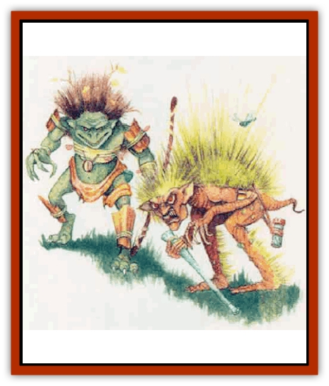
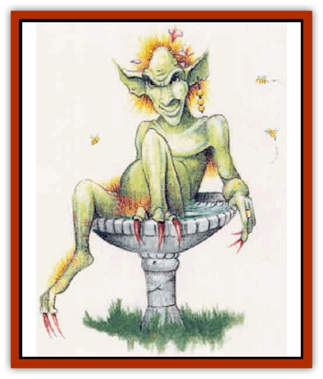

# Imp - Mystara

| Statistic | **Bog** | **Garden** | **Wood** |
| --- | --- | --- | --- |
| **Activity Cycle:** | Night | Night | Night |
| **Alignment:** | Chaotic evil | Chaotic neutral | Chaotic evil |
| **Armor Class:** | 7 (10) | 8 (10) | 6 (10) |
| **Climate/Terrain:** | Any swamp | Any garden | Temperate forest |
| **Damage/Attack:** | 1d3 (claw)/1d3 (claw) or 1d2 (darts) | 1d3 (bite) | 1d3 (bite) or 1d4 (arrow)/1d4 (arrow) |
| **Diet:** | Carnivore | Omnivore | Carnivore |
| **Frequency:** | Rare | Very rare | Rare |
| **Hit Dice:** | 1-1 | 1 | 1-6 hp |
| **Intelligence:** | Average (8-10) | Very (11-12) | Average (8-10) |
| **Magic Resistance:** | Nil | Nil | Nil |
| **Morale:** | Steady (11) | Elite (13) | Steady (11) |
| **Movement:** | 9 | 9 | 9 |
| **No. Appearing:** | 2d6 | 1 | 1d8 |
| **No. of Attacks:** | 2 or 1 | 1 | 1 or 2 |
| **Organization:** | Tribe | Solitary | Tribe |
| **Size:** | T (2' tall) | S (2½' tall) | T (1½-2' tall) |
| **Special Attacks:** | Poison, surprise, snares | Summon insects | Poison, surprise, snares |
| **Special Defenses:** | Camouflage | Nil | Nil |
| **THAC0:** | 20 | 19 | 20 |
| **Treasure:** | O (A) | R | S (C,N) |
| **XP Value:** | 120 | 120 | 65 / Leader: 120 / Chief: 175 / Shaman: 270 |

[[Imp|Imps]] are nasty, diminutive creatures that roam the world causing mischief to all they meet. Three forms of imp inhabit the wilds of Mystara: the wood, bog, and garden imp.

## 

Wood Imp

Wood imps are small, evil humanoids that live in dark forests. These green-skinned creatures stand 1 to 2' tall and always seem to have numerous twigs and leaves tangled in their wild, wood-brown hair. Their little faces are quite round, each bearing a gaping slit of a mouth filled with needle-teeth. Wood imps normally dress themselves in stolen scarves and strips of bark.

**Combat:** Wood imps hate to enter battle head-on, instead relying most often on guile and trickery. Because of this imp's protective coloration, opponents suffer a -2 penalty to their surprise rolls.

The creature's bite causes 1d3 points of damage and often leaves a lingering - although nondamaging - rash. The creatures rarely use this attack, however. Instead, they lay ambushes near traps they have set - usually they favor concealed pits and snares. Victims who fail a saving throw vs. paralyzation (with a -2 penalty) find themselves caught in a trap; the imps then either capture them or slay them with poisoned arrows (see below).

As well as laying ambushes, wood imps also actively hunt those foolish enough to enter their territory, driving the intruders straight into their traps. When hunting, wood imps ride large [[Spider|spiders]]. Their specia1 saddles allow them to stay mounted even while the spiders cling to the undersides of tree branches.

Wood imps most often attack with short bows, which they can fire even when upside-down. The arrows inflict 1d4 points of damage; an imp can fire two shots per round. It might choose to spend a round coating an arrowhead in spider venom it retrieves from its mount. Characters the arrows hit must make a saving throw vs. poison with a +2 bonus; those who fail become sluggish for 2d4+2 rounds. Sluggish creatures roll for initiative with a penalty of +3 and move at half speed until the effect wears off. The nonfatal poison has no cumulative effect. If the arrows are not fired the round after they are coated in venom, the poison evaporates and must be reapplied.

If forced to enter melee, wood imps drop out of the trees still astride their spiders and attack opponents with their small two-handed swords (damage 1d6), while the spiders attack with their bites.

**Habitat/Society:** These tribal, petty creatures get along well only with their large spiders - occasionally with each other, too. For every 10 wood imps, there lives one leader with 1-1 HD. However, these leaders rarely wield much control over their people, often resorting to violence or bribery to get a group to act in concert. An entire tribe follows a chief with 1 HD. If these chiefs are slain, wood imp morale drops to 7. Fifty percent of tribes also have 1d4 shamans (priests of 1st to 4th level).

**Ecology:** Wood imps keep their prisoners and fresh food in lairs among old and rotted trees. The captives usually consist of 2d6 creatures varying from small humanoids (like [[Kobold|kobolds]]) and humans to forest creatures.

## Bog Imp

Bog imps, cousins of the wood imps, live only in the deepest swamps and fens and have adapted well to their wet surroundings.

These wizened creatures have dark, gnarled skin, wide mouths, and slightly protruding eyes. Their grasslike hair grows from the top of their matted, greasy heads clear down the backs of their legs. A bog imp has long, dexterous fingers and can sound a cry akin to that of a puppy.

**Combat:** As with their woodland cousins, bog imps avoid direct combat. They hide very effectively in their natural environment, curling into small "grass-covered hummocks". They become effectively invisible to the eye (although not to infravision), but remain vulnerable to trackers that can scent them. Their camouflage causes opponents to suffer a -4 penalty to surprise rolls.

When forced to attack head-on, the creatures tear at their enemies with their sharp claws (1d3 points of damage each), aiming for very vulnerable areas such as the nose and eyes.

Normally, however, bog imps attack by luring their victims to the edge of a standing pool or fen, beside which they have laid snares. The creatures are adept with these snares; an opponent can avoid them with a successful saving throw vs. paralyzation, modified by a -2 penalty due to the imps' skill. The creatures attempt to pull ensnared victims underwater in hopes of drowning them; those caught in one of these snares must make a successful saving throw vs. paralyzation or lose their footing and fall into the water, where more imps wait with weighted ropes and nets to hold them under. Once underwater, victims can drown, as explained in the swimming rules in the *Player's Handbook*. A successful bend bars roll allows a character in the water to break away from the creatures unaided.

Bog imps also enjoy firing darts from reed blowpipes at intruders. These darts cause 1d2 points of damage and are coated with a poison that causes weakness (as the spell of the same name). Victims who fail a saving throw vs. poison lose 1 point of Strength for 1d6+1 turns. Effects of the poison are cumulative.

**Habitat/Society:** Bog imps make their homes in caves or underhollowed logs in fetid swamps and fens. Their lairs always lie near the stagnant pools of water they use with their snares. They seem less organized than wood imps and have no leaders per se. Instead, the creatures solve internal quarrels by fighting (usually attempting to drown one another) until either they reach a resolution of some sort or a more interesting activity comes along. Bog imps hate other humanoids and love to catch and kill them in their snares.

**Ecology:** The waters surrounding the lairs of a bog imp tribe often contain a great deal of treasure, the belongings of the imps' past victims.

## 

Garden Imp

Garden imps, though not quite as nasty as either of their previously described relations, still can prove utterly selfish, dangerous creatures. These mottled, greenish-brown imps usually stand 2½' tall and have pointed faces with large brown eyes and elflike ears. Strange, lilylike flowers often grow in a garden imp's soft brown hair in the spring and summer months.

**Combat:** Garden imps, as with others of their kind, prefer to attack with guile. Each of these imps knows its particular garden intimately and prepares a variety of traps, pits, and snares to which it can lead annoying visitors. One favorite trick of this monster involves leading the victim to the top of a small rise, under which the imp has hollowed out a pit. The victim must make a successful saving throw vs. paralyzation (with a -4 penalty) or suffer 1d6 points of damage from a fall into the pit of thorny bushes the imp has placed in the pit beneath the rise.

These imps also can attack using swarms of tiny insects that obey their commands. Such swarms have the same characteristics as those created by the 3rd-level priest spell *summon insects*. Finally, garden imps can bite opponents, inflicting 1d3 points of damage.

**Habitat/Society:** These solitary creatures prefer to live in lush gardens that have been either abandoned or allowed to grow somewhat wild. An imp will keep watch oyer any dwelling attached to its garden. It normally treats the owners of such a home normally fairly, only bothering them if they attempt to drive it out or change its garden.

**Ecology:** The flowers from the hair of a garden imp can be used in the creation of a *potion of vitality*.

---
## Discovery & Documentation

**Source Publication:** Mystara Appendix (1994)
**Campaign Setting:** Mystara
**Author(s):** John Nephew, Teeuwynn Woodruff, John Terra, Skip Williams

### Other Creatures Found in This Source Book
   * [[Actaeon|Actaeon]]
   * [[Agarat|Agarat]]
   * [[Ash_Crawler|Ash Crawler]]
   * [[Baldandar|Baldandar]]
   * [[Bargda|Bargda]]
   * [[Bhut|Bhut]]
   * [[Bird_Mystara|Bird (Mystara)]]
   * [[Blackball|Blackball]]
   * [[Choker|Choker]]
   * [[Coltpixie|Coltpixie]]
   * [[Crone_of_Chaos|Crone of Chaos]]
   * [[Darkhood|Darkhood]]
   * [[Darkwing|Darkwing]]
   * [[Decapus|Decapus]]
   * [[Deep_Glaurant|Deep Glaurant]]
   * [[Diabolus|Diabolus]]
   * [[Dimensional_Warper|Dimensional Warper]]
   * [[Dragon_Mystara_Crystalline|Dragon (Mystara), Crystalline]]
   * [[Dragon_Mystara_Jade|Dragon (Mystara), Jade]]
   * [[Dragon_Mystara_Onyx|Dragon (Mystara), Onyx]]
   * [[Dragon_Mystara_Ruby|Dragon (Mystara), Ruby]]
   * [[Drake_Mystara|Drake (Mystara)]]
   * [[Dragonfly|Dragonfly]]
   * [[Dusanu|Dusanu]]
   * [[Elemental_of_Chaos_Air_Earth|Elemental of Chaos, Air/Earth]]
   * [[Elemental_of_Chaos_Fire_Water|Elemental of Chaos, Fire/Water]]
   * [[Elemental_of_Law_Air_Earth|Elemental of Law, Air/Earth]]
   * [[Elemental_of_Law_Fire_Water|Elemental of Law, Fire/Water]]
   * [[Familiar_Mystara|Familiar (Mystara)]]
   * [[Frost_Salamander|Frost Salamander]]
   * [[Fundamental_Air_Earth|Fundamental, Air/Earth]]
   * [[Fundamental_Fire_Water|Fundamental, Fire/Water]]
   * [[Gargantua_Mystara|Gargantua (Mystara)]]
   * [[Geonid|Geonid]]
   * [[Ghostly_Horde|Ghostly Horde]]
   * [[Giant_Athach|Giant, Athach]]
   * [[Giant_Hephaeston|Giant, Hephaeston]]
   * [[Golem_Drolem|Golem, Drolem]]
   * [[Golem_Mystara_I|Golem (Mystara) I]]
   * [[Golem_Mystara_II|Golem (Mystara) II]]
   * [[Golem_Mystara_III|Golem (Mystara) III]]
   * [[Gray_Philosopher|Gray Philosopher]]
   * [[Guardian_Warrior|Guardian Warrior]]
   * [[Gyerian|Gyerian]]
   * [[Herex|Herex]]
   * [[Hivebrood|Hivebrood]]
   * [[Horde|Horde]]
   * [[Hsiao|Hsiao]]
   * [[Huptzeen|Huptzeen]]
   * [[Hutaakan|Hutaakan]]
   * [[Jellyfish_Giant_Mystara|Jellyfish, Giant (Mystara)]]
   * [[Kna|Kna]]
   * [[Kopru|Kopru]]
   * [[Lizard_Mystara|Lizard (Mystara)]]
   * [[Lizard-kin_Mystara|Lizard-kin (Mystara)]]
   * [[Lupin|Lupin]]
   * [[Lycanthrope_Werejaguar_Mystara|Lycanthrope, Werejaguar (Mystara)]]
   * [[Lycanthrope_Wereswine|Lycanthrope, Wereswine]]
   * [[Magen|Magen]]
   * [[Manikin|Manikin]]
   * [[Mek|Mek]]
   * [[Mujina|Mujina]]
   * [[Nagpa|Nagpa]]
   * [[Neh-thalggu|Neh-thalggu]]
   * [[Nightshade_Mystara|Nightshade (Mystara)]]
   * [[Nuckalavee|Nuckalavee]]
   * [[Pegataur|Pegataur]]
   * [[Phanaton|Phanaton]]
   * [[Plant_Dangerous_Mystara|Plant, Dangerous (Mystara)]]
   * [[Plasm|Plasm]]
   * [[Rakasta|Rakasta]]
   * [[Rock_Man|Rock Man]]
   * [[Sabreclaw|Sabreclaw]]
   * [[Sacrol|Sacrol]]
   * [[Scamille|Scamille]]
   * [[Shapeshifter|Shapeshifter]]
   * [[Shargugh|Shargugh]]
   * [[Shark-kin|Shark-kin]]
   * [[Sollux|Sollux]]
   * [[Spectral_Death|Spectral Death]]
   * [[Spectral_Hound|Spectral Hound]]
   * [[Spider-kin|Spider-kin]]
   * [[Spirit_Mystara|Spirit (Mystara)]]
   * [[Statue_Living|Statue, Living]]
   * [[Surtaki|Surtaki]]
   * [[Tabi|Tabi]]
   * [[Thoul|Thoul]]
   * [[Thunderhead|Thunderhead]]
   * [[Tiger_Ebon|Tiger, Ebon]]
   * [[Topi|Topi]]
   * [[Tortle|Tortle]]
   * [[Vampire_Velya|Vampire, Velya]]
   * [[White_Fang|White Fang]]
   * [[Worm_Mystara|Worm (Mystara)]]
   * [[Wyrd|Wyrd]]
   * [[Yowler|Yowler]]
   * [[Zombie_Lightning|Zombie, Lightning]]
