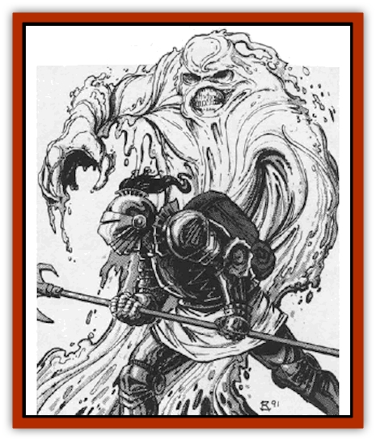

# Impersonator

| Statistic | **Impersonator** |
| --- | --- |
| **Activity Cycle:** | Any |
| **Alignment:** | Neutral evil |
| **Armor Class:** | 8 |
| **Climate/Terrain:** | Any wetlands or subterranean |
| **Damage/Attack:** | 1d4 |
| **Diet:** | Blood |
| **Frequency:** | Rare |
| **Hit Dice:** | 5+2 |
| **Intelligence:** | Semi- (2-4) |
| **Magic Resistance:** | Nil |
| **Morale:** | Average (8-10) |
| **Movement:** | 3 |
| **No. Appearing:** | 1 |
| **No. of Attacks:** | 1 |
| **Organization:** | Solitary |
| **Size:** | S (4' diameter) |
| **Special Attacks:** | See below |
| **Special Defenses:** | See below |
| **THAC0:** | 15 |
| **Treasure:** | Varies |
| **XP Value:** | 13,000 |

The impersonator is strange form of life that lurks in swamps, wetlands, and caverns, waiting for its chance to drain the blood from a living creature.

In its natural form, an impersonator appears to be nothing more than a pool of thick, stagnant water. In actuality, it is far more dense than water and its body has the consistency of thick oil. When the creature decides to attack, however, it assumes the form of one of its past victims.

In their natural forms, there is no evidence that these creatures can communicate with each other or with outsiders in any way. In they assume the form of another being, however, they can employ any means of communication utilized by their former victims.

**Combat:** An impersonator usually uses its power of *replication* to assume a form that will make it welcome among others. It then lures one or more individuals into a situation where they feel safe and are either helpless or asleep. It then returns to its true form and attacks them. While the impersonator can engage in battle while in its assumed form, it is loathe to do so. For one thing, damage inflicted on its victims in this state means less blood to be consumed later. In addition, the assumed form has only the statistics of the impersonator. Thus, while it may appear to be a powerful knight in field plate, it is actually only a 5 HD monster with AC 8. Any attack from the impersonator in its assumed form inflicts 1d4 points of damage. The impersonator does not gain any of its form's special abilities (like infravision or magical spells), although it does have access to all of the knowledge that its new form possessed.

The impersonator feeds by drawing blood out of its victims. However, the process it uses to do this is quite slow and, therefore, the creature must first immobilize its prey. This is accomplished by physical contact with its natural form. Anyone who touches the impersonator while it is in its true form must save vs. poison (with a +4 bonus to their roll) or become unable to move. The effect of this toxin wears off 1d4 rounds after contact with the creature is terminated.

While its victim is helpless, however, the impersonator flows over them, and begins to siphon off their blood. Each round, the victim will suffer 1d4 points of damage. Although the blood drain itself is painless, the victim eventually begins to feel a bone-numbing cold as they draw nearer and nearer to death.

Impersonators seldom have the chance to attack in their natural forms, so they use their special ability of replication to lure victims near. This power allows an impersonator to assume the form of any creature whose blood it has tasted. It takes one round to assume the new form; but once this is done, it can remain in that state for 1 turn (10 minutes) per point of damage it inflicted on that particular victim. Thus, if it had drained 50 hit points from a 9th level fighter it could assume the form of that fighter for 50 turns (8.3 hours) before it reverts to its natural form. The impersonator can abandon its disguise at any time by spending 1 round to melt back into its true state. Once an impersonator has assumed a specific form, it cannot do so again until it feeds on that victim again. However, the typical impersonator will have from 3-12 (3d4) forms available to it at any given time, and the order in which it fed upon victims has no bearing on the order in which it assumes their forms.

**Habitat/Society:** The impersonator has an unusually evil and cunning nature. While it is not truly sentient, it has a natural ability to sense what forms a group of near-by individuals might find pleasing from those available to it. Thus, it never appears before a band of elves in the form of a growling orc.

Once the impersonator has located a rich feeding ground (say, near a small village) it will attempt to attack and kill an unsuspecting member of that community. Then, using the form it has just acquired, it will move into that group and begin to seek new prey. By constantly assuming new forms as it feeds, it is often able to stay one step ahead of those who would kill it, leaving a trail of pale, bloodless bodies behind.

**Ecology:** The origins of the impersonator are unknown. If it is a natural creature, which most sages doubt, then it is possibly a relative of the [[Mimic|mimic]]. The majority of scholars, however, believe that the impersonator is either a creature from the lower planes or the result of twisted magical experiments.

---
## Discovery & Documentation

**Source Publication:** MC10 Ravenloft Appendix I (1989)
**Campaign Setting:** Planescape
**Author(s):** William W. Connors

### Other Creatures Found in This Source Book
   * [[Bastellus|Bastellus]]
   * [[Bat_Ravenloft|Bat (Ravenloft)]]
   * [[Bowlyn|Bowlyn]]
   * [[Broken_One|Broken One]]
   * [[Bussengeist|Bussengeist]]
   * [[Darkling|Darkling]]
   * [[Doom_Guard|Doom Guard]]
   * [[Doppelganger_Plant|Doppelganger Plant]]
   * [[Elemental_Ravenloft|Elemental (Ravenloft)]]
   * [[Ermordenung|Ermordenung]]
   * [[Ghoul_Lord|Ghoul Lord]]
   * [[Goblyn|Goblyn]]
   * [[Golem_III|Golem III]]
   * [[Golem_IV|Golem IV]]
   * [[Golem_Ravenloft|Golem (Ravenloft)]]
   * [[Grim_Reaper|Grim Reaper]]
   * [[Human_Abber_Nomad|Human, Abber Nomad]]
   * [[Human_Ravenloft|Human (Ravenloft)]]
   * [[Imp_Assassin|Imp, Assassin]]
   * [[Lycanthrope_Werebat|Lycanthrope, Werebat]]
   * [[Lycanthrope_Wereraven|Lycanthrope, Wereraven]]
   * [[Mist_Horror|Mist Horror]]
   * [[Mummy_Greater|Mummy, Greater]]
   * [[Quevari|Quevari]]
   * [[Quickwood|Quickwood]]
   * [[Ravenkin|Ravenkin]]
   * [[Reaver|Reaver]]
   * [[Scarecrow_Ravenloft|Scarecrow (Ravenloft)]]
   * [[Shadow_Fiend|Shadow Fiend]]
   * [[Skeleton_Giant|Skeleton, Giant]]
   * [[Strahd's_Skeletal_Steed|Strahd's Skeletal Steed]]
   * [[Treant_Evil|Treant, Evil]]
   * [[Treant_Undead|Treant, Undead]]
   * [[Valpurgeist|Valpurgeist]]
   * [[Vampire_Dwarf|Vampire, Dwarf]]
   * [[Vampire_Elf|Vampire, Elf]]
   * [[Vampire_Gnome|Vampire, Gnome]]
   * [[Vampire_Halfling|Vampire, Halfling]]
   * [[Vampire_General_Information|Vampire, General Information]]
   * [[Vampire_Kender|Vampire, Kender]]
   * [[Vampyre|Vampyre]]
   * [[Widow_Red|Widow, Red]]
   * [[Wolfwere_Greater|Wolfwere, Greater]]
   * [[Zombie_Lord|Zombie Lord]]
