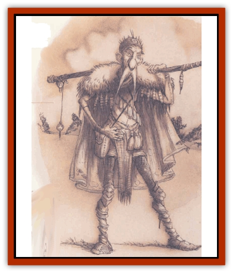

# Incantifer

| Statistic | **Incantifer** |
| --- | --- |
| **Activity Cycle:** | Any |
| **Alignment:** | Neutral (evil) |
| **Armor Class:** | 0 or better |
| **Climate/Terrain:** | Any |
| **Damage/Attack:** | By weapon |
| **Diet:** | Special |
| **Frequency:** | Very rare |
| **Hit Dice:** | 9d4+18 to 9d4+26 |
| **Intelligence:** | Supra-genius (19-20) |
| **Magic Resistance:** | 20% + 5% per level over 9th |
| **Morale:** | Average (8-10) |
| **Movement:** | 12 |
| **No. Appearing:** | 1 |
| **No. of Attacks:** | 1 |
| **Organization:** | Solitary |
| **Size:** | M (5-6' tall) |
| **Special Attacks:** | Spells |
| **Special Defenses:** | Absorption |
| **THAC0:** | 13 |
| **Treasure:** | R&times;3 and incidental |
| **XP Value:** | 13,000+ |

Centuries ago, a faction called the Incanterium schemed and maneuvered in the *kriegstanz* of Sigil�s factions. They were known as the Magicians or the Wanters; it's said they believed that the secret to everything was wizardly magic. Magic's powerful, the  Incanterium line went: so powerful that archmages change the rules of the worlds they deal with, so powerful that the gods themselves fear it. Any cutter with determination and savvy can make himself the high-up by learning all there is to know about magic. It's been done before, after all.

The Magicians spent their time and effort collecting every magical item, every scrap of magical lore they could lay their hand on. They collected it all in Sigil's Tower Sorcerous, a dark fortress of knowledge and ambition. The other factions'd try to use the Magicians by offering them magic in return for their help, or they'd scheme to steal a little of the Incanterium's knowledge back. In fact, there came a time when the Magicians were calling the tune, and the other factions were beginning to learn how to dance.

Then something happened. One day the folk of Sigil found that the Tower Sorcerous no longer stood over the skyline of the Clerk�s Ward. Rumors spread that the Lady had put 'em all in the Mazes, and the better Sigil was for it. Some cutters believed that maybe the Magicians had challenged the Lady and failed. Others thought that each of the other factions'd found a way to put the Incanterium in the dead-book. It didn't matter; in time, the Incanterium was forgotten.

But they're not as lost as everyone thinks.

From time to time, one of the members of this ancient sect shows up, still pursuing his unattainable goal of mastering all the magic of the multiverse. Without exception, they're self-centered, ambitious cutters of tremendous magical power. They're called incantifers now.

An incantifer looks human enough on the outside, but just like a tanner who'll never be able to get the smell of his work off his skin, an incantifer reeks of magic. It's changed and twisted him on the inside. Incantifers usually appear extremely old and frail; they've used life-extending magics to defeat death, but youth for its own sake doesn't interest them. After all, it's a simple trick to *appear* youthful when it's necessary. There are two giveaways for an incantifer: first, his or her eyes're orbs of blank, shining silver; secondly, the magical strength that courses through them provides uncanny grace and agility despite their decrepit appearance.

**Combat:** Incantifers spurn physical conflict, since magic's cleary the best way to deal with any foe. There's a spell for everything, if a cutter knows it. As a matter of last resort, an incantifer can make use of an effective Strength of 18/51, punching for 1d3+3 points of damage or striking with a magical staff or similar weapon. Generally an incantifer throws a punch or physical blow only to clear himself enough room to cast a spell or use a magical item.

Without exception, incantifers are powerful mages. A typical incantifer has the spell ability of a 9th- to 18th-level (d8+10) mage. Most incantifers are specialists: wild mages, transmuters, conjurers, and evokers are the most common varieties. The incantifer's Hit Dice are tied to its magic-use level - a 9th-level incantifer has 9d4+18 hit points, and higher level incantifers have an additional +1 hit point per level. A special warning to berks thinking of tangling with an incantifer: They've had lots of time to find spells a body's never even heard of.

Incantifers also carry numerous magical items of varying power and effects. Generally, an incantifer has 2 to 5 useful po-tions (*extra-healing*, *invisibility*, *gaseous form*, or *invulnerability* are common); 1 to 3 scrolls (*protection from undead*, *dragon breath*, or *petrification*); 1 to 2 rings (*mind shielding*, *protection*, *regeneration*, or *wizardry* are preferred); 1 to 3 wands; and 2 to 5 miscellaneous magical items. An incantifer's Armor Class is based on the level of magical protection he carries, coupled with a Dexterity of 18. For example, an incantifer with an *armor* spell in effect, a *cloak of displacement* (+2 to AC), and a *ring of protection +3* is effectively AC -3.

Incantifers're also likely to be protected by long-lasting spells such as *armor*, *stoneskin*, a permanent *protection from normal missiles* or permanent *detect invisibility*.

In a fight, incantifers prefer to expend memorized spells first, since they're a renewable resource; they're peery of wasting valuable one-use magical items unless it's absolutely necessary.

All in all, it might seem that an incantifer's no different from a well-prepared mage who's had time to get his defenses and spells set just right. But there's one vitally important difference that makes an incantifer far more dangerous than a mage of equal level - incantifers can absorb magic. Any time a spell, spell-like effect, or spell-projecting magical item is used on an incantifer, she absorbs the effect if she passes her magic resistance roll. This heals 1 hp of damage per spell level absorbed, and enables her to cast spells without removing them from her memory, just as a *rod of absorption* does. Even a *dispel magic*can be absorbed. The only magical effects that can't be assimilated are magical weapons or *antimagic* areas. If the incantifer fails her magic resistance roll, she's still entitled to any normal saving throws permitted by the spell.

The altered physiology of an incantifer frees him of the need to breathe and makes him immune to nonmagical extremes of temperature or environment.

**Habitat/Society:** The original survivors of the Incanterium are very rare creatures; only a handful still walk the planes. Their apprentices and servants are more common. Every so often, an incantifer will consent to teach a talented mage the secrets of his or her abilities and cast a series of transformation spells that create a new incantifer. These younglings are the lowest-level incantifers, ranging from 9th to 14th level.

Incantifers are exceedingly paranoid about their magical caches and never leave them unguarded. In fact, they carry as much of their stashes with them as they can. An incantifer on the move can be a humorous sight, with dozens of pouches, satchels, and packs hanging from his garments. (Important piece of advice, berk: Don't laugh.)

Most incantifers've forgotten how to deal with people and view any cutter they meet as a potential source of magic. If a body runs across one in a tavern, he'll likely find the incantifer to be brusque, inconsiderate, and condescending. Incantifers don't always try to take what they want by force, but few of 'em have any patience for extended haggling or insults.

Some interesting peels or cross-trades've got incantifers at the bottom of them. It's not too unusual for a sharp blood to be approached by an incantifer with a job offer. These jobs can be pretty dangerous, since they typically involve separating some rare and unusual piece of magic from its rightful owner, but incantifers can pay quite well.

**Ecology:** The transformations that make a mage into an incantifer change his life processes. Breathing, eating, sleeping - none of these things matter to incantifers anymore. The only thing they live for is the collection of magic. An incantifer must absorb spell levels equal to his own experience level every month, or he permanently loses a level. Draining a magical item provides 1 spell level per 500 XP value of the device. For example, a 16th-level incantifer has to consume 16 spell levels of magic or 8,000 XP of magical items, or any combination of the two, within one month's time or be permanently reduced to 15th level. Incantifers trapped in magic-dead areas have been known to starve.

---
## Discovery & Documentation

**Source Publication:** Planescape II (1996)
**Campaign Setting:** Planescape
**Author(s):** Rich Baker, Karen S. Boomgarden

### Other Creatures Found in This Source Book
   * [[Aasimar|Aasimar]]
   * [[Abrian|Abrian]]
   * [[Arcane|Arcane]]
   * [[Balaena|Balaena]]
   * [[Beholder-kin_Observer|Beholder-kin, Observer]]
   * [[Bloodthorn|Bloodthorn]]
   * [[Bonespear|Bonespear]]
   * [[Darkweaver|Darkweaver]]
   * [[Demarax|Demarax]]
   * [[Dhour|Dhour]]
   * [[Eater_of_Knowledge|Eater of Knowledge]]
   * [[Eladrin_Greater_Firre|Eladrin, Greater, Firre]]
   * [[Eladrin_Greater_Ghaele|Eladrin, Greater, Ghaele]]
   * [[Eladrin_Greater_Tulani|Eladrin, Greater, Tulani]]
   * [[Eladrin_Lesser_Bralani|Eladrin, Lesser, Bralani]]
   * [[Eladrin_Lesser_Coure|Eladrin, Lesser, Coure]]
   * [[Eladrin_Lesser_Noviere|Eladrin, Lesser, Noviere]]
   * [[Eladrin_Lesser_Shiere|Eladrin, Lesser, Shiere]]
   * [[Fhorge|Fhorge]]
   * [[Ghostlight|Ghostlight]]
   * [[Guardinal_Avoral|Guardinal, Avoral]]
   * [[Guardinal_Cervidal|Guardinal, Cervidal]]
   * [[Guardinal_General_Information|Guardinal, General Information]]
   * [[Guardinal_Equinal|Guardinal, Equinal]]
   * [[Guardinal_Leonal|Guardinal, Leonal]]
   * [[Guardinal_Lupinal|Guardinal, Lupinal]]
   * [[Guardinal_Ursinal|Guardinal, Ursinal]]
   * [[Hollyphant|Hollyphant]]
   * [[Ironmaw|Ironmaw]]
   * [[Keeper|Keeper]]
   * [[Khaasta|Khaasta]]
   * [[Leomarh|Leomarh]]
   * [[Monster_of_Legend|Monster of Legend]]
   * [[Mortai|Mortai]]
   * [[Noctral|Noctral]]
   * [[Quill|Quill]]
   * [[Razorvine|Razorvine]]
   * [[Reave|Reave]]
   * [[Retriever|Retriever]]
   * [[Rilmani_Abiorach|Rilmani, Abiorach]]
   * [[Rilmani_General_Information|Rilmani, General Information]]
   * [[Rilmani_Argenach|Rilmani, Argenach]]
   * [[Rilmani_Aurumach|Rilmani, Aurumach]]
   * [[Rilmani_Cuprilach|Rilmani, Cuprilach]]
   * [[Rilmani_Ferrumach|Rilmani, Ferrumach]]
   * [[Rilmani_Plumach|Rilmani, Plumach]]
   * [[Shadowdrake|Shadowdrake]]
   * [[Spellhaunt|Spellhaunt]]
   * [[Spider_Hook|Spider, Hook]]
   * [[Sunfly|Sunfly]]
   * [[Sword_Spirit|Sword Spirit]]
   * [[Tanar'ri_Lesser_Bulezau|Tanar'ri, Lesser, Bulezau]]
   * [[Tanar'ri_Lesser_Maurezhi|Tanar'ri, Lesser, Maurezhi]]
   * [[Tanar'ri_Lesser_Yochlol|Tanar'ri, Lesser, Yochlol]]
   * [[Tanar'ri_General_Information|Tanar'ri, General Information]]
   * [[Tanar'ri_True_Alkilith|Tanar'ri, True, Alkilith]]
   * [[Terlen|Terlen]]
   * [[Tso|Tso]]
   * [[T'uen-rin|T'uen-rin]]
   * [[Vaporighu|Vaporighu]]
   * [[Vorr|Vorr]]
   * [[Wastrel|Wastrel]]
   * [[Wraithworm|Wraithworm]]
   * [[Yugoloth_Lesser_Canoloth|Yugoloth, Lesser, Canoloth]]
   * [[Zoveri|Zoveri]]
