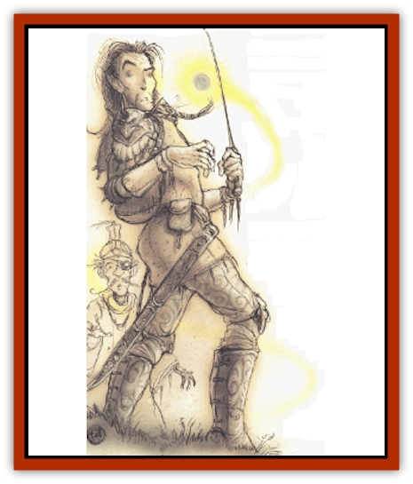

# Incarnate

| Statistic | **Incarnate** |
| --- | --- |
| **Activity Cycle:** | Any |
| **Alignment:** | See below |
| **Armor Class:** | 0 |
| **Climate/Terrain:** | Any plane |
| **Damage/Attack:** | See below |
| **Diet:** | See below |
| **Frequency:** | Very rare |
| **Hit Dice:** | 10 (4) |
| **Intelligence:** | Exceptional (15-16) |
| **Magic Resistance:** | Nil |
| **Morale:** | Champion (15-16) |
| **Movement:** | Fl 18 (A) |
| **No. Appearing:** | 1 |
| **No. of Attacks:** | 1 |
| **Organization:** | Solitary |
| **Size:** | T (1� diameter) |
| **Special Attacks:** | See below |
| **Special Defenses:** | See below |
| **THAC0:** | 11 (17) |
| **Treasure:** | Nil |
| **XP Value:** | 5,000 (650) |

(Information is for major incarnates; statistics of minor incarnates appear in parentheses.)

Incarnates are sapient embodiments of the pure energy of abstract principles. For instance, an evil incarnate is formed of pure living evil energy, and a courage incarnate is the living energy of pure courage. An incarnate is completely invisible. If magically viewed by spell or device, it appears as a multicolored ball of light. Incarnates inhabit many of the Outer Planes, primarily the upper and lower. They gravitate toward planes and planar layers that suit their individual alignments and temperaments. Incarnates are divided into major and minor types. The major classification holds only two: good incarnates and evil incarnates. The 14 minor incarnates are divided into good and evil groups. The good-aligned minor incarnates are charity, courage, hope, faith, justice, temperance, and wisdom. The evil-aligned minor incarnates are anger, covetousness. envy, gluttony, lust, pride and sloth.

**Combat:** Incarnates are attracted to energy sources similar to their own subtance - good incarnates to sources of goodness, anger incarnates to anger in a creature, the courageous attract courage incarates, etc. Incarnates attack and attempt to take over a victim (called the host) in order to feed on that energy.

The touch of an incarnate drains 2 points of Constitution per hit. The host suffers not only the penalties of lowered Constitution, but also feels an increasing weakness in mind and body. If the host's Constitution reaches zero, the incarnate can take over the host's body. The host receives a system shock roll (based on original Constitution); if the roll is made, the incarnate cannot take over the host. The host's Constitution immediately returns to normal if incarnate takes over, or if the system-shock roll is successful. In addition, if the incarnate ceases the attack for any reason (killed, captured, driven off, etc.) before it takes over the host, the victim's Constitution returns to normal at the rate of 2 points per turn. (Monsters without Constitution scores can he assumed to have a default value of 12.)

Once in control, the incarnate can use the host body as it desires. The incarnate and host can communicate through a telepathic link established when it takes over. The incarnate can control all speech, actions, and spellcasting by the host. However, not all incarnates use this control. Good-aligned incarnates take over a host but rarely attempt to interfere with the host's behavior: control allows the incarnate to feed on the courage, hope, etc., of the host. (As detailed below, good incarnates avoid taking over hosts who will be harmed by their presence. Evil incarnates are not so choosy, and they care nothing for their hosts except to get as much energy from them as possible.) Incarnates gift their hosts with special powers during the time of control.

Only one incarnate can take over a host at any one time. Also, control by any incarnate prevents the host from being taken over by other creatures, such as a [[Ghost|ghost]] or [[Haunt|haunt]], or even a wizard using a *magic jar* spell. The host is also immune to many mind-affecting spells, as if the host had a Wisdom score of 25.

Incarnates can be driven from their hosts or victims only by the appropriate spells (see below) or by the death of the host body. Attacks against those controlled by an incarnate affect only the host's body and not the incarnate. This includes energy draining, spell, and weapon attacks. The host is a buffer between the incarnate and these attacks. However, this does not render the incarnate completely immune to all spells. Minor incarnates can be dislodged from a host by *dispel evil/good* or a *limited wish* spell. The spells *abjure*, *exaction*, *holy/unholy ward*, and *wish* drive out both major and minor incarnates. Once an incarnate leaves a host, it can be attacked physically. Physical attacks require a +1 or better magical weapon to hit. Also, incarnates are immune to heat, cold, and electrical attacks.

**Ecology:** Major incarnates cannot take over creatures of less than 10 HD without completely destroying them. Victims of less than 10 HD are simply incinerated by the force of the major incarnate's pure energy.

Creatures of greater than 10 HD, but of an alignment differing from the major incarnate's, take damage from the control. Damage is a base 10d8, minus 1d8 per level of the host above 10th. For instance, if a 15th-level good or neutral fighter is taken over by an evil major incarnate, the fighter takes 5d8 in damage; at 20th level or greater the fighter takes no damage. After damage (if any) is assessed, the host's alignment immediately and temporarily changes to that of the incarnate.

**Good Major Incarnates:** Good incarnates are lawful good in alignment and dwell in Chronias, the seventh layer of Mount Celestia. They are sometimes found on Solania, Mertion, and Jovar, the fourth, fifth, and sixth layers. Here good incarnates use only sword and tome [[Archon|archons]] as hosts. They prefer to take over only lawful-good beings, such as paladins, lawful-good clerics, and [[Dragon_Metallic_Gold|gold]] and [[Dragon_Metallic_Silver|silver dragons]].

The relationship between the good incarnate and its host is synergistic - that is, the two form a whole greater than the sum of their parts. The host gains the following abilities: *detect evil* and *protection from evil, 20� radius* (both always active); turn undead as a 5th-level cleric (or at five levels higher than normal if the host can already turn undead); Wisdom and Strength raised by 1 each; and Charisma raised by 3 (maximum 19). Major incarnates have none of the above abilities unless in control of a host.

**Evil Major Incarnates:** Evil incarnates make their home in the darkest, vilest layers of the Abyss. They are chaotic evil and prefer to take over those in positions of power. The host of an evil major incarnate gains these abilities: *detect good* and *protection from good, 10' radius* (both always active); control undead and turn paladins as a 5th-level evil cleric (or at five levels higher than normal); Wisdom falls by 1; Strength rises by 2 (maximum 19); and Charisma falls by 3 (minimum 3). Major incarnates have none of the above abilities unless in control of a host.

**Minor Incarnates:** Control by minor incarnates may adjust some of the host's ability scores. Adjustments apply immediately upon success. They never raise an ability score above 18 or reduce it below 3.

Unless otherwise noted, both good and evil minor incarnates will take over neutrally aligned hosts, but abandon them as soon as possible for a more appropriate individual.

**Good Minor Incarnates** never force a host to behave a certain way nor remain in a host if the control threatens the host's well-being.

The following descriptions of the good-aligned minor incarnates list alignment; preferred planes; ability score adjustments, if any; and effects on role-playing.

*Charity:* Lawful good: Mount Celestia and Bytopia; Wisdom and Charisma increased 1 point each; host immune to greed, envy, or berserk rage; incarnate leaves if host fails for any reason to spare the life of a surrendering foe.

*Courage:* Neutral good: Upper Planes; Constitution and Charisma increase 1 each; host becomes immune to magical fear and becomes fearless but not stupid or reckless; incarnates leaves if host changes to evil alignment.

*Hope:* Chaotic good; Upper Planes (most numerous of all incarnates): Charisma increases 1, +1 bonus to all saving throws: host immune to despair or hopelessness.

*Faith:* Lawful good; Upper Planes; Strength increases 2, Wisdom 2, Charisma 1 (incarnate prefers only paladins or lawful-good clerics as hosts); hosts immune to magical alignment change.

*Justice:* Lawful good; Mount Celestia (fewest in number of good minor incarnates); increases Wisdom, Intelligence, and Charisma 1 each; incarnate leaves if host takes unjust action (cheating, stealing, or lack of fair play).

*Temperance:* Neutral good; Mechanus, occasionally Beastlands and Mount Celestia; host gains +2 on all saving throws vs. *charm*, *confusion*, *emotion*, *fear*, *spook symbol*, and *taunt* spells; do not take over evil hosts.

*Wisdom:* Neutral good; Mount Celestia; increases Wisdom 1; do not take over evil hosts except as a last resort.

Evil Minor Incarnates prefer hosts of good alignment. They care nothing for their host's health and enjoy forcing hosts to commit reprehensible and repugnant acts. Hosts can resist being forced to act against their will, lowering the body's physical Dexterity by 2.

The following descriptions of the evil minor incarnates give alignment; preferred planes; ability score adjustments, if any; and effects on role-playing.

*Anger:* Neutral evil; Lower Planes; increases Strength 1, decreases Intelligence and Charisma 2 each; a tame or timid creature suddenly rages and tries to kill anything near it.

*Covetousness:* Neutral evil beings; Gehenna and the Gray Waste; Wisdom and Charisma decreased 2: host develops "gold fever" or turns into a miser.

*Envy:* Chaotic evil; Lower Planes (least in number of the incarnates); Wisdom and Charisma decreased 2; no obvious signs that a host is controlled, but host begins a slow, devious campaign of rumor and backbiting against fellows; perpetually jealous of others' abilities and treasure; secretly tries to lose, ruin, or destroy prized treasure of others.

*Gluttony:* Neutral evil; most Lower Planes; Wisdom and Charisma decreased 2, and host gains 2d4+4 lbs. per week (Dexterity, Strength, and Constitution reduced 2 each for every 100 pounds gained); hosts overindulge in food and drink; begs, borrows, or steals food (or money to get food).

*Lust:* Chaotic evil; the Abyss; Charisma increases 1, Intelligence and Wisdom decrease 2 each; host knows only desperation of unfulfilled desire.

*Pride:* Lawful evil; Baator; Wisdom decreases 1, Intelligence and Charisma decrease 2 each; host is vain and haughty in the extreme and tends to treat everyone as a lowly servant; angry with anyone who fails to act servile.*Sloth:* Neutral evil; Lower Planes; Strength, Dexterity, and Wisdom each reduced 2; incarnate takes over any host available (too lazy to choose); host becomes lazy and slipshod, shirks duties, sleeps on guard duty, and neglects equipment and weapons. If a wizard, host skips memorizing spells; if a priest, neglect meditation and prayers.

---
## Discovery & Documentation

**Source Publication:** MC Planescape I (1991)
**Campaign Setting:** Planescape
**Author(s):** various

### Other Creatures Found in This Source Book
   * [[Aasimon_Agathinon|Aasimon, Agathinon]]
   * [[Aasimon_Deva|Aasimon, Deva]]
   * [[Aasimon_Light|Aasimon, Light]]
   * [[Aasimon_General_Information|Aasimon, General Information]]
   * [[Aasimon_Planetar|Aasimon, Planetar]]
   * [[Aasimon_Solar|Aasimon, Solar]]
   * [[Animal_Lord|Animal Lord]]
   * [[Baatezu_Lesser_Abishai|Baatezu, Lesser, Abishai]]
   * [[Baatezu_Greater_Amnizu|Baatezu, Greater, Amnizu]]
   * [[Baatezu_Lesser_Barbazu|Baatezu, Lesser, Barbazu]]
   * [[Baatezu_Greater_Cornugon|Baatezu, Greater, Cornugon]]
   * [[Baatezu_Lesser_Erinyes|Baatezu, Lesser, Erinyes]]
   * [[Baatezu_General_Information|Baatezu, General Information]]
   * [[Baatezu_Greater_Gelugon|Baatezu, Greater, Gelugon]]
   * [[Baatezu_Lesser_Hamatula|Baatezu, Lesser, Hamatula]]
   * [[Baatezu_Lemure|Baatezu, Lemure]]
   * [[Baatezu_Least_Nupperibo|Baatezu, Least, Nupperibo]]
   * [[Baatezu_Lesser_Osyluth|Baatezu, Lesser, Osyluth]]
   * [[Baatezu_Greater_Pit_Fiend|Baatezu, Greater, Pit Fiend]]
   * [[Baatezu_Least_Spinagon|Baatezu, Least, Spinagon]]
   * [[Baku|Baku]]
   * [[Bariaur|Bariaur]]
   * [[Bebilith|Bebilith]]
   * [[Bodak|Bodak]]
   * [[Einheriar|Einheriar]]
   * [[Elemental_Grue_Chaggrin|Elemental Grue, Chaggrin]]
   * [[Elemental_Grue_Harginn|Elemental Grue, Harginn]]
   * [[Elemental_Grue_Ildriss|Elemental Grue, Ildriss]]
   * [[Elemental_Grue_Varrdig|Elemental Grue, Varrdig]]
   * [[Foo_Creature|Foo Creature]]
   * [[Gehreleth|Gehreleth]]
   * [[Githyanki|Githyanki]]
   * [[Githzerai|Githzerai]]
   * [[Hordling|Hordling]]
   * [[Hound_Yeth|Hound, Yeth]]
   * [[Imp|Imp]]
   * [[Larva|Larva]]
   * [[Maelephant|Maelephant]]
   * [[Marut|Marut]]
   * [[Mediator|Mediator]]
   * [[Mephit_General_Information|Mephit, General Information]]
   * [[Mephit_I_Air_Smoke|Mephit I (Air/Smoke)]]
   * [[Mephit_II_Earth_Ooze|Mephit II (Earth/Ooze)]]
   * [[Mephit_III_Fire_Radiant|Mephit III (Fire/Radiant)]]
   * [[Mephit_IV_Water_Ice|Mephit IV (Water/Ice)]]
   * [[Mephit_V_Dust_Salt|Mephit V (Dust/Salt)]]
   * [[Mephit_VI_Lightning_Mineral|Mephit VI (Lightning/Mineral)]]
   * [[Mephit_VII_Magma_Ash|Mephit VII (Magma/Ash)]]
   * [[Mephit_VIII_Mist_Steam|Mephit VIII (Mist/Steam)]]
   * [[Night_Hag|Night Hag]]
   * [[Nightmare|Nightmare]]
   * [[Per|Per]]
   * [[Shadow_Fiend|Shadow Fiend]]
   * [[Slaad|Slaad]]
   * [[Tanar'ri_Greater_Babau|Tanar'ri, Greater, Babau]]
   * [[Tanar'ri_Greater_Chasme|Tanar'ri, Greater, Chasme]]
   * [[Tanar'ri_Greater_Nabassu|Tanar'ri, Greater, Nabassu]]
   * [[Tanar'ri_Greater_Wastrilith|Tanar'ri, Greater, Wastrilith]]
   * [[Tanar'ri_Least_Dretch|Tanar'ri, Least, Dretch]]
   * [[Tanar'ri_Least_Manes|Tanar'ri, Least, Manes]]
   * [[Tanar'ri_Least_Rutterkin|Tanar'ri, Least, Rutterkin]]
   * [[Tanar'ri_Lesser_Alu-Fiend|Tanar'ri, Lesser, Alu-Fiend]]
   * [[Tanar'ri_Lesser_Bar-Lgura|Tanar'ri, Lesser, Bar-Lgura]]
   * [[Tanar'ri_Lesser_Cambion|Tanar'ri, Lesser, Cambion]]
   * [[Tanar'ri_Lesser_Succubus|Tanar'ri, Lesser, Succubus]]
   * [[Tanar'ri_Guardian_Molydeus|Tanar'ri, Guardian, Molydeus]]
   * [[Tanar'ri_True_Balor|Tanar'ri, True, Balor]]
   * [[Tanar'ri_True_Glabrezu|Tanar'ri, True, Glabrezu]]
   * [[Tanar'ri_True_Hezrou|Tanar'ri, True, Hezrou]]
   * [[Tanar'ri_True_Marilith|Tanar'ri, True, Marilith]]
   * [[Tanar'ri_True_Nalfeshnee|Tanar'ri, True, Nalfeshnee]]
   * [[Tanar'ri_True_Vrock|Tanar'ri, True, Vrock]]
   * [[Tiefling|Tiefling]]
   * [[Vargouille|Vargouille]]
   * [[Yugoloth_Greater_Arcanaloth|Yugoloth, Greater, Arcanaloth]]
   * [[Yugoloth_Lesser_Dergoloth|Yugoloth, Lesser, Dergoloth]]
   * [[Yugoloth_Lesser_Hydroloth|Yugoloth, Lesser, Hydroloth]]
   * [[Yugoloth_General_Information|Yugoloth, General Information]]
   * [[Yugoloth_Lesser_Mezzoloth|Yugoloth, Lesser, Mezzoloth]]
   * [[Yugoloth_Lesser_Piscoloth|Yugoloth, Lesser, Piscoloth]]
   * [[Yugoloth_Greater_Ultroloth|Yugoloth, Greater, Ultroloth]]
   * [[Yugoloth_Lesser_Yagnoloth|Yugoloth, Lesser, Yagnoloth]]
