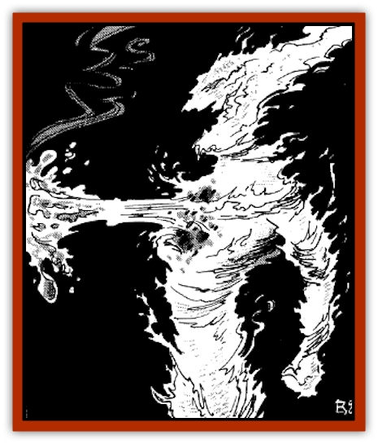
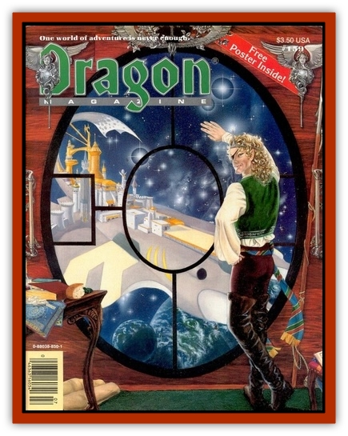

# Infernite

| Statistic | **Infernite** |
| --- | --- |
| **Activity Cycle:** | Any |
| **Alignment:** | Lawful neutral |
| **Armor Class:** | 3 |
| **Climate/Terrain:** | Fire-based worlds, volcanic vents, dim solid stars |
| **Damage/Attack:** | By weapon type (see text), or 2-8/2-8 |
| **Diet:** | Molten rock or metal, and flammable items |
| **Frequency:** | Rare |
| **Hit Dice:** | 4+3 |
| **Intelligence:** | Average (8-10) |
| **Magic Resistance:** | Nil |
| **Morale:** | Elite (14) |
| **Movement:** | 9 |
| **No. Appearing:** | 10-100 |
| **No. of Attacks:** | 1 or 2 |
| **Organization:** | Kiln or subject citizens |
| **Size:** | M (6' tall) |
| **Special Attacks:** | Bear-hug flame damage, magma missiles, fireteam advantages, spells possible |
| **Special Defenses:** | Regeneration |
| **THAC0:** | 15 |
| **Treasure:** | Y (&times;3), V (armor and weapons only) |
| **XP Value:** | 650 (more for magicians and leaders as appropriate) |

Infernites are a race of intelligent humanoids inhabiting many known fire-based worlds. They are fire-based themselves, and some are proficient in the use of magic and spelljamming craft. Infernites are the same size as humans, more powerful but of comparable intelligence. Socially, they are more rigid, structured, and single-minded of purpose than any humans.

**Combat:** To an earth-based creature, a single infernite is a formidable opponent. It is of great power and skill, and its hot, flaming body can roast most creatures. If that were not bad enough, infernites rarely engage in combat in groups of less than five, all of them being highly trained soldiers accustomed to close combat, missile fire, and military discipline. Such a military group is known as a kiln.

An infernite can also throw off chunks of molten rock and metal from its own body, each missile causing 2d4 points of damage at a range equal to that of a thrown dagger (1/2/3); two such missiles can be hurled per round. However, each time an infernite throws a chunk of itself as a missile weapon, it loses 1 hit point. "Magma throwers" will no longer use their inherent missile weapons once they fall to 10 hit points or below.

Infernite weapons are the same as those commonly found on earth-based worlds (except that the metals won't melt). Most individuals have swords that cause 1d8 points of damage plus 2d6 points of additional flame damage. The members of a kiln are armed with other weapons, as noted later.

Also, the intense heat of infernite bodies does 2d6 points of damage per round to creatures in physical contact with them. Realizing this, infernites are known to engage in bear-hugs to kill their foes (to-hit roll at +2 required, which can be broken by victim if a roll to open doors is made, once per round).

Cold is especially effective against infernites, doing double the normal damage. Even in temperatures that humans consider comfortable (up to the boiling point of water), infernites suffer 1d3 points of damage per round. Water causes 1d10 points of damage per gallon poured onto an infernite.

One infernite in six is a magician, able to cast spells as a mage of level 1-10, Ironically, infernite magicians are well versed in the use of cold spells; until they reached wildspace, infernites fought only each other. Typical spells include *affect normal fires*, *chill touch*, *chilling hands* (the cold version of *burning hands*), *ice storm*, *wall of ice*, and *cone of cold*. All infernite magicians have an inherent ability to create *improved phantasmal force* once per day (at their mage level of ability) in addition to all other powers.

A group of infernites, whether on the ground or in wildspace, will be organized into kilns of five infernites each. Kilns are typically organized in one of these four fashions:

<ul><li>Pike team: Four armed with pikes (1d6 +2d6 points of fire damage) and one magma thrower.</li><li>Close combat team: Two armed with swords, two magma throwers, and one magician.</li><li>Magical team: Three magicians, one magma thrower, and one using a sword.</li><li>Missile team: Four magma throwers and one charged with resupply.</li></ul>The pike team is often used in large battles; a few hundred such teams are organized into a phalanx. Close-combat teams and magical teams are more frequently used in piracy and boarding actions. The missile team is a support team designed to enhance any combat situation, the resupplier carrying additional material to replenish the other members (see "Ecology").

When in their formations, teams provide both a +1 to hit for each member and a -1 to their Armor Classes. A team loses these benefits if it is reduced to three or fewer members.

Infernites are able to manipulate their fluid bodies to flow through cracks and around obstacles. They can pass through any cracks or holes that are at least 6" across at their normal movement rate. Also, when body material such as hot coals or lava presents itself, infernites have the ability to bond with it and regenerate 1 hit point every other round given no interruptions (see "Ecology").

**Habitat/Society:** Fire-based worlds are difficult for earth-based creatures to imagine. Physically, such a world offers many of the same challenges to its inhabitants. For instance, there is no need for infernites to wear clothing or construct buildings to protect them from the elements on their worlds, and they make no territorial claims because of the flowing of their molten lands. Whereas human culture grew diverse in relatively static environments, infernite cultures developed very unyielding structures on turbulent, everchanging worlds.

Infernite communities contain 10-100 individuals. One leader is in addition to this number and has maximum hit points, maximum wizard abilities, and the ability to cast a *plane shift* spell once per day, taking up to 50 infernites in physical contact with it. Spelljammer crews have the normal number of crew, with the ships' captains being leaders and all crew being organized into kilns.

The individual infernite has very little freedom of choice, nor does it expect any. The offspring of each parent take on that parent ?s role in society, be it soldier, leader, administrator, or worker. Leaders enjoy the absolute confidence of those under them. Once working for a particular leader, an infernite is bound to that leader for life; when that leader dies, its subjects cease taking on nourishment and quickly perish as well. Interestingly, infernite leaders nearly always disagree on some point of policy, leading to ferocious battles between their followers until one leader and all his followers die - a frequent occurrence that limits their otherwise fast-growing population.

Infernite leaders and mages have spelljamming capabilities, and leaders sometimes order large metallic spelljamming vessels to be built. The metal of the hulls is forged to withstand the great temperatures generated both within and without. To a human, the outside of an infernite ship is as hot as a cookstove, and its interior like a volcano's core (ships in this state are hereafter referred to as "hot", though infernite crews often complain because their ships are kept too "cold"). A ship has a single leader; if that leader is lost, the ship is left to cool in the icy cold of space. Originally, infernite spelljammer ships used the same designs as were used for ships that sailed their molten seas, but they have since adopted common for their spelljamming vessels. Use common ship statistics for their vessels; all statistics apply except "save as" which should be thin metal. Infernite spelljamming ships cause an additional 1d3 points of hull damage when ramming, from their intense heat, and will automatically set ablaze any wooden ship or rigging it comes in contact with. The [[Q'nidar|q'nidar]] (from MC7) are a race of creatures despised and hunted by the infernites.

When a leader divides (see "Ecology"), it divides its subjects between its offspring. By whatever agreement, one leader then leaves with its subjects, more often than not to travel to another world by spelljamming ships or *plane shift*. Infernites have colonized many known fire-based worlds by traveling through interplanar gates opened by their leaders, since they cannot cross the Phlogiston (see "Ecology"). They also enjoy such places as volcanic vents, world cores, hot gaseous worlds, and dim red stars.

When encountered, infernites rarely do business with creatures from earth-based worlds. Their pirates often raid in search of hardened metals or magical items that can withstand the heat of their bases. They defend what is theirs tenaciously.

Infernites do not venture into the Phlogiston, as the heat from their ships is magnified and the infernites "burn out". A "hot" infernite ship that enters the Flow causes a 100'-radius explosion for 30d6 points of damage to non-fire-based beings (see page 10 of the Concordance of Arcane Space in the SPELLJAMMER boxed set). Infernites themselves must save vs. death magic at -4 each round they are in the Flow, or die.

**Ecology:** Infernites are beings of molten metal and rock, somewhat akin to [[Elemental_Fire_Water|fire elementals]]. Their bodies are rather fluid but maintain a humanoid appearance virtually all the time. There is only one sex; reproduction is accomplished through a long process of fission. Each infernite divides itself in a week-long ritual once every four months. However, reproduction can be highly accelerated when the community, be it a world, colony, or starship crew, is either threatened or is preparing for war. In such an instance, the community consciousness naturally takes over, forcing individuals to seek out sources of body material and begin reproducing once per day. Since leaders divide their power when they divide, they will try to avoid reproduction indefinitely. Body material is drawn from the surface of a dim star, the volcanoes of an earth-based world, the surface of a fire-based world, or from huge kilns stoked by the infernites themselves. The infernites literally become one with the new body material and force themselves to divide more often. This process can continue as long as there is still a perceived threat to the community or until the body material runs out. In a short time, the infernites can create whole armies to perpetuate their race and their ambitions.

In a similar process, infernites can heal damage done to themselves. If there is a source of body material at hand, they can heal one point of damage every other round by bonding with it. For instance, in a missile fire team, the missile users stick their hands into a vat of molten material to gain back hit points and continue firing. Fighting infernites on their own worlds is always a costly venture.

On their own worlds, infernites tend to eat just about everything. On earth-based worlds they can eat anything that normally burns: wood, coal, oil, etc., but eating "cold" food brings their body temperatures down gradually - those that have been forced to live on earth-based worlds for extended periods of time eventually cool down and die. Water-based worlds are shunned by infernites, and air-based worlds exhaust their fuel quickly, burning them out.

---
## Discovery & Documentation

**Source Publication:** Dragon159 (1990)
**Campaign Setting:** Dragon Magazine
**Author(s):** 

### Other Creatures Found in This Source Book
   * [[Andeloid|Andeloid]]
