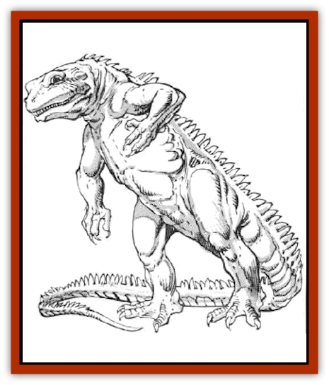

# Ingundi

| Statistic | **Ingundi** |
| --- | --- |
| **Activity Cycle:** | Night |
| **Alignment:** | Chaotic evil |
| **Armor Class:** | 6 |
| **Climate/Terrain:** | Temperate/Forests |
| **Damage/Attack:** | 1-6/1-6/1-12 |
| **Diet:** | Carnivore |
| **Frequency:** | Very rare |
| **Hit Dice:** | 3+2 |
| **Intelligence:** | Low (5-7) |
| **Magic Resistance:** | Nil |
| **Morale:** | Average (10) |
| **Movement:** | 6 |
| **No. Appearing:** | 1 |
| **No. of Attacks:** | 2 claws, 1 bite |
| **Organization:** | Solitary |
| **Size:** | M (5-6' tall) |
| **Special Attacks:** | Spells |
| **Special Defenses:** | Nil |
| **THAC0:** | 17 |
| **Treasure:** | D |
| **XP Value:** | 420 |

The ingundi is an intelligent humanoid reptile that can cloak itself in illusion to fool its prey.

In its true form, the ingundi is similar in appearance to a small [[Lizard_Man|lizard man]] - a lightly built, bipedal reptile standing five to six feet tall, with a tail that balances its upper body. Its mouth is wider than a lizard man's, however, and is filled with sharp, rending teeth. Its forelimbs, though slimmer and weaker, bear long and hideously sharp claws. Ingundi skin color ranges from a light green on the back to a pale yellow on the creature's belly. Its small eyes are yellow with large black pupils. The ingundi wears no clothes or ornaments of any kind.

Ingundi have no language, but they communicate telepathically.

**Combat:** The ingundi rarely appears in its true form. It has a powerful form of *ESP*, a well-developed *change self* power, and typically appears as some other, more innocuous, creature. It can be any creature from the size of a large [[Dog|dog]] to that of a [[Bear|bear]]. It can disguise itself this way twice a day; the disguise lasts for 1d10+10 rounds.

When hunting humans or demihumans, it takes on the appearance of an attractive individual of the same race as its victim but of the opposite sex. The physical details of the illusion are picked right out of the mind of its prey. It always picks out a figure greatly desired, but frequently unattainable, by the victim. The *ESP* power can be blocked by magical spells, such as *mind blank*. With intelligent creatures there is always the danger of appearing as somebody who would not reasonably be there.

In this form, the ingundi approaches its victim and tries to engage him or her in flirtatious conversation. In the case of animal prey it uses courtship rituals. Unknown to the victim, the ingundi's side of the conversation is all telepathic. Anybody else witnessing the two hears only a one-sided conversation.

During the talk the ingundi casts a powerful, telepathic *charm person* or *monster* (as the case may be) spell. The victim gets a saving throw vs. spell with a -2 penalty. If the *ESP* ability cannot read the victim's mind, the ingundi cannot *charm* him. If it is successful, the ingundi leads the victim away from prying eyes, where it convinces its victim to remove all armor. During the first round, it attacks with a +4 bonus to its attack roll and automatic surprise. After this initial round, the charm is dispelled, the bonus is lost, and its victim can strike back. If anything goes wrong, such as a failed *charm* or somebody intervening, it flees. It fights only if cornered.

**Habitat/Society:** An ingundi typically makes a small lair inside a dead tree or among exposed tree roots. Individuals approach each other only to mate, once a year during the depths of winter. The single egg the female lays is hidden and forgotten. Twelve weeks later it hatches. The newly hatched ingundi has full powers, but it hunts only small animals until it is full grown six months later.

The normal prey for ingundi are forest animals of a size that it can imitate through illusion, such as deer. It is not afraid of humans and hunts them if they are the nearest prey. It usually hunts only once every few days, a single kill being enough to feed it for that long.

Ingundi have no known culture or civilization.

**Ecology:** The ingundi is a highly efficient predator. It has no natural enemies. Its magical abilities are used defensively, the *ESP* warning it of stalkers. When one is detected, it merely changes into a creature that the hunter would not hunt, or even into a similar creature of the opposite sex. In this case the hunted becomes the hunter.

The ingundi produces nothing of value for humans or animals. Some ingundi take [[Iguana_Giant|giant iguanas]], charm them, and use them as mounts. They are controlled telepathically and obey their rider completely. Ingundi are believed to be responsible for many myths and legends about evil creatures that hunt wicked people. This is a common rationale when folk disappear without a trace and no natural cause can be found.

---
## Discovery & Documentation

**Source Publication:** MC5 Greyhawk Appendix (1989)
**Campaign Setting:** Advanced Dungeons & Dragons 2nd Edition
**Author(s):** Grant Boucher, William W. Connors, Steve Gilbert, Bruce Nesmith, Chris Mortika, Skip Williams

### Other Creatures Found in This Source Book
   * [[Aspis|Aspis]]
   * [[Beastman|Beastman]]
   * [[Bonesnapper|Bonesnapper]]
   * [[Booka|Booka]]
   * [[Brownie_Buckawn|Brownie, Buckawn]]
   * [[Brownie_Quickling|Brownie, Quickling]]
   * [[Crystalmist|Crystalmist]]
   * [[Dragon_Cloud|Dragon, Cloud]]
   * [[Dragon_Oerth_Greyhawk|Dragon (Oerth), Greyhawk]]
   * [[Dragonfly_Giant|Dragonfly, Giant]]
   * [[Dragonnel|Dragonnel]]
   * [[Elf_Grugach|Elf, Grugach]]
   * [[Elf_Valley|Elf, Valley]]
   * [[Golem_Necrophidius|Golem, Necrophidius]]
   * [[Grell_Wild|Grell, Wild]]
   * [[Grung|Grung]]
   * [[Hobgoblin_Norker|Hobgoblin, Norker]]
   * [[Hook_Horror|Hook Horror]]
   * [[Horgar|Horgar]]
   * [[Hound_Yeth|Hound, Yeth]]
   * [[Iguana_Giant|Iguana, Giant]]
   * [[Kech|Kech]]
   * [[Kyuss_Son_of|Kyuss, Son of]]
   * [[Mite|Mite]]
   * [[Needleman|Needleman]]
   * [[Plant_Carnivorous_Oerth|Plant, Carnivorous (Oerth)]]
   * [[Plant_Carnivorous_Vampire_Cactus|Plant, Carnivorous, Vampire Cactus]]
   * [[Plasmoid_General_Information|Plasmoid, General Information]]
   * [[Rat_Oerth|Rat (Oerth)]]
   * [[Raven_Crow|Raven/Crow]]
   * [[Scarecrow|Scarecrow]]
   * [[Shadow_Slow|Shadow, Slow]]
   * [[Skulk|Skulk]]
   * [[Snail|Snail]]
   * [[Sprite|Sprite]]
   * [[Taer|Taer]]
   * [[Tentamort|Tentamort]]
   * [[Turtle_Giant|Turtle, Giant]]
   * [[Tyrg|Tyrg]]
   * [[Wolf_Mist|Wolf, Mist]]
   * [[Wraith_Oerth|Wraith (Oerth)]]
   * [[Zygom|Zygom]]
