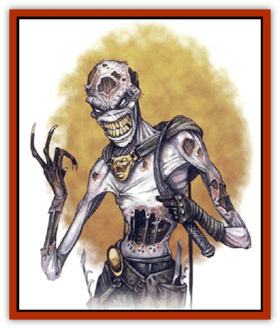

# Inquisitor

| Statistic | **Inquisitor** |
| --- | --- |
| **Activity Cycle:** | Night |
| **Alignment:** | Lawful evil |
| **Armor Class:** | 4 |
| **Climate/Terrain:** | Urban/subterranean |
| **Damage/Attack:** | 1-4/1-6 |
| **Diet:** | Omnivore |
| **Frequency:** | Very rare |
| **Hit Dice:** | 6 |
| **Intelligence:** | High (13-14) |
| **Magic Resistance:** | Nil |
| **Morale:** | Fanatic (17-18) |
| **Movement:** | 9 |
| **No. Appearing:** | 1 |
| **No. of Attacks:** | 2 |
| **Organization:** | Solitary |
| **Size:** | M (6' tall) |
| **Special Attacks:** | Disease, fear, paralysis, torture |
| **Special Defenses:** | Spell immunity |
| **THAC0:** | 15 |
| **Treasure:** | W |
| **XP Value:** | 3,000 |

Created by evil wizards centuries ago, inquisitors are a shambling, rotting, undead abomination, living on sheer terror. Each is an ancient expert in torture and information extraction, an artist who works in screams and agony. Those without masters dwell in dark places where they can take prisoners and ask impossible questions that let them further perfect their techniques. Some inquisitors are themselves imprisoned by more powerful beings and forced to work their trade on demand, longing for the day they put their masters on the rack.

An inquisitor can be easily mistaken for a [[Zombie|zombie]] or other undead. Nearly half of its flesh has rotted away, exposing tendons and yellowing bones. Many wear black hoods, but those who don't display foul smelling mucous dripping from their eyes and mouths. An inquisitor wears tattered pants and shoes, but no shirt or gloves. Its hands are charred from years of using red-hot torture implements, and its thick, yellow nails poke menacingly from its fingers. One is seldom encountered without its whip in hand.

An inquisitor can speak and understand Common and any racial languages particular to its location.

**Combat:** An inquisitor's horrifying appearance and its reputation for lingering torture and death require those who see him to successfully save vs. paralyzation or flee in fear for 1-6 rounds. Once a victim has failed this saving throw, his attacks against that inquisitor are made with a -2 penalty to the attack roll, even after the victim stops fleeing.

The inquisitor's gaze requires one opponent per round to successfully save vs. paralyzation or be paralyzed for 1-4 turns. This gaze attack is in addition to any physical attacks it makes during the round. On a successful saving throw, a victim can never be paralyzed by that particular inquisitor.

Each round an inquisitor can attack with its whip, causing 1-4 points of damage, and scratch with the nails on its other hand, causing 1-6 points of damage. Any victim who is hit with the nails must successfully save vs. poison to avoid a wasting disease that causes him to lose one point of Strength and one point of Constitution per day until cured. Only *cure disease* can rid a character of the affliction and restore lost points. If either ability score reaches zero the victim dies.

If an inquisitor manages to capture a victim, it chains and shackles him to a table and gleefully begins its torture. The inquisitor's torture causes considerable pain and disfigurement. At the end of every day of torture, the victim must successfully save vs. paralyzation or become insane. While insane, the character may still attempt to escape the inquisitor and may defend himself, but is unable to distinguish his friends from enemies or interact with familiar places or situations. The character may only regain his sanity with time, 1-4 weeks after the torture has ended. In any event, the character loses one point of Charisma after being tortured by an inquisitor. This point can only be regained through magical healing such as a *heal* spell intended for this purpose only.

An inquisitor is immune to all mind affecting spells, such as *charm*, *geas*, or illusions.

**Habitat/Society:** Every inquisitor has its own torture chamber for its lair. The chamber can be in a dungeon or cave, in the secluded wilderness, or even in the town square. The devices it has vary, including but not limited to racks, iron maidens, thumb screws, vices and clamps, or even more exotic devices such as large helmets filled with hungry insects or rats. When screaming victims offer bribes to lessen their punishment, an inquisitor often keeps the gems and coins for itself rather than alert its master. Any treasure is hidden in or around the inquisitor's chamber. Of course, no bribe will stay an inquisitor from its task.

The inquisitor's home is its torture chamber. It only strays from its chamber when in search of new victims. If supplied with ample subjects for its torture, an inquisitor may not willingly leave his chamber for years or even centuries at a time.

The inquisitor is a solitary creature, but may employ lesser beings to do its bidding. Evil creatures such as [[Orc|orcs]] and [[Kobold|kobolds]] sometimes make a small profit selling live captives to an inquisitor.

**Ecology:** Inquisitors are biologically immortal, cursed hundreds or thousands of years ago to forever cause pain and extract information. They cannot reproduce. If an inquisitor is denied the opportunity to mercilessly torture victims for a long period of time, it slowly wastes away and dies. Every year of such denial it loses one hit point permanently. More powerful beings who use inquisitors often keep them in check with threats of victim denial.

---
## Discovery & Documentation

**Source Publication:** MC11 Forgotten Realms Appendix II (1991)
**Campaign Setting:** Advanced Dungeons & Dragons 2nd Edition
**Author(s):** Tim Beach, Tim Brown, William W. Connors, Dale Donovan, Ed Greenwood, Jeff Grubb, Bruce Heard, Slade Henson, Rob King, Colin McComb, Roger E. Moore, Bruce Nesmith, Jon Pickens, Jean Rabe, Dori Watry, Skip Williams

### Other Creatures Found in This Source Book
   * [[Alaghi|Alaghi]]
   * [[Alguduir|Alguduir]]
   * [[Beguiler|Beguiler]]
   * [[Bird_Toril|Bird (Toril)]]
   * [[Cantobele|Cantobele]]
   * [[Carapace|Carapace]]
   * [[Cat_Toril|Cat (Toril)]]
   * [[Chitine|Chitine]]
   * [[Cildabrin|Cildabrin]]
   * [[Dimensional_Warper|Dimensional Warper]]
   * [[Dragon_Deep|Dragon, Deep]]
   * [[Fachan_Toril|Fachan (Toril)]]
   * [[Fael|Fael]]
   * [[Feyr|Feyr]]
   * [[Firetail|Firetail]]
   * [[Frost|Frost]]
   * [[Gaund|Gaund]]
   * [[Gloomwing|Gloomwing]]
   * [[Golden_Ammonite|Golden Ammonite]]
   * [[Golem_Lightning|Golem, Lightning]]
   * [[Hamadryad|Hamadryad]]
   * [[Harrier|Harrier]]
   * [[Harrla|Harrla]]
   * [[Haun|Haun]]
   * [[Haundar|Haundar]]
   * [[Hendar|Hendar]]
   * [[Lhiannan_Shee|Lhiannan Shee]]
   * [[Loxo|Loxo]]
   * [[Manni|Manni]]
   * [[Manscorpion|Manscorpion]]
   * [[Mara|Mara]]
   * [[Morin|Morin]]
   * [[Naga_Dark|Naga, Dark]]
   * [[Orpsu|Orpsu]]
   * [[Plant_Carnivorous_Black_Willow|Plant, Carnivorous, Black Willow]]
   * [[Plant_Carnivorous_Toril|Plant, Carnivorous (Toril)]]
   * [[Plant_Dangerous_I|Plant, Dangerous I]]
   * [[Ring-Worm|Ring-Worm]]
   * [[Rohch|Rohch]]
   * [[Sand_Cat|Sand Cat]]
   * [[Saurial|Saurial]]
   * [[Sha'az|Sha'az]]
   * [[Silver_Dog|Silver Dog]]
   * [[Simpathetic|Simpathetic]]
   * [[Skuz|Skuz]]
   * [[Spider_Monkey|Spider, Monkey]]
   * [[Tren|Tren]]
