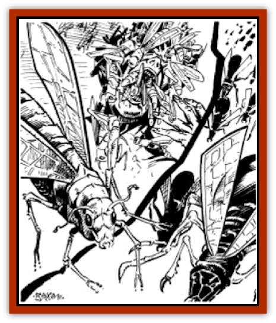

# Insect Swarm - Athas

| Statistic | **Locust** | **Mini-kank** |
| --- | --- | --- |
| **Activity Cycle:** | Day | Day |
| **Alignment:** | Neutral | Neutral |
| **Armor Class:** | Fl 18 (A) | 10 |
| **Climate/Terrain:** | Any plains | Any plains |
| **Damage/Attack:** | See below | See below |
| **Diet:** | Omnivore | Omnivore |
| **Frequency:** | Very rare | Very rare |
| **Hit Dice:** | Special | 1 per 15 insects |
| **Intelligence:** | Non- (0) | Non- (0) |
| **Magic Resistance:** | Nil | Nil |
| **Morale:** | Average (8-10) | Average (8-10) |
| **Movement:** | 1 per 10 insects | Fl 15 (A) |
| **No. Appearing:** | 2,000-5,000 ((1d4+1)&times;1000) | 2,000-5,000 ((1d4+1)&times;1000) |
| **No. of Attacks:** | See below | See below |
| **Organization:** | Swarm | Swarm |
| **Size:** | T (8&rdquo;) | T (5&rdquo;) |
| **Special Attacks:** | Nil | Blood drain |
| **Special Defenses:** | Nil | Nil |
| **THAC0:** | See below | Special |
| **Treasure:** | Nil | Nil |
| **XP Value:** | 65 per 10 insects | 65 per 10 insects |

The insects of Athas are of a hearty breed, and [[Insect_Swarm|insect swarms]] are among the most deadly plagues that this world has ever been subject to.

There are two insect breeds which form swarms in the deserts of Athas. The first type is a variant of the common [[Insect_Swarm|locust]], while the other is a smaller version of the [[Animal_Domestic_Athas_I|kank]].

## Locust

The locusts of Athas are approximately 8 inches in length and look very much like large, brown [[Insect_Swarm|grasshoppers]]. They have five-inch-long wings which grant them extremely fast flight speeds and excellent maneuverability.

**Combat:** There is little to nothing that can withstand an attack by a swarm. Encountered individually, these insects are dangerous enough, but when massed in the thousands, they are devastating. When encountered individually, a single locust can attack three times, with its fore claws and its mandibles. Each successful attack does 1-2 points of damage. Each locust has 1 hit point and will die if struck by any weapon.

When in a swarm, however, these insects are much more deadly. When a swarm of Athasian locusts encounter a creature in their path, the creature is virtually covered from head to toe with the insects, which will attack the creature until it has been picked clean to the bone. When a creature is caught by a swarm of locusts, roll 1d4 and multiply the result by 20 to determine the number of locusts that will attack it. The locusts attack with a THAC0 of 10. Make three attack rolls and determine how much damage is done to the victim. Then multiply this number by one-half the number of locusts attacking the creature. This is the total number of hit points of damage done to the creature in that round. Once a creature has fallen dead, its carcass will be cleaned to the bone within 3 rounds. Any creature or character caught in a swarm has its movement rate cut to 3.

**Habitat/Society:** Swarms gather together very rarely, usually only one time every three or four years. Those most affected by these swarms are the nomadic herdsmen, who often lose entire herds of kank or [[Animal_Domestic_Athas_I|erdlus]] to these terrible insects.

From afar, a locust swarm appears as a small dark cloud which moves quickly across the desert. The swarm usually covers an area of approximately 100 square yards.

Aside from the danger that these swarms present to the population, Athasian insect swarms also devastate miles and miles of vegetation and plant life.

**Ecology:** Despite their devastation, the insect swarms do produce one useful side effect - they kill large numbers of the rodents and small mammals breeding on the Athasian deserts.

## Mini-Kanks

The other type of swarming insect is a small species of the kank. This small cousin of the kank is about five inches in length and sports three-inch-long wings on its back.

**Combat:** Swarms of mini-kanks are similar to swarms of locusts in the numbers of insects in a swarm, but are different in terms of how they attack their prey. While locusts chew their victims until nothing but bone remains, mini-kanks are blood-suckers. When a swarm of mini-kanks attack a creature, 10-40 (1d4x10) will usually combine to kill it by sucking its blood. Each single mini-kank can drain up to 3 hit points from a victim, one per round. Creatures attacked by a swarm of mini-kanks must make a saving throw vs. paralyzation or lose a number of hit points equal to the number of insects attacking. A successful saving throw means the creature loses only half that number of hit points. This continues for three rounds at which point the mini-kanks attacking will fly off. If the creature survives, a new number of mini-kanks will attack on the very next round, repeating the process outlined above, until the victim is dead. Like swarms of locusts, swarms of mini-kanks slow the movement rates of attacked creatures to 3.

**Habitat/Society:** Swarms of mini-kanks are slightly smaller (75 square yards) than swarms of locusts, but move more quickly across the desert.

---
## Discovery & Documentation

**Source Publication:** MC12 Dark Sun Appendix I - Terrors of the Desert (1991)
**Campaign Setting:** Dark Sun
**Author(s):** Tom Prusa, Louis J. Prosperi, Walter M. Baas

### Other Creatures Found in This Source Book
   * [[Animal_Herd_Athas|Animal, Herd (Athas)]]
   * [[Animal_Household_Athas|Animal, Household (Athas)]]
   * [[Antloid_Desert|Antloid, Desert]]
   * [[Banshee_Dwarf|Banshee, Dwarf]]
   * [[Beetle_Agony|Beetle, Agony]]
   * [[Bog_Wader|Bog Wader]]
   * [[Brambleweed|Brambleweed]]
   * [[B'rohg|B'rohg]]
   * [[Burnflower|Burnflower]]
   * [[Cat_Psionic|Cat, Psionic]]
   * [[Cha'thrang|Cha'thrang]]
   * [[Cistern_Fiend|Cistern Fiend]]
   * [[Clam_Giant|Clam, Giant]]
   * [[Cloud_Ray|Cloud Ray]]
   * [[Drake_Athas_Air|Drake (Athas), Air]]
   * [[Drake_Athas_Earth|Drake (Athas), Earth]]
   * [[Drake_Athas_Fire|Drake (Athas), Fire]]
   * [[Drake_Athas_Water|Drake (Athas), Water]]
   * [[Dune_Runner|Dune Runner]]
   * [[Dune_Trapper|Dune Trapper]]
   * [[Elemental_Athas_Greater_Air|Elemental (Athas), Greater, Air]]
   * [[Elemental_Athas_Greater_Earth|Elemental (Athas), Greater, Earth]]
   * [[Elemental_Athas_Greater_Fire|Elemental (Athas), Greater, Fire]]
   * [[Elemental_Athas_Greater_Water|Elemental (Athas), Greater, Water]]
   * [[Elemental_Athas_Lesser_Air_Earth|Elemental (Athas), Lesser, Air/Earth]]
   * [[Elemental_Athas_Lesser_Fire_Water|Elemental (Athas), Lesser, Fire/Water]]
   * [[Elemental_Athas_General_Information|Elemental (Athas), General Information]]
   * [[Erdland|Erdland]]
   * [[Esperweed|Esperweed]]
   * [[Flailer|Flailer]]
   * [[Floater|Floater]]
   * [[Giant_Athas|Giant (Athas)]]
   * [[Golem_Athas_I|Golem (Athas) I]]
   * [[Golem_Athas_II|Golem (Athas) II]]
   * [[Golem_Athas_III|Golem (Athas) III]]
   * [[Golem_Athas_General_Information|Golem (Athas), General Information]]
   * [[Halfling_Renegade|Halfling, Renegade]]
   * [[Hej-kin|Hej-kin]]
   * [[Id_Fiend|Id Fiend]]
   * [[Kank_Wild|Kank, Wild]]
   * [[Kirre|Kirre]]
   * [[Megapede|Megapede]]
   * [[Mul_Wild|Mul, Wild]]
   * [[Nightmare_Beast|Nightmare Beast]]
   * [[Plant_Carnivorous_Athas|Plant, Carnivorous (Athas)]]
   * [[Pterran|Pterran]]
   * [[Pterrax|Pterrax]]
   * [[Pulp_Bee|Pulp Bee]]
   * [[Pyreen|Pyreen]]
   * [[Rasclinn|Rasclinn]]
   * [[Razorwing|Razorwing]]
   * [[Roc_Athas|Roc (Athas)]]
   * [[Sand_Bride|Sand Bride]]
   * [[Sand_Cactus|Sand Cactus]]
   * [[Sand_Vortex|Sand Vortex]]
   * [[Scrab|Scrab]]
   * [[Silt_Horror|Silt Horror]]
   * [[Silt_Runner|Silt Runner]]
   * [[Sink_Worm|Sink Worm]]
   * [[Sloth_Athas|Sloth (Athas)]]
   * [[So-ut|So-ut]]
   * [[Spider_Cactus|Spider Cactus]]
   * [[Spider_Crystal|Spider, Crystal]]
   * [[Spirit_of_the_Land|Spirit of the Land]]
   * [[T'Chowb|T'Chowb]]
   * [[Thrax|Thrax]]
   * [[Tohr-kreen_I|Tohr-kreen I]]
   * [[Villichi|Villichi]]
   * [[Zhackal|Zhackal]]
   * [[Zombie_Plant|Zombie Plant]]
