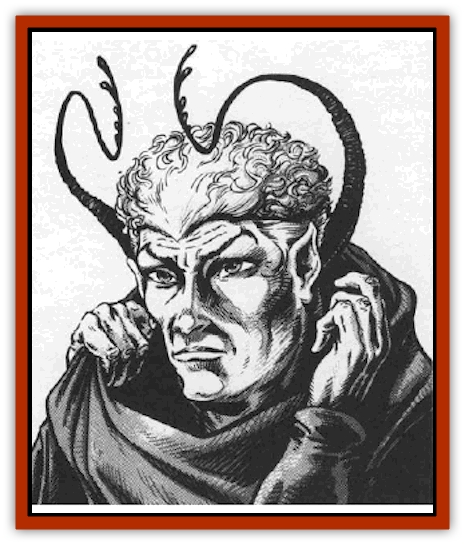

# Insectare

| Statistic | **Insectare** |
| --- | --- |
| **Activity Cycle:** | Any |
| **Alignment:** | Lawful evil |
| **Armor Class:** | 3 |
| **Climate/Terrain:** | Any |
| **Damage/Attack:** | 1d8 (weapon)/1s2/1d2 |
| **Diet:** | Omnivore |
| **Frequency:** | Very rare |
| **Hit Dice:** | 3+1 |
| **Intelligence:** | Very (12) |
| **Magic Resistance:** | 20% |
| **Morale:** | Champion (16) |
| **Movement:** | 9 |
| **No. Appearing:** | 2-12 |
| **No. of Attacks:** | 3 |
| **Organization:** | Clan |
| **Size:** | M (6') |
| **Special Attacks:** | See below |
| **Special Defenses:** | Nil |
| **THAC0:** | 17 |
| **Treasure:** | W (A) |
| **XP Value:** | 420 |

lnsectare are a humanoid race rumored to be the descendants of a magical union of [[Elf|elves]] and insects. The insectare's goal is to rule the spaceways, but they wage this campaign subtly, trying to play one race against another. While instigating these problems, the insectare try to stay in the background.

These humanoids are immediately recognizable by their limegreen skin and the two eight-foot antennae that sprout from behind their elven ears. For this reason, they wear heavy, concealing clothes such as large robes with hoods pulled in close. That way, an insectare can hide its antennae by slipping them down its back or coiling them in the folds of a loosely-fitting robe.

Close examination of an insectare's eyes reveals that they are slightly multifaceted. Getting that close may prove difficult, though, as insectare do not ordinarily allow other races near them. From five feet away, the eyes look normal.

No one has ever reported seeing a female insectare, but for that matter, not many people have even seen a male insectare without a hood. Therefore, they could have been dealing with a female and not noticed.

Insectare can communicate with each other by touching their antennae together. They also have their own language, a clicking, lilting tongue that is a mixture of the common tongue and the insects' original language. Characters who understand the common tongue have a 30% chance of catching the general idea of a conversation between two insectare, but cannot provide a comprehensive translation for others.

Most insectare stand 6' or taller and are heavily muscled beneath their tough exoskeleton. Most insectare encountered outside their home sphere are fighters, wizards, thieves, or any combination of the three.

**Combat:** Insectare are ruthless in battle. Once a fight has begun, they never give up until the enemy is completely defeated. They chase fleeing foes to exact surrender, and they execute survivors who refuse surrender.

Insectare use a long sword and their two antennae, which attack as whips (1d2 damage). Often, one antenna entangles the opponent's weapon hand (with an attack roll of 18 or better) while the other antenna and sword attack. An entangled limb cannot attack; to disentangle the limb, the character must make a Dexterity ability check.

In combat, the insectare's chitinous exoskeleton provides an Armor Class equivalent to plate mail, without restricting movement. The exoskeleton has no known weak points.Insectare wizards jealously guard their magic, relying on their martial skills to bring them through a battle. The insectare obviously have magical ability, since they can spelljam, but the limits of insectare power remain unknown. Insectare wizards never reveal information without overwhelming reason. (The threat of death doesn't qualify.)

**Habitat/Society:** Insectare live in a closed society. They forbid outsiders to set foot on their secret homeworld. Captured interlopers can expect a harsh interrogation, to find out if any other beings know of the world's location, and then public execution. Insectare do not believe in keeping prisoners.

Insectare live in large hollowed-out mountains that rise out of the endless forests of their homeworld. These mountains are said to be honeycombed with dwellings. Not much is known about these community homes, but they are probably a remnant of their insect heritage.

The two major classes of insectare society are the wizards and the priests. The wizards are the explorers, forever searching wildspace for more magical power. The priests stay on their planet, diligently serving their god, Klikral.

The insectare mages' goal, after learning spelljamming, was to acquire magical knowledge and power from other races, without drawing attention to their goals. Consequently, insectare prefer to work subtly among foreigners.

Some insectare are proficient thieves, despite the aversion to thieves on their homeworld. Insectare thieves are only interested in magic; gold, jewelry, gems hold no attraction. When an inectare steals a powerful magic item, it often leaves at least one misleading clue, pointing at another known thief (such as a player character).

Insectare priests rarely leave their homeworld, for they prefer not to venture far from Klikral. If a priest is found offworld, its mission must be highly important to the insectare race. Klikral grants insectare priests who reach 2nd level one special ability: They can summon insects from the surrounding area and send them against any one opponent. This swarm of insects arrives in one round, inflicts 1d8 points of damage per round, and remains for one round per level of the spellcaster.

Unlike other insectare, priests have normal humanoid eyes. No explanation has been found for this difference. The symbol of one multifaceted eye with two antennae off the two corners means that the owner or creator is an insectare wizard, fighter, or thief; a similar symbol, with a regular eye and two antennae represents an insectare priest. These two symbols, obviously signatures of some sort, appear on stolen insectare documents.

Multiclass options for insectare are wizard/fighter, wizard/thief and wizard/fighter/thief. Priests never engage in another profession. Insectare can reach 11th level in all classes except wizard, where they reach 14th level.

Ten ancient insectare priests on the inscctare homeworld serve as high priests of Klikral. They are all 11th-level priests and never leave the planet. They are twice as large as the usual insectare, and can communicate directly with Klikral.

The insectare travel space in their own distinctive ship, the klicklikak. The sleek ship resembles a grasshopper head with two long antennae trailing behind it. The name means "service to Klikral".

The insectare power the klicklikak with a special spelljammer helm consisting of a shiny copper sphere with two holes. To propel the ship through space, the spelljammer inserts its two antennae. Only insectare can use this helm; conversely, insectare cannot use other kinds of helm.

Rumors have it that a new, larger version of the klicklikak roams the spaceways, but no sightings are confirmed.

**Ecology:** Spacefaring peoples shun the insectare, especially elves. Elves vehemently deny any suggestion that they are related to the insectare. Insectare, aware of this discord, go to great lengths to remain inconspicuous while among elves and other foreigners. Although other races don't know much about the insectare master plan, they note the insectare's secrecy and deviousness, which puts many people on guard.

A good weaponsmith can work the outer skin of an insectare, which is a hard exoskeleton, into a +1 shield, and can fashion an antenna into a short rope or whip. However, insectare consider this practice abominable, and anyone who uses such a weapon or shield earns every insectare's instant hatred.

---
## Discovery & Documentation

**Source Publication:** MC9 Spelljammer Appendix II (1991)
**Campaign Setting:** Planescape
**Author(s):** Scott Davis, Newton Ewell, John Terra

### Other Creatures Found in This Source Book
   * [[Alchemy_Plant|Alchemy Plant]]
   * [[Allura|Allura]]
   * [[Aperusa|Aperusa]]
   * [[Autognome|Autognome]]
   * [[Bionoid|Bionoid]]
   * [[Bloodsac|Bloodsac]]
   * [[Buzzjewel|Buzzjewel]]
   * [[Constellate|Constellate]]
   * [[Contemplator|Contemplator]]
   * [[Dohwar|Dohwar]]
   * [[Dragon_Moon|Dragon, Moon]]
   * [[Dragon_Stellar|Dragon, Stellar]]
   * [[Dragon_Sun|Dragon, Sun]]
   * [[Dreamslayer|Dreamslayer]]
   * [[Dweomerborn|Dweomerborn]]
   * [[Fal|Fal]]
   * [[Feesu|Feesu]]
   * [[Fire_Bat|Fire Bat]]
   * [[Firebird|Firebird]]
   * [[Firelich|Firelich]]
   * [[Flowfiend|Flowfiend]]
   * [[Gadabout|Gadabout]]
   * [[Gammaroid|Gammaroid]]
   * [[Gonn|Gonn]]
   * [[Gossamer|Gossamer]]
   * [[Grav|Grav]]
   * [[Great_Dreamer|Great Dreamer]]
   * [[Greatswan|Greatswan]]
   * [[Grell_Colonial|Grell, Colonial]]
   * [[Gullion|Gullion]]
   * [[Lhee|Lhee]]
   * [[Mercurial_Slime|Mercurial Slime]]
   * [[Meteorspawn|Meteorspawn]]
   * [[Monitor|Monitor]]
   * [[Owl_Space|Owl, Space]]
   * [[Pristatic|Pristatic]]
   * [[Scro|Scro]]
   * [[Selkie_Star|Selkie, Star]]
   * [[Silatic|Silatic]]
   * [[Skullbird|Skullbird]]
   * [[Sleek|Sleek]]
   * [[Sluk|Sluk]]
   * [[Space_Swine|Space Swine]]
   * [[Sphinx_Astro-|Sphinx, Astro-]]
   * [[Spirit_Warrior|Spirit Warrior]]
   * [[Starfly_Plant|Starfly Plant]]
   * [[Stargazer|Stargazer]]
   * [[Undead_Stellar|Undead, Stellar]]
   * [[Witchlight_Marauder|Witchlight Marauder]]
   * [[Xixchil|Xixchil]]
   * [[Yitsan|Yitsan]]
   * [[Zurchin|Zurchin]]
