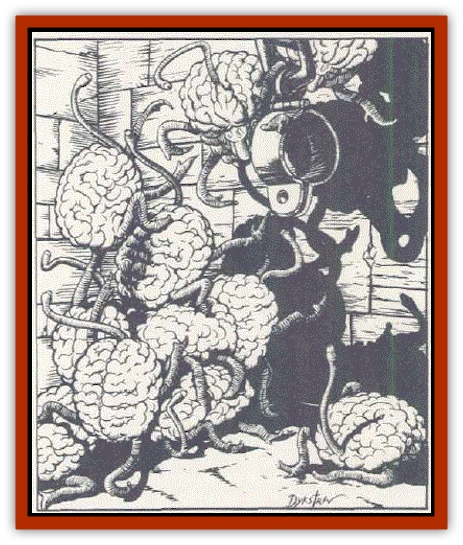
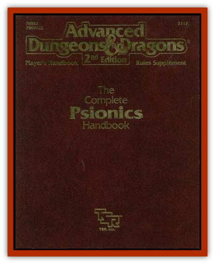

# Intellect Devourer - Larva - Ustilagor

| Statistic | **Intellect Devourer, Larva (Ustilagor)** |
| --- | --- |
| **Activity Cycle:** | During Darkness  |
| **Alignment:** | Neutral (evil) |
| **Armor Class:** | 5  |
| **Climate/Terrain:** | Dark, moist areas  |
| **Damage/Attack:** | 1d4+1 (save vs. poison or double) |
| **Diet:** | Emotions  |
| **Frequency:** | Rare  |
| **Hit Dice:** | 3+3  |
| **Intelligence:** | Not ratable  |
| **Magic Resistance:** | Nil (See below)  |
| **Morale:** | Unsteady (5-7)  |
| **Movement:** | 9  |
| **No. Appearing:** | 1-3  |
| **No. of Attacks:** | 1  |
| **Organization:** | Solitary  |
| **Size:** | T (Brain sized)  |
| **Special Attacks:** | Psionics  |
| **Special Defenses:** | Psionics  |
| **THAC0:** | 17  |
| **Treasure:** | Q (x1d20) |
| **XP Value:** | 650 |

**Psionics Summary**

| Level | Dis/Sci/Dev | Attack/Defense | Score | PSPs |
| --- | --- | --- | --- | --- |
| 3 | 2/1/4 | II/M- | 10 | 150 |

**Psychometabolism -** *Sciences:* energy containment. *Devotions:* chemical simulation (see below)

**Telepathy -** *Devotions:* contact, id insinuation, telempathic projection (see below)

Ustilagor are the larval form of [[Intellect_Devourer|intellect devourers]]. Like their parents, they look like brains with four legs. However, they are  much smaller, and their bodies are soft and moist. They lack the hard covering which they will eventually gain as adults. Ustilagor also have a 3-foot tendril which is very flexible and agile. Unlike their parents, they have coral-like legs with no feet, so they travel slowly (MV 9). Even so, they can jump and dart with amazing  agility. (That's why their annor class is 5.) 

**Combat:**Ustilagor can attack by striking an opponent with their tendril while performing their own version of chemical simulation. They never fail when using this power and expend only 1 PSP per attack. Moreover, the acid is so caustic that the victim must save vs. poison or suffer additional damage the next round (1d4+1). 

Of course, this is not a highly effective form of attack, and the ustilagor prefers to use either id insinuation or its advanced telempathic projection power. Using the latter, it can force its victims into one of five states of mind during a round: hate for associates, distrust of associates, fear of [[Fungus|fungi]], loathing of area, or uncertainty. These projected emotions cause attack, bickering, desertion, or dithering, accordingly. Note that adult intellect devourers lose this enhanced power, and are only able to performtelempathic projection

Though they are psionically endowed, ustilagor seem to have no intelligence as defined by humans. Thus, attacks that affect minds (psionically or magically) do not function upon them, with the exception of psionic blast. Due to an unusual fungal growth (see "Habitat/Society"), they are immune to fungal attacks and any attack that affects an aura. 

Finally, ustilagor use their energy containment power to protect themselves from spells and other applicable forms of attack. A ustilagor does not have the advanced form of energy containment associated with their adult form

All ustilagor are attracted to gems. No one knows why for sure, but it is suspected that ustilagor use the gems for energy containment. These creatures will attack a being who's carrying gems before they attack any others.

**Habitat/Society:** Ustilagor are so moist that fungi usually grow upon them. It's a symbiotic relationship. The fungi prevent the ustilagor from drying out, and they also mask the creature's psionic aura. Thus, no power that affects an aura will work against a ustilagor covered with fungi. Cerebral parasites cannot penetrate this layer of protection, either.

No one knows when or how the ustibgor become intellect devourers, but it no doubt has something to do with minds and psionics. Sages theorize that fungi also plays a role.

**Ecology:** [[Mind_Flayer|Mind flayers]] (illithids) view ustilagors as culinary delights. If they survive the encounter, adventurers view them as treasure troves. As noted above, ustilagors like to collect gems.

---
## Discovery & Documentation

**Source Publication:** PHBR5 The Complete Psionics Handbook (1990)
**Campaign Setting:** Advanced Dungeons & Dragons 2nd Edition
**Author(s):** Blake Mobley, Andria Hayday, Steve Winter

### Other Creatures Found in This Source Book
   * [[Baku|Baku]]
   * [[Brain_Mole|Brain Mole]]
   * [[Cerebral_Parasite|Cerebral Parasite]]
   * [[Intellect_Devourer|Intellect Devourer]]
   * [[Shedu|Shedu]]
   * [[Su-Monster|Su-Monster]]
   * [[Thought_Eater|Thought Eater]]
   * [[Vagabond|Vagabond]]
