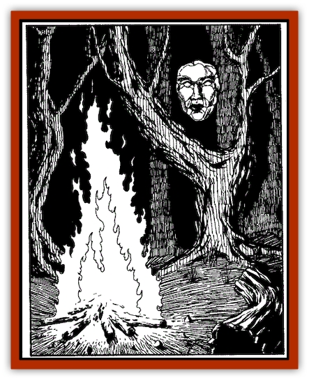

# Invisible of Stardock

| Statistic | **Invisible of Stardock** |
| --- | --- |
| **Activity Cycle:** | Any |
| **Alignment:** | Neutral evil |
| **Armor Class:** | 6 (10) |
| **Climate/Terrain:** | Stardock |
| **Damage/Attack:** | By weapon |
| **Diet:** | Omnivore |
| **Frequency:** | Very rare |
| **Hit Dice:** | 3 |
| **Intelligence:** | Average-High (8-14) |
| **Magic Resistance:** | Nil |
| **Morale:** | Champion (16) |
| **Movement:** | 12 |
| **No. Appearing:** | 1-6 (30-300) |
| **No. of Attacks:** | 1 |
| **Organization:** | Kingdom |
| **Size:** | M (5-6' tall) |
| **Special Attacks:** | Nil |
| **Special Defenses:** | Invisibility |
| **THAC0:** | 17 |
| **Treasure:** | Q (D) |
| **XP Value:** | 120 |

The invisible race of Stardock has inhabited their inaccessible kingdom for many centuries. Their origin is uncertain though the ice wizard Khahkht may have had some role in their creation. They may even be related in some fashion to the transparent-fleshed [[Ghoul_Lankhmar|Nehwon ghouls]]. They are a secretive and evil race.

Invisibles have been known to leave Stardock, riding on the backs of the [[Ray_Invisible_Flying|invisible rayfish]]. They are allied with Khahkht in his quest for power.

**Combat:** Invisibles fight with ordinary weapons, which remain visible. The Stardockers never wear armor, but all attacks upon them are at -4 to hit. They often fight from the backs of their invisible rayfish and are fond of dlying past enemies, loosing missile weapons, then vanishing with a maniacal laugh.

Stardockers have a natural ability to see invisible objects and individuals and fight invisible opponents without penalty.

**Habitat/Society:** The xenophobic invisibles scrupulously avoid other races except when helping Khahkht in another one of his plots against civilization. Stardock is a monarchy, ruled by the stern and merciless Oomforafor and his demented son, Faroomfar.

The invisibles are served by a captive tribe of [[Ice_Gnome|ice gnomes]]. The gnomes are well treated and respectful (but still slaves).

Stardock society is old and decadent. The sterility of invisible males has led to a severe decline in population and threatened the entire kingdom with collapse and extinction. Oomforafor has relevantly decided to experiment with human-invisible crossbreeding, but the results of these experiments are not known.

Stardock currency is in the form of strange gems, visible to non-Stardockers only in the dark. These gems are worth 1,000-6,000 gp each to collectors.

**Ecology:** Stardockers possess a humanlike physiology and - when they reveal their true form through the use of cosmetics - are entirely human-appearing. Their shape is malleable through magic; Faroomfar has a pair of wings given him by the ice wizard.

---
## Discovery & Documentation

**Source Publication:** Lankhmar: City of Adventure (2nd Ed.) (1993)
**Campaign Setting:** Lankhmar
**Author(s):** Bruce Nesmith, Douglas Niles, and Ken Rolston

### Other Creatures Found in This Source Book
   * [[Astral_Wolf|Astral Wolf]]
   * [[Behemoth|Behemoth]]
   * [[Bird_of_Tyaa|Bird of Tyaa]]
   * [[Cat_War|Cat, War]]
   * [[Cloaker_Sea|Cloaker, Sea]]
   * [[Cold_Woman|Cold Woman]]
   * [[Devourer_Lankhmar|Devourer (Lankhmar)]]
   * [[Ghoul_Kleshite|Ghoul, Kleshite]]
   * [[Ghoul_Lankhmar|Ghoul (Lankhmar)]]
   * [[Gladiator_Lizard|Gladiator Lizard]]
   * [[Horag|Horag]]
   * [[Howler|Howler]]
   * [[Ice_Gnome|Ice Gnome]]
   * [[Lizard|Lizard]]
   * [[Ophidian|Ophidian]]
   * [[Ray_Invisible_Flying|Ray, Invisible Flying]]
   * [[Scorpion|Scorpion]]
   * [[Simorgyan|Simorgyan]]
   * [[Snow_Serpent|Snow Serpent]]
   * [[Thunder_Children|Thunder Children]]
   * [[Wraith-Spider|Wraith-Spider]]
   * [[Zombie_Sea|Zombie, Sea]]
