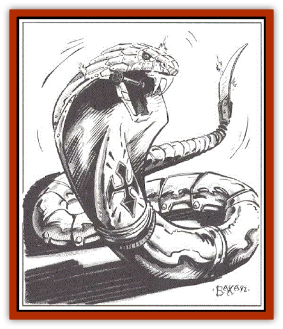

# Iron Cobra

| Statistic | **Iron Cobra** |
| --- | --- |
| **Activity Cycle:** | Any |
| **Alignment:** | Neutral |
| **Armor Class:** | 0 |
| **Climate/Terrain:** | Any |
| **Damage/Attack:** | 1-3 |
| **Diet:** | None |
| **Frequency:** | Very rare |
| **Hit Dice:** | 1 |
| **Intelligence:** | Non- (0) |
| **Magic Resistance:** | Nil |
| **Morale:** | Steady (12) |
| **Movement:** | 12 |
| **No. Appearing:** | 1 |
| **No. of Attacks:** | 1 |
| **Organization:** | Solitary |
| **Size:** | S (3' long) |
| **Special Attacks:** | Poison |
| **Special Defenses:** | See below |
| **THAC0:** | 19 |
| **Treasure:** | See below |
| **XP Value:** | 420 |

An iron cobra appears somewhat similar to a normal poisonous [[Snake|snake]], yet it is a programmable, magical automaton, constructed of an unknown metal by some ancient wizard, or perhaps even a minor deity.

The body of the iron cobra is divided into segments. The largest segment is about 3" long, and just behind the head. The remaining segments taper in size closer to the tail. The creature's body color was determined by the wizard who created it, and often closely resembles a deadly poisonous snake such as a cobra or copperhead. Its construction required the use of two specially-enchanted emeralds (value of at least 500 gold pieces each) for the eyes; this fact often reveals the true nature of these creatures. Iron cobras were created with painstaking detail, and often include features such as functioning rattles, small forked tongues, or a hood such as a true cobra possesses.

**Combat:** An iron cobra has no mind, so spells which affect the mind (*charm monster*, *sleep*, *hold monster*, etc.) do not affect it. Furthermore, webs (natural or magical) do not stick to the metal from which these robots are constructed. Nonmagical weapons inflict only half damage on an iron cobra.

The iron cobra can hide in shadows well (85% chance), and saves versus magical attacks as its creator (usually at least 12th level). Iron cobras emit no body heat, and thus are invisible to infravision. Once per turn, an iron cobra can move for one round in absolute silence, attempting to move up behind a victim to attack. The fangs deliver 1-3 points of piercing damage, and inject a dose of whatever is in the iron cobra's fluid reservoir. Most iron cobras were supplied with a deadly poison, which requires a saving throw versus poison at -2 to avoid death. Other iron cobras were outfitted with paralyzing poison (2-5 rounds), sleep-inducing (no Hit Dice limit; 1-4 rounds), hypnotic (as per the wizard spell *hypnotism*, for 2-5 rounds), or other drugs (normal saving throw versus poison applies in these cases). Regardless of the effect, the fang reservoir holds enough liquid for three injections only. Once the reservoir has been depleted, the fangs still deliver their piercing damage. Recharging the fangs would require only two rounds - if the creator of the iron cobra were present. However, one iron cobra was believed to be able to regenerate the contents of its poison reservoir in 24 hours. Note that a dose refers to the amount of injected poison which will affect one human-sized creature. Poison durations and saving throws must be adjusted with consideration of the size and mass of the victim.

**Habitat/Society:** An iron cobra may have been created to guard a special treasure, or simply to act as a bodyguard. Alternately, these automatons could be programmed to track down and attack any creature whose true name is known, within a one mile range. The iron cobra relentlessly tracks its intended victim by homing in on its psychic vibrations. which are related to the victim's true name. The victim can defend himself by blocking these emanations with a mind blank or similar magic effect or spell.

Programming can consist only of a few, simple commands, as an iron cobra has but a small memory. These commands serve to activate, program, and deactivate the iron cobra, and were determined by the wizard when the creature was initially constructed. The commands understood by these unusual creatures are simple and few in number, and might include guard, attack, hide, come home, track, etc. Once programmed, the program cannot be changed until the iron cobra is deactivated (*dispel magic*, etc.), and reprogrammed by its creator. There is a small chance (10%) that electrical attacks, such as *shocking grasp* or *lightning bolt*, will scramble an iron cobra's programming, and thus render it impotent,

**Ecology:** Iron cobras do not eat, sleep, or breathe. The methods for the construction of these automatons have been lost many centuries ago. The study of ancient lore has revealed that only a few iron cobras were ever constructed, perhaps a few dozen total. Modern wizards value a deactivated but functional iron cobra at 2,000 gold pieces, if the command words are known. Iron cobras created by more powerful beings, such as minor deities, are more accurate reproductions of nature, and thus it may be difficult to ascertain the true nature of these creatures until it is too late.

---
## Discovery & Documentation

**Source Publication:** MC14 Fiend Folio Appendix (1992)
**Campaign Setting:** Fiends Folio
**Author(s):** Don Bingle, John Terra, Wes Nicholson, Tim Beach, Steve Hardinger, Kris Hardinger, Rob Nicholls, Greg Swedberg, Al Boyce, Vince Garcia, Norm Ritchie

### Other Creatures Found in This Source Book
   * [[Aballin|Aballin]]
   * [[Achaierai|Achaierai]]
   * [[Adherer|Adherer]]
   * [[Algoid|Algoid]]
   * [[Al-Mi'raj|Al-Mi'raj]]
   * [[Apparition|Apparition]]
   * [[Caterwaul|Caterwaul]]
   * [[Coffer_Corpse|Coffer Corpse]]
   * [[Crabman|Crabman]]
   * [[Dark_Creeper|Dark Creeper]]
   * [[Dark_Stalker|Dark Stalker]]
   * [[Darter|Darter]]
   * [[Denzelian|Denzelian]]
   * [[Dune_Stalker|Dune Stalker]]
   * [[Dwarf_Urdunnir|Dwarf, Urdunnir]]
   * [[Falcon_Fire|Falcon, Fire]]
   * [[Faux_Faerie|Faux Faerie]]
   * [[Flawder|Flawder]]
   * [[Fyrefly|Fyrefly]]
   * [[Gambado|Gambado]]
   * [[Garbug|Garbug]]
   * [[Giant_Fhoimorien|Giant, Fhoimorien]]
   * [[Gibberling|Gibberling]]
   * [[Gorbel|Gorbel]]
   * [[Grimlock|Grimlock]]
   * [[Hellcat|Hellcat]]
   * [[Ice_Lizard|Ice Lizard]]
   * [[Khargra|Khargra]]
   * [[Mantari|Mantari]]
   * [[Penanggalan|Penanggalan]]
   * [[Pernicon|Pernicon]]
   * [[Phantom_Stalker|Phantom Stalker]]
   * [[Retriever|Retriever]]
   * [[Ruve|Ruve]]
   * [[Scathe|Scathe]]
   * [[Sheet_Ghoul_Sheet_Phantom|Sheet Ghoul/Sheet Phantom]]
   * [[Shocker|Shocker]]
   * [[Spanner|Spanner]]
   * [[Stwinger|Stwinger]]
   * [[Sussurus|Sussurus]]
   * [[Symbiotic_Jelly|Symbiotic Jelly]]
   * [[Terithran|Terithran]]
   * [[Thunder_Children|Thunder Children]]
   * [[Troll_Ice|Troll, Ice]]
   * [[Tween|Tween]]
   * [[Umpleby|Umpleby]]
   * [[Volt|Volt]]
   * [[Xill|Xill]]
   * [[Xvart|Xvart]]
   * [[Zygraat|Zygraat]]
