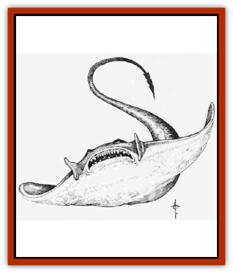

# Ixitxachitl - Ixzan

| Statistic | **Ixitxachitl, Ixzan** |
| --- | --- |
| **Activity Cycle:** | Any (day) |
| **Alignment:** | Chaotic evil |
| **Armor Class:** | 4 |
| **Climate/Terrain:** | Underdark lakes |
| **Damage/Attack:** | 1+1 to 3+3 HD 2d4 (+1d8) / 4+4 to 6+6 HD 3d4 (+1d10) |
| **Diet:** | Omnivore |
| **Frequency:** | Very rare |
| **Hit Dice:** | 1+1 to 6+6 |
| **Intelligence:** | High to Genius (13-18) |
| **Magic Resistance:** | Nil |
| **Morale:** | Champion (16) |
| **Movement:** | 3, swim 12 |
| **No. Appearing:** | 3-10 (1d8+2) or 20-101 (9d10+11) in lair |
| **No. of Attacks:** | 1 (2) |
| **Organization:** | Tribal |
| **Size:** | 1+1 to 3+3 HD M (5' wingspan) / 4+4 to 6+6 HD L (7-10' wingspan) |
| **Special Attacks:** | Nil (see below) |
| **Special Defenses:** | Half damage from blunt weapons (unless +3 or above), +4 saving throw bonus against illusions and Elemental Water |
| **THAC0:** | 1+1, 2+2 HD: 19 / 3+3 HD 17 / 4+4, 5+5 HD 15 / 6+6 HD 13 |
| **Treasure:** | Nil (P,R,S) |
| **XP Value:** | 1+1 HD 65 / 2+2 HD 120 / 3+3 HD 175 / 4+4 HD 270 / 5+5 Hi3 420 / 6+6 HD 650+ (see below) |

Ixzan are a freshwater offshoot of the [[Ixitxachitl|ixitxachitl]] race. They are intelligent, evil creatures who resemble [[Ray|manta rays]] with barbed tails. They are variable in coloration, with most having gray underbellies and mottled, browngray upper surfaces. They are semi-amphibious and can survive out of water for one full turn before needing to return to it to breathe. If forced to remain out of water after one turn, they begin to suffocate (see the "holding your breath" rule in the *Player's Handbook;* treat Ixzan Constitution scores as 8+1d6). On land, they move in an awkward undulating manner, but because their skins are thick and rubbery they can traverse even relatively rocky terrain without undue discomfort, though they cannot negotiate walls, boulders, and like obstacles.

Ixzan are vicious, brutal creatures with better organization than their alignment might suggest. They worship the evil Power Ilxendren and enjoy stalking, sacrificing, and eating all manner of underdark races. They are especially fond of [[Gnome|svirfneblin]] flesh, though by no means adverse to giving surface [[Gnome|gnome]] a try. Their lifespan is variable, with high mortality among the young: those who survive to adulthood generally live from 40 to 70 years. Mutant types live shorter lifespans, spellcasting types longer ones. [[Vampire_General_Information|Vampiric]] Ixzan are effectively immortal. Ixzan communicate in water by a form of sonar but cannot converse out of water since they cannot vocalize. They have good infravision (90-foot range).

Ixzan communities are more isolated than those of their seawater cousins and, as a result, they are more variable in nature, with a higher proportion of exceptional or unusual types.

**XP Note:** Variant Ixzan are noted below. For purposes of determining XP rewards, count priests and wizards as one category higher than their HD alone would indicate if of 1st to 4th level, two XP categories higher if of 5th to 8th level, and three XP categories higher if of 9th or higher level. Vampiric types are always treated as three XP categories higher than their HD totals. Mutant Ixzan count as one XP category higher for each special attack they possess (poisonous tail, corrosive slime, automatic damage, etc.). All these bonuses are cumulative. If the category goes off the scale given above (for example, a 6+6 HD Ixzan with the abilities of a 7th-level wizard), consult the XP award table in the *Dungeon Master Guide*.

**Combat:** The normal Ixzan attack mode is its bite; those with other attacks will certainly use them, as Ixzan spellcasters are wily and use their spells to best effect. Ixzan use ambush tactics much as do their ixitxachitl cousins, except that they are capable of using them more effectively due to their superior spell use (especially *fly* and *invisibility*). Those able to cast *levitation* are fond of pressing themselves against ceilings in the manner of a [[Lurker|lurker]], thus ambushing prey from an unexpected direction.

Ixzan make saving throws against all illusion/phantasm spells and all Elemental Water spells with a +4 bonus. They are permitted saving throws (with no bonuses) against spells of these schools even when no saving throw would normally be allowed. Ixzan suffer only half damage from blunt weapons below +3 enchantment, due to the hard, rubbery nature of their skins. Note that Ixzan spellcasters are not inconvenienced by a silence 15' radius spell since they do not vocalize during their spellcasting.

Priests form some 10% of any Ixzan community. Their spellcasting level is determined by rolling 1d4 and adding their HD total, to a maximum of 8th level. They can use spells from the following spheres: all, charm, combat, divination (minor access only), elemental earth, elemental water, healing, necromantic, protection, sun (reversed forms only), and weather (minor access only). Priest Ixzan do not gain bonus spells for high Wisdom scores, but they do gain the regular saving throw bonuses for superior Wisdom. A typical Ixzan priest has a Wisdom score of 12+1d6.

Wizard lxzan form some 5% of the total Ixzan population. These rare creatures have innate spell-like abilities. They do not require spellbooks, nor do they memorize spells. Spell-like powers are usable one per round, once per day each. Casting time is equal to the casting time for the spell, less 2 segments (to a minimum casting time of 1 segment). The spellcasting level of these wizards is determined by rolling 1d6 and adding the Ixzan's HD, to a maximum of 12th level. The number of spell-like powers is equal to the number of spells memorizable by a normal mage of the same experience level. Wizard Ixzan have Intelligence scores of 14+1d4. These spellcasters seem able to use any school of spells, but the most commonly reported are divination spells and those of the following list: charm person, cone of cold,fly, haste, ice storm, invisibility, invisibility 10" radius, levitation, magic missile, mirror image, slow, and stoneskin. Many have the power of air breathing (the reversed form of water breathing). Note that priest and wizard skills are incompatible in the huge majority of cases. Only exceptionally rare individuals are priest-wizards.

Mutant Ixzan form only 2% of the population. They display a variety of abnormalities of form, determined by rolling 1d12 and consulting the table below:

| 1d12 | Mutation |
| --- | --- |
| 1-6 | Barbed tail, additional attack (1d8 or 1d10, depending on HD) |
| 7-10 | As above, but +poison (a failed saving throw indicates 1d6+6 additional points of damage) |
| 11 | Mutant has a thick ridge of jaw bone and can inflict a crushing bite (4d4) and then hold victim in its jaws for 3d4 automatic points of damage per round thereafter. |
| 12 | The mutant's body secretes a thick, corrosive slime. Out of water, a successful attack from such a mutant splashes the victim with acidic slime (1d6 hp of damage) which then coats the victim for 1d4+2 rounds (1d4 automatic damage per round). An oil- or alcohol-based solvent will remove this slime in one round. |

Mutant Ixzan are neither priests nor wizards. Other, very rare, types of mutation may also occur, such as freakishly thick skin (AC bonus, but the Ixzan may be blind and unable to orient itself except when underwater where it can use sonic detection effectively), natural magic resistance, or more than one tail.

Vampiric Ixzan are also rare, some 3% of the Ixzan population. Their bite causes the victim to lose one experience level or HD, with no saving throw permitted. Vampiric Ixzan may be priests (25% chance) or wizards (25% chance), but mutation seems to negate vampirism. Vampiric Ixzan regenerate 3 hp per round in combat. Greater vampiric Ixzan, akin to greater vampiric ixitxachitl rulers, are rumored to exist, but there are no reliable reports of them. Certainly, no form of vampiric Ixzan is ever encountered outside of a major lair or city.

**Habitat/Society:** Ixzan communities, encountered only in sizeable Underdark lakes, are some 20 to 100 mong. Both magic and *charmed* slaves are used to construct the peculiar pyramidal structures the Ixzan favor (these have significance for their reverence of their patron power). Lakes may even be deepened or extended, and underground passageways feeding water into them widened and their courses changed to bring extra water in the lakes.

Ixzan communities tend not to be dominated by a single exceptional leader-type but by an oligarchy of the most powerful of their priests and wizardy. Vampiric ixitxachitl almost alwavs rise to imporrant positions within such ruling elites, due both to their power and their innate longevity, unless killed off by vampiric rivals who want to sequester power for themselves.

**Ecology:** Ixzan have no natural predators. On the other hand, thev may have many enemies, although there is no particular race for which they have especial animosity, and rivailries vary from place to place. In one Underdark domain, Ixzan might get on well with [[Elf_Drow|drow]], whereas in another hundreds of miles away they might be deadly enemies. Ixzan have natural affinities with [[Aboleth|aboleth]] and [[Kuo-Toa|kuo-toa]]. Aboleth are very much the dominant party in any aboleth/Ixzan alliance. while Ixzan dominate kuo-toa in turn (regarding them as essentially rather stupid - strong, excellent guards, but stupid nonetheless). Ixzan will often be found living with kuo-toa, as their respective Powers (Blibdoolpoolp and Ilxenden are known to be on good terms with each other. In such communities, Ixzan and kuo-toa dwell in separate areas, with the Ixzan guarding the entrances to their central pyramid (if thev have one) zealously. Ixzan wizards use their spell powers to assist kuo-toa in battle, while allowing the gogglers do the meleeing and take most of the risks.

Kuo-toa sometimes use Ixzan in a ritual designed to weed out the weaker of their young. Young kuo-toa who have reached semi-maturity may be flung en masse into a great pool filled with Ixzan and forced to negotiate their way through an underwater maze while the Ixran gorge themseIves on the flesh of those who are not fast, strong, or ruthless enough. Since the kuo-toa spawn vast numbers of young, this ritualized weeding-out is regarded wholly dispassionately by them. Young who have not survived this ritual are not perceived as kuo-toa by their own kin; only afterwards are they regarded as individuals and adults.

Ixzan are likewise careless of their young. Ixzan are born neutral, and only acquire their chaotic evil alignment as the result of a gruelling process designed to make them as strong and ruthless as possible; those who fail to survive are neither mourned nor missed. The only exceptions are the fledgling wizards; other spellcasting Ixzan can intuitively sense when a young Ixzan has this ability and protect it fiercely, inculcating their own morality into it through a regiment designed to instill a sense of absolute self-worth along with contempt for "lesser" beings,

---
## Discovery & Documentation

**Source Publication:** Monstrous Compendium, 1996 Annual, Volume 3 (1995)
**Campaign Setting:** Advanced Dungeons & Dragons 2nd Edition
**Author(s):** Jon Pickens

### Other Creatures Found in This Source Book
   * [[Alaghi|Alaghi]]
   * [[Alhoon|Alhoon]]
   * [[Aranea_Savage_Coast|Aranea (Savage Coast)]]
   * [[Arcane_Head|Arcane Head]]
   * [[Banedead|Banedead]]
   * [[Banelich|Banelich]]
   * [[Bat_Bonebat|Bat, Bonebat]]
   * [[Beetle|Beetle]]
   * [[Belgoi|Belgoi]]
   * [[Bladeling|Bladeling]]
   * [[Braxat|Braxat]]
   * [[Bunyip|Bunyip]]
   * [[Burbur|Burbur]]
   * [[Bvanen|Bvanen]]
   * [[Cat_Great_Snow_Tiger|Cat, Great, Snow Tiger]]
   * [[Chosen_One|Chosen One]]
   * [[Chronovoid|Chronovoid]]
   * [[Cildabrin|Cildabrin]]
   * [[Coffer_Corpse|Coffer Corpse]]
   * [[Disenchanter|Disenchanter]]
   * [[Dog_Temporal|Dog, Temporal]]
   * [[Dragon_Cerilia|Dragon (Cerilia)]]
   * [[Dragon_Ghost|Dragon, Ghost]]
   * [[Dragon_Lesser_Undead|Dragon, Lesser Undead]]
   * [[Dragon_Neutral_Amber|Dragon, Neutral, Amber]]
   * [[Dread_Warrior|Dread Warrior]]
   * [[Dreamweaver|Dreamweaver]]
   * [[Dream_Spawn_Greater_Ennui|Dream Spawn, Greater, Ennui]]
   * [[Dream_Spawn_Lesser_Morph|Dream Spawn, Lesser, Morph]]
   * [[Dwarf_Arctic|Dwarf, Arctic]]
   * [[Dwarf_Urdunnir|Dwarf, Urdunnir]]
   * [[Eel_Giant_Moray|Eel, Giant Moray]]
   * [[Elemental_Fire_Kin_Tome_Guardian|Elemental, Fire Kin, Tome Guardian]]
   * [[Elf_Rockseer|Elf, Rockseer]]
   * [[Ethyk|Ethyk]]
   * [[Faerie_Faerie_Fiddler|Faerie, Faerie Fiddler]]
   * [[Faerie_Petty_Bramble|Faerie, Petty, Bramble]]
   * [[Faerie_Petty_Gorse|Faerie, Petty, Gorse]]
   * [[Faerie_Petty|Faerie, Petty]]
   * [[Firenewt|Firenewt]]
   * [[Formian|Formian]]
   * [[Gargoyle_II|Gargoyle II]]
   * [[Giant_Cerilia|Giant (Cerilia)]]
   * [[Goblin_Cerilia|Goblin (Cerilia)]]
   * [[Golem_Magic|Golem, Magic]]
   * [[Golem_Shaboath|Golem, Shaboath]]
   * [[Hag_Bheur|Hag, Bheur]]
   * [[Hamadryad|Hamadryad]]
   * [[Hound_of_Ill-Omen|Hound of Ill-Omen]]
   * [[Human_Cerilia|Human (Cerilia)]]
   * [[Hybsil|Hybsil]]
   * [[Ibrandlin|Ibrandlin]]
   * [[Imp_Chaos|Imp, Chaos]]
   * [[Jabberwock|Jabberwock]]
   * [[Kyton|Kyton]]
   * [[Kyuss_Son_of|Kyuss, Son of]]
   * [[Lillend|Lillend]]
   * [[Life-Shaped_Creation_Guardian|Life-Shaped Creation, Guardian]]
   * [[Life-Shaped_Creation_Transport|Life-Shaped Creation, Transport]]
   * [[Lycanthrope_Werecrocodile|Lycanthrope, Werecrocodile]]
   * [[Lycanthrope_Werespider|Lycanthrope, Werespider]]
   * [[Magedoom|Magedoom]]
   * [[Manotaur|Manotaur]]
   * [[Mastiff_Shadow|Mastiff, Shadow]]
   * [[Meazel|Meazel]]
   * [[Mist_Scarlet_Dancer|Mist, Scarlet Dancer]]
   * [[Needleman|Needleman]]
   * [[Orc_Neo-Orog|Orc, Neo-Orog]]
   * [[Orc_Ondonti|Orc, Ondonti]]
   * [[Owlbear_II|Owlbear II]]
   * [[Pegataur|Pegataur]]
   * [[Phaerimm|Phaerimm]]
   * [[Reggelid|Reggelid]]
   * [[Render|Render]]
   * [[Saurial|Saurial]]
   * [[Scalamagdrion|Scalamagdrion]]
   * [[Sharn|Sharn]]
   * [[Snake_Messenger|Snake, Messenger]]
   * [[Spirit_Forest_Uthraki|Spirit, Forest, Uthraki]]
   * [[Spirit_Forest_Wood_Man|Spirit, Forest, Wood Man]]
   * [[Spirit_Ice_Orglash|Spirit, Ice, Orglash]]
   * [[Spirit_Rock_Thomil|Spirit, Rock, Thomil]]
   * [[Strider_Giant|Strider, Giant]]
   * [[Tembo|Tembo]]
   * [[Temporal_Glider|Temporal Glider]]
   * [[Temporal_Stalker|Temporal Stalker]]
   * [[Tether_Beast|Tether Beast]]
   * [[Thessalmonster|Thessalmonster]]
   * [[Time_Dimensional|Time Dimensional]]
   * [[Tomb_Tapper|Tomb Tapper]]
   * [[Undead_Dragon_Slayer|Undead Dragon Slayer]]
   * [[Unicorn_Black_Toril|Unicorn, Black (Toril)]]
   * [[Vaath|Vaath]]
   * [[Vortex_Spider|Vortex Spider]]
   * [[Weredragon|Weredragon]]
   * [[Zhentarim_Spirit|Zhentarim Spirit]]
