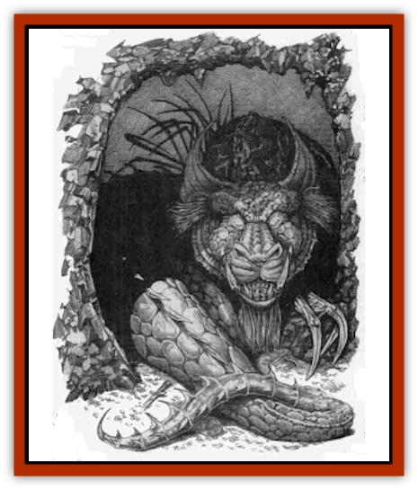

# Jabberwock

| Statistic | **Jabberwock** |
| --- | --- |
| **Activity Cycle:** | Any |
| **Alignment:** | Neutral |
| **Armor Class:** | -10 |
| **Climate/Terrain:** | Forest |
| **Damage/Attack:** | 3d10 |
| **Diet:** | Carnivore |
| **Frequency:** | Unique? |
| **Hit Dice:** | 15 (99 hp) |
| **Intelligence:** | Semi- (4) |
| **Magic Resistance:** | 80% |
| **Morale:** | Fearless (20) |
| **Movement:** | 15, fly 15 (C) |
| **No. Appearing:** | 1 |
| **No. of Attacks:** | 1 |
| **Organization:** | Solitary |
| **Size:** | G (30' body, 25' tail) |
| **Special Attacks:** | <i>Burble</i>, eyebeams, fear aura, grasp, flurry attack |
| **Special Defenses:** | Immune to non-vorpal weapons |
| **THAC0:** | 5 |
| **Treasure:** | Incidental |
| **XP Value:** | 25,000 |

The jabberwock is a curious creature found only in dense, virgin forests. In appearance it resembles a [[Dragon_General_Information|dragon]] in its general outlines but lacks a breath weapon or any treasure-hoarding instinct. It is, however, fiercely territorial and attempts to slay and devour any intruders it finds prowling about in its woods.

Due to the creature's *burble* attack (described below), accurate descriptions of the jabberwock are difficult to come by, as dazed survivors often retain only a confused impression of parts and not the whole. However, the sage Ludovicus Humphrey made a careful study of the beast before his untimely demise on a recent research trip and reported that it has a stout draconian torso with sturdy hind legs, long forearms each ending in four feathery talons (each talon being some four feet long and fully prehensile), a long sinus neck ending in an enormons head, a pair of elegant wings, and a long thin tail. The creature can rear up on its hind legs and actually take a few steps in biped fashion if the need occurs (say, to retrieve a quarry who has climbed a tree), beating its wings for balance. It can fly but rarely does, as it prefers to keep to the shelter of the trees. The baleful yellow eyes have red pupils and actually emit beams of light - said to be an unnerving sight when spotted approaching in a dark forest. Moss fills the tiny cracks between its scales, and it's possible that the <q>feathery</q> appendages hanging from its claws are actually parasitic growths similar to Spanish moss. The scales themselves are tawny, the color of tarnished gold (if gold could tarnish), darkening to brown at the extremities (the wings and claws).

**Combat:** Combat: The jabberwock is a fearsome opponent, more for its relentlessness pursuit of a target than any other factor. Once a jabberwock has chosen a target, it concentrates all its attacks on him or her (or it) until the victim is killed (and devoured), until the jabberwock itself is slain (a very unlikely event), or until the target escapes via *teleportation* or some similar means. Note that like true dragons the jabberwock has exceptionally keen senses and can detect *invisible* or hidden opponents; so long as the chosen target remains within its forest, the jabberwock will pursue it.

The jabberwock's preferred method of attack is a straightforward bite with its huge front teeth; its snaky neck enables its head to dart out and attack targets a surprising distance away.

However, it has several special attacks which make its task easier and the victim's life harder (and, often, shorter). First, it constantly mutters or burbles to itself - a low, rumbling bubbling sound that carries up to 200 feet. Anyone who hears this sound must make a saving throw vs. spell at a 4 penalty or become *confused*. A jabberwock's *confusion* is more potent than the wizard spell of the same name, lasting as long as the victim is within range and able to hear the noise; in addition, it distorts perception, causing hallucinations and strangely skewed judgment of distance: objects, or parts of objects, may appear much closer or further away than they actually are (this translates into a -3 penalty on the attack roll of anyone suffering from this confused warping of depth perception). A curious side effect of the *burble* is that it acts as a sort of *babble* spell (a reversed *tongues*): the victim's words slide, shift, and blend, producing odd hvbrids that make comunication very difiicult.

In addition to its burble. the jabberwock also has several other special attacks. Its eyebeams act as the rays from a *wand of paralysis*, freezing in place any target who fails a saving throw vs. paralyzation. The jabberwock also shares the fear aura of true dragons. While its normal attack is a simple bite with its enormous incisors, it can also grasp prey in its great talons, holding a man-sized creature helplessly immobilized in either forepaw (it then gains a +2 bonus to bite a target so restrained - +4 if the victim is held by both forepaws). If seriously inconvenienced (that is, if attacked by a large party of well-armed and well-coordinated adventurers), it will go into a flurry of activity, striking out in all directions like a hurricane with swipes of its forepaw claws (1d10/1d10), wing buffets (2d10/2d10), hind leg stomps (2d6/2d6), bite (3d10), and tail lash (2d8). Each of these attacks is at a -2 penalty on the creature's attack roll; those struck must make a saving throw vs. paralysis or be knocked down or driven back (50% chance of either), enabling the jabberwock to refocus its attack.

The only effectove means of attacking a jabberwock is with a vorpal weapon; its extremely tough scales repel all other blows (all non-vorpal weapons inflict only nonlethal subdual damage). Even its eyes - traditionally a vulnerable spot in armored creatures - are protected by tough semitransparent inner eyelids. Its superior magic resistance prevents most spells from being effective as well.

**Habitat/Society:** The jabbemock is a solitary creature that apparently treats all other beings it meets as prey. The only exceptions to this rule are druids, which the jabberwock ignores, and sylvan creatures such as [[Dryad|dryads]], [[Treant|treants]], forest [[Gnome|gnomes]], and the like, who can sense its approach and discreetly withdraw in order to avoid a confrontation. It is generally believed that, like the [[Tarrasque|tarrasque]] or [[Phoenix|phoenix]], only one jabberwock exists at any one time; certainly only one will be encountered in any one forest.

The sage Ludovicus Humphrey maintained that the jabberwock was created by the forest itself as a sort of *genius loci*, a manifestation of the woodland designed to protect it from intruders. In theory, then, more than one jabberwock could exist, each in its own primal forest, although no duplication has ever been recorded. It must be a large and ancient forest to manifest a jabberwock, which then acts as a sort of antibody to repel or destroy interlopers. Should the jabberwock be destroyed, it will reappear within a generation, either in the same forest (unless it has been too badly damaged in the interim by logging or settlement) or in a far-distant one. No immature jabberwock has ever been sighted, and the creature does not appear to age, although there are some indications that it continues to grow throughout its long life.

**Ecology:** Despite its unwavering ferocity, the jabberwock serves a very important function for the forest it inhabits. In essence, it is the woods' protector, its very presence serving to keep away most of those who would exploit or destroy the woodlands. It is doubtful that the jabberwock is aware of, or cares about, the purpose for which it was created; it simply fulfills that function by its sheer efficiency as a predator.

<h3 style="color:#4169e1;">Jabberwocky</h3>*�Twas briflig, and the slithy toves
Did gyre and gimble in the wabe:
All mimsy were the borogoves,
And the mome raths outgrabe.*

"Beware the Jabberwock, my son!
The jaws that bite, the claws that catch!
Beware the Jubjub bird, and shun
The frumious Bandersnatch!"

He took his vorpal sword in hand
Long time the mansome foe he sought &mdash;
He rested he by the Tumtum tree,
And stood awhile in thought.

And, as in uffish thought he stood,
The Jabberwock, with eyes of flame,
Came whiffling through the tulgey wood,
And burbled as it came!

One, two! One, two! And through and through
The vorpal blade went snicker-snack!
He left it dead, and with its head
He went galumphing back.

"And hast thou slain the Jabberwock?
Come to my arms, my beamish boy
O frabjous day! Callooh! Callay!"
He chortled in his joy.

*Twas briflig, and the slithy toves
Did gyre and gimble in the wabe:
All mimsy were the borogoves,
And the mome raths outgrabe.*

&mdash; Lewis Carroll

---
## Discovery & Documentation

**Source Publication:** Monstrous Compendium, 1996 Annual, Volume 3 (1995)
**Campaign Setting:** Advanced Dungeons & Dragons 2nd Edition
**Author(s):** Jon Pickens

### Other Creatures Found in This Source Book
   * [[Alaghi|Alaghi]]
   * [[Alhoon|Alhoon]]
   * [[Aranea_Savage_Coast|Aranea (Savage Coast)]]
   * [[Arcane_Head|Arcane Head]]
   * [[Banedead|Banedead]]
   * [[Banelich|Banelich]]
   * [[Bat_Bonebat|Bat, Bonebat]]
   * [[Beetle|Beetle]]
   * [[Belgoi|Belgoi]]
   * [[Bladeling|Bladeling]]
   * [[Braxat|Braxat]]
   * [[Bunyip|Bunyip]]
   * [[Burbur|Burbur]]
   * [[Bvanen|Bvanen]]
   * [[Cat_Great_Snow_Tiger|Cat, Great, Snow Tiger]]
   * [[Chosen_One|Chosen One]]
   * [[Chronovoid|Chronovoid]]
   * [[Cildabrin|Cildabrin]]
   * [[Coffer_Corpse|Coffer Corpse]]
   * [[Disenchanter|Disenchanter]]
   * [[Dog_Temporal|Dog, Temporal]]
   * [[Dragon_Cerilia|Dragon (Cerilia)]]
   * [[Dragon_Ghost|Dragon, Ghost]]
   * [[Dragon_Lesser_Undead|Dragon, Lesser Undead]]
   * [[Dragon_Neutral_Amber|Dragon, Neutral, Amber]]
   * [[Dread_Warrior|Dread Warrior]]
   * [[Dreamweaver|Dreamweaver]]
   * [[Dream_Spawn_Greater_Ennui|Dream Spawn, Greater, Ennui]]
   * [[Dream_Spawn_Lesser_Morph|Dream Spawn, Lesser, Morph]]
   * [[Dwarf_Arctic|Dwarf, Arctic]]
   * [[Dwarf_Urdunnir|Dwarf, Urdunnir]]
   * [[Eel_Giant_Moray|Eel, Giant Moray]]
   * [[Elemental_Fire_Kin_Tome_Guardian|Elemental, Fire Kin, Tome Guardian]]
   * [[Elf_Rockseer|Elf, Rockseer]]
   * [[Ethyk|Ethyk]]
   * [[Faerie_Faerie_Fiddler|Faerie, Faerie Fiddler]]
   * [[Faerie_Petty_Bramble|Faerie, Petty, Bramble]]
   * [[Faerie_Petty_Gorse|Faerie, Petty, Gorse]]
   * [[Faerie_Petty|Faerie, Petty]]
   * [[Firenewt|Firenewt]]
   * [[Formian|Formian]]
   * [[Gargoyle_II|Gargoyle II]]
   * [[Giant_Cerilia|Giant (Cerilia)]]
   * [[Goblin_Cerilia|Goblin (Cerilia)]]
   * [[Golem_Magic|Golem, Magic]]
   * [[Golem_Shaboath|Golem, Shaboath]]
   * [[Hag_Bheur|Hag, Bheur]]
   * [[Hamadryad|Hamadryad]]
   * [[Hound_of_Ill-Omen|Hound of Ill-Omen]]
   * [[Human_Cerilia|Human (Cerilia)]]
   * [[Hybsil|Hybsil]]
   * [[Ibrandlin|Ibrandlin]]
   * [[Imp_Chaos|Imp, Chaos]]
   * [[Ixitxachitl_Ixzan|Ixitxachitl, Ixzan]]
   * [[Kyton|Kyton]]
   * [[Kyuss_Son_of|Kyuss, Son of]]
   * [[Lillend|Lillend]]
   * [[Life-Shaped_Creation_Guardian|Life-Shaped Creation, Guardian]]
   * [[Life-Shaped_Creation_Transport|Life-Shaped Creation, Transport]]
   * [[Lycanthrope_Werecrocodile|Lycanthrope, Werecrocodile]]
   * [[Lycanthrope_Werespider|Lycanthrope, Werespider]]
   * [[Magedoom|Magedoom]]
   * [[Manotaur|Manotaur]]
   * [[Mastiff_Shadow|Mastiff, Shadow]]
   * [[Meazel|Meazel]]
   * [[Mist_Scarlet_Dancer|Mist, Scarlet Dancer]]
   * [[Needleman|Needleman]]
   * [[Orc_Neo-Orog|Orc, Neo-Orog]]
   * [[Orc_Ondonti|Orc, Ondonti]]
   * [[Owlbear_II|Owlbear II]]
   * [[Pegataur|Pegataur]]
   * [[Phaerimm|Phaerimm]]
   * [[Reggelid|Reggelid]]
   * [[Render|Render]]
   * [[Saurial|Saurial]]
   * [[Scalamagdrion|Scalamagdrion]]
   * [[Sharn|Sharn]]
   * [[Snake_Messenger|Snake, Messenger]]
   * [[Spirit_Forest_Uthraki|Spirit, Forest, Uthraki]]
   * [[Spirit_Forest_Wood_Man|Spirit, Forest, Wood Man]]
   * [[Spirit_Ice_Orglash|Spirit, Ice, Orglash]]
   * [[Spirit_Rock_Thomil|Spirit, Rock, Thomil]]
   * [[Strider_Giant|Strider, Giant]]
   * [[Tembo|Tembo]]
   * [[Temporal_Glider|Temporal Glider]]
   * [[Temporal_Stalker|Temporal Stalker]]
   * [[Tether_Beast|Tether Beast]]
   * [[Thessalmonster|Thessalmonster]]
   * [[Time_Dimensional|Time Dimensional]]
   * [[Tomb_Tapper|Tomb Tapper]]
   * [[Undead_Dragon_Slayer|Undead Dragon Slayer]]
   * [[Unicorn_Black_Toril|Unicorn, Black (Toril)]]
   * [[Vaath|Vaath]]
   * [[Vortex_Spider|Vortex Spider]]
   * [[Weredragon|Weredragon]]
   * [[Zhentarim_Spirit|Zhentarim Spirit]]
