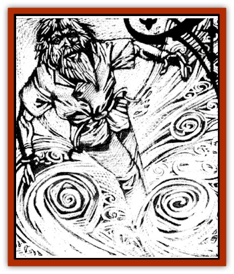

# Jack Frost

| Statistic | **Jack Frost** |
| --- | --- |
| **Activity Cycle:** | Any |
| **Alignment:** | Neutral evil |
| **Armor Class:** | 0 or 5 |
| **Climate/Terrain:** | Arctic lands &amp; mountain tops |
| **Damage/Attack:** | 2d4 or 1d6 |
| **Diet:** | Body heat |
| **Frequency:** | Rare |
| **Hit Dice:** | 5 |
| **Intelligence:** | Low (5-7) |
| **Magic Resistance:** | Nil |
| **Morale:** | Champion (15-16) |
| **Movement:** | 12, Fl 18 (C) |
| **No. Appearing:** | 3-30 (3d10) |
| **No. of Attacks:** | 1 |
| **Organization:** | Flurry |
| **Size:** | S (3-4' tall) |
| **Special Attacks:** | See below |
| **Special Defenses:** | See below |
| **THAC0:** | 15 |
| **Treasure:** | B |
| **XP Value:** | 3,000 |

A jack frost is a malicious ice spirit that lives on mountain tops or in arctic terrain. It delights in tormenting helpless creatures and subsists on the body heat that it drains from its victims. Jack frosts travel in groups called flurries. Though they are referred to by a masculine name, individual jack frosts may appear to be either male or female.

Jack Frosts have several forms and can change from one to another at will. They may appear as a flurry of beautiful and intricately patterned snowflakes, a vaporous white cloud, or as small, pale blue humanoids with silver eyes and white or silvery icicle-like hair. Even in the heaviest snow or coldest region, they wear only gauzy white clothing and go barefoot. Those who might be identified as males wear tunics and trousers, while those regarded as females prefer gowns.

They all have mischievous. beguiling smiles. and speak only their own language.

**Combat:** In their snowflake forms, jack frosts are so beautiful that anyone viewing them falling from the sky and tumbling about must save vs, spell or be hypnotized by their loveliness (as per the *hypnotic pattern* spell). Once they have gotten close to their victims through this ruse, these ice spirits change form into a cloud of freezing vapor ten feet in diameter. It is not uncommon for several frosts to combine and create a larger cloud. In this form they are able to sweep across their victims, causing 5d6 points of cold damage. A save vs. breath weapon is allowed for half damage.

After the initial attack, they change into humanoid form and reach out to individual targets to touch them with chilling grasps or to nip them with freezing, numbing bites. A jack frost's touch sends a searing, freezing shock through its victim's body, causing 2d4 points of cold damage and draining some of his body heat.

A bite from the creature causes 1d6 points of damage, also from loss of body heat, but renders the part bitten numb as well. Favored targets for a jack frost's bite are the lips, nose, ears, fingertips and (if they can somehow reach them) the toes. They always attack these parts in preference to any other, and suffer no penalties to their attack rolls when they do so.

A jack frost's nip causes frostbite. If the injured region is not properly tended to within the hour through gentle warming, healing potions, or the like, there is a 75% chance that the part will have to be amputated as gangrene will set in.

While in either snowflake or cloud form, they are AC 0 and can only be hit by +2 or better weapons. In humanoid form they are AC 5 and can be hit by any weapons. While in nonhumanoid form, they are immune to all spells except *gust of wind* or *weather summoning* and *control* spells (which cause them to flee). In humanoid form, they are susceptible to all spells except those that rely on cold to inflict damage.

**Habitat/Society:** Jack frosts wander the arctic landscape seeking nourishment in the form of body heat and amusement in the torment of mortals. They possess several powers that endanger travelers in the regions they inhabit.

They have no true society as such, existing to play elaborate games. Their thought processes are completely alien to mortals, being composed of strange yearnings and sly, incomprehensible ploys to "win" the latest game, whatever it may be.

**Ecology:** Jack frosts have no true sexes and reproduce by warming to the point of melting and reforming as two creatures. They often take treasure gained from former victims and strew it about to attract other prey to their current wandering grounds. Other than this, however, they have no use for such trinkets.

---
## Discovery & Documentation

**Source Publication:** Ravenloft Appendix III (1991)
**Campaign Setting:** Ravenloft
**Author(s):** Kirk Botulla

### Other Creatures Found in This Source Book
   * [[Akikage|Akikage]]
   * [[Animator_Common|Animator, Common]]
   * [[Animator_Greater|Animator, Greater]]
   * [[Animator_Minor|Animator, Minor]]
   * [[Animator_General_Information|Animator, General Information]]
   * [[Bakhna_Rakhna|Bakhna Rakhna]]
   * [[Baobhan_Sith|Baobhan Sith]]
   * [[Beetle_Scarab|Beetle, Scarab]]
   * [[Boneless|Boneless]]
   * [[Boowray|Boowray]]
   * [[Bruja|Bruja]]
   * [[Carrionette|Carrionette]]
   * [[Carrion_Stalker|Carrion Stalker]]
   * [[Cat_Midnight|Cat, Midnight]]
   * [[Cat_Skeletal|Cat, Skeletal]]
   * [[Cloaker_Resplendent|Cloaker, Resplendent]]
   * [[Cloaker_Shadow|Cloaker, Shadow]]
   * [[Cloaker_Undead|Cloaker, Undead]]
   * [[Corpse_Candle|Corpse Candle]]
   * [[Death's_Head_Tree|Death's Head Tree]]
   * [[Doppelganger_Ravenloft|Doppelganger (Ravenloft)]]
   * [[Familiar_Pseudo-|Familiar, Pseudo-]]
   * [[Familiar_Undead|Familiar, Undead]]
   * [[Feathered_Serpent|Feathered Serpent]]
   * [[Fenhound|Fenhound]]
   * [[Figurine_Ceramic|Figurine, Ceramic]]
   * [[Figurine_Crystal|Figurine, Crystal]]
   * [[Figurine_Ivory|Figurine, Ivory]]
   * [[Figurine_Obsidian|Figurine, Obsidian]]
   * [[Figurine_Porcelain|Figurine, Porcelain]]
   * [[Figurine_General_Information|Figurine, General Information]]
   * [[Fleas_of_Madness|Fleas of Madness]]
   * [[Furies|Furies]]
   * [[Geist|Geist]]
   * [[Ghost_Animal|Ghost, Animal]]
   * [[Golem_Flesh_Ravenloft|Golem, Flesh (Ravenloft)]]
   * [[Golem_Mist_Ravenloft|Golem, Mist (Ravenloft)]]
   * [[Golem_Wax_Ravenloft|Golem, Wax (Ravenloft)]]
   * [[Gremishka|Gremishka]]
   * [[Hag_Spectral|Hag, Spectral]]
   * [[Head_Hunter|Head Hunter]]
   * [[Hearth_Fiend|Hearth Fiend]]
   * [[Hebi-No-Onna|Hebi-No-Onna]]
   * [[Hound_Phantom|Hound, Phantom]]
   * [[Hound_Skeletal|Hound, Skeletal]]
   * [[Imp_Wishing|Imp, Wishing]]
   * [[Ivy_Crawling|Ivy, Crawling]]
   * [[Jolly_Roger|Jolly Roger]]
   * [[Kizoku|Kizoku]]
   * [[Lashweed|Lashweed]]
   * [[Leech_Magical|Leech, Magical]]
   * [[Leech_Psionic|Leech, Psionic]]
   * [[Lich_Defiler|Lich, Defiler]]
   * [[Lich_Drow|Lich, Drow]]
   * [[Lich_Elemental|Lich, Elemental]]
   * [[Lich_Psionic|Lich, Psionic]]
   * [[Living_Tattoo|Living Tattoo]]
   * [[Lycanthrope_Loup-garou|Lycanthrope, Loup-garou]]
   * [[Lycanthrope_Werejackal|Lycanthrope, Werejackal]]
   * [[Lycanthrope_Werejaguar_Ravenloft|Lycanthrope, Werejaguar (Ravenloft)]]
   * [[Lycanthrope_Wereleopard|Lycanthrope, Wereleopard]]
   * [[Lycanthrope_Wereray|Lycanthrope, Wereray]]
   * [[Mist_Ferryman|Mist Ferryman]]
   * [[Moor_Man|Moor Man]]
   * [[Obedient|Obedient]]
   * [[Odem|Odem]]
   * [[Paka|Paka]]
   * [[Plant_Blood_Rose|Plant, Blood Rose]]
   * [[Plant_Fearweed|Plant, Fearweed]]
   * [[Radiant_Spirit|Radiant Spirit]]
   * [[Recluse|Recluse]]
   * [[Remnant_Aquatic|Remnant, Aquatic]]
   * [[Rushlight|Rushlight]]
   * [[Sea_Spawn_Master|Sea Spawn, Master]]
   * [[Sea_Spawn_Minion|Sea Spawn, Minion]]
   * [[Shadow_Asp|Shadow Asp]]
   * [[Shattered_Brethren|Shattered Brethren]]
   * [[Skeleton_Archer|Skeleton, Archer]]
   * [[Skeleton_Insectoid|Skeleton, Insectoid]]
   * [[Skin_Thief|Skin Thief]]
   * [[Spirit_Psionic|Spirit, Psionic]]
   * [[Strahd_Skeleton|Strahd Skeleton]]
   * [[Strahd_Zombie|Strahd Zombie]]
   * [[Unicorn_Shadow|Unicorn, Shadow]]
   * [[Vampire_Drow|Vampire, Drow]]
   * [[Vampire_Nosferatu|Vampire, Nosferatu]]
   * [[Vampire_Oriental|Vampire, Oriental]]
   * [[Virus_General_Information|Virus, General Information]]
   * [[Virus_I|Virus I]]
   * [[Virus_II|Virus II]]
   * [[Virus_III|Virus III]]
   * [[Vorlog|Vorlog]]
   * [[Will_O'Dawn|Will O'Dawn]]
   * [[Will_O'Deep|Will O'Deep]]
   * [[Will_O'Mist|Will O'Mist]]
   * [[Will_O'Sea|Will O'Sea]]
   * [[Zombie_Cannibal|Zombie, Cannibal]]
   * [[Zombie_Desert|Zombie, Desert]]
   * [[Zombie_Wolf|Zombie Wolf]]
   * [[Zombie_Fog|Zombie Fog]]
