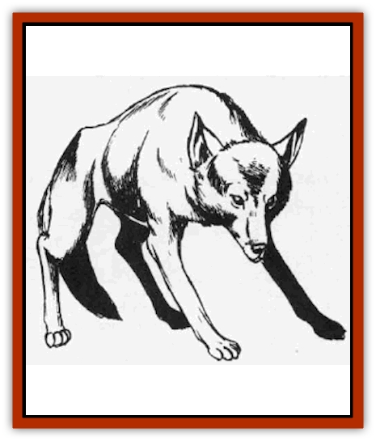

# Jackal

| Statistic | **Jackal** |
| --- | --- |
| **Activity Cycle:** | Night |
| **Alignment:** | Neutral |
| **Armor Class:** | 7 |
| **Climate/Terrain:** | Warm plains and deserts |
| **Damage/Attack:** | 1-2 |
| **Diet:** | Scavenger |
| **Frequency:** | Common |
| **Hit Dice:** | ½ (1-4 hp) |
| **Intelligence:** | Semi- (2-4) |
| **Magic Resistance:** | Nil |
| **Morale:** | Unreliable (2-4) |
| **Movement:** | 12 |
| **No. Appearing:** | 1-6 |
| **No. of Attacks:** | 1 |
| **Organization:** | Pack |
| **Size:** | S (3' long) |
| **Special Attacks:** | Nil |
| **Special Defenses:** | Nil |
| **THAC0:** | 20 |
| **Treasure:** | Nil |
| **XP Value:** | 7 |

Jackals are small, canine scavengers that roam the warm grasslands of the world. They are neither fierce nor brave, but are quite common. There are three known species of jackal in the world: asian, black-backed. and side-striped. Except for their markings, these animals are very similar.

The typical jackal has a narrow head and a sharp, pointed snout which looks very similar to that of a fox. In its other characteristics, however, the animal is much like a [[Wolf|wolf]] or [[Dog|dog]]. Its fur is typically a tawny buff in color and quite grizzled. The tip of the animal's bushy tail is much darker, often shading to black.

**Combat:** As a rule, any jackal will flee if charged or threatened by another predator. In fact, they will even abandon their efforts at hunting if their prey turns out to have more life left in it than they expected.

When a jackal does attack, it will do so by biting. Although this is not an especially fierce attack, it serves the animal well enough. Often, jackals will dart in to bite a victim and then quickly retreat to a safe distance to examine the effects of their attack. If more than one jackal is trying to bring down a particular animal, they will attack in a haphazard manner with little or no coordination of their efforts.

**Habitat/Society:** Jackals inhabit plains, deserts, and grasslands throughout the warmer regions of the world. During the day, when the sun is too hot for their tastes, they remain in holes which they have dug in the ground.

At night, they come out to hunt. Although they usually search for prey in pairs, they can be encountered in small groups of up to six individuals. Jackals are loath to attack healthy animals who might be able to harm them. Rather, they will stalk only those too feeble (either old, young. sick, or injured) to put up much of a fight. Carrion is a regular part of the jackal's diet, as are occasional pieces of fruit.

Whenever a jackal is afoot, it habitually utters its piercing cry. Known as a *pheal*, this frightening sound can be heard for quite a distance and is often far more terrifying than the animal itself. Herbivores (including domesticated ones) will tend to become frightened by the pheal of a jackal. There is a 10% chance per jackal that the howling will cause a herd of herbivores to panic and attempt to flee. Horses and similar animals can be calmed by their keepers, cutting the chance for panic in half.

Despite its less-than-dangerous nature, the jackal plays a dark and mysterious role in the mythos of various human cultures. Their place as carrion eaters and killers of the defenseless has earned them a reputation for cruelty and evil deeds which is wholly undeserved. Jackal attacks on men and other demihumans are few and far between. In many regions which are frequented by jackals, numerous horror stories will be told about the doings of jackals but, oddly enough, further investigation will usually show that these are second hand reports of questionable origin.

**Ecology:** Jackals are reluctant predators and their position in the food chain is that of a scavenger rather than a hunter. By hunting and killing sick or weak animals, they play an important part in the process of natural selection. In addition, the carrion which they consume, would otherwise rot and become a potential health hazard and breeding ground for disease.

Jackal pups mature quickly and in just over a year they are able to fend for themselves quite well. They live for 12 to 15 years in the wild.

In those places where they share territory with men, it is quite common for jackals to interbreed with domesticated dogs. Further, both the pups born to such a mating and adult wild jackals are easily domesticated. Thus, although they are not fierce enough to act as guards or hunting animals, they are often found in human communities near their lands as pets.

Young, wild, or domesticated jackals are seldom available on the commercial market, however, and are worth little when offered for sale.

---
## Discovery & Documentation

**Source Publication:** MC1 Volume I (w/binder #1) (1991)
**Campaign Setting:** Advanced Dungeons & Dragons 2nd Edition
**Author(s):** Jay Batista, Scott Bennie, Grant Boucher, William W. Connors, Steve Gilbert, Heike Kubasch, James Lowder, David Edward Martin, Bruce Nesmith, Jean Rabe, Rick Swan, John J. Terra, Gary L. Thomas

### Other Creatures Found in This Source Book
   * [[Bat|Bat]]
   * [[Bear|Bear]]
   * [[Behir|Behir]]
   * [[Boar|Boar]]
   * [[Bookworm|Bookworm]]
   * [[Brownie|Brownie]]
   * [[Bugbear|Bugbear]]
   * [[Carrion_Crawler|Carrion Crawler]]
   * [[Cat_Great|Cat, Great]]
   * [[Catoblepas|Catoblepas]]
   * [[Dragon_General_Information|Dragon, General Information]]
   * [[Dragonfish|Dragonfish]]
   * [[Elemental_Air_Kin_Aerial_Servant|Elemental, Air Kin, Aerial Servant]]
   * [[Elemental_Earth_Kin_Sandling|Elemental, Earth Kin, Sandling]]
   * [[Elephant|Elephant]]
   * [[Gnoll|Gnoll]]
   * [[Hobgoblin|Hobgoblin]]
   * [[Homunculus|Homunculus]]
   * [[Hornet_Giant|Hornet, Giant]]
   * [[Horse|Horse]]
   * [[Hyena|Hyena]]
   * [[Jackalwere|Jackalwere]]
   * [[Korred|Korred]]
   * [[Lich|Lich]]
   * [[Lizard|Lizard]]
   * [[Lizard_Man|Lizard Man]]
   * [[Lycanthrope_General_Information|Lycanthrope, General Information]]
   * [[Lycanthrope_Seawolf|Lycanthrope, Seawolf]]
   * [[Lycanthrope_Werebear|Lycanthrope, Werebear]]
   * [[Lycanthrope_Weretiger|Lycanthrope, Weretiger]]
   * [[Lycanthrope_Werewolf|Lycanthrope, Werewolf]]
   * [[Manticore|Manticore]]
   * [[Medusa|Medusa]]
   * [[Mind_Flayer|Mind Flayer]]
   * [[Minotaur|Minotaur]]
   * [[Mudman|Mudman]]
   * [[Mummy|Mummy]]
   * [[Nixie|Nixie]]
   * [[Nymph|Nymph]]
   * [[Ogre|Ogre]]
   * [[Ooze_Slime_Jelly_I|Ooze/Slime/Jelly I]]
   * [[Ooze_Slime_Jelly_II|Ooze/Slime/Jelly II]]
   * [[Orc|Orc]]
   * [[Owl|Owl]]
   * [[Owlbear_I|Owlbear I]]
   * [[Pegasus|Pegasus]]
   * [[Piercer|Piercer]]
   * [[Pudding_Deadly|Pudding, Deadly]]
   * [[Rakshasa|Rakshasa]]
   * [[Rat|Rat]]
   * [[Ray|Ray]]
   * [[Remorhaz|Remorhaz]]
   * [[Satyr|Satyr]]
   * [[Scorpion|Scorpion]]
   * [[Selkie|Selkie]]
   * [[Shadow|Shadow]]
   * [[Skeleton|Skeleton]]
   * [[Skunk|Skunk]]
   * [[Snake|Snake]]
   * [[Spectre|Spectre]]
   * [[Spider|Spider]]
   * [[Sprite|Sprite]]
   * [[Toad_Giant|Toad, Giant]]
   * [[Treant|Treant]]
   * [[Troll|Troll]]
   * [[Umber_Hulk|Umber Hulk]]
   * [[Unicorn|Unicorn]]
   * [[Vampire|Vampire]]
   * [[Wight|Wight]]
   * [[Will_O'Wisp|Will O'Wisp]]
   * [[Wolf|Wolf]]
   * [[Wolfwere|Wolfwere]]
   * [[Wraith|Wraith]]
   * [[Wyvern|Wyvern]]
   * [[Yeti|Yeti]]
   * [[Yuan-ti|Yuan-ti]]
   * [[Zombie|Zombie]]
