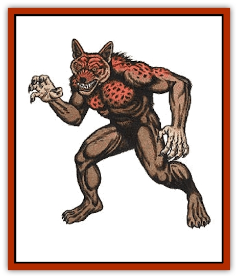

# Jackalwere

| Statistic | **Jackalwere** |
| --- | --- |
| **Activity Cycle:** | Any |
| **Alignment:** | Chaotic evil |
| **Armor Class:** | 4 |
| **Climate/Terrain:** | Any temperate |
| **Damage/Attack:** | 2-8 (2d4) |
| **Diet:** | Carnivore |
| **Frequency:** | Rare |
| **Hit Dice:** | 4 |
| **Intelligence:** | Very (11-12) |
| **Magic Resistance:** | Nil |
| **Morale:** | Steady (11-12) |
| **Movement:** | 12 |
| **No. Appearing:** | 1-4 |
| **No. of Attacks:** | 1 |
| **Organization:** | Pack |
| **Size:** | S (3' long) as a jackal / M (6' tall) as a human or hybrid |
| **Special Attacks:** | Gaze causes sleep |
| **Special Defenses:** | Hit only by iron and +1 or better magical weapons |
| **THAC0:** | 17 |
| **Treasure:** | C |
| **XP Value:** | 270 |

The jackalwere is a terrible and savage creature which preys on unsuspecting travelers and other demihumans that it can ambush. Its ability to alter its shape at will makes it a most dangerous foe.

The jackalwere can be found in any of three forms, showing no preference for any one over the others. The first of these is that of a normal [[Jackal|jackal]]. In this form it will often run and hunt with jackal packs. Its second form is a six foot tall, half-human/half-jackal hybrid which stands erect. In its third form, the jackalwere is physically indistinguishable from normal human beings. The exact physical characteristics of the jackalwere's human form varies according to the desires of the monster.

**Combat:** In its jackal form, the monster conforms to the statistics presented in the [[Jackal|Jackal entry]]. A careful observer, however, will find that the creature does not act in the manner typical of a normal jackal, for it is far more aggressive.

In its hybrid form, the jackalwere can attack with either its bite or with any weapons in hand. Because it has a great thirst for the blood of humans and demihumans, the jackalwere will use its bite whenever possible. Still, it will not avoid the use of weapons that will insure its victory in combat.

In its human form, the jackalwere can only attack with weapons. Although it may employ any manner of weapon, it greatly enjoys those which will cut and tear the flesh of its victims. In some cases, a jackalwere has been known to feed on the bodies of fallen enemies without reverting to its jackal or hybrid form.

In all forms, the jackalwere possesses a magical gaze. If an unsuspecting victim meets the monster's gaze, the victim must save versus spell or fall deeply asleep; the effect is identical to that of the *sleep* spell. Note that hostile, scared, or excited people are not considered to be unsuspecting.

The jackalwere's special defenses also function in all three forms. Only +1 or better magical weapons or those forged from cold iron will cause any damage to the jackalwere. Jackalweres revert to their jackal form after death.

**Habitat/Society:** When the jackalwere locates a victim it will assume human shape and approach its prey. It will seek to ease the suspicions of its target, often pretending to be injured or otherwise in need, until it can employ its gaze attack. If this fails and the jackalwere is confronted with forceful resistance it will decide whether to flee or press the attack based on its estimation of its victim's strength.

The jackalwere spends its life hunting and killing any humans and demihumans it comes across. They roam the world in either the jackal or human form, seeking humanoids to kill, eat, and rob. They are sly creatures and masters of deceit.

Jackalweres are able to mate only in their jackal form. They may produce offspring either by mating with true jackals or other jackalweres, but only those young who were not of mixed blood will be jackalweres themselves. The children of a jackal and jackalwere mating will be jackals, although they will be unnaturally aggressive.

Female jackalweres give birth in five months to a litter of 1-4 pups. These are identical to jackal pups although they initially have 1 Hit Die. The pups grow quickly and add an additional Hit Die each year. Their jackal forms reach full growth at three years and pups are locked in that form for their first two years. At age two they gain the ability to assume their hybrid form and at age three they gain the ability to assume a human form which is apparently nine years of age. The human form grows at triple the normal human rate. If a parent in human form is discovered with its pups, it will often try to pass them off as pets.

Jackalweres may (20%) travel in the company of 1-6 normal jackals. Although these jackals are normal in every regard, the influence of the jackalwere tends to make them more fierce than normal. Jackals under the influence of a jackalwere will be hunters instead of scavengers.

**Ecology:** Jackalweres will not serve any but the most evil of humanoids, and even then only if they have the opportunity to slay more humans and demihumans than they could on their own.

---
## Discovery & Documentation

**Source Publication:** MC1 Volume I (w/binder #1) (1991)
**Campaign Setting:** Advanced Dungeons & Dragons 2nd Edition
**Author(s):** Jay Batista, Scott Bennie, Grant Boucher, William W. Connors, Steve Gilbert, Heike Kubasch, James Lowder, David Edward Martin, Bruce Nesmith, Jean Rabe, Rick Swan, John J. Terra, Gary L. Thomas

### Other Creatures Found in This Source Book
   * [[Bat|Bat]]
   * [[Bear|Bear]]
   * [[Behir|Behir]]
   * [[Boar|Boar]]
   * [[Bookworm|Bookworm]]
   * [[Brownie|Brownie]]
   * [[Bugbear|Bugbear]]
   * [[Carrion_Crawler|Carrion Crawler]]
   * [[Cat_Great|Cat, Great]]
   * [[Catoblepas|Catoblepas]]
   * [[Dragon_General_Information|Dragon, General Information]]
   * [[Dragonfish|Dragonfish]]
   * [[Elemental_Air_Kin_Aerial_Servant|Elemental, Air Kin, Aerial Servant]]
   * [[Elemental_Earth_Kin_Sandling|Elemental, Earth Kin, Sandling]]
   * [[Elephant|Elephant]]
   * [[Gnoll|Gnoll]]
   * [[Hobgoblin|Hobgoblin]]
   * [[Homunculus|Homunculus]]
   * [[Hornet_Giant|Hornet, Giant]]
   * [[Horse|Horse]]
   * [[Hyena|Hyena]]
   * [[Jackal|Jackal]]
   * [[Korred|Korred]]
   * [[Lich|Lich]]
   * [[Lizard|Lizard]]
   * [[Lizard_Man|Lizard Man]]
   * [[Lycanthrope_General_Information|Lycanthrope, General Information]]
   * [[Lycanthrope_Seawolf|Lycanthrope, Seawolf]]
   * [[Lycanthrope_Werebear|Lycanthrope, Werebear]]
   * [[Lycanthrope_Weretiger|Lycanthrope, Weretiger]]
   * [[Lycanthrope_Werewolf|Lycanthrope, Werewolf]]
   * [[Manticore|Manticore]]
   * [[Medusa|Medusa]]
   * [[Mind_Flayer|Mind Flayer]]
   * [[Minotaur|Minotaur]]
   * [[Mudman|Mudman]]
   * [[Mummy|Mummy]]
   * [[Nixie|Nixie]]
   * [[Nymph|Nymph]]
   * [[Ogre|Ogre]]
   * [[Ooze_Slime_Jelly_I|Ooze/Slime/Jelly I]]
   * [[Ooze_Slime_Jelly_II|Ooze/Slime/Jelly II]]
   * [[Orc|Orc]]
   * [[Owl|Owl]]
   * [[Owlbear_I|Owlbear I]]
   * [[Pegasus|Pegasus]]
   * [[Piercer|Piercer]]
   * [[Pudding_Deadly|Pudding, Deadly]]
   * [[Rakshasa|Rakshasa]]
   * [[Rat|Rat]]
   * [[Ray|Ray]]
   * [[Remorhaz|Remorhaz]]
   * [[Satyr|Satyr]]
   * [[Scorpion|Scorpion]]
   * [[Selkie|Selkie]]
   * [[Shadow|Shadow]]
   * [[Skeleton|Skeleton]]
   * [[Skunk|Skunk]]
   * [[Snake|Snake]]
   * [[Spectre|Spectre]]
   * [[Spider|Spider]]
   * [[Sprite|Sprite]]
   * [[Toad_Giant|Toad, Giant]]
   * [[Treant|Treant]]
   * [[Troll|Troll]]
   * [[Umber_Hulk|Umber Hulk]]
   * [[Unicorn|Unicorn]]
   * [[Vampire|Vampire]]
   * [[Wight|Wight]]
   * [[Will_O'Wisp|Will O'Wisp]]
   * [[Wolf|Wolf]]
   * [[Wolfwere|Wolfwere]]
   * [[Wraith|Wraith]]
   * [[Wyvern|Wyvern]]
   * [[Yeti|Yeti]]
   * [[Yuan-ti|Yuan-ti]]
   * [[Zombie|Zombie]]
