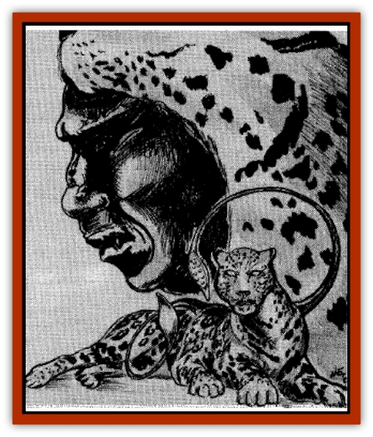

# Jagre

| Statistic | **Jagre** |
| --- | --- |
| **Activity Cycle:** | Any |
| **Alignment:** | Any evil |
| **Armor Class:** | 5 |
| **Climate/Terrain:** | Any land |
| **Damage/Attack:** | 1-6+7 or by weapon (2-12+7) or 2-6/2-8 |
| **Diet:** | Carnivorous |
| **Frequency:** | Very rare |
| **Hit Dice:** | 12 |
| **Intelligence:** | Low-very (5-12) |
| **Magic Resistance:** | Nil |
| **Morale:** | Fanatic (17-18) |
| **Movement:** | 12 |
| **No. Appearing:** | 1-4 |
| **No. of Attacks:** | 1 |
| **Organization:** | Tribe |
| **Size:** | H (16' tall) |
| **Special Attacks:** | See below |
| **Special Defenses:** | See below |
| **THAC0:** | 9 |
| **Treasure:** | D |
| **XP Value:** | 4,000 |

These monstrosities were spawned by Zaltec on the Night of Wailing, though they did not make their appearance until later. While normal warriors became [[Orc|orcs]], and jaguar knights were transformed into [[Ogre|ogres]], certain high level jaguar knights became especially large ogres, which were later changed into jagres.

A jagre is a huge, brutish humanoid with cruel features. All jagres bear the mark of the Viperhand, a red brand in the center of their chests. They wear armor made from displacer beasts, which allows them to transform themselves into [[Displacer_Beast|displacer beasts]]. The latter form has the tentacles and six legs common to displacer beasts, but its coat is usually a reddish brown with dark spots, like a [[Cat_Great|jaguar's]].

**Combat:** A jagre is as likely to enter combat unarmed as with a weapon. Those that prefer weapons usually (75%) carry huge *macas*, while others wield clubs. A jagre may transform itself into displacer beast form at will, gaining its attacks and special abilities. In its cat-like shape, a jagre attacks with two tentacles, inflicting 2d4 points of damage on its victims. If pressed, it may attack with two claws and a bite for damage of 1-3/1-3/1-8, but is more likely to attempt to escape or switch back to humanoid form.

In beast form, a jagre has the same armor class, hit dice, hit points, and saving throws as its humanoid form. It gains the beast's displacement ability, however, making it appear to be three feet from its actual location. Anyone attacking the jagre.s beast form receives a -2 on his attack roll. In addition, the creature makes saving throws at +2 while in this form.

**Habitat/Society:** Jagres are leaders of the beasts of the Viperhand which now inhabit the Valley of Nexal. They are huge variations of Viperhand ogres, having been rewarded with special powers for their service to Zaltec. The special displacer beasts armor they wear, imbued with hishna magic, allows them to change shape.

At present, there are only male jagres. To increase their numbers, they sometimes invite especially strong and smart ogres to join their ranks. They also mate with some of the few female ogres in the Valley of Nexal, producing ogres as offspring. When one of these offspring reaches maturity, or when an ogre is invited into the ranks of the jagre, that individual must obtain the skin of a displacer beast. In a special ceremony, the ogre and the skins are then imbued with the power of hishna, creating a jagre. If the jagre loses its armor, it is stripped of the power to change forms, though it retains all other jagre abilities.

Some jagres take things a step further, going through a special unholy ceremony which bonds the armor to their skin so that it can not be removed. Maztican displacer beasts often have colorations different from their eastern cousins, and jagres often choose a pelt of a color that appeals to them.

Jagres are recognized as authorities by all inhabitants of the Valley of Nexal. They answer only to Hoxitl and his personal servants, the Beast Leaders.

Jagres often lead companies of other Viperhand beasts. Some 50% will be accompanied by 10 ogres, while 25% lead 20 orcs, 15% lead a mixed group of orcs and ogres, 5% lead 2-5 [[Troll|trolls]], and 5% lead a company of ogres, orcs, and trolls. Jagres are sometimes encountered when they are off duty, and will not be accompanied by anyother Viperhand beasts.

**Ecology:** Jagres are some of the most powerful creatures in Maztica, and they have no natural enemies. Because they are relatively new to the world, their impact on the local ecology has not yet been fully determined. It is known that they eat any form of meat, though they seem to prefer that of humans, demihumans, and humanoids.

Jagre lairs often hold treasure recovered from the ruins of Nexal. When determining treasure for a jagre, substitute Maztican valuables for coinage. Magical items will also be Maztican, with most being *talismans* of hishna.

The displacer beast armor, if taken from a jagre, will not allow other creatures to make the transformation.

---
## Discovery & Documentation

**Source Publication:** Maztica (boxed set) (1998)
**Campaign Setting:** Maztica (Forgotten Realms)
**Author(s):** Douglas Niles

### Other Creatures Found in This Source Book
   * [[Chac|Chac]]
   * [[Kamatlan|Kamatlan]]
   * [[Plumazotl|Plumazotl]]
