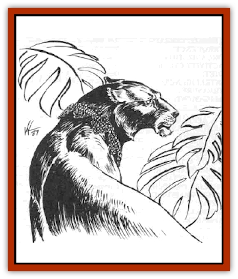

# Jakar

| Statistic | **Jakar** |
| --- | --- |
| **Activity Cycle:** | Any |
| **Alignment:** | Neutral |
| **Armor Class:** | 5 better than the form assumed |
| **Climate/Terrain:** | Valley of the Mage and surrounding area |
| **Damage/Attack:** | Special |
| **Diet:** | Omnivore |
| **Frequency:** | Unique |
| **Hit Dice:** | 18 (90 hps) |
| **Intelligence:** | Genius (17-18) |
| **Magic Resistance:** | +2 to saves vs fire and electrical attacks |
| **Morale:** | Champion (15) |
| **Movement:** | Per form assumed |
| **No. Appearing:** | 1 |
| **No. of Attacks:** | Special |
| **Organization:** | Solitary |
| **Size:** | Varies |
| **Special Attacks:** | Per form assumed |
| **Special Defenses:** | Immune to enchantment/charm spells |
| **THAC0:** | 3 |
| **Treasure:** | Special |
| **XP Value:** | 15,000 |

The jakar (pronounced ye-kare), or changer, is similar to a [[Lycanthrope_General_Information|lycanthrope]] in that it can change from a human to an animal form. However, the jakar can assume any animal form and can appear as a human of any age.

The jakar, a creation of Jason Krimeah, the Exalted One, possesses a *polymorph self* ability that enables it to take on the form of a mammal, avian, or reptile, ranging in weight from 8,000 pounds to � pound. The jakar possesses the physical attacks of the assumed form, such as a [[Dragon_General_Information|dragon's]] claw and bite attacks, but not its breath weapon. Because of this unique ability, a jakar is virtually impossible to detect.

**Combat:** The jakar's fighting skills are based on the form it has assumed, employing to the fullest all the physical attacks of the form. If the jakar knows it will be in combat, it frequently assumes the form of a large ape or a [[Cat_Great|great cat]] because of the damage these forms can inflict, the movement rate allowed it, and its ability to travel through the terrain.

The jakar assumes the mannerisms of the form it has taken; in a cat form, it stalks its opponents and sometimes plays with them before dealing a killing blow.

The jakar can be unnerving to its targets during a fight because of its hit points and unusual Armor Class; its Armor Class is always 5 better than the form it has chosen. For example, an [[Elephant|elephant]] has an AC of 6, but a jakar in elephant form has an AC of 1.

**Habitat/Society:** Only one jakar is known to exist, and it has been seen only within the Valley of the Mage. The jakar was once a human hierophant druid who made his home in the vale, finding the company of animals more to his liking than humans. The druid spent little time in his human form. The druid, called Jakar Whitewing, encountered Jason Krimeah after the mage appointed himself ruler of the valley. A violent confrontation ensued between the pair, as Jakar was tired of humans pretending to control nature. However, Krimeah and Jakar emerged from the incident unscathed, and the pair became as close to being friends as either of them would permit.

Krimeah, obsessed with experimenting with magic and intrigued by the druid's preoccupation with animals, offered to work on a magical item that would enable Jakar to change form more often than his class allowed. In exchange the druid agreed to add his might to protect the valley. Jakar was confident that if anything went awry he would be able to dispel the effects of the magical item.

It took Krimeah a little more than a year to fashion a collar of chain mail imbued with a special *polymorph self* ability. The collar permits Jakar to change into any animal or human form up to 24 times a day, fully assuming all the physical abilities of the shape selected. Jakar cannot assume the form of an unnatural creature, such as an [[Owlbear_I|owlbear]]; the form must be of a natural animal. It is believed Krimeah made more than one of these collars, and some suspect that he gave them to others to create more jakar.

The druid was pleased with Krimeah's "gift", and promptly pledged his life in defense of the vale and the mage. The druid donned the collar nearly three decades ago and has not seemed to have aged since. Jakar is at peace, moving more freely in the animal kingdom than he ever believed possible, and rarely selecting a human shape because he thinks of himself as an animal. He did not mind the side effects of the potent magical item; the druid cannot remove the collar and cannot cast druidical spells while wearing it. However, he has retained the following druidical abilities, which he can use in any form: identify plants, animals, and pure water; pass through undergrowth without leaving a trail; immune to *charm* spells cast by woodland creatures; +2 bonus to saving throws vs. all electrical and fire attacks.

It is believed other jakar would have different abilities, based on the class they had in their human form.

**Ecology:** The jakar lives alone or with other animals of the form it has assumed. It is omnivorous, eating whatever the animal's form it has assumed prefers. The jakar's treasure consists of the items it owned at the time it became a jakar and any additional items it acquired from the creatures and people it killed. Its lairs can be found in inaccessible spots, such as high on a mountain peak, or deep in a cavern, to prevent others from obtaining its treasure. The jakar speaks the language of the animal form it has assumed; in human form it speaks any languages it knew at the time the collar was placed on it.

The life span of the jakar is unknown.

---
## Discovery & Documentation

**Source Publication:** WG12 Vale of the Mage (1989)
**Campaign Setting:** Greyhawk
**Author(s):** Jean Rabe

### Other Creatures Found in This Source Book
   * [[Grist|Grist]]
   * [[Griveling|Griveling]]
   * [[Jaleeda_Bird|Jaleeda Bird]]
