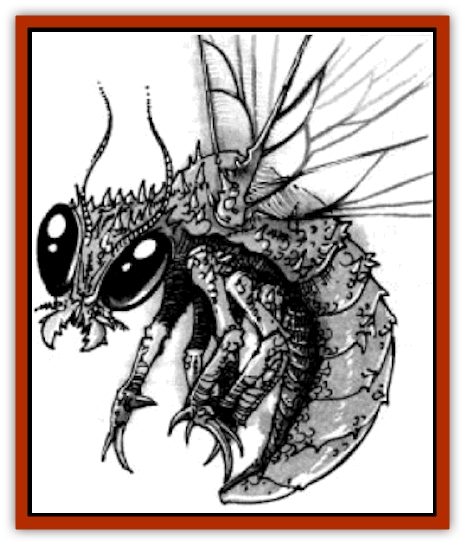
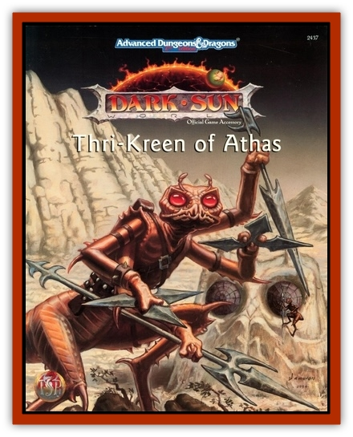

# Jalath'gak

| Statistic | **Jalath'gak** |
| --- | --- |
| **Activity Cycle:** | Constant |
| **Alignment:** | Neutral |
| **Armor Class:** | 5 |
| **Climate/Terrain:** | Scrub plains, sandy wastes |
| **Damage/Attack:** | 1d4&times;6 (claw)/1d8 (bite) |
| **Diet:** | Omnivore (nectar, blood) |
| **Frequency:** | Uncommon |
| **Hit Dice:** | 8+8 |
| **Intelligence:** | Animal (1) |
| **Magic Resistance:** | Nil |
| **Morale:** | Elite (13-14) |
| **Movement:** | 9, fly 24 (D) |
| **No. Appearing:** | 3d10 |
| **No. of Attacks:** | 7 |
| **Organization:** | Swarm |
| **Size:** | H (13' long) |
| **Special Attacks:** | Blood drain (2d6) |
| **Special Defenses:** | Stink cloud (15' rad.) |
| **THAC0:** | 11 |
| **Treasure:** | Nil |
| **XP Value:** | 4,000 |

First domesticated by the [[Thri-kreen|kreen]] of the distant North, wild jalath'gak are the scourge of herdsmen throughout the Tablelands. It is an enormous winged [[Insect_Giant|insect]], 13 feet long, with a wingspan of nearly 20 feet.

The head is long and narrow so that it may fit into smell areas to collect blood or nectar. Its mandibles are extremely strong, end are hollow to draw nourishment. Long whiskers on the top of its heed detect pheromones and other odors; these are always moist, end are drawn beck against the head during combat The creature's exoskeleton is firm but brittle.

The creature's six limbs join to its thorax, and sport long dagger-like talons. The thin wings, also attached to the thorax, fold close against the creature's side when not in use, extending a few feet behind the creature. When spread, the fragile-looking wings are transparent.

The jalath'gak's abdomen stores blood and nectar. When the insect has recently fed, the abdomen bulges, becoming a deep red or yellow. If the insect hasn't fed in a few weeks, the abdomen sags, limp and gray. The rest of the insect.s coloring is a pattern of black and bright blue.

Jalath'gak communicate with each other with pheronomes. Thri-kreen end other insects can communicate with them in a rudimentary fashion with their own pheronomes, but complex ideas cannot be conveyed. Other intelligent creatures can communicate with jalath'gath through psionics or magic.

**Combat:** The jalath'gak can always attack with its mandibles and six legs. It can either hover and attack, or land and rear back on its abdomen, bringing all of its legs into action. Each leg inflicts 1d4 hit points of damage, and the mandibles 1d8.

The round after the mandible hits, and each round thereafter, the jalath'gak drains blood. The opponent is pinned and cannot attack. 2d6 points of blood are drained each round and the jalath'gak can attack with all of its legs. A pinned creature try to break free each round by making a saving throw vs. paralyzation. A jalath'gak that slays a victim by blood drain will remain attached to the body for another 1d3 rounds before moving on. One that has drained 50 points of blood in one combat is gorged and will not use further blood drain attacks.

If reduced to 10 hit points or less, a jalath'gak will release a stink cloud from its mouth. The cloud covers a 15-foot-radius sphere directly to the creature's front. Those in the stink cloud must save vs. poison or be incapaciteted for 1d6 rounds. A jalath'gak can release up to three stink clouds a day.

**Habitat/Society:** In the wild, these insects live in large swarms. Unlike hive insects, jalath'gak don't cooperate. Their eggs are simply dropped from the ever-flying swarm into the hot desert sends. Although only one egg in 1,000 hatches, this is sufficient to maintain the numbers of the Swarm.

Some thri-kreen packs have domesticated the jalath'gak, and use them to pull heavy loads during migration. At great need the abdomen can be cut off to provide food or water, or to pull an exceptionally heavy load. Wthout its abdomen, a jalath'gak will function normally for 36+1d6 hours, end then die.

Attempts to harness the jalath'gak for flight have been unsuccessful. It cannot carry much weight, and its wings and legs are prone to damage when harnessed. Also, the most common domestication techniques render them flightless.

**Ecology:** The abdomen yields 16 gallons of water and enough blood/nectar plasma for 32 common meals, for the hardy. Jalath'gek wings are sought by the artists of Raam and Draj as canvasses. An undamaged set of wings can be sold for 50cp.

Rumors exist of giant jalath'gak. These creatures are rare, but may grow upward of 20 feet in length, with increased capabilities. Their mandibles pierce thri-kreen chitin with ease. These insects don't so much fly as make wing-assisted jumps, end have little control of their direction once they are airborne.

---
## Discovery & Documentation

**Source Publication:** Thri-Kreen of Athas (1995)
**Campaign Setting:** Dark Sun
**Author(s):** Tim Beach and Dori Hein

### Other Creatures Found in This Source Book
   * [[Trin|Trin]]
   * [[Zik-trin'ak|Zik-trin'ak]]
