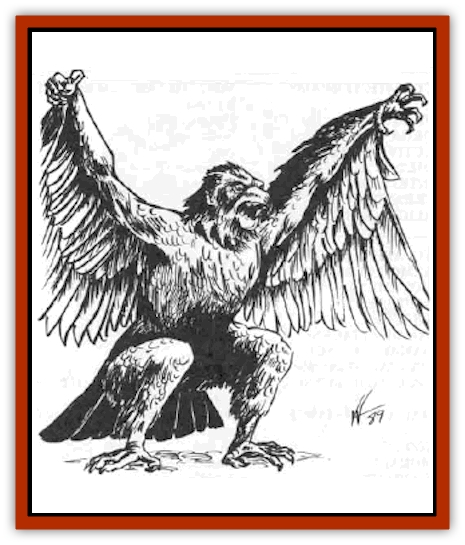

# Jaleeda Bird

| Statistic | **Jaleeda Bird** |
| --- | --- |
| **Activity Cycle:** | Any, usually night |
| **Alignment:** | Neutral evil |
| **Armor Class:** | 4 |
| **Climate/Terrain:** | Any temperate or subtropical |
| **Damage/Attack:** | 1-8/1-8/1-12 |
| **Diet:** | Omnivore |
| **Frequency:** | Very rare |
| **Hit Dice:** | 8 |
| **Intelligence:** | Low (5-7) |
| **Magic Resistance:** | Nil |
| **Morale:** | Unsteady (7) |
| **Movement:** | 15, Fl 24 (C) |
| **No. Appearing:** | 1 (1-4) |
| **No. of Attacks:** | 3 |
| **Organization:** | Solitary |
| **Size:** | L (8-9') |
| **Special Attacks:** | Snatch, cry |
| **Special Defenses:** | Immune to charm spells |
| **THAC0:** | 13 |
| **Treasure:** | D |
| **XP Value:** | 2,000 |

A jaleeda bird is a bizarre creation of Jason Krimeah, the Exalted One. It was a by-product of his research to create a [[Jakar|jakar]]. The bird, developed utilizing the theories that created the [[Owlbear_I|owlbear]], is a hideous cross between a great ape and a [[Eagle|giant eagle]]. It is named after Krimeah's uncle, whom the mage despised. The creature is mean and ravenous, and possesses a cruelty unmatched by any other animal in the vale. Its behavior is believed to stem from its unnatural condition. Krimeah created a dozen of these birds, none of which he could control. He released them into the valley, where tales of their appearance has been added to the reported monster sightings that keep common folk from trespassing into his land.

Jaleedas are covered with a mix of thick, black hair and brown and white feathers, which give them their Armor Class. The ugly creature has taloned, ape-like hands at the end of its great wings, which also are covered with hair and feathers. Its feet end in large, powerful talons. It has a large maw that is both ape- and bird-like-a jagged yellow beak and a mouth full of teeth. Jaleedas range in height from eight to nine feet, and have a 30-foot wingspan. They have piercing red, deep-set eyes. The birds have little sanity, as the process that created them ripped away their reason.

**Combat:** A jaleeda fights with little provocation, rapidly going after creatures and people it believes has invaded its territory. The bird usually announces itself with a shrill cry that sounds like a great ape in pain; the cry is so loud and terrifying that creatures of less than 5 Hit Dice that hear it must roll successful saving throws vs. petrification or run in fear for 1d6 rounds. The bird usually attacks three or fewer creatures, having enough sense not to tackle too many foes. A jaleeda attacks a large group of creatures or people only if its cry has caused some of them to scatter. The bird prefers to pursue creatures affected by its cry so it can attack them from behind.

The jaleeda apparently has no combat strategy, for the bird wildly plunges at its target or targets. It can attack with the claws on its wings and its bite, or with its taloned feet and its bite. If the bird successfully attacks a victim with both of its feet, it has in effect snatched the victim and can carry him aloft. The bird has been known to drag a victim across the tops of trees or along the sides of mountains to kill him before tossing him to the ground where it devours him.

Because the bird has such a low intelligence and little sanity, it cannot be charmed.

**Habitat/Society:** Jaleedas nest at the tops of lowly crags or high in the branches of large trees. They establish a territory around their lairs and attack creatures entering the territory.

If a jaleeda is encountered alone, it is likely a young bird, one to three years in age; birds older than that mate with others of their kind, mating for life and producing 1d6 eggs every six months. Only one jaleeda hatchling survives. The first to hatch devours the unhatched eggs. The young jaleeda stays with the parents until it is time for the next clutch of eggs to hatch; at this time it is sent out on its own.

At one time the population within the vale was estimated at nine dozen, but the valley elves and tree people have reduced that number by about two-thirds. It is unknown how many jaleeda birds exist outside the valley. The elves and tree people have little trouble dispatching a bird that has established its territory near one of the settlements. The elves and tree people routinely set up a dummy in a clearing within the bird's territory and hide in the foliage with their bows ready. Because the bird is stupid, it usually flies at the dummy and is brought down by a volley of arrows. Although the bird has keen senses of hearing and eyesight, it has a poor sense of smell and no common sense.

**Ecology:** Jaleeda birds are omnivorous, eating plants, animals, and humans and demihumans. They do not like water and therefore refrain from eating fish and creatures that live on river banks. Their preferred diet is monkeys and large birds, which they seem to envy and detest.

Jaleedas' covet treasure, collecting items from their prey and hiding these in their nests. They especially enjoy shiny objects and regularly inventory their horde to make sure creatures invading their territory have not stolen from them.

Jaleedas are believed to live about 50 years and are able to lay eggs through the first 40 years. They seem to have no language, but communicate with each other through horrid-sounding caws and wing gestures.

---
## Discovery & Documentation

**Source Publication:** WG12 Vale of the Mage (1989)
**Campaign Setting:** Greyhawk
**Author(s):** Jean Rabe

### Other Creatures Found in This Source Book
   * [[Grist|Grist]]
   * [[Griveling|Griveling]]
   * [[Jakar|Jakar]]
