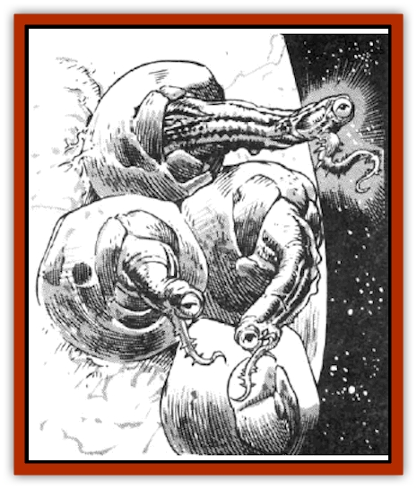

# Jammer Leech

| Statistic | **Jammer Leech** |
| --- | --- |
| **Activity Cycle:** | Any |
| **Alignment:** | Neutral |
| **Armor Class:** | 3 |
| **Climate/Terrain:** | Any |
| **Damage/Attack:** | See below |
| **Diet:** | Parasite |
| **Frequency:** | Rare |
| **Hit Dice:** | 3 |
| **Intelligence:** | Semi- (2-4) |
| **Magic Resistance:** | 25% |
| **Morale:** | Steady (11-12) |
| **Movement:** | 1 |
| **No. Appearing:** | 1-4 |
| **No. of Attacks:** | 1 |
| **Organization:** | Solitary or cluster |
| **Size:** | S (1' high) |
| **Special Attacks:** | Spells |
| **Special Defenses:** | See below |
| **THAC0:** | 17 |
| **Treasure:** | Nil |
| **XP Value:** | 650 |

Resembling the barnacle-like immature [[Krajen|krajens]], jammer leeches are unwittingly attracted by the spellcasters who power ships through wildspace and the phlogiston. They can be very dangerous if mishandled, and they always cause the ships they infest a great deal of trouble.

A jammer leech has a hard shell, which grows to be a foot tall. The shell can be of almost any color, though it closely matches that of the lull of the ship it is attached to. (This makes spotting the leech very difficult from casual observation alone.) Inside, the leech is reddish-purple in color, with a body much like that of a snail. It has a single, watery eye at one end. It also possesses a sharply spiked tentacle, which is the same color and consistency as its body.

**Combat:** In most situations, the jammer leech uses its tentacle for protection. The sharp spikes on the end of the foot-long arm cause 1d4 points of damage. That is often enough to discourage most creatures from harassing the parasite.

In a situation where a hard swipe from a tentacle doesn't discourage a predator, the jammer leech uses magic. As it rests upon the hull, close to the spelljammer helm, the leech draws magical energy from the wizard or priest powering the ship. For every ten days of jamming, the leech absorbs one spell - of any level - at random from the spellcaster's mind. On a trip that takes 30 days, for example, the leech would be able to absorb three spells. Luckily, jammer leeches can hold only four spells at a time. However, when more than one leech attaches itself to a ship, they each draw spells from the spelljammer. Spellcasters who are preyed upon by jammer leeches forget the spell absorbed by the parasite and must regain it in the normal manner. However, the wizard or priest notices the missing spell only if he attempts to recall it; otherwise, the loss goes undetected.

In combat, the jammer leech discharges the spells it has stolen at random. The parasite uses all the magic it has stored, one spell per round, to drive away its assailant. The spell is cast at the level at which the victimized spellcaster would cast it. If more than one mage or priest powered the helm during the ten days, the average level is used.

There are only two effective ways to deal with a magic-laden jammer leech: kill it with a single strike or cast a separate *dispel magic* spell on each parasite to disarm it before striking. However, the leech has 25% resistance to magic, so attacking the creature is always a risky business. Once its magic reserve is gone and the parasite's hard shell is cracked, it is an easy target.

It is important to note that leeches will use their spells to ward off any physical attack. They frequently discharge their spells during any battle in which their section of the hull is repeatedly struck. Sometimes this works in favor of the leech's host ship, but more often it proves to be disastrous.

**Habitat/Society:** Since a jammer leech does not need air to survive, it can be found almost anywhere there are spelljammers. Beginning as a spore, the jammer leech attaches itself to the hull of a ship, at a spot close to the spelljamming helm. The spore digs into the hull, then draws food and nutrients from the ship's surface at a rate of 1 hull point a month. After only one week on the ship, the spore develops a hard shell that roughly matches the color of the hull itself. The shell is attached to the ship by a strong, glue-like substance secreted by the leech, making the task of scraping it from the hill time consuming and tedious.

These parasites are found in small groups of four or less. If more than two leeches are encountered, there is a 10% chance they are a mated pair that produces 1d6 spores once per month. Some of these may quickly join their parents on the hull of the ship, while others float off, waiting to attach themselves to another unwary vessel.

**Ecology:** Jammer leeches have few intelligent natural predators, for most creatures quickly learn that attacking these parasites is painful, if not deadly. Some omnivores, such as [[Zard|zards]], try to eat leeches as they would anything else, but the parasite can usually warn these creatures off with a sharp swipe of their tentacle.

The glue that the leeches excrete to hold their shells to a hull is extremely strong and highly prized. The gooey purple substance is waterproof, fireproof, and even slightly magic resistant (5%). The dangers involved in collecting live leeches and maintaining them limits this market, however, and the glue is rare and very expensive.

---
## Discovery & Documentation

**Source Publication:** MC7 Spelljammer Appendix I (1990)
**Campaign Setting:** Advanced Dungeons & Dragons 2nd Edition
**Author(s):** various

### Other Creatures Found in This Source Book
   * [[Aartuk|Aartuk]]
   * [[Albari|Albari]]
   * [[Ancient_Mariner|Ancient Mariner]]
   * [[Argos|Argos]]
   * [[Beholder_Abomination_Astereater|Beholder (Abomination), Astereater]]
   * [[Blazozoid|Blazozoid]]
   * [[Chattur|Chattur]]
   * [[Chevall|Chevall]]
   * [[Clockwork_Horror|Clockwork Horror]]
   * [[Colossus|Colossus]]
   * [[Delphinid|Delphinid]]
   * [[Dizantar|Dizantar]]
   * [[Dog|Dog]]
   * [[Dog_Bog_Hound|Dog, Bog Hound]]
   * [[Esthetic|Esthetic]]
   * [[Focoid|Focoid]]
   * [[Fractine|Fractine]]
   * [[Giant_Spacesea|Giant, Spacesea]]
   * [[Golem_Furnace|Golem, Furnace]]
   * [[Golem_Radiant|Golem, Radiant]]
   * [[Gravislayer|Gravislayer]]
   * [[Grommam|Grommam]]
   * [[Hadozee|Hadozee]]
   * [[Hamster_Giant_Space|Hamster, Giant Space]]
   * [[Lakshu|Lakshu]]
   * [[Lumineaux|Lumineaux]]
   * [[Lutum|Lutum]]
   * [[Mimic_Space|Mimic, Space]]
   * [[Misi|Misi]]
   * [[Moon_Rogue|Moon, Rogue]]
   * [[Mortiss|Mortiss]]
   * [[Murderoid|Murderoid]]
   * [[Nay-Churr|Nay-Churr]]
   * [[Phlog-Crawler|Phlog-Crawler]]
   * [[Plasman|Plasman]]
   * [[Plasmoid_DeGleash|Plasmoid, DeGleash]]
   * [[Plasmoid_DelNoric|Plasmoid, DelNoric]]
   * [[Plasmoid_General_Information|Plasmoid, General Information]]
   * [[Plasmoid_Ontalak|Plasmoid, Ontalak]]
   * [[Puffer|Puffer]]
   * [[Q'nidar|Q'nidar]]
   * [[Rastipede|Rastipede]]
   * [[Reigar|Reigar]]
   * [[Rock_Hopper|Rock Hopper]]
   * [[Slinker|Slinker]]
   * [[Spider_Asteroid|Spider, Asteroid]]
   * [[Spiritjam|Spiritjam]]
   * [[Survivor|Survivor]]
   * [[Syllix|Syllix]]
   * [[Symbiont_Power|Symbiont, Power]]
   * [[Vine_Infinity|Vine, Infinity]]
   * [[Wiggle|Wiggle]]
   * [[Wizshade|Wizshade]]
   * [[Wryback|Wryback]]
   * [[Zard|Zard]]
   * [[Zodar|Zodar]]
